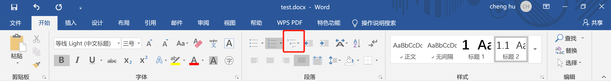

# 多级标题
在开始面板，段落块可以选择多级列表，则可启用多级标题。

这里有几个有用的快捷键：

| 快捷键                 | 作用                             |
| ---------------------- | -------------------------------- |
| Alt + Shift + 左右箭头 | 切换标题级别                     |
| Ctrl + Enter           | 在标题后面操作另起一面并继续编号 |
|                        |                                  |

