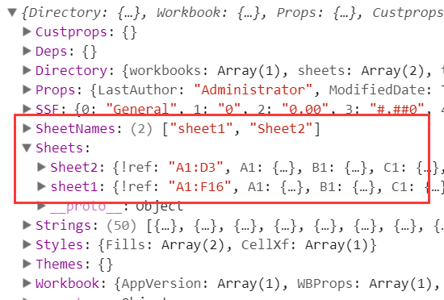
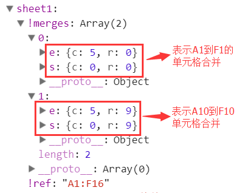

# 基础对象

## Workbook Obejct

`workbook`里面有什么东西呢，我们打印出来看一下：



可以看到，`SheetNames`里面保存了所有的sheet名字，然后`Sheets`则保存了每个sheet的具体内容（我们称之为`Sheet Object`）。每一个`sheet`是通过类似`A1`这样的键值保存每个单元格的内容，我们称之为单元格对象（`Cell Object`）：

## Sheet Object

每一个`Sheet Object`表示一张表格，只要不是`!`开头的都表示普通`cell`，否则，表示一些特殊含义，具体如下：

- `sheet['!ref']`：表示所有单元格的范围，例如从A1到F8则记录为`A1:F8`；
- `sheet[!merges]`：存放一些单元格合并信息，是一个数组，每个数组由包含`s`和`e`构成的对象组成，`s`表示开始，`e`表示结束，`r`表示行，`c`表示列；（这里提一下，当合并的单元格有多个值时，取的是左上角的第一个值），数值为空的地方需要以 `null` 填充




## Cell Object

每一个单元格是一个对象（`Cell Object`），主要有`t`、`v`、`r`、`h`、`w`等字段

CellObject每个字段定义如下：

https://github.com/SheetJS/sheetjs#cell-object


# 文件操作

## 数组导出Excel文件

XLSX.utils.aoa_to_sheet

XLSX.utils.new_book

XLSX.writeFile：在Node环境下会生成文件，在Browser中，会触发下载文件。

> 下载原理：
>
> 可以配合 `file-saver` 这个库来使用。
>
> FileSaver.js 在客户端下载文件。如果是服务端下载文件，使用Content-Disposition消息头，更好的兼容性
>
> ```http
> Content-Type: 'application/octet-stream; charset=utf-8'
> Content-Disposition: attachment; filename="filename.jpg"; filename*="filename.jpg"
> Content-Length: <size in bytes>
> ```


