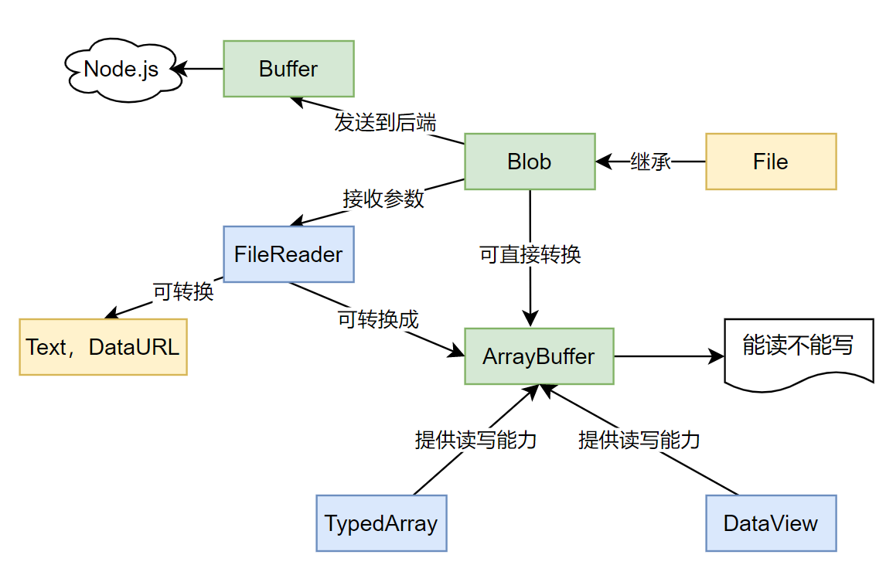

# 数据格式

## JS内部什么编码

**JavaScript用的是UCS-2！**在ES6标准中，可以认为基本上是**UTF-16**的编码方式存储的。这里我们要区分 codePointAt，charAt，charCodeAt 的区别

| 方法             | 作用                                                         |
| ---------------- | ------------------------------------------------------------ |
| charAt(pos)      | 返回指定位置字符，只针对UTF-16编码，非主平面字符会被拆分读取 |
| charCodeAt(pos)  | 同charAt，返回UTF-16的编码值，非主平面由两个charCode组成     |
| codePointAt(pos) | 返回unicode码点，所有平面均会考虑，兼容unicode非基本平面     |

𡃁妹 𠂒 👦👩

> 疑问？？？ "𠂒".codePointAt(1).toString(16) 还有值，而且返回的是dc92，unicode保留点


## URI编码

**encodeURI：** 是对统一资源标识符（URI）进行编码的方法
**encodeURIComponent：** 是对统一资源标识符（URI）的**组成部分**进行编码的方法。例如url参数为一个URI地址，需要中此函数进行包装

```js
// 输出："-_.!~*'(),;/?:@&=+$#"
encodeURI("-_.!~*'(),;/?:@&=+$#")

// 输出："-_.!~*'()%2C%3B%2F%3F%3A%40%26%3D%2B%24%23"
encodeURIComponent("-_.!~*'(),;/?:@&=+$#")
```

区别在于 `,;/?:@&=+$#` 这几个字符，为uri中的保留字符。


## Base64

Base64是一种用64个字符来表示任意二进制数据的方法。对二进制数据进行处理，每3个字节一组，一共是24bit，划为4组，每组正好6个bit（2^6 = 64）

Base64编码会把3字节的二进制数据编码为4字节的文本数据，长度增加33%。如果要编码的二进制数据不是3的倍数，最后会剩下1个或2个字节，Base64用`\x00`字节在末尾补足后，再在编码的末尾加上1个或2个`=`号，表示补了多少字节，解码的时候，会自动去掉。

可使用 window下的两个函数，btoa，atob

## 二进制相关

https://zhuanlan.zhihu.com/p/97768916  这个有图片讲的很好



### ArrayBuffer

**`ArrayBuffer`** 对象用来表示通用的、固定长度的原始二进制数据缓冲区。它是一个字节数组，通常在其他语言中称为“byte array”。与Array类似，但是不能修改。

不能直接操作 `ArrayBuffer` 的内容，而是要通过[类型数组对象](https://developer.mozilla.org/zh-CN/docs/Web/JavaScript/Reference/Global_Objects/TypedArray)或 [`DataView`](https://developer.mozilla.org/zh-CN/docs/Web/JavaScript/Reference/Global_Objects/DataView) 对象来操作，它们会将缓冲区中的数据表示为特定的格式，并通过这些格式来读写缓冲区的内容。

### FileReader

如果想要读取**Blob**或者**文件对象**，并转化为其他格式的数据，可以借助FileReader对象的API进行操作。可通过如下方法解析即可：

- **readAsArrayBuffer**：返回二进制缓冲区
- readAsBinaryString：已废弃
- **readAsDataURL**：返回base64 Data URL
- readAsText：按指定的编码进行解析

```js
var reader = new FileReader();
reader.onload = function(){
    //查看文件输出内容
    console.log(reader.result);
}
// 通过四种方式读取文件
reader.readAsXXX(file);  
```

### Blob

```js
var aBlob = new Blob( array, options );
```

返回一个新创建的 Blob 对象，其内容由参数中给定的数组串联组成。

- **array** 是一个由[`ArrayBuffer`](https://developer.mozilla.org/zh-CN/docs/Web/JavaScript/Reference/Global_Objects/ArrayBuffer), [`TypedArray`](https://developer.mozilla.org/zh-CN/docs/Web/JavaScript/Reference/Global_Objects/TypedArray), [`Blob`](https://developer.mozilla.org/zh-CN/docs/Web/API/Blob), [`DOMString`](https://developer.mozilla.org/zh-CN/docs/Web/API/DOMString) 等对象构成的 [`Array`](https://developer.mozilla.org/zh-CN/docs/Web/JavaScript/Reference/Array) ，或者其他类似对象的混合体，它将会被放进 [`Blob`](https://developer.mozilla.org/zh-CN/docs/Web/API/Blob)。DOMStrings会被编码为UTF-8。
- **options** 可能会指定如下两个属性：
  - `type`，默认值为 `""`，它代表了将会被放入到blob中的数组内容的MIME类型。
  - `endings`，默认值为`"transparent"`，用于指定包含行结束符`\n`的字符串如何被写入。 它是以下两个值中的一个： `"native"`，代表行结束符会被更改为适合宿主操作系统文件系统的换行符，或者 `"transparent"`，代表会保持blob中保存的结束符不变 

```js
var str = "这";	// 中文的utf-8编码为3个字节
var blob = new Blob([str]); // blob.size = 3
```

常用方法：

| 方法               | 描述                                                        |
| ------------------ | ----------------------------------------------------------- |
| Blob.arrayBuffer() | 返回一个promise且包含blob所有内容的二进制格式的 ArrayBuffer |
| Blob.text()        | 返回一个promise且包含blob所有内容的UTF-8格式的 USVString。  |
| Blob.slice()       | 返回新的Blob对象，指向指定范围的数据                        |

#### Blob URL

Blob协议的URL，由 `URL.createObjectURL(blob)` 生成，格式类似：`blob:域名/[uuid]`，当不再需要该URL时，调用 `URL.revokeObjectURL(url)` 使该链接失效。使用场景如前端生成数据文件，然后通过创建 `<a>` 标签下载该文件。

> 个人理解blob url相当于内存中一个资源的引用，类似于指针

#### Blob图片预览

window.URL.createObjectURL生成的Blob URL还可以赋给img.src，从而实现图片的显示

```html
  <!-- html部分 -->
  <input id="f" type="file" />
  
  <!-- js部分 -->
  <script>
    document.getElementById('f').addEventListener('change', function (e) {
      const file = this.files[0];
      const url = URL.createObjectURL(file);
      const img = document.getElementById('img');
      img.src = url;
      img.onload = function() {
        URL.revokeObjectURL(url);
      }
    }, false);
  </script>
```

#### Blob实现下载文件

```js
  <input id="f" type="file" />
  <a id="a">下载</a>
  <script>
    document.getElementById('f').addEventListener('change', function (e) {
      const file = this.files[0];
      const url = URL.createObjectURL(file);
      const a = document.getElementById('a');
      a.href = url;
      a.download = file.name; // 下载的文件名
    }, false);
  </script>
```

#### 视频网站blob链接

参考：[为什么视频网站的视频链接地址是blob？](https://juejin.im/post/5d1ea7a8e51d454fd8057bea)

```html
<video preload="auto" src="blob:https://www.bilibili.com/522d9f38-5c6f-4575-ae1f-5a87f3df59f1"></video>
```

核心是运用 `URL.createObjectURL` 生成blob协议的链接。要使用BlobURL，则需要先获取原始的blob对象，但是视频很大这种方法肯定不行，所以出现了流媒体，常用有以下两种形式：HLS和MPEG DASH。

**HLS（HTTP Live Streaming）**

Apple 公司实现的基于 HTTP 的媒体流传输协议。HLS以ts为传输格式，m3u8为索引文件（文件中包含了所要用到的ts文件名称，时长等信息，可以用播放器播放）。优酷使用的是这种格式。

**DASH（Dynamic Adaptive Streaming over HTTP）**

DASH会通过media presentation description (MPD)将视频内容切片成一个很短的文件片段，每个切片都有多个不同的码率，DASH Client可以根据网络的情况选择一个码率进行播放，支持在不同码率之间无缝切换。索引文件通常是mpd，文件扩展名通常是 `.m4s`。Youtube，B站使用这种方案。

**MediaSource**

如何无缝切换视频地址，可以Blob URL指向一个视频二进制数据，然后不断将下一段视频的二进制数据添加拼接进去。要实现这个功能我们要通过MediaSource来实现，MediaSource接口功能也很纯粹，作为一个媒体数据容器可以和HTMLMediaElement进行绑定。
基本流程就是通过URL.createObjectURL创建容器的BLob URL，设置到video标签的src上，在播放过程中，我们仍然可以通过MediaSource.appendBuffer方法往容器里添加数据，达到更新视频内容的目的。

### TypedArray

一个**类型化数组**（**TypedArray）**对象描述了一个底层的[二进制数据缓冲区](https://developer.mozilla.org/zh-CN/docs/Web/JavaScript/Reference/Global_Objects/ArrayBuffer)（binary data buffer）的一个类数组视图（view）。

> ```js
> // TypedArray 指的是以下的其中之一：
> Int8Array();
> Uint8Array();
> Uint8ClampedArray();
> Int16Array();
> Uint16Array();
> Int32Array();
> Uint32Array();
> Float32Array();
> Float64Array();
> ```

### Buffer(Node)

`Buffer` 类是 JavaScript 的 [`Uint8Array`](http://nodejs.cn/s/ZbDkpm) 类的子类，且继承时带上了涵盖额外用例的方法。 只要支持 `Buffer` 的地方，Node.js API 都可以接受普通的 [`Uint8Array`](http://nodejs.cn/s/ZbDkpm)。

可利用`Buffer.from()`和`Buffer.toString()`方法进行字符转换。

### 转换

**ArrayBuffer  =>  Blob**

```
new Blob([buffer])
```

**Blob  =>  ArrayBuffer**

直接调用 `Blob.arrayBuffer()`方法

**ArrayBuffer  =>  Buffer**

Buffer.from(arraybuffer)


# 语法

## 基本类型

基本类型: number, string, boolean, null, undefined, symbol

包装类型是特殊的引用类型。每当读取一个基本类型值的时候，**后台就会创建一个对应的基本包装类型**的对象，从而可能调用一些方法来操作这些数据。 

基本包装类型：Boolean, Number, String

## 原型链


## Object方法

**Object.seal**：封闭一个对象，阻止添加新属性并将所有现有属性标记为不可配置。当前属性的值只要原来是可写的就可以改变。 

**Object.freeze**：封闭一个对象，阻止添加新属性并将所有现有属性标记为不可配置。不能修改已有属性的值。 比seal作用更强。

## 对象的创建

对象的创建主要三种方式：字面量方式、new的方式、Object.create

### new创建对象的原理

```js
var obj = {};
obj.__proto__ = Car.prototype
Car.call(obj)
```

1. 创建了一个空对象obj
2. 将空对象的__proto__属性指向了Car函数的原型对象，obj的原型属性将拥有了Car.prototype中的属性和方法。
3. 将Car函数中的this指针指向obj，obj有了Car构造函数中的属性和方法

### Object.create

Object.create()方法创建一个新对象，使用现有的对象来提供新创建的对象的__proto__。

```js
Object.create =  function (o) {
    var F = function () {};
    F.prototype = o;
    return new F();
};

```

## Class

```js
class Person {

  constructor() {
    // 实例属性
    this.name = 'xxx';
    this.hi = function() {
      console.log("hi");
    }
  }

  // 实例属性
  age = 80;

  // 原型对象的属性
  hello() {
    console.log("hello");
  }

}

// Person {age: 80, name: "xxx", hi: ƒ}
```

### class与继承

```js
class SuperMan extends Person {
  
  constructor() {
    // 注意必须调用此函数，执行父类的构造函数
    super();
    this.job = 'job';
  }
  
  work() {
    console.log("work");
  }
}

var p = new SuperMan();
```
输出p对象，可看到如下结果：

```
SuperMan {age: 80, name: "xxx", job: "job", hi: ƒ}
age: 80
name: "xxx"
hi: ƒ ()
job: "job"
__proto__: Person
	constructor: class SuperMan
	work: ƒ work()
	__proto__:
		constructor: class Person
		hello: ƒ hello()
		__proto__: Object
```

### function实现继承
最佳实践组合继承，关键点：

- 属性使用构造函数继承 —— 避免了原型继承中Parent引用属性被所有Child实例共享的缺陷。
- 方法使用原型继承 —— 避免了构造函数继承中方法重复拷贝、浪费内存的缺陷。

```js
// 属性放在构造函数中
function Parent(name) {
  this.name = name; 
  this.hobby = []; 
}
// 方法放在原型中
Parent.prototype.say = function() { 
  console.log("Parent say");
}

function Child(name, type) {
  Parent.call(this, name);  // 构造函数继承
  this.type = type;  // Child扩展属性
}
// Child继承Parent方法（原型继承）
// 注意此处可以进行原型扩展
Child.prototype = Object.create(Parent.prototype);  
// Child扩展方法
Child.prototype.speak = function() { 
  console.log("Child speak");
}
// 修复Child的constructor指向，否则Child的constructor会指向Parent
Child.prototype.constructor = Child; 
```

对于组合继承代码中的Child.prototype = Object.create(Parent.prototype)，还有两种常见的类似写法是Child.prototype = Parent.prototype和Child.prototype = new Parent()，但这两种写法都是有缺陷的，需要避免：

- Child.prototype = Parent.prototype，<font color="red"> 修改Child.prototype就等于修改Parent.prototype</font>，会干扰所有Parent实例。

- Child.prototype = new Parent()，Parent构造函数重复调用了两次（另一处调用是Child构造函数中的Parent.call(this)），浪费效率，且如果Parent构造函数有副作用，重复调用可能造成不良后果

## 类型判断

### instanceof

instanceof 操作符的内部实现机制和隐式原型、显式原型有直接的关系。instanceof的左值一般是一个**对象**，右值一般是一个构造函数，用来判断左值是否是右值的实例。它的内部实现原理是这样的

```js
// 设 L instanceof R 
// 通过判断
L.__proto__.__proto__ ..... === R.prototype ？
// 最终返回true or false
```

也就是沿着L的__proto__一直寻找到原型链末端，直到等于R.prototype为止。知道了这个也就知道为什么以下这些奇怪的表达式为什么会得到相应的值了

```js
Function instanceof Object // true 
Object instanceof Function // true 
Function instanceof Function //true
Object instanceof Object // true
Number instanceof Number //false
```

## 对象的遍历

**for...in**: 遍历对象自身和继承的可枚举属性（不含Symbol属性）

**Object.keys(obj)**：返回一个数组，包括对象自身的（不含继承的）所有可枚举属性（不含Symbol），同类型还有**Object.entries**、**Object.values**

**Object.getOwnPropertyNames(obj)**： 返回一个由指定对象的所有**自身**属性的属性名（包括不可枚举属性但不包括Symbol值作为名称的属性）组成的数组 

**Object.getOwnPropertySymbols(obj)**：返回一个数组，包含对象自身的所有Symbol属性

>  在JavaScript中，对象的属性分为可枚举和不可枚举之分，它们是由属性的enumerable值决定的。 
>
>  ```
>  Object.defineProperty(kxy, "sex", {
>   value: "female",
>   enumerable: false
>  });
>  ```

# 进阶

**数组去除**

```js
// 去除重复元素
Array.from(new Set([1,2,4,5,6,5,5,5]))
// 字符字典
Array.from(new Set("d3243dadsad22142121fdfs"))
// ["d", "3", "2", "4", "a", "s", "1", "f"]
```

**数字和字符串转换**

```js
// 数字转字符串
const a = 1;
const b = a + "";

// 字符串转数字
const a = "15";
const b = +a; // 15
const c = true;
const d = +c; // 1
```

**数字取整**
```js
// 通过位运算或两次取反，位运算会先转换成整型
const num = "13.3333";
const n = num | 0;
const n = ~~num;
```

**幂运算操作符**

```js
const b = Math.pow(m, n);
// ** 为幂运算符
const b = m ** n;
```

**nullish运算符与可选链**

```# 基础
// 当a为null或者undefined时，则返回后面的值
const b = a ?? "default";
// 前面为null或者undefined，返回undefined，否则调用表达式
const bat = obj?.foo?.bat;
const baz = obj?.foo?.bar?.();
```

# 正则表达式

## 基础

### 特殊字符

|      | 描述                                                         |
| ---- | ------------------------------------------------------------ |
| ^    | 匹配输入字符串的开始位置，除非在方括号表达式中使用，当该符号在**方括号表达式中使用**时，表示不接受该方括号表达式中的字符集合。要匹配 ^ 字符本身，请使用 \^。 |
|      |                                                              |
|      |                                                              |

## 常见

### IP地址

```
/^((25[0-5]|2[0-4]\d|((1\d{2})|([1-9]?\d)))\.){3}(25[0-5]|2[0-4]\d|((1\d{2})|([1-9]?\d)))$/
```

解释：

贪婪模式与非贪婪模式

```
String str="abcaxc";
Patter p="ab.*c";
```

**贪婪匹配**：正则表达式一般趋向于最大长度匹配，也就是所谓的贪婪匹配。如上面使用模式p匹配字符串str，结果就是匹配到 **abcaxc**。

**非贪婪匹配**：就是匹配到结果就好，就少的匹配字符。如上面使用模式p匹配字符串str，结果就是匹配到：**abc**。

**默认是贪婪模式；在量词后面直接加上一个问号？就是非贪婪模式。**


JS的String.match，返回匹配的字符串

```js
// g标识匹配所有，不加则返回第一个会有一些额外的属性
var a = /abc.*?/g
"abcaxcabcc".match(a)
```

## 其他

如何判断当前域名是qq.com还是xxx.qq.com，我的解答：`/^([a-z0-9-]+\.)*(qq.com)$/`


# 异步

## 协程

协程本身是个函数，协程之间的切换本质是函数执行权的转移。生成器函数的`yield`关键字有可以交出函数的执行权，挂起自身。

## Generator


## Promise

Promise是一个状态机，当 pending 变化的时候，Promise 对象会根据最终的状态调用不同的处理函数。


## Async/Await

