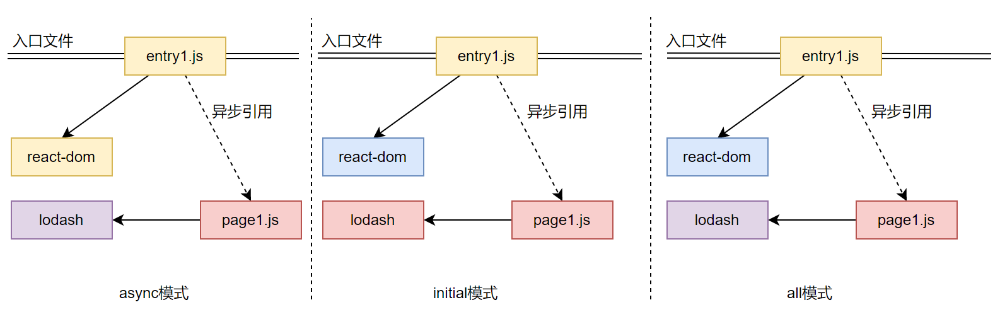
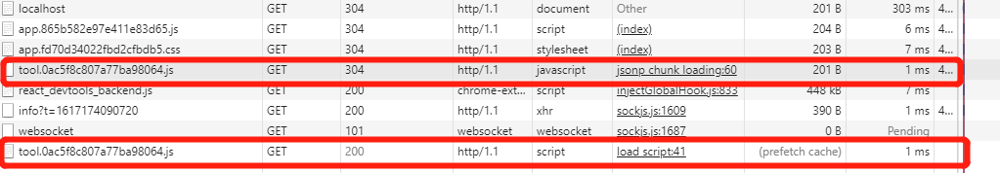
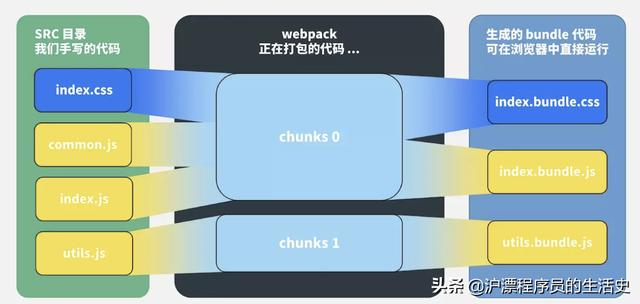

# 模块化

## CommonJS

同步加载方案，一个单独的文件就是一个模块，每一个模块有单独的作用域，只能通过 `module.exports` 导出。加载使用 `require` 。

服务器端加载本地文件很快，但是对于浏览器，需要采用异步模块加载模式。所以就有AMD和CMD。

commonjs 中有几个特别的变量，`module`、`exports`、`require`、`global`、`__filename`、`__dirname`。

## AMD & CMD

AMD：Asynchromous Module Definition，即异步模块定义。不是JS原生支持，使用AMD规范需要用到 `RequireJS` 。

RequireJS定义了一个函数 define，它是全局变量，用来定义模块。

```js
// 定义模块，id-可选参数，dependencies-当前模块依赖名称数组，factory-模块初始化要执行的函数或对象。若为函数，只被执行一次；若是对象，此对象应该为模块的输出值
define(id?, dependencies?, factory);
// 使用require加载模块，第一个参数：依赖模块，第二个参数：回调函数
require([dependencies], function(){});
```

CMD：Common Module Definition，国内发展出来，类似AMD的requireJS，CMD也有类似的叫SeaJS。

也遵循统一写法：

```js
define(id?, deps?, factory);
// factory有三个参数
// function(require, exports, module)
       
// 定义模块 myModule.js
define(function(require, exports, module) {
  var $ = require('jquery.js')
  $('div').addClass('active');
});

// 加载模块
seajs.use(['myModule.js'], function(my){

});
```

1. 一个文件一个模块，所以经常就用文件名作为模块id
2. CMD推崇依赖就近，所以一般不在define的参数中写依赖，在factory中写


AMD 与 CMD 都是异步加载，主要区别：

1. 针对define，AMD推崇依赖前置，在定义模块的时候就要声明其依赖的模块；CMD推崇就近依赖，只有在用到某个模块的时候再去require。
2. 都是异步加载，执行时机不一样。AMD在加载模块完成后就会执行该模块，模块执行顺序不确定，RequireJS2.0可以延迟执行；CMD加载完某个依赖模块后并不执行，require时才执行，保证按书写顺序执行


## ESM

ESM，ECMA Script Modules，就是我们常使用的 import、export。

同步还是异步？？？


# 常见配置

| 配置项                          | 作用                                                         |
| ------------------------------- | ------------------------------------------------------------ |
| resolve.alias                   | 创建 import 或 require 的别名，来确保模块引入变得更简单。    |
| resolve.extensions              | 自动解析确定的扩展，能够使用户在引入模块时不带扩展。默认为['.js', '.json']。 |
| resolve.mainFiles               | 解析**目录**时要使用的文件名，默认`mainFiles: ["index"]`     |
| resolve.modules                 | 告诉 webpack 解析模块时应该搜索的目录。默认是node_modules。  |
| externals                       | 打包时排除某些依赖，而由用户环境提供。                       |
| optimization.splitChunks        | [SplitChunksPlugin](https://webpack.docschina.org/plugins/split-chunks-plugin/)的配置，用于指定分块策略。 |
| optimization.splitChunks.chunks | 指定哪些chunks进行优化，默认为async。<br />async: 作用？？？<br />all: 作用？？？ |


# 常见Loader

| Loader         | 作用                                                         |
| -------------- | ------------------------------------------------------------ |
| style-loader   | 将 css 代码以`style`标签的形式插入到 html 中                 |
| css-loader     | 处理导入的css，会处理 JS中的import、require和CSS中的@import、url |
| postcss-loader | 用于 css 的兼容性处理，具有众多功能，例如 **添加前缀，单位转换** 等 |
| less-loader    | css预处理器，在 css 中新增了许多语法，提高了开发效率         |
| file-loader    | 解析文件的 `import/require()` ，转换成一个url，并且输出到指定目录。 |
| url-loader     | url-loader内部封装了file-loader。<br />url-loader工作分两种情况：<br />1.文件大小小于limit参数，url-loader将会把文件转为DataURL；<br />2.文件大小大于limit，url-loader会调用file-loader进行处理，参数也会直接传给file-loader。 |

# 常见Plugin

| Plugin                             | 描述                                                         |
| ---------------------------------- | ------------------------------------------------------------ |
| HotModuleReplacementPlugin         | webpack自带插件，可以在调试阶段只更新修改的部分，而不用刷新整个页面。 |
| html-webpack-plugin                | 生成html文件                                                 |
| clean-webpack-plugin               | 清理上一次打包的结果                                         |
| mini-css-extract-plugin            | 将css提取为独立的文件                                        |
| optimize-css-assets-webpack-plugin | 对css文件进行压缩，减小css打包后的体积                       |
| terser-webpack-plugin              | webpack自带的JS代码压缩插件                                  |
| compression-webpack-plugin         | 压缩资源为gzip格式插件，对js/css有很多的压缩效果，需要后端配置支持 |
| DefinePlugin                       | webpack自带插件，可以定义一些全局变量，可以在模块中直接使用  |
| ProvidePlugin                      | webpack自带插件，自动加载模块定义。如React项目中，每个组件的头部都必须import一次，是用该插件，可以省略该步，在需要引入时插件帮我们自动引入。 |
| DllPlugin/DllReferencePlugin       | 预打包某些不会变的资源，然后创建manifest文件链接，可提高编译速度。 |
| IgnorePlugin                       | webpack自带插件，忽略第三方包指定目录。                      |

## IgnorePlugin

这是 webpack 内置插件，它的作用是：忽略第三方包指定目录，让这些指定目录不要被打包进去。

比如我们要使用 `moment` 这个第三方依赖库，该库主要是对时间进行格式化，并且支持多个国家语言。虽然我设置了语言为中文，但是在打包的时候，是会将所有语言都打包进去的。这样就导致包很大，打包速度又慢。对此，我们可以用 `IgnorePlugin` 使得指定目录被忽略，从而使得打包变快，文件变小。

```js
const Webpack = require('webpack')
plugins: [
  // moment这个库中，如果引用了./locale/目录的内容，就忽略掉，不会打包进去
  new Webpack.IgnorePlugin(/\.\/locale/, /moment/),
]
```

我们虽然按照上面的方法忽略了包含`’./locale/'`该字段路径的文件目录，但是也使得我们使用的时候不能显示中文语言了，所以这个时候可以手动引入中文语言的目录。

```js
import moment from 'moment'

//手动引入所需要的语言包
import 'moment/locale/zh-cn'

moment.locale('zh-cn')

let r = moment().endOf('day').fromNow()
console.log(r)
```

# 优化

## 代码分割

代码分割主要集中在webpack中的**optimization.splitChunks**项的配置 

参考http://www.qiutianaimeili.com/html/page/2019/10/u3c9rzngly9.html，这里讲了很多参数，这里暂先看下chunks这个参数的含义

> 注：在自己的webpack5脚手架中发现，对于异步加载的js文件，触发异步加载条件时会创建script标签挂载到head中进行加载，当加载完毕后，该script标签也就被删除了。

### splitChunks.chunks

该值包含三种设置："initial" "async"  "all"，我们构造如下一个依赖关系看下参数

```js
//entry1.js
import ReactDOM from 'react-dom'
import('./page1').then();

//page1.js
import _ from 'lodash'
```



**async** 只会异步加载模块进行分割，打包结果为：

```
entry1.***.js
page1.***.js
vendor~page1.***.js
```

可以看到：

1. page1.js因为是异步引用，所以会从主包中分离出去。page1中的lodash也会单独打成一个包。
2. react-dom并没有被打包，因为async模式，只会分割异步加载里面的引用。

**initial** 只会对入口文件进行分割，打包结果为：

```
entry1.***.js
page1.***.js
vendor~entry1.***.js
```

**all** 表示对入口和异步引用都会进行分割，打包结果为：

```
entry1.***.js
page1.***.js
vendor~entry1.***.js
vendor~page1.***.js
```

## 预加载

### prefetch/preload

代码懒加载固然能提高首页的加载速度，可是若当用户与页面进行交互时再加载代码，会使得用户首次交互体验不佳，这个时候就需要预拉取（prefetch）和预加载（preload）了。

如何启用prefetch？这是我们需要一种Magic Comment（魔法注释）的方式

```js
import(/* webpackChunkName: 'tool', webpackPrefetch:true */ "./tool").then(
    ({ add }) => {
        console.log("loadSuccess:" + add(1, 3));
    }
);
```

这样做了之后，webpack会替我们在 `head` 标签内添加如下一行，其会在父chunk加载完成之后进行资源下载，此时暂时还不会加载js文件：

```html
<link rel="prefetch" as="script" href="http://localhost:9000/tool.0ac5f8c807a77ba98064.js">
```

这样的话，prefetch chunk会在父chunk加载完成之后进行加载，



 当我们触发加载异步JS文件时，新建script标签插入head中进行加载，此时由于JS文件之前已经预拉取了，这里则直接从prefetch cache缓存中提取，加快了JS文件的加载速度。

> 注：前面提起过，异步加载的script加载完成后会又从head中移除。

preload chunk会在父chunk加载时以并行方式加载。这个尝试了下，没有起作用，跟没有设置一样。


# 常见问题

## module/chunk/bundle



看这个图就很明白了：

1. 对于一份同逻辑的代码，当我们手写了一个个的文件，它们无论是 ESM 还是 CommonJS 或是 AMD，他们都是 **module**；
2. 当我们写的 module 源文件传到 webpack 进行打包时，webpack 会根据文件引用关系生成 **chunk** 文件，webpack 会对这个 chunk 文件进行一些操作；
3. webpack 处理好 chunk 文件后，最后会输出 **bundle** 文件，这个 bundle 文件包含了经过加载和编译的最终源文件，所以它可以直接在浏览器中运行。

一般来说一个 chunk 对应一个 bundle，比如上图中的 utils.js -> chunks 1 -> utils.bundle.js；但也有例外，比如说上图中，我就用 MiniCssExtractPlugin 从 chunks 0 中抽离出了 index.bundle.css 文件。

**一句话总结：**

module，chunk 和 bundle 其实就是同一份逻辑代码在不同转换场景下的取了三个名字：我们直接写出来的是 module，webpack 处理时是 chunk，最后生成浏览器可以直接运行的 bundle。

## filename/chunkFilename 

**filename**

filename 是一个很常见的 `output` 配置，指经过webpack 打包后输出文件的文件名。

```js
const path = require('path');

module.exports = {
  entry: './path/to/my/entry/file.js',
  output: {
    path: path.resolve(__dirname, 'dist'),
    filename: '[name].bundle.js'
  }
};
```

**chunkFilename**

chunkFilename 指未被列在 entry 中，却又需要被打包出来的 chunk 文件的名称。一般来说，这个 chunk 文件指的就是要**懒加载**的代码。

**一句话总结：**

filename 指列在 entry 中，打包后输出的文件的名称。

chunkFilename 指未列在 entry 中，却又需要被打包出来的文件的名称。


## hash

首先来个背景介绍，哈希一般是结合 CDN 缓存来使用的。如果文件内容改变的话，那么对应文件哈希值也会改变，对应的 HTML 引用的 URL 地址也会改变，触发 CDN 服务器从源服务器上拉取对应数据，进而更新本地缓存。 

| 类型        | 描述                                                         |
| ----------- | ------------------------------------------------------------ |
| hash        | 跟整个项目的构建相关，生成文件的hash都一样                   |
| chunkhash   | 它根据不同的入口文件(Entry)进行依赖文件解析、构建对应的 chunk，生成对应的哈希值。 |
| contenthash | 根据资源内容创建出唯一 hash，也就是说文件内容不变，hash 就不变 |


# Webpack工作流程

1、读取配置文件，按命令 **初始化** 配置参数，创建 Compiler 对象；

2、调用插件的 apply 方法 **挂载插件** 监听，然后从入口文件开始执行编译；

3、按文件类型，调用相应的 Loader 对模块进行 **编译**，并在合适的时机点触发对应的事件，调用 Plugin 执行，最后再根据模块 **依赖查找** 到所依赖的模块，递归执行第三步；

4、将编译后的所有代码包装成一个个代码块 (Chuck)， 并按依赖和配置确定 **输出内容**。这个步骤，仍然可以通过 Plugin 进行文件的修改;

5、最后，根据 Output 把文件内容一一写入到指定的文件夹中，完成整个过程；