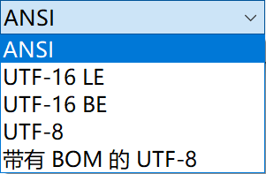
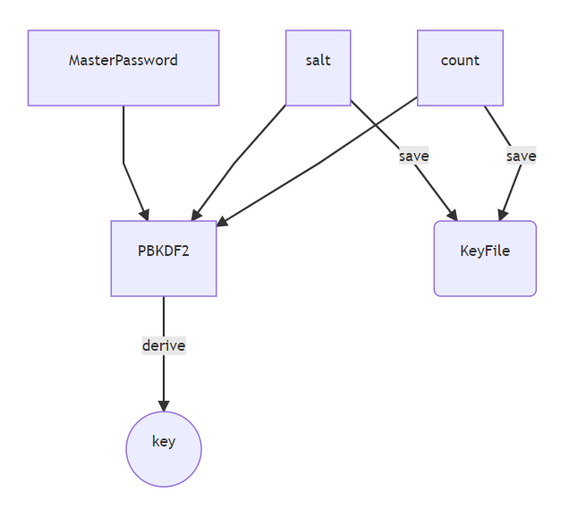
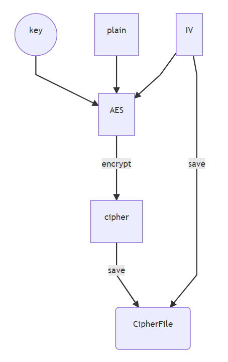
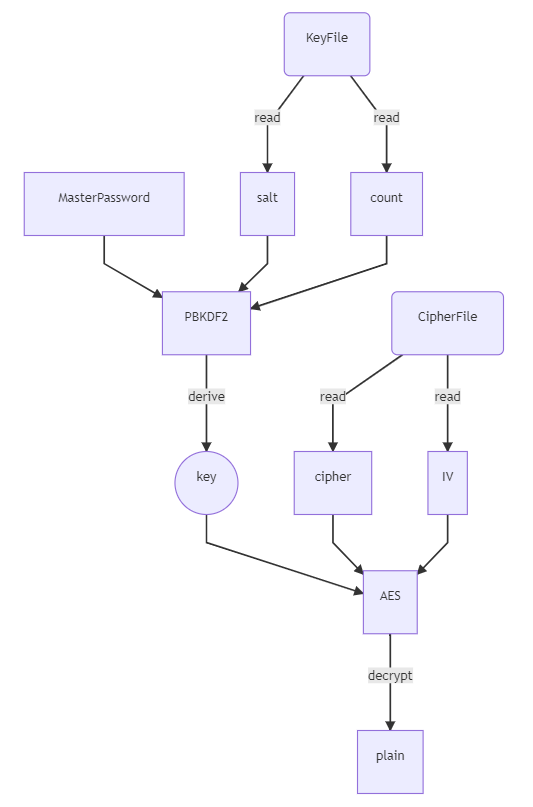
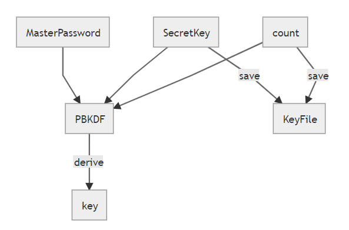
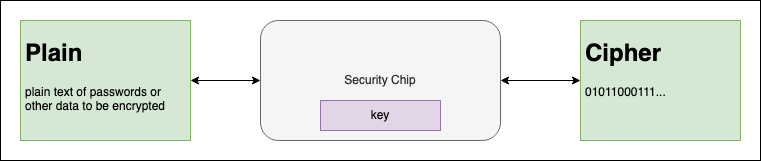
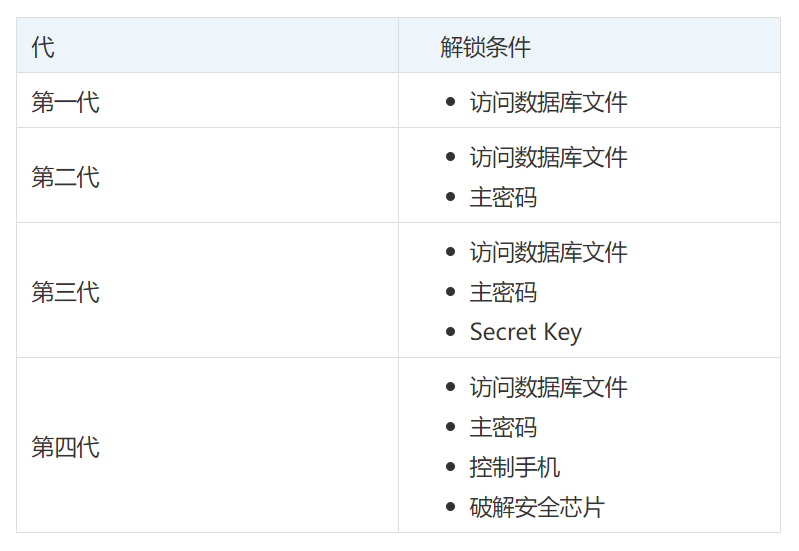

# 基础概念

**字节序**： 

- 大端 Big-endian：低位地址存放高位
- 小端 Little-endian：低位地址存放低位

```
如：0x12345678

低地址------------------->高地址
 0x01   0x02   0x03   0x04     内存中
| 12   | 34  |  56   | 78 |    big endian 方式
| 78   | 56  |  34   | 12 |    little endian方式 
```

**BOM**

ByteOrderMark：文件编码头，即 字节顺序标记。

它是插入到以UTF-8、UTF16或UTF-32编码文件开头的特殊标记。

BOM编码头 常见形式如下:

- EF BB BF =  UTF-8 (可选标记)

- FE FF   =  UTF-16, big-endian
- FF FE   =  UTF-16, little-endian (也是windows中的Unicode编码默认标记)

- 00 00 FE FF  = UTF-32, big-endian
- FF FE 00 00 = UTF-32, little-endian

Windows的记事本可以选择如下几种编码保存：




# 消息编码

## Unicode

初衷：所有的字符都包含在一个字符集里。

每个符号指定一个编号，叫“码点”。一共有17（2<sup>5</sup>）个平面，每个平面存在65536（2<sup>16</sup>）个字符，整个Unicode字符集大小现在是2<sup>21</sup>。

最前面的65536个字符，称为基本面（BMP），U+0000 ~ U+FFFF。里面包含的最常见的字符。

剩下在的字符都在辅助平面（SMP），码点范围 U+010000 ~ U+10FFFF。注意这里是16进制表示，包含16个平面。

## UTF-32

最直观的编码方式，每个码点4个字节表示，字节内容和码点一一对应，不足4个字节的前面加0补充。**缺点浪费空间！！！英文是ASCII编码的4倍！！！**

UTF-32 与 UTF-16 一样有大尾序和小尾序之别，编码前会放置 U+0000FEFF 或 U+FFFE0000 以区分。

## UTF-16 

编码规则也很简单，基本面用2个字节表示，辅助面用4个字节表示。**UTF-16的编码长度要么是2个字节（U+0000到U+FFFF），要么是4个字节（U+010000到U+10FFFF）。**

那么有一个问题，当遇到两个字节怎么判断它是单独字符还是需要和后面两个字节放在一起？很神奇的地方是，Unicode基本面内，从U+D800到U+DFFF是一个空段，需要利用这个空段来承载。

辅助平面有 2<sup>20</sup> 个字符（16个平面，每个平面 2<sup>16</sup>个字符），UTF-16将这20位拆成两半，前10位映射在U+D800到U+DBFF（**空间**大小2<sup>10</sup>），称为高位（H），后10位映射在U+DC00到U+DFFF（**空间**大小2<sup>10</sup>），称为低位（L）。这意味着，一个辅助平面的字符，被拆成两个基本平面的字符表示。

**转换关系：**

```js
// 1. 如果是基本面的字符，直接转换成对应的十六进制，对应两个字节

// 2. 如果是辅助面，则高低字节转换公式如下
H = Math.floor((c-0x10000) / 0x400)+0xD800
L = (c - 0x10000) % 0x400 + 0xDC00
```

由于大部分汉字在基本面，故大部分汉字是两个字节编码，少量不常用汉字采用四个字节编码。UTF-16 编码有大尾序和小尾序之别，即 UTF-16BE 和 UTF-16LE，在编码前会放置一个 U+FEFF 或 U+FFFE（UTF-16BE 以 FEFF 代表，UTF-16LE 以 FFFE 代表），其中 U+FEFF 字符在 Unicode 中代表的意义是 ZERO WIDTH NO-BREAK SPACE，顾名思义，它是个没有宽度也没有断字的空白。

## UTF-8

Unicode是字符集，每个字符分配一个唯一ID。这里只负责分配数字，具体数字如何传输、占几个字节，是由编码规则决定的。

UTF-8 顾名思义，是一套以 8 位为一个编码单位的可变长编码。会将一个码位编码为 1 到 4 个字节：

```
U+  0000 ~ U+  007F: 0XXXXXXX
U+  0080 ~ U+  07FF: 110XXXXX 10XXXXXX
U+  0800 ~ U+  FFFF: 1110XXXX 10XXXXXX 10XXXXXX
U+010000 ~ U+10FFFF: 11110XXX 10XXXXXX 10XXXXXX 10XXXXXX
```

根据上表中的编码规则，「知」字的码位 U+77E5 属于第三行的范围：

```
      7    7    E    5    
    0111 0111 1110 0101    二进制的 77E5
--------------------------
    0111   011111   100101 二进制的 77E5
1110XXXX 10XXXXXX 10XXXXXX 模版（上表第三行）
11100111 10011111 10100101 代入模版
   E   7    9   F    A   5
```

这就是将 U+77E5 按照 UTF-8 编码为字节序列 E79FA5 的过程。**可见在UTF-8编码中，一个汉字一般占3个字节**。

## GBK

**GB2312**：一个小于127的字符的意义与原来相同，但两个大于127的字符连在一起时，就表示一个汉字，前面的一个字节（高字节）从0xA1用到0xF7，后面一个字节（低字节）从0xA1到0xFE

**GBK**：扩展GB2312，低字节不需要大于127，只要高字节大于127即可

**GB18030**：扩展GBK，增加生僻字符


## Base64

Base64是一种用64个字符来表示任意二进制数据的方法。对二进制数据进行处理，每3个字节一组，一共是24bit，划为4组，每组正好6个bit（2^6 = 64）

Base64编码会把3字节的二进制数据编码为4字节的文本数据，长度增加33%

如果要编码的二进制数据不是3的倍数，最后会剩下1个或2个字节，Base64用`\x00`字节在末尾补足后，再在编码的末尾加上1个或2个`=`号，表示补了多少字节，解码的时候，会自动去掉。


# 对此加密

加密解密是同一个密钥。

优点：保密性高，加密速度快，适合加密大量数据，易于通过硬件实现；
缺点：秘钥必须通过安全可靠的途径传输，秘钥的分发是保证安全的关键因素；

## DES

DES是1977年美国联邦信息处理标准中使用的一种对称密码技术，曾今被美国和其他国家政府银行使用。不过现在已被暴力破解，不再安全可靠了，我们除了用它解密以前的密文外，已**不再使用DES了**。

3DES只是将DES重复3次，为了增加DES强度。

## AES

最流行的对称加密算法是 AES(Advanced Encryption Standard)。根据密钥`key`的长度分为三个级别：128/192/256 bit。其中，AES-256 作为最高级别的算法，广泛应用于金融、军事等领域，也被很多密码管理器采用。

# 非对称加密

公钥 + 私钥，一个加密另一个解密

优点：密文可通过公开信道进行，无需保密。既可用于加密也可用于签名。
缺点：加密速度不如对称密码，不适合大量数据加密，加密操作难以通过硬件实现。


## RSA

RSA是1977年由罗纳德·李维斯特（Ron Rivest）、阿迪·萨莫尔（Adi Shamir）和伦纳德·阿德曼（Leonard Adleman）一起提出的。当时他们三人都在麻省理工学院工作。RSA就是他们三人姓氏开头字母拼在一起组成的。

RSA的安全基于大数分解的难度。其公钥和私钥是一对大素数的函数。从一个公钥和密文恢复出明文的难度，等价于分解两个大素数之积。

RSA允许你选择公钥的大小。512位的密钥被视为不安全的；768位的密钥不用担心受到除了国家安全管理（NSA）外的其他事物的危害；1024位的密钥几乎是安全的。


## ECC

基于椭圆曲线离散对数难题


# Hash函数

哈希函数将任意长的消息映射为一个固定长度的散列值，哈希是单向函数。

哈希函数的安全性是由发生碰撞的概率决定的。如果攻击者能轻易构造出两个不同的消息具有相同的消息摘要，那么这样的哈希函数是不可靠的。

## MD5


# 数字签名

数字签名与验证过程：

发送方用哈希函数从报文文本中生成一个128位的散列值（或报文摘要），发送方用自己的**私钥**对这个散列值进行加密来形成自己的数字签名。然后，这个数字签名将作为报文的附件和报文一起发送给接收方。接收方收到报文后：

1. 同样的哈希函数从原始报文中计算出散列值（或报文摘要）

2. 再用发送方的公钥来对报文附加的数字签名进行解密得出另一个散列值

3. 如果两个散列值相同，那么接收方就能确认该数字签名是发送方的。

通过数字签名能够实现消息的完整性和不可抵赖性。

# 密码管理器

https://www.infoq.cn/article/Jrr56Ufm8h2jCkepI5qG

## 第二代密码管理

PBKDF2

通过主密码生成保护数据的安全密钥`key`

通过增加迭代次数，生成密钥的算法很消耗计算资源，这提高了暴力破解的难度。



这里要强调，不保存主密码！不保存主密码！不保存主密码！

用一句话解释：通过主密码生成安全的加密密钥 `key` ，并且保存密钥生成算法的参数。



加密过程如上：使用安全密钥加密数据，保存密文（加密后的数据）。



按照同样方法从主密码生成密钥 `key` ，再使用解密算法从密文解密出原文**。**

**主密码建议使用密码短语**

## 第三代密码管理



第三代将 salt 叫 Secret Key。

除主密码外，还增加了一个不同步的 Secret Key。

## 第四代密码管理器

基于安全芯片的数据保护技术，不再担心主密码泄露

安全芯片中存储的数据都是加密的，运行时的内存也是加密的，加密密钥存储在芯片内部。即使是外部操作系统，也无法访问安全芯片中的数据、无法获取加密数据的密钥。



App 可以请求安全芯片创建密钥，并且只有创建密钥的 App 才能请求安全芯片使用这个密钥执行加密算法。不论是加密还是解密，都由安全芯片处理，App 只能得到加密/解密的结果，而得不到密钥。

> 哪里保证了创建密钥的App才能请求安全芯片使用密钥来执行算法

## 总结



# 椭圆曲线加密算法

## Secp256k1

