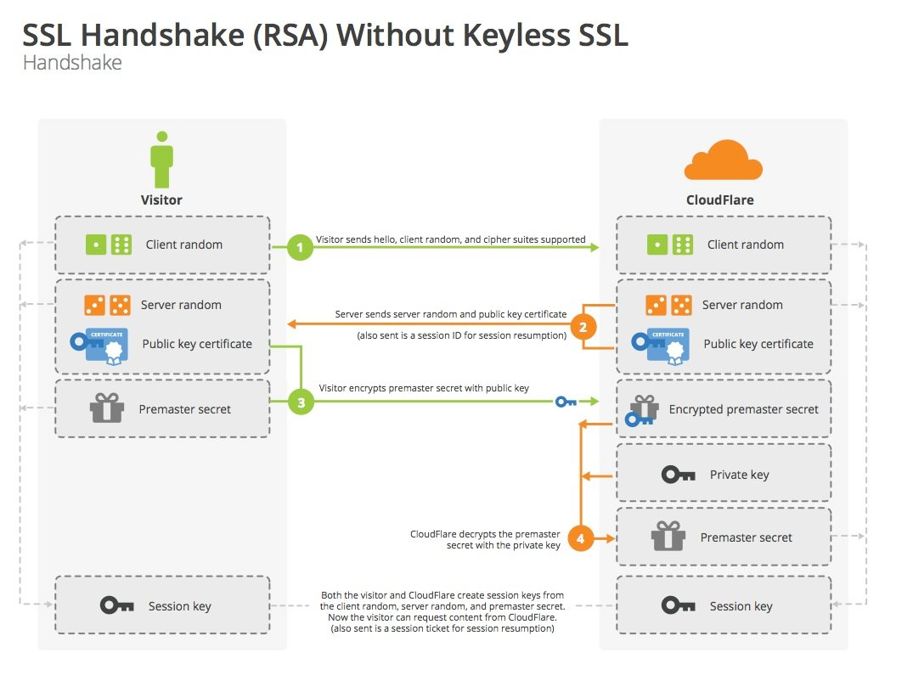
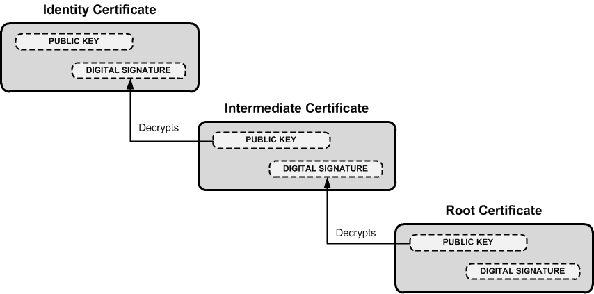
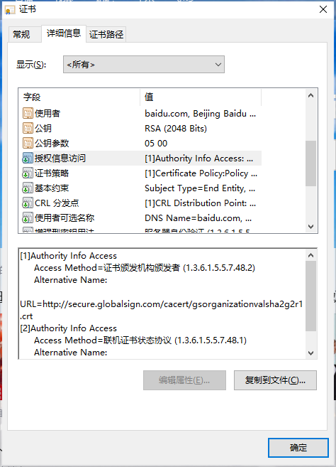

# TLS/SSL

**SSL**： Secure Socket Layer，安全套接层

**TLS**：Transport Layer Security，传输层安全

由于HTTPS的推出受到了很多人的欢迎，在SSL更新到3.0时，IETF对SSL3.0进行了标准化，并添加了少数机制(但是几乎和SSL3.0无差异)，标准化后的IETF更名为TLS1.0，可以说TLS就是SSL的新版本3.1，并同时发布“RFC2246-TLS加密协议详解”。现在主流的版本是 TLS1.2。未来，可能是 TLS1.3 的时代。


# 加密套件

加密套件列表一般由客户端发送，供服务器选择。用 openssl 查看列表：

```
➜ openssl ciphers -v
ECDHE-RSA-AES256-GCM-SHA384  	TLSv1.2 Kx=ECDH     Au=RSA    Enc=AESGCM(256) Mac=AEAD
ECDHE-ECDSA-AES256-GCM-SHA384 	TLSv1.2 Kx=ECDH     Au=ECDSA  Enc=AESGCM(256) Mac=AEAD
AES256-SHA256                     TLSv1.2 Kx=RSA      Au=RSA    Enc=AES(256)   Mac=SHA256
...
... Cipher Suites(17 suites)
```

上图数据表明列表附带了多达 17 个加密套件，单个拎出来一般长这样：


意思是：

- `TLS` 握手过程中，使用 `ECDHE` 算法生成 pre_random。
- 身份验证 (签名) 使用 `RSA` 算法。
- 128 位的 `AES` 算法进行对称加密，在对称加密的过程中使用主流的 `GCM` 分组模式，可以让算法用固定长度的密钥加密任意长度的明文。
- 最后是用于数据完整性校验的哈希摘要算法，采用 `SHA256` 算法。

# TLS握手

参考：https://blog.csdn.net/kunyus/article/details/98754475/

## RSA握手



具体流程：

1. 浏览器向服务器发送随机数 Client random，TLS 版本和供筛选的加密套件列表。 
2. 服务器接收到，立即返回 Server random，确认好双方都支持的加密套件以及数字证书 (证书中附带公钥 Public key certificate)。 
3. 浏览器接收，先验证**数字证书**。若通过，接着使用加密套件的密钥协商算法RSA算法生成预主密钥 Premaster secret，并且用证书里的公钥加密，传给服务器。 
4. 服务器用私钥解密这个被加密后的预主密钥Premaster secret。
5. 浏览器和服务器使用Client random + Server random + Premaster secret 使用协商好的方式生成对称密钥。

## DH握手


**SSL 数字证书根据可信强度，大概可以分为以下几种：**

- 域名型 SSL 证书（DV SSL）
- 企业型 SSL 证书（OV SSL）
- 增强型 SSL 证书（EV SSL）


https://zhuanlan.zhihu.com/p/144138640

根证书、中间证书


证书验证过程


https://www.zhihu.com/question/37370216




授权信息访问：得到非根证书的颁发者证书




证书分为DV(Digital Verification)，OV(Organization Verification)和EV(Extended Verification)，其中EV证书最贵，可以在浏览器中看到绿色的就是EV证书。证书从申请到批准要走很久的流程，需要提供很多的公司认证信息和个人信息，否则是不会通过的。因此可以保证签发的证书内容是可信的。


证书颁发机构（CA）不会直接从根目录颁发服务器证书（即SSL证书），因为这种行为是十分危险的，因为一旦发生错误颁发或者需要撤销root,则使用root签名的每个证书都会被撤销信任。