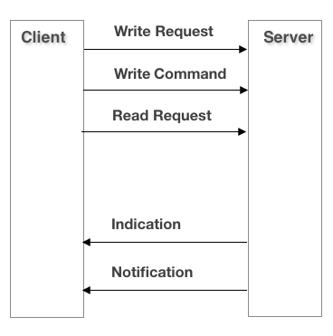

# 蓝牙协议

## GAP

GAP，Generic Access Profile，GAP 协议层定义了 BLE 设备的发现流程，设备管理和设备连接的建立。  

BLE GAP 协议层采用 API 调用和事件 (Event) 返回的设计模式，通过事件返回来获取 API在协议栈的处理结果。当对端设备主动发起请求时，也是通过事件返回获取对端设备的状态。 

BLE 设备定义了四类 GAP 角色：

- 广播者 (Broadcaster)：处于这种角色的设备通过发送广播 (Advertising) 让接收者发现自己。这种角色只能发广播，不能被连接。
- 观察者 (Observer)：处于这种角色的设备通过接收广播事件并发送扫描 (Scan) 请求。这种角色只能发送扫描请求，不能被连接。
- 外围设备 (Peripheral)：当广播者接受了观察者发来的连接请求后就会进入这种角色。当设备进入了这种角色之后，将会作为从设备 (Slave) 在链路中进行通信。
- 中央设备 (Central)：当观察者主动进行初始化，并建立一个物理链路时就会进入这种角色。这种角色在链路路中同样被称为主设备 (Master)。  

## GATT

通用属性配置文件(GATT)在属性协议(ATT)的基础上构建，为属性协议传输和存储数据建立了一些通用操作和框架。

### ATT属性协议

BLE 里面的数据以属性 (Attribute) 方式存在，每条属性由四个元素组成：

- 属性句柄 (Attribute Handle)：正如我们可以使用内存地址查找内存中的内容一样，ATT 属性的句柄也可以协助我们找到相应的属性，例如第一个属性的句柄是0x0001，第二个属性的句柄是 0x0002，以此类推，最大可以到 0xFFFF。系统会自动按顺序地为相关attribute生成句柄。其中有一个UUID非常特殊，它被蓝牙联盟采用为官方UUID，这个UUID如下所示：**0000xxxx-0000-1000-8000-00805F9B34FB**, 由于这个UUID众所周知，蓝牙联盟将自己定义的attribute或者数据只用16bit UUID来表示。
- 属性类型 (Attribute UUID)：每个数据有自己需要代表的意思，例如表示温度、发射功率、电池等各种各样的信息。蓝牙组织 (Bluetooth SIG) 对常用的一些数据类型进行了归类，赋予不同的数据类型不同的标识码(UUID)。例如 0x2A09 表示电池信息，0x2A6E 表示温度信息。UUID 可以是 16 比特的 (16-bit UUID)，也可以是 128 比特的 (128-bit UUID)。
- 属性值 (Attribute Value)：属性值是每个属性真正要承载的信息，其他 3 个元素都是为了让对方能够更好地获取属性值。有些属性的长度是固定的，例如电池属性(Battery Level) 的长度只有 1 个字节，因为需要表示的数据仅有 0~100%，而 1 个字节足以表示 1～100 的范围；而有些属性的长度是可变的，例如基于 BLE 实现的透
  传模块。
- 属性许可 (Attribute Permissions)：每个属性对各自的属性值有相应的访问限制，比如有些属性是可读的、有些是可写的、有些是可读又可写的等等。拥有数据的一方可以通过属性许可，控制本地数据的可读写属性。

我们把存有数据（即属性）的设备叫做服务器 (Server)，而将获取别人设备数据的设备叫做客户端 (Client)。下面是服务器和客户端间的常用操作：

- 客户端给服务端发数据，通过对服务器的数据进行写操作 (Write)，来完成数据发送工作。写操作分两种，一种是写入请求 (Write Request)，一种是写入命令 (Write Command)，两者的主要区别是前者需要对方回复响应 (Write Response)，而后者不需要对方回复响应。
- 服务端给客户端发数据，主要通过服务端指示 (Indication) 或者通知 (Notification) 的形式，实现将服务端更新的数据发给客户端。与写操作类似，指示和通知的主要区别是前者需要对方设备在收到数据指示后，进行回复 (Confirmation)。
- 客户端也可以主动通过读操作读取服务端的数据。

# 蓝牙配网

ESP32支持一键配网方式有3中，airkiss、smartconfig、blufi

## BluFi

BluFi 是一款基于蓝牙通道的 Wi-Fi 网络配置功能，适用于 ESP32。它通过安全协议将 Wi-Fi 配置和证书传输到 ESP32，然后 ESP32 可基于这些信息连接到 AP 或建立 SoftAP。

BluFi 流程的关键部分包括数据的分片、加密、校验和验证。

ESP32的连接过程：

https://docs.espressif.com/projects/esp-idf/zh_CN/latest/esp32/api-guides/blufi.html

可以使用官方示例 EspBluFi-1.5.3-24.apk 和 esp-idf\examples\bluetooth\bluedroid\ble\blufi 来实现配网功能 

AndroidApp代码：https://github.com/EspressifApp/EspBlufiForAndroid

个人写的微信小程序版本：https://github.com/xuhongv/BlufiEsp32WeChat

## AirKiss

## Smart Config

这种配网方式有的地方称为Easy-Connect配网，原理都是一样的，就是利用设备无线模块的混杂模式发送广播数据包。

SmartConfig配网就是让智能家居物联网设备的无线模块工作在混杂模式下，然后手机APP不断的向周围广播带有约定标志的你输入的WIFI信息，物联网设备对接收到的数据包分析，把带有约定标志的解密，然后得到WIFI信息。

