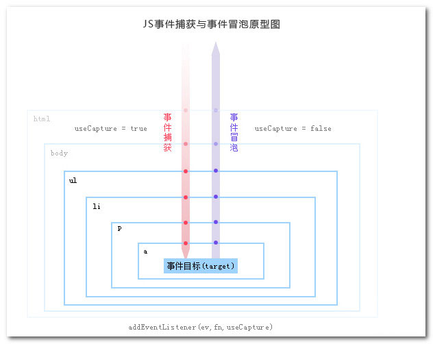

在做前端开发的时候，我们经常需要做一些各式各样的交互，如鼠标单击/双击/滑动事件、键盘事件等等等等，这些都是DOM事件。首先我们先看一个概念，叫DOM事件流。

# DOM事件流

事件流：事件在目标元素和祖先元素间的触发顺序。

学习前端的同学对于事件流肯定不会陌生，不就是冒泡和捕获？是的，事件不会只作用在绑定的元素上，而是会有一个流向，流向上的DOM元素绑定了事件的话，都会响应。 在早期，微软和网景实现了相反的事件流，网景主张捕获方式，微软主张冒泡方式。

- 捕获(Capture)：事件由最顶层逐级向下传播, 直至到达目标元素。

- 冒泡(Bubble)：事件由第一个被触发的元素接收, 然后逐级向上传播。

最后 W3C 采用折中的方式，规定先捕获再冒泡，才平息了战火。如此一个事件就被分成了三个阶段（是的，不光是捕获和冒泡）:

- **捕获阶段**：事件从最顶层元素 window 一直传递到目标元素的父元素。

- **目标阶段**：事件到达目标元素，如果事件指定不冒泡，那就会在这里中止。

- **冒泡阶段**：事件从目标元素父元素向上逐级传递直到最顶层元素 window。

也就是如下图所示，这里只需有个大概的概念，后面将具体介绍这几个阶段：



好了，对事件流有了一个大概的理解了，我们再来看看DOM级别。

# DOM级别

DOM级别是啥玩意呢？其实就是DOM在不同时期出来的一些规范，就像 JavaScript 里的ES5、ES6、ES7等是一个意思，不断往里面添加一些新的东西。DOM级别有DOM0、DOM1、DOM2、DOM3。其中DOM1和事件没有关系，将不做介绍。

## DOM0级事件

为啥要以0为起点呢？ 因为这不是 W3C 规范。最开始的时候还没有规范，但各个浏览器就约定俗成的这么做了，所以就成了一个事实上的“规范”。

那么什么是DOM0级处理事件呢？DOM0级事件就是将一个函数赋值给一个事件处理属性，比如： 

```html
<button id="btn" type="button">点我</button>
<script>
 	var btn = document.getElementById('btn');
 	btn.onclick = function() {
 		alert('Hello World');
 	}
 // btn.onclick = null; 解绑事件 
</script>
```

以上代码我们给button定义了一个id，通过JS获取到了这个id的按钮，并将一个函数赋值给了一个事件处理属性onclick，这样的方法便是DOM0级处理事件的体现。我们可以通过给事件处理属性赋值null来解绑事件。

DOM0级事件处理程序的缺点在于一个处理程序**无法同时绑定多个处理函数**，比如我还想在按钮点击事件上加上另外一个函数。

## DOM2级事件

DOM2级事件在DOM0级事件的基础上弥补了无法同时绑定多个处理函数的缺点，允许给一个DOM元素添加多个处理函数(addEventListener)。运行如下代码后点击按钮，我们可以发现两个事件均会被触发： 

```html
<!DOCTYPE html>
<html lang="en">
  <head>
    <meta charset="UTF-8" />
    <meta name="viewport" content="width=device-width, initial-scale=1.0" />
    <title>Document</title>
  </head>
  <body>
    <button id="btn" type="button">点我</button>
    <script>
      var btn = document.getElementById('btn');
      function showFn1() {
        alert('Hello1');
      }
      function showFn2() {
        alert('Hello2');
      }
      btn.addEventListener('click', showFn1, false);
      btn.addEventListener('click', showFn2, false);
    </script>
  </body>
</html>
```

DOM2级事件定义了 `addEventListener` 和 `removeEventListener` 两个方法，分别用来绑定和解绑事件，方法中包含3个参数，分别是绑定的事件处理属性名称（注意不包含on）、处理函数和是否在捕获阶段执行。

## DOM3级事件

DOM3级事件在DOM2级事件的基础上添加了更多的事件类型，全部类型如下：

1. UI事件，当用户与页面上的元素交互时触发，如：load、scroll
2. 焦点事件，当元素获得或失去焦点时触发，如：blur、focus
3. 鼠标事件，当用户通过鼠标在页面执行操作时触发如：dbclick、mouseup
4. 滚轮事件，当使用鼠标滚轮或类似设备时触发，如：mousewheel
5. 文本事件，当在文档中输入文本时触发，如：textInput
6. 键盘事件，当用户通过键盘在页面上执行操作时触发，如：keydown、keypress
7. 合成事件，当为IME（输入法编辑器）输入字符时触发，如：compositionstart
8. 变动事件，当底层DOM结构发生变化时触发，如：DOMsubtreeModified

同时DOM3级事件也允许使用者自定义一些事件。


# 详解事件流


##  事件冒泡

所谓事件冒泡就是事件像泡泡一样从最开始生成的地方一层一层往上冒，比如上图中a标签为事件目标，点击a标签后同时也会触发p、li上的点击事件，一层一层向上直至最外层的 html 或 document。下面是代码示例： 

```html
<!DOCTYPE html>
<html lang="en">

<head>
  <meta charset="UTF-8">
  <meta name="viewport" content="width=device-width, initial-scale=1.0">
  <title>Document</title>
</head>

<body>
  <p id="parent" style="background-color: red;padding: 20px">
    <a id="child" style="background-color: blue;">事件冒泡</a>
  </p>
  <script>
    var parent = document.getElementById('parent');
    var child = document.getElementById('child');
    child.addEventListener('click', function () {
      alert('我是目标 a');
    }, false);
    parent.addEventListener('click', function () {
      alert('事件冒泡至 p');
    }, false);
  </script>
</body>

</html>
```

上面的代码运行后我们点击 a 标签，首先会弹出【我是目标 a 】的提示，然后又会弹出【事件冒泡至 p】的提示，这便说明了事件自内而外向上冒泡了。 

## 事件捕获

和事件冒泡相反，事件捕获是自上而下执行，我们只需要将 `addEventListener` 的第三个参数改为true就行。 同样是上面的例子，我们在 p 标签上添加一个捕获阶段的绑定，代码如下：

```html
<!DOCTYPE html>
<html lang="en">

<head>
  <meta charset="UTF-8">
  <meta name="viewport" content="width=device-width, initial-scale=1.0">
  <title>Document</title>
</head>

<body>
  <p id="parent" style="background-color: red;padding: 20px">
    <a id="child" style="background-color: blue;">事件冒泡</a>
  </p>
  <script>
    var parent = document.getElementById('parent');
    var child = document.getElementById('child');
    // 添加此捕获阶段的事件
    parent.addEventListener('click', function () {
      alert('事件捕获至 p');
    }, true);
    child.addEventListener('click', function () {
      alert('我是目标 a');
    }, false);
    parent.addEventListener('click', function () {
      alert('事件冒泡至 p');
    }, false);
  </script>
</body>

</html>
```

上面的代码运行后我们点击 a 标签，提示顺序为：【事件捕获至 p 】->【我是目标 a 】->【事件冒泡至 p】。可以看到，事件确实是如上图所示，先进行捕获，后冒泡。

## 终止事件传播

不管在捕获阶段还是冒泡阶段，我们都不希望事件再进行传递了，那么我们怎么进行阻止呢？这时我们可以使用`Event` 对象的 ` stopPropagation ` 方法。而 `Event` 怎么获取呢？其实每个事件响应函数都有一个参数，就是这个事件对象。

同样是上面的例子，当点击 a 标签，若我们在 p 标签的捕获阶段就阻止事件的传递，这样一来后面的事件均不会执行，代码示例如下：

```html
<!DOCTYPE html>
<html lang="en">

<head>
  <meta charset="UTF-8">
  <meta name="viewport" content="width=device-width, initial-scale=1.0">
  <title>Document</title>
</head>

<body>
  <p id="parent" style="background-color: red;padding: 20px">
    <a id="child" style="background-color: blue;">事件冒泡</a>
  </p>
  <script>
    var parent = document.getElementById('parent');
    var child = document.getElementById('child');
    parent.addEventListener('click', function (e) {
      alert('事件捕获至 p');
      // 阻止传播，"我是目标 a" 和 "事件冒泡至 p" 都不执行
      e.stopPropagation();
    }, true);
    child.addEventListener('click', function () {
      alert('我是目标 a');
      // 阻止传播，"事件冒泡至 p" 不执行
      // e.stopPropagation();
    }, false);
    parent.addEventListener('click', function () {
      alert('事件冒泡至 p');
    }, false);
  </script>
</body>

</html>
```

运行点击 a 标签，我们可以看到如注释那样的效果。只要看明白了事件流的那张图，了解了捕获/目标/冒泡这三个阶段，其实就很容易理解了  `stopPropagation` 阻止事件流所引起的这些现象。这里需要注意的是  `stopPropagation` 这个函数是阻止事件传播（从单词中可以明白），而不单单只是阻止冒泡，在其他的文章中没有解释清楚。


# 疑问❓

**onclick是在哪些阶段执行？**

这里我们针对的是**非目标阶段**，修改上述例子，我们 id=parent 节点，即 p 标签添加一个onclick事件。

```html
<!DOCTYPE html>
<html lang="en">

<head>
  <meta charset="UTF-8">
  <meta name="viewport" content="width=device-width, initial-scale=1.0">
  <title>Document</title>
</head>

<body>
  <p id="parent" style="background-color: red;padding: 20px">
    <a id="child" style="background-color: blue;">事件冒泡</a>
  </p>
  <script>
    var parent = document.getElementById('parent');
    var child = document.getElementById('child');
    parent.addEventListener('click', function (e) {
      alert('事件捕获至 p');
    }, true);
    child.addEventListener('click', function () {
      alert('我是目标 a');
    }, false);
    parent.addEventListener('click', function () {
      alert('事件冒泡至 p');
    }, false);
    parent.onclick = function (e) {
      alert('p 标签 onclick');
    }
  </script>
</body>

</html>
```

我们可以看到会有这样的一个顺序：

【事件捕获至 p 】->【我是目标 a 】->【事件冒泡至 p】-> 【p 标签 onclick】

从上面的结果我们可以得出结论：**onclick是在冒泡阶段执行的！！！**

那么另外一个问题来了，既然我们在 p 标签的冒泡阶段绑定了两个 click 函数，一个是通过addEventListener（DOM2级别）添加，一个是直接给onclick属性赋值（DOM0级别），那么这两个函数哪个会先执行呢？直接给出结论，和绑定的顺序有关，也就是说**谁写在前面就先执行谁**。同样是上面的例子，我们 p 标签绑定的两个函数对调一下先后位置：

```html
<!DOCTYPE html>
<html lang="en">

<head>
  <meta charset="UTF-8">
  <meta name="viewport" content="width=device-width, initial-scale=1.0">
  <title>Document</title>
</head>

<body>
  <p id="parent" style="background-color: red;padding: 20px">
    <a id="child" style="background-color: blue;">事件冒泡</a>
  </p>
  <script>
    var parent = document.getElementById('parent');
    var child = document.getElementById('child');
    parent.addEventListener('click', function (e) {
      alert('事件捕获至 p');
    }, true);
    child.addEventListener('click', function () {
      alert('我是目标 a');
    }, false);
    parent.onclick = function (e) {
      alert('p 标签 onclick');
    }
    parent.addEventListener('click', function () {
      alert('事件冒泡至 p');
    }, false);
  </script>
</body>

</html>
```

我们可以看到会变成这样的一个顺序：

调整后：【事件捕获至 p 】->【我是目标 a 】-> 【p 标签 onclick】->【事件冒泡至 p】

调整前：【事件捕获至 p 】->【我是目标 a 】->【事件冒泡至 p】-> 【p 标签 onclick】

可见，正是印证了我们之前的结论。

那么在目标阶段呢？即 a 标签我们既绑定了 onclick 事件，又通过 addEventListener 绑定了click事件，那么这个时候会按什么顺序执行呢？因为这个时候是在目标阶段，那么执行顺序还是和上述一样，**先绑定先执行**。

总结成一句话：先绑定先执行，onclick在冒泡阶段执行。

