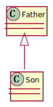
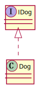
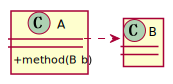
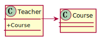
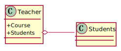
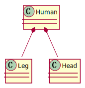
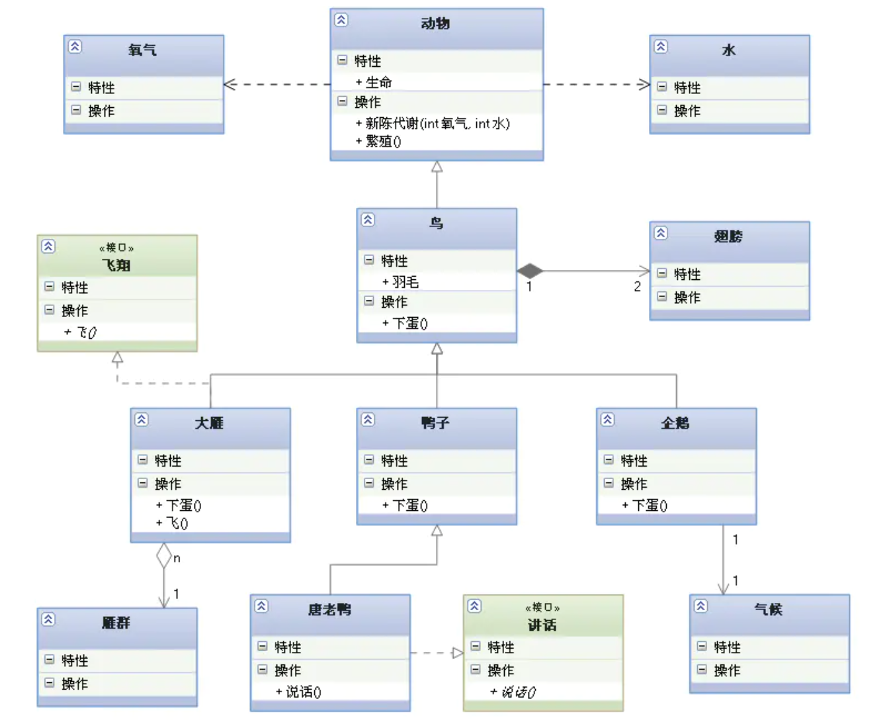

# 安装

可以在VS Code 中安装PlantUML插件来进行画图。使用 `Alt + D` 进行PlantUML的预览。 

软件要求：

- Java : 是运行PlantUML的必需条件, 请在您的环境中安装Java
- [graphviz-dot](https://www.graphviz.org/download/): 可选的, 但是建议安装 (如果想绘制 除 时序图和活动图以外的图, 就需要安装 Graphviz 软件)

# UML箭头含义

## 泛化

**概念：**泛化是一种**一般与特殊**、**一般与具体**之间关系的描述，具体描述建立在一般描述的基础之上，并对其进行了扩展。在java中用来表示继承的关系。

**表示方法：**用实线空心三角箭头表示。

## 实现

**概念**：实现是一种**类与接口**的关系，表示类是接口所有特征和行为的实现，在程序中一般通过类实现接口来描述

**表示方法**：空心三角形箭头的虚线，实现类指向接口

## 依赖

**概念**：是一种**使用**的关系，即一个类的实现需要另一个类的协助。

**代码表现**：局部变量、方法的参数或者对静态方法的调用。

**表示方法**：虚线箭头，指向被使用者。

## 关联

**概念**：表示类与类之间的联接，它使一个类知道另一个类的属性和方法，这种关系比依赖更强、不存在依赖关系的偶然性、关系也不是临时性的，一般是长期性的。

**代码体现**：成员变量

**表示方法**：实线箭头

## 聚合

**概念**：是**整体与部分**的关系，且**部分可以离开整体**而单独存在。如：车和轮胎是整体和部分的关系，轮胎离开车仍然可以存在。聚合关系是关联关系的一种，是强的关联关系；关联和聚合在语法上无法区分，必须考察具体的逻辑关系。

**代码体现**：成员变量

**表示方法**：尾部为空心菱形的实线箭头（也可以没箭头）

## 组合

**概念**：是**整体与部分**的关系，但**部分不能离开整体**而单独存在。如：公司和部门是整体和部分的关系，没有公司就不存在部门。组合关系是关联关系的一种，是比聚合关系还要强的关系，它要求普通的聚合关系中代表整体的对象**负责**代表部分的对象的**生命周期**。

**代码体现**：成员变量

**表示方法**：尾部为实心菱形的实现箭头（也可以没箭头）

## 强弱关系

泛化 = 实现 > 组合 > 聚合 > 关联 > 依赖

下面这张UML图，比较形象地展示了各种类图关系：

