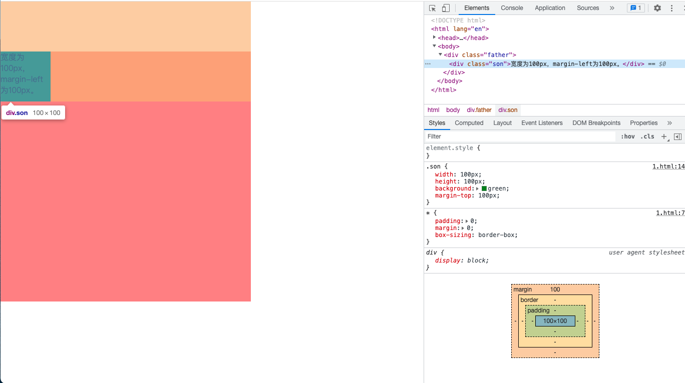
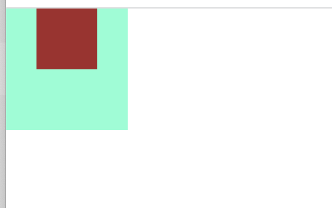
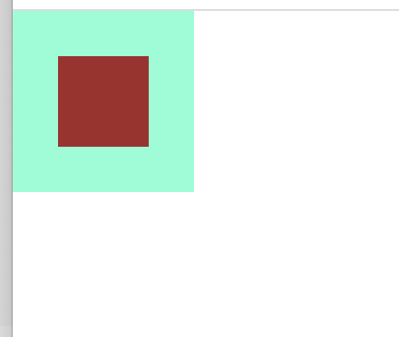

# 属性

## margin

### 同级元素间的margin

水平方向 margin **不会**进行合并，为相邻元素的 margin 之和

垂直方向 margin **会**进行合并，取较大值。有趣的情况，若元素高度为0（或内容为空），同时设置了 `margin-top` 和 `margin-bottom`，这两个margin也会叠加，取较大一个。

### 父子元素间的margin

**水平方向**

- 若水平方向没有设置 padding，实际上是子元素距离父元素 `border` 内侧的距离
- 若水平方向设置了 padding，实际上是子元素距离父元素 `padding` 内侧的距离

如下示例：

```html
<!DOCTYPE html>
<html lang="en">
<head>
    <meta charset="UTF-8">
    <title>margin</title>
    <style>
        *{padding:0; margin:0; box-sizing: border-box;}
        .father{
            width: 500px;
            height: 500px;
            background: rgb(255, 128, 128);
            border: 10px solid #ddd;
        }
        .son{
            width: 100px;
            height: 100px;
            background: green;
            margin-left: 100px;
        }
    </style>
</head>
<body>
    <div class="father">
        <div class="son">宽度为100px，margin-left为100px。</div>
    </div>
</body>
</html>
```

效果图


当父元素设置了padding时的效果图


**垂直方向**

当父元素没有设置 padding 或 border 值时，父元素与子元素重合，margin作用到父元素（是否可以理解为margin溢出？？？），注意水平方向不会出现该情况。

上面示例将 margin-left 改为 margin-top，效果如下



对于这种问题的解决办法：

- **方法一：给父元素添加padding-top值**
- **方法二：给父元素添加border值**
- **方法三：给父元素添加属性overflow:hidden;**(推荐)
- **方法四：给父元素或者子元素声明浮动float**
- **方法五：使父元素或子元素声明为绝对定位：position:absolute;**
- **方法六：给父元素添加属性** overflow:auto; positon:relative；

### margin中的百分比 %

不论是父子元素还是同级元素之间，且不论是水平还是垂直方向的 margin ，都是基于**父元素的宽度**进行计算。


### 深入理解 margin:auto

在讲 `margin: auto` 的作用机制之前，我们需要了解如下两个事实：

1. 有时候元素没有设置 `width`，也会自动填充。如 `<div></div>` 等 block 元素。

2. 有时候元素没有设置 `width`，也会自动填充对应的**方位**。如下，此时的div宽度就会自动填满包含块容器。

   ```css
   div {
     position: absolute;
     left: 0;
     right: 0;
   }
   ```

在上述第二种情况中，若此时 div 宽度被限制为200px，外部容器为300px，那么 `margin: auto` 就是为了处理多余的100px这个闲置尺寸而设计的。

`margin: auto` 的填充规则：

- 如果一侧为定值，一侧为auto，则auto为剩余空间大小。

- 如果两侧均为auto，则平分剩余空间。

上述规则可用于**块级元素左右对齐**，这个比float属性要好用的多，与内联元素的 text-align 控制左右对齐遥相呼应。


**触发 `margin: auto` 有一个很重要的前提：当 `width` 或 `height` 为 `auto` 时，元素必须具有对应方向的填充特性！！！**

如下 html 结构，来了解这个居中的特性。

```html
  <div class="father">
    <div class="son"></div>
  </div>
```

如下样式是否能使 son 水平垂直居中呢？

```css
.father {
  width: 100px;
  height: 100px;
  background-color: aquamarine;
  position: relative;
}

.son {
  width: 50px;
  height: 50px;
  margin: auto;
  background-color: brown;
}
```



可以看到元素仅在水平方向居中，并没有在垂直方向居中。根据前面的前提：当 width 为 auto 时，son 具有水平方向的填充特性；而当 height 为 auto 时（height为0），son 没有垂直方向的填充特性。故 `margin: auto` 只能触发水平方向的居中。

我们将 son 的样式改成如下形式，可以看到元素实现了水平垂直居中了。

```css
.son {
  position: absolute;
  width: 50px;
  height: 50px;
  left: 0;
  right: 0;
  top: 0;
  bottom: 0;
  background-color: brown;
  margin: auto;	// 会触发计算实现居中
} 
```



为什么呢？还是继续前面的前提，当 width 和 height 为 auto 时，son 这个子元素能填充整个父元素，故能水平垂直居中。


## display

`flex` 和 `inline-flex` 的区别，前者宽度默认100%，后者具有包裹性。


## flex

**flex-basis**

flex-basis和width同时存在，**flex-basis优先级高于width**。需要注意的是，当flex-basis和width，其中一个属性值为auto时，非auto的优先级更高。虽然指定了flex-basis，但其实际的宽度会视情况而定：

**width为auto，flex-basis和实际宽度以尺寸大的为准**

- 实际内容宽度 > flex-basis，则宽度为实际内容宽度
- 实际内容宽度 < flex-basis，则宽度为flex-basis值

**width不为auto且不设置overflow: hidden**，视情况而定，规则较复杂。

**over-flow: hidden，无论任何情况，都以flex-basis为准**

最佳实践：左侧固定的话，左侧使用 flex-basis + overflow: hidden

# 概念

## BFC

参考：https://juejin.cn/post/6950082193632788493

Block Formatting Context (块级格式化上下文)，简单来说就是，`BFC`是一个完全独立的空间（布局环境），让空间里的子元素不会影响到外面的布局。

### 触发BFC

- overflow: hidden
- display: inline-block
- position: absolute
- position: fixed
- display: table-cell
- display: flex

### BFC规则

`BFC`就是一个块级元素，块级元素会在垂直方向一个接一个的排列

`BFC`就是页面中的一个隔离的独立容器，容器里的标签不会影响到外部标签

垂直方向的距离由margin决定， 属于同一个`BFC`的两个相邻的标签外边距会发生重叠

计算`BFC`的高度时，浮动元素也参与计算

### BFC解决的问题

1. float高度塌陷问题
2. margin边距重叠
3. 两栏布局float覆盖问题