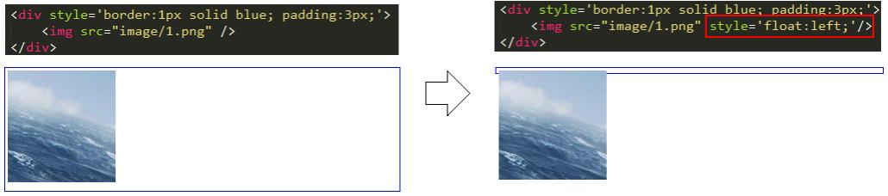
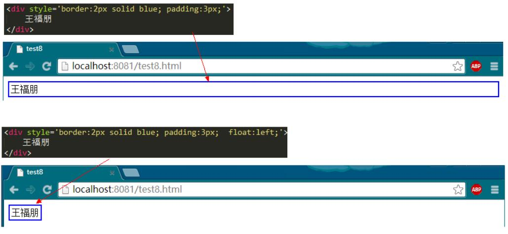
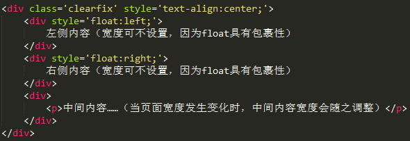

## Flex

### 1. [flex-basis 和 width关系](https://segmentfault.com/a/1190000011650962)

> 经常在项目中碰到左侧宽度固定，右侧自适应清空，使用flex-basis: 0 0 100px，想的是可以固定宽度，发现有时无法固定宽度，原因是：在width为auto的情况下，当实际宽度 > flex-basis的情况下，以实际宽度为准

#### 默认值

- flex-basis 默认值：auto，即flex-basis的属性值为项目的width属性值
- width 默认值：auto，即项目的width属性值为项目内容的宽度
- 项目的实际宽度是flex-basis与width比较求得


#### flex实际宽度

- width为auto
  - 实际内容宽度 > flex-basis，则宽度为实际内容宽度
  - 实际内容宽度 < flex-basis，则宽度为flex-basis值
  - 总结就是以尺寸大的为准
- width不为auto + 不设置overflow: hidden
  - 会按width、内容宽度、flex-basis计算得到，一般不会都指定
- over-flow: hidden
  - 无论任何情况，都以flex-basis为准（亲测是的，width不起作用）


## 常用技巧

### 清除浮动(antd版)

```css
.clearfix {
  zoom: 1;
}
.clearfix::before,
.clearfix::after {
  display: table;
  content: '';
}
.clearfix::after {
  clear: both;
}
```

### 包裹的两个元素左右分开

可以使用如下样式：

```css
display: flex;
justify-content: space-between;
```


## 布局

### 两行布局，上面固定，下面占满
```html
<div class="outer">
    <div class="A">头部DIV</div>
    <div class="B">下部DIV</div>
</div>
```
方案一 外层padding，内层absolute
```css
html,
body { height: 100%; padding: 0; margin: 0; }
.outer { height: 100%; padding: 100px 0 0; box-sizing: border-box ; position: relative; }
.A { height: 100px; background: #BBE8F2; position: absolute; top: 0 ; left: 0 ; width: 100%; }
.B { height: 100%; background: #D9C666; }
```

方案二 负margin
```css
html,
body { height: 100%; padding: 0; margin: 0; }
.outer { height: 100%; padding: 100px 0 0; box-sizing: border-box ; }
.A { height: 100px; margin: -100px 0 0; background: #BBE8F2; }
.B { height: 100%; background: #D9C666; }
```

方案三 flex
```css
html,
body { height: 100%; padding: 0; margin: 0; }
.outer { height: 100%; display: flex; flex-direction: column; box-sizing: border-box ; }
.A { height: 100px; background: #BBE8F2; }
.B { flex: 1 0 0; background: #D9C666; overflow-y: auto }
```

## 伪元素

## float
float 设计出来的初衷是实现文字环绕效果
具有如下特性：

1. 破坏性，脱离文档流，会导致父元素坍塌
   
2. 包裹性，会包裹内容，可以设置宽高，将按照设定的宽高进行包裹
   
3. 清空格，根本原因是由于 float 会导致节点脱离文档流结构，它身边的什么换行、空格就都和它没关系的

### 清除浮动
float 具有“破坏性”，它会导致父元素“坍塌”，这将不是所要看到的。
两个比较简单，但是不常用的解决方法：

- 为父元素添加 overflow:hidden
- 浮动父元素
- 所有浮动元素下方添加一个 clear:both 的元素（style="clear:both"）
- clearfix（BootStrap 使用的方案）

```css
.clearfix:after {
  content: "";
  display: table;
  clear: both;
}
```

### float 三列布局


中间的 div 宽度还是整个宽度，但不会覆盖左右浮动部分

### float 两列布局
左侧 float，固定 width，右侧 div 设置 margin-left 即可

### 参考

https://www.cnblogs.com/wangfupeng1988/p/4314160.html
https://www.cnblogs.com/wangfupeng1988/p/4314804.html

## position定位属性
position 一共有四个可选属性：static/relative/absolute/fixed。其中 static（静态定位）是默认值，即所有的元素如果不设置其他的 position 值，它的 position 值就是 static，有它跟没有它一样。

### relative
relative 会导致自身位置的相对变化，而不会影响其他元素的位置、大小的变化。
relative 产生一个新的定位上下文

### absolute

1. 脱离文档流，产生破坏性，导致父元素坍塌。
2. 包裹性
3. 悬浮在页面上方，会遮挡住下方的页面内容

### fixed
fixed 和 absolute 是一样的，唯一的区别在于：absolute 元素是根据最近的定位上下文确定位置，而 fixed 永远根据浏览器确定位置。

### 定位上下文

- relative 元素的定位永远是相对于元素自身位置的，和其他元素没关系，也不会影响其他元素。
- fixed 元素的定位永远是相对于浏览器边界的，和其他元素没有关系。但是它具有破坏性，会导致其他元素位置的变化。
- absolute 的定位相对于前两者要复杂许多。如果为 absolute 设置了 top、left，浏览器会根据什么去确定它的纵向和横向的偏移量呢？答案是浏览器会递归查找该元素的所有父元素，如果找到一个设置了 position:relative/absolute/fixed 的元素，就以该元素为基准定位，如果没找到，就以浏览器边界定位。如下两个图所示：

### 参考

https://www.cnblogs.com/wangfupeng1988/p/4322680.html
