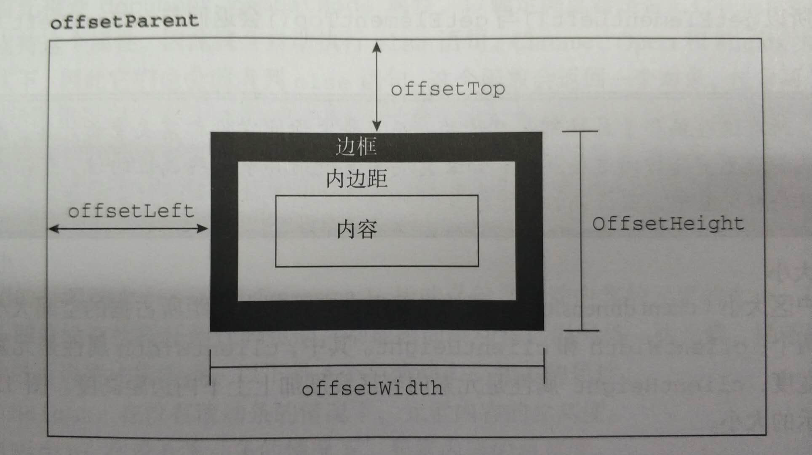
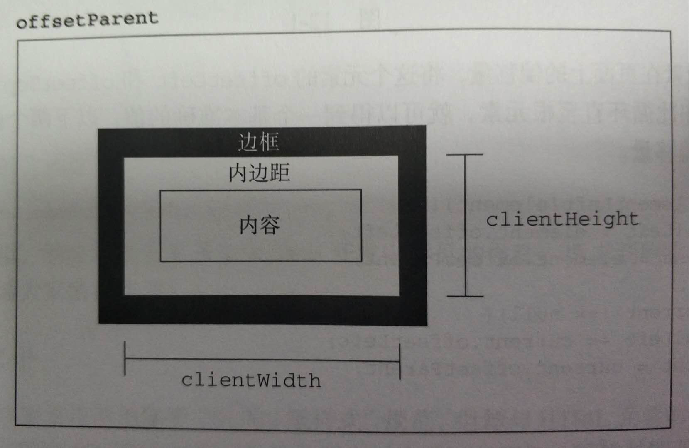
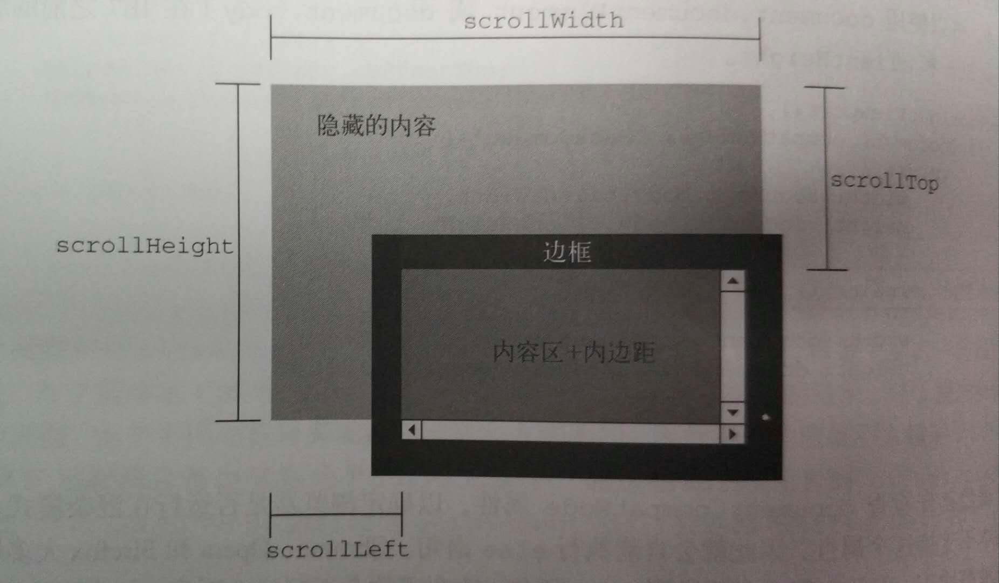

## DOM高度宽度等属性

1. 偏移量-offset开头的

2. 客户区-client开头的

3. 滚动大小-scroll开头

4. window-inner、outer开头

   window.innerWidth, window.innerHeight 可视区域的宽高

   window.outerWidth, window.outerHeight 整个窗口的宽高，包括导航工具栏以及F12调试面板都在内部	