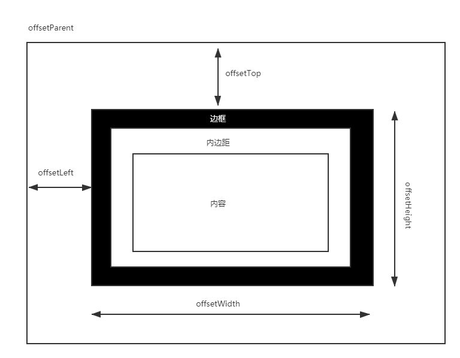
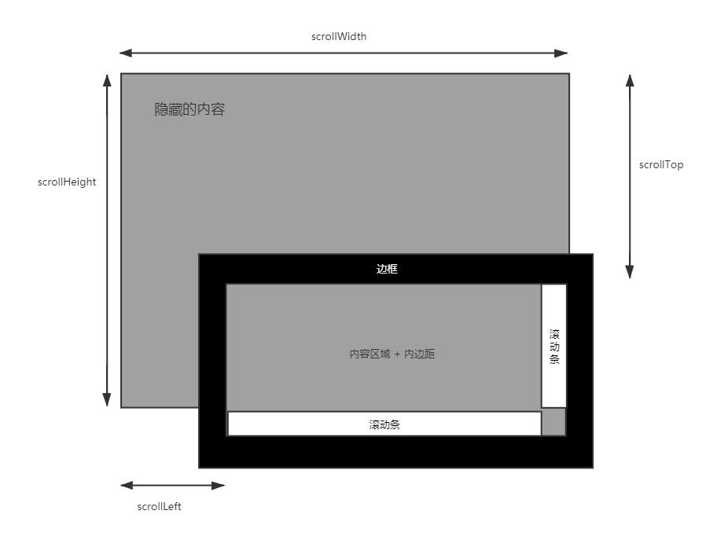

# DOM节点

## DOM节点类型

节点至少拥有nodeType、nodeName和nodeValue这三个基本属性。节点类型不同，这三个属性的值也不相同 。其中nodeType可取如下值：

```js
元素节点            　　Node.ELEMENT_NODE(1)
属性节点            　　Node.ATTRIBUTE_NODE(2)
文本节点            　　Node.TEXT_NODE(3)
文档节点            　 Node.DOCUMENT_NODE(9)

注释节点            　 Node.COMMENT_NODE(8)
文档类型节点        　　Node.DOCUMENT_TYPE_NODE(10) //  <!DOCTYPE html>
文档片段节点        　　Node.DOCUMENT_FRAGMENT_NODE(11) // DocumentFragment

CDATA节点             Node.CDATA_SECTION_NODE(4)
实体引用名称节点    　　 Node.ENTRY_REFERENCE_NODE(5)
实体名称节点        　　Node.ENTITY_NODE(6)
处理指令节点        　　Node.PROCESSING_INSTRUCTION_NODE(7)
DTD声明节点            Node.NOTATION_NODE(12)
```

其中Node为js内建接口，枚举节点类型。

### 元素节点

以body为例：

```js
nodeType = 1  // Node.ELEMENT_NODE
nodeName = 'BODY'
nodeValue = null
```

### 属性节点

```js
nodeType = 2 // Node.ATTRIBUTE_NODE
nodeName = [属性名]
nodeValue = [属性值]
```

### 文本节点

```js
nodeType = 3 // Node.TEXT_NODE
nodeName = '#text' // 注释节点此位置为 "#comment"
nodeValue = [文本值]
```

> node.firstChild 会返回第一个节点类型，而node.firstElementChild则只会选择元素节点返回

### 文档节点

```js
nodeType = 9 // Node.DOCUMENT_NODE
nodeName = '#document' // 注释节点此位置为 "#comment"
nodeValue = null
```


## document

### document.readyState

当这个属性的值变化时，document对象上的readystatechange事件被触发。

- loading：加载，document仍在加载。
- interactive：互动，文档已经完成加载，文档已被解析，但是诸如图像、样式表和框架之类的子资源仍在加载。
- complete：完成，文档和所有子资源已完成加载。状态表示load事件即将被触发。

```html
<!DOCTYPE html>
<html lang="en">
  <head>
    <meta charset="UTF-8" />
    <meta name="viewport" content="width=device-width, initial-scale=1.0" />
    <title>Document</title>
  </head>

  <body>
    <div class="controls">
      <button id="reload" type="button">Reload</button>
    </div>

    <div class="event-log">
      <label>Event log:</label>
      <textarea readonly class="event-log-contents" rows="8" cols="30"></textarea>
    </div>

    <script>
      const log = document.querySelector(".event-log-contents");
      const reload = document.querySelector("#reload");

      reload.addEventListener("click", () => {
        log.textContent = "";
        window.setTimeout(() => {
          window.location.reload(true);
        }, 200);
      });

      window.addEventListener("load", (event) => {
        log.textContent = log.textContent + "load\n";
      });

      document.addEventListener("readystatechange", (event) => {
        log.textContent = log.textContent + `readystate: ${document.readyState}\n`;
      });

      document.addEventListener("DOMContentLoaded", (event) => {
        log.textContent = log.textContent + `DOMContentLoaded\n`;
      });
    </script>
  </body>
</html>

```

> readystate: interactive
> DOMContentLoaded
> readystate: complete
> load

### querySelector/querySelectorAll

querySelector

文档对象模型[`Document`](https://developer.mozilla.org/zh-CN/docs/Web/API/Document)引用的 querySelector 方法返回文档中与指定选择器或选择器组匹配的**第一个** [`HTMLElement`](https://developer.mozilla.org/zh-CN/docs/Web/API/HTMLElement)对象。 如果找不到匹配项，则返回`null`。**注意这里返回的是第一个！**

querySelectorAll

返回与指定的选择器组匹配的文档中的元素列表 (使用深度优先的先序遍历文档的节点)。返回的对象是 [`NodeList`](https://developer.mozilla.org/zh-CN/docs/Web/API/NodeList) 。

> 什么叫深度优先的先序遍历？


## DOM高度宽度等属性

**偏移量-offset开头的**

所有的offset都是以DOM节点的**offsetParent**进行定位的，和定位上下文有关，即父元素position属性是否为absolute/relative。



**谈谈offsetParent**

我们看到上面的定位信息都是基于offsetParent进行定位的，offsetParent具体对应关系如下：

1. 如果当前元素的**祖先**级元素没有进行CSS定位（position为absolute或relative），offsetParent为body。
2. 如果当前元素的祖先级元素中有CSS定位（position为absolute或relative），offsetParent取**最近**的那个祖先级元素。


**客户区-client开头的**

客户区client相对于offset，其width和height**不包括border边框**


**滚动大小-scroll开头**




**window-inner、outer开头**

window.innerWidth, window.innerHeight 可视区域的宽高

window.outerWidth, window.outerHeight 整个窗口的宽高，**包括导航工具栏以及F12调试面板都在内部**	


## link标签

 https://juejin.im/post/5cf517f3f265da1bb13f1c92 

最常用是用来链接外部样式表

```html
<link href="main.css" rel="stylesheet">
```

还可以做其他事情提升页面的性能

### DNS Prefetch

```html
<link rel="dns-prefetch" href="//example.com">
```

DNS解析，简单来说就是把域名转化为ip地址。我们在网页里使用域名请求其他资源的时候，都会先被转化为ip地址，再发起链接。dns-prefeth使得转化工作提前进行了，缩短了请求资源的耗时。

什么时候使用呢？当我们页面中使用了其他域名的资源时，比如我们的静态资源都放在cdn上，那么我们可以对cdn的域名进行预解析。浏览器的支持情况也不错。

### Preconnect

预链接 

```html
<link rel="preconnect" href="//example.com">
<link rel="preconnect" href="//cdn.example.com" crossorigin>
```

我们访问一个站点时，简单来说，都会经过以下的步骤：

1. DNS解析
2. TCP握手
3. 如果为Https站点，会进行TLS握手

使用preconnect后，浏览器会针对特定的域名，提前初始化链接(执行上述三个步骤)，节省了我们访问第三方资源的耗时。需要注意的是，我们一定要确保preconnect的站点是网页必需的，否则会浪费浏览器、网络资源。

### Prefetch

预拉取

```html
<link rel="prefetch" href="//example.com/next-page.html" as="document" crossorigin="use-credentials">
<link rel="prefetch" href="/library.js" as="script">
```

link标签里的as参数可以有以下取值： 

```
audio: 音频文件
video: 视频文件  
Track: 网络视频文本轨道 
script: javascript文件
style: css样式文件
font: 字体文件   
image: 图片   
fetch: XHR、Fetch请求
worker: Web workers
embed: 多媒体<embed>请求 
object:  多媒体<object>请求
document: 网页
```

预拉取用于标识从当前网站跳转到下一个网站可能需要的资源，以及本网站应该获取的资源。这样可以在将来浏览器请求资源时提供更快的响应。

如果正确使用了预拉取，那么用户在从当前页面前往下一个页面时，可以很快得到响应。但是如果错误地使用了预拉取，那么浏览器就会下载额外不需要的资源，影响页面性能，并且造成网络资源浪费。

这里需要注意的是，使用了prefetch，<font color='red'>资源仅仅被提前下载，下载后不会有任何操作，比如解析资源。</font>

### Prerender

预渲染

```html
<link rel="prerender" href="//example.com/next-page.html">
```

prerender比prefetch更进一步。不仅仅会下载对应的资源，还会对资源进行解析。解析过程中，如果需要其他的资源，**可能**会直接下载这些资源。这样，用户在从当前页面跳转到目标页面时，浏览器可以更快的响应。 


# DOM属性

## data-*自定义数据属性

它赋予我们在所有 HTML 元素上嵌入自定义数据属性的能力，并可以通过脚本在 [HTML](https://developer.mozilla.org/zh-CN/docs/Web/HTML) 与 [DOM](https://developer.mozilla.org/zh-CN/docs/Web/API/Document_Object_Model) 表现之间进行专有数据的交换。可以在DOM上保存数据，可以通过元素的dataset属性来访问。

```html
<ul>
    <li data-id="10784">Jason Walters, 003: Found dead in "A View to a Kill".</li>
    <li data-id="97865">Alex Trevelyan, 006: Agent turned terrorist leader; James' nemesis in "Goldeneye".</li>
    <li data-id="45732">James Bond, 007: The main man; shaken but not stirred.</li>
</ul>
```


