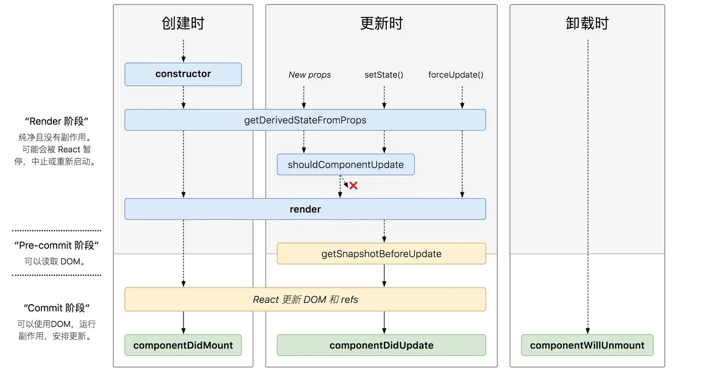
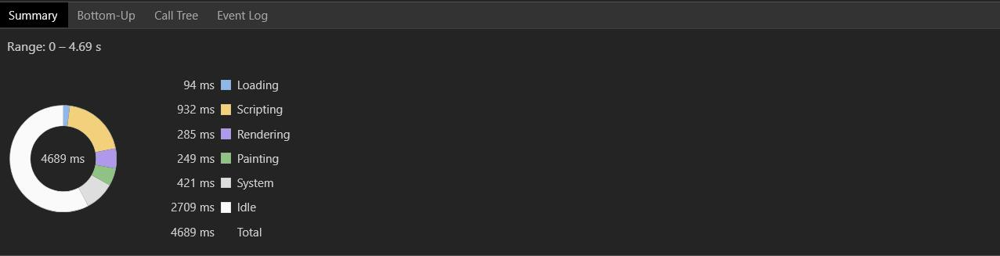

# 生命周期


- [你真的了解 React 生命周期吗](https://juejin.im/post/5df648836fb9a016526eba01)
- [官网生命周期](https://zh-hans.reactjs.org/docs/react-component.html#the-component-lifecycle)



#### constructor(props)

应在其他语句之前调用super(props)，不然this.props在构造函数中会出现未定义。可以在constructor中定义state以及函数的bind，我比较喜欢使用Class Fields语法来实现，需要babel支持。

#### componentDidMount()

会在组件挂载后调用（插入到DOM数中），一般在这里进行数据获取然后调用setState赋值。如果有一些依赖DOM节点的大小和位置，可在这里处理。如Ant Design中Table的高度获取。

#### componentDidUpdate(prevProps, prevState, snapshot)

当组件更新后立即执行，首次渲染不会执行。 当组件更新后，可以在此处对 DOM 进行操作。如果你对更新前后的 props 进行了比较，也可以选择在此处进行网络请求。（例如，当 props 未发生变化时，则不会执行网络请求）。 

```jsx
componentDidUpdate(prevProps) {
  // 典型用法（不要忘记比较 props）：
  if (this.props.userID !== prevProps.userID) {
    this.fetchData(this.props.userID);
  }
}
```

你也可以在 `componentDidUpdate()` 中直接调用 `setState()`，但请注意它必须被包裹在一个条件语句里，正如上述的例子那样进行处理，否则会导致**死循环**。如果实现了 `getSnapshotBeforeUpdate() `生命周期函数，将作为第三个参数传入。

#### componentWillUnmount()

会在组件卸载及销毁之前直接调用。在此方法中执行必要的**清理操作**，例如，清除 timer，取消网络请求或清除在 `componentDidMount()` 中创建的订阅等。 

#### static getDerivedStateFromProps(props, state)

会在调用 render 方法之前调用，并且在初始挂载及后续更新时都会被调用。它应返回一个对象来更新 state，如果返回 null 则不更新任何内容。 返回一个对象来更新state，null则表示不更新。静态函数，无法访问组件内部方法。

`getDerivedStateFromProps` 的存在只有一个目的：让组件在 **props 变化**时更新 state。比如根据props变化加载外部数据。 

#### shouldComponentUpdate(nextProps, nextState)

判断 React 组件的输出是否受**当前** state 或 props 更改的影响。默认行为是 state 每次发生变化组件都会重新渲染。大部分情况下，你应该遵循默认行为。首次渲染或使用 `forceUpdate()` 时不会调用该方法。 

我们不建议在 `shouldComponentUpdate()` 中进行深层比较或使用 `JSON.stringify()`。这样非常影响效率，且会损害性能。 

> 官网意思是，不要过分依赖这个，后续可能改变这个功能，尽量使用PureComponent。

#### getSnapshotBeforeUpdate(prevProps, prevState)

接收父组件传递过来的 props 和组件之前的状态，此生命周期钩子必须有返回值，返回值将作为第三个参数传递给 componentDidUpdate。必须和 componentDidUpdate 一起使用，否则会报错。   
作用：能让你在组件更新DOM和refs之前，从DOM中捕获一些信息（如滚动位置）
触发时机：组件Update时，在render之后，更新DOM和refs之前。


# 父子组件生命周期

#### mount阶段

```
Parent getDerivedStateFromProps
Parent render
Child getDerivedStateFromProps
Child render
Child componentDidMount
Parent componentDidMount
```

可见在render时，先render父组件，然后在render子组件。didmount回调，则先触发子组件mount，再触发父组件mount。

#### update阶段（parent组件state变化）

```
Parent getDerivedStateFromProps
Parent render
Child getDerivedStateFromProps
Child shouldComponentUpdate
Child render
Child componentDidUpdate
Parent componentDidUpdate
```

可见父组件update时，先出发父组件的render，然后是子组件的render，didupdate回调，子组件先出发，父组件后触发

#### unmount阶段

先出发父组件unmount，然后触发子组件unmount


# 常见问题

#### 当外部的 props 改变时，如何再次执行请求数据、更改状态等操作

- componentDidUpdate 中发数据请求，注意if判断
- 组件绑定一个key属性，当key变化时，会卸载原来组件重新创建组件。

#### 如果setState更新的值不变，还会触发生命周期钩子吗？

哪怕每次都设置同样的值，还是会触发更新

#### props变化时重置内部state

- key属性，key变化时会创建一个新的组件而不是更新一个既有的组件，会重置所有内部state
- 使用getDerivedStateFromProps，比较前后props变化，可重置部分状态
- ref方式调用内部方法，但是这个通常不建议

#### 缓存基于当前 props 计算后的结果

**实用**，特别是在列表过滤。使用memoize-one技术，仅缓存最近一次的结果，因为组件会碰到经常render的情况，而render中根据属性计算结果。使用缓存技术，可以保证相关的参数没有改变，不必重新计算，直接使用缓存。

#### 条件渲染

可使用 && 运算符，react 对与false，true，null都渲染为空

#### PureComponent

PureComponent实现了shouldComponentUpdate，对于props和state的浅比较，对于函数式组件的React.memo（Hook中的memo如何运作？）

#### 组合函数

```js
const name = compose(
    splitmyName,
    countEachName,
    comvertUpperCase,
    returnName
)
// compose简单的实现方式：
const compose = (...fns) => fns.reduce((f, g) => (...args) => g(f(...args)));
```

#### 组件类型

- 展示组件：无状态，纯函数，没有任何副作用。

- 容器组件：获取处理数据、订阅Redux存储的组件，可包含展示组件和其他容器组件。

#### Render Props

- 具有 render prop 的组件接受一个函数，该函数返回一个 React 元素并调用它而不是实现自己的渲染逻辑。
- render prop 是一个用于告知组件需要渲染什么内容的函数 prop。
- 任何被用于告知组件需要渲染什么内容的函数 prop 在技术上都可以被称为 “render prop”。

> children也可以是函数，作为Render Props。比如可以实现一个vue slot的应用场景，如果没有children则按照默认渲染，若有则按照children规定方式渲染


# 高阶组件HOC

#### HOC可以干什么

- 组合渲染
- 条件渲染
- 操作props
- 获取ref
- 状态管理，如可以把Input的value放在HOC中
- 操作State，只能在反向继承中实现
- 渲染劫持，只要改变了原组件的渲染，我们都将它称之为一种渲染劫持

#### compose 和 Decorators

假设现在我们有logger，visible，style等多个HOC，现在要同时增强一个Input组件。

```js
// 第一种，难以阅读
logger(visible(style(Input)))
// 第二种，提供一个compose函数，与第一种类似
const compose = (...fns) => fns.reduce((f, g) => (...args) => g(f(...args)));
compose(logger,visible,style)(Input);
// 第三种
@logger
@visible
@style
class Input extends Component {
  // ...
}
```

# React Hooks

- [30分钟精通React Hooks](https://juejin.im/post/5be3ea136fb9a049f9121014)
- [【React深入】从Mixin到HOC再到Hook](https://juejin.im/post/5cad39b3f265da03502b1c0a)
- [React Hooks 详解 【近 1W 字】+ 项目实战](https://juejin.im/post/5dbbdbd5f265da4d4b5fe57d)
- [官网：使用 Effect Hook（很详细）](https://react.docschina.org/docs/hooks-effect.html)
- [HOOK FAQ 可以多领会](https://react.docschina.org/docs/hooks-faq.html)

#### 为什么要搞一个Hooks

1. 复用一个有状态的组件太麻烦，官方解决方案：Render Props 和 HOC（提供获取信息功能）。
2. 生命周期钩子函数逻辑乱，比如异步数据请求，有时我们需要在componentDidMount和componentDidUpdate中做同样的事情。
3. class this指向问题

#### useState

```js
const [count, setCount] = useState(0);
```

- useState初始状态可以是一个函数，只在初始渲染时调用
- setCount可以使用函数式更新，参数为先前的state

#### useEffect

之前class组件，对于一些副作用，我们会写在 componentDidMount/componentDidUpdate/componentWillUnmount 中，但是现在使用一个
useEffect 即可，三合一！

要点：

1. React首次渲染和以后的每次渲染都会调用传给useEffect的函数，而之前需要在componentDidMount和componentDidUpdate中分别实现。
2. useEffect中的函数是异步执行的，不会阻塞浏览器更新视图。而之前的componentDidMount和componentDidUpdate都是同步的（当然是可以加async/await处理异步任务的）。
3. useEffect清除副作用，返回一个函数即可。它会在调用一个新的 effect 之前对前一个 effect 进行清理。注意前一个effect的清理函数保持着之前的状态。
4. useEffect的第二个参数，可以条件执行effect，只要值没有发送变化则不用执行effect，注意hook是利用Object.is进行浅比较。若传一个空数组，
   则表示只运行一次的 effect（仅在组件挂载和卸载时执行）
5. 每次渲染都有自己独立的props和state
6. 可以使用多个Effect关注分离点，也就是说可以写多个useEffect，功能不一样的可以分离
7. useEffect 在全部渲染完毕后才会执行，而useLayoutEffect 会在 浏览器 layout 之后，painting 之前执行

执行时机：useEffect 会在第一次渲染之后和每次更新之后都会执行

```js
// Mount with { friend: { id: 100 } } props
ChatAPI.subscribeToFriendStatus(100, handleStatusChange);     // 运行第一个 effect

// Update with { friend: { id: 200 } } props
ChatAPI.unsubscribeFromFriendStatus(100, handleStatusChange); // 清除上一个 effect
ChatAPI.subscribeToFriendStatus(200, handleStatusChange);     // 运行下一个 effect

// Update with { friend: { id: 300 } } props
ChatAPI.unsubscribeFromFriendStatus(200, handleStatusChange); // 清除上一个 effect
ChatAPI.subscribeToFriendStatus(300, handleStatusChange);     // 运行下一个 effect

// Unmount
ChatAPI.unsubscribeFromFriendStatus(300, handleStatusChange); // 清除最后一个 effect
```

#### 其他Hooks

##### useContext

```js
const value = useContext(MyContext);
```

当组件上层最近的 更新时，该 Hook 会触发重渲染，并使用最新传递给 MyContext provider 的 context value 值。即使祖先使用 [`React.memo`](https://react.docschina.org/docs/react-api.html#reactmemo) 或 [`shouldComponentUpdate`](https://react.docschina.org/docs/react-component.html#shouldcomponentupdate)，也会在组件本身使用 `useContext` 时重新渲染。 

##### useLayoutEffect

它会在所有的 DOM 变更之后同步调用 effect。可以使用它来读取 DOM 布局并同步触发重渲染。在浏览器执行绘制之前，`useLayoutEffect` 内部的更新计划将被同步刷新。 

> 这个还不清楚用途所在，是否时我一直的疑问？比如子组件didMount时，父组件还没有didMount，因此子组件的didMount无法计算出子组件的高度？

##### useCallback

memoized回调函数，当作为属性传递给子组件时，子组件若使用引用相等去优化时很有用

```js
const memoizedCallback = useCallback(
  () => {
    doSomething(a, b);
  },
  [a, b],
);
```

##### useMemo

仅在依赖发生改变时触发

```js
const memoizedValue = useMemo(() => computeExpensiveValue(a, b), [a, b]);
```

##### useRef

传入的初始值为refContainer的current属性的初始值

```js
const refContainer = useRef(initialValue);
```

##### useImperativeHandle

 可以让你在使用 `ref` 时自定义暴露给父组件的实例值。 

```js
function FancyInput(props, ref) {
  const inputRef = useRef();
  useImperativeHandle(ref, () => ({
    focus: () => {
      inputRef.current.focus();
    }
  }));
  return <input ref={inputRef} ... />;
}
FancyInput = forwardRef(FancyInput);
```


#### 自定义Hook

把相同的Hook逻辑提取到一个自定义Hook中

```js
import React, { useState, useEffect } from 'react';

// 参数为某个好友的ID，如果friendID变化，则会触发Hook中的副作用。
function useFriendStatus(friendID) {
  const [isOnline, setIsOnline] = useState(null);

  useEffect(() => {
	// 注意这个函数写在了内部
    function handleStatusChange(status) {
      setIsOnline(status.isOnline);
    }

    ChatAPI.subscribeToFriendStatus(friendID, handleStatusChange);
    return () => {
      ChatAPI.unsubscribeFromFriendStatus(friendID, handleStatusChange);
    };
  });

  return isOnline;
}
```

要点：

1. 自定义Hook以use开头.
2. 使用相同Hook中的state不会被共享
3. 必须把hooks写在函数最外面，不允许在if/else等条件语句中，保证hooks的执行顺序一致.

#### HOOK FAQ

##### 该如何测量 DOM 节点？

获取 DOM 节点的位置或是大小的基本方式是使用 [callback ref](https://react.docschina.org/docs/refs-and-the-dom.html#callback-refs)。每当 ref 被附加到一个另一个节点，React 就会调用 callback。

> 在这个案例中，我们没有选择使用 `useRef`，因为当 ref 是一个对象时它并不会把当前 ref 的值的 *变化* 通知到我们。使用 callback ref 可以确保 [即便子组件延迟显示被测量的节点](https://codesandbox.io/s/818zzk8m78) (比如为了响应一次点击)，我们依然能够在父组件接收到相关的信息，以便更新测量结果。 

注意到我们传递了 `[]` 作为 `useCallback` 的依赖列表。这确保了 ref callback 不会在再次渲染时改变，因此 React 不会在非必要的时候调用它。 

##### 定义在useEffect中的函数

尽量将useEffect调用函数写在useEffect内部，可以更清晰的发现依赖变量。

##### 如何实现shouldComponentUpdate

使用React.memo来包裹一个函数式组件。

##### 如何惰性创建昂贵对象

useMemo允许记住一次昂贵的计算。

state初始值的函数式方式加载。


# React虚拟DOM

#### 页面呈现的三个阶段

- JS 计算 (Scripting)
- 生成渲染树 (Rendering)
- 绘制页面 (Painting)
  


## 项目ICON的引入