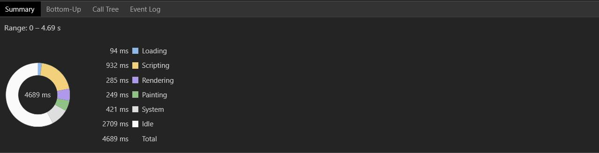

# React虚拟DOM

#### 页面呈现的三个阶段

- JS 计算 (Scripting)
- 生成渲染树 (Rendering)
- 绘制页面 (Painting)
  

Virtual DOM很快前提

1. javascript很快
2. DOM很慢，DOM对象很复杂，创建和更新都比较耗时

虚拟DOM简单步骤

1. 用**JavaScript对象来表示DOM树**的结构； 然后**用这个树构建一个真正的DOM树**，**插入到文档中**。  
2.  当状态变更的时候，**重新构造一个新的对象树**，然后用这个新的树和旧的树作对比，记录**两个树的差异**。 
3.  把2所记录的差异应用在步骤1所构建的真正的DOM树上（生成patch），视图就更新了。 

