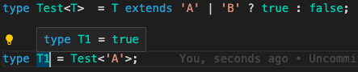

# 基础类型


主要有：`boolean` `number` `string` `array` `enum` `any` `unknown` `void` `tuple` `null` `undefined` `never`

## any类型

在 TypeScript 中，任何类型都可以被归为 `any` 类型。`any` 类型本质上是类型系统的一个逃逸舱。作为开发者，这给了我们很大的自由：TypeScript 允许我们对 `any` 类型的值执行任何操作，而无需事先执行任何形式的检查。比如：

```ts
let value: any;

value.foo.bar; 	// OK
value.trim(); 	// OK
value(); 				// OK
new value(); 		// OK
value[0][1]; 		// OK
```

在许多场景下，这太宽松了。使用 `any` 类型，可以很容易地编写类型正确但在运行时有问题的代码。如果我们使用 `any` 类型，就无法使用 TypeScript 提供的大量的保护机制。为了解决 `any` 带来的问题，TypeScript 3.0 引入了 `unknown` 类型。

## unknown类型

就像所有类型都可以赋值给 `any`，所有类型也都可以赋值给 `unknown`。这使得 `unknown` 成为 TypeScript 类型系统的另一种顶级类型（另一种是 `any`）

```ts
let value: unknown;

value = true; // OK
value = 42; // OK
value = "Hello World"; // OK
value = []; // OK
value = {}; // OK
value = Math.random; // OK
value = null; // OK
value = undefined; // OK
value = new TypeError(); // OK
value = Symbol("type"); // OK
```

对 `value` 变量的所有赋值都被认为是类型正确的。但是，当我们尝试将类型为 `unknown` 的值赋值给其他类型的变量时会发生什么？

```ts
let value: unknown;

let value1: unknown = value; // OK
let value2: any = value; // OK
let value3: boolean = value; // Error
let value4: number = value; // Error
let value5: string = value; // Error
let value6: object = value; // Error
let value7: any[] = value; // Error
let value8: Function = value; // Error
```

`unknown` 类型只能被赋值给 `any` 类型和 `unknown` 类型本身。直观地说，这是有道理的：只有能够保存任意类型值的容器才能保存 `unknown` 类型的值。毕竟我们不知道变量 `value` 中存储了什么类型的值。

现在让我们看看当我们尝试对类型为 `unknown` 的值执行操作时会发生什么。以下是我们在之前 `any` 章节看过的相同操作：

```ts
let value: unknown;

value.foo.bar; // Error
value.trim(); // Error
value(); // Error
new value(); // Error
value[0][1]; // Error
```

将 `value` 变量类型设置为 `unknown` 后，这些操作都不再被认为是类型正确的。通过将 `any` 类型改变为 `unknown` 类型，我们已将允许所有更改的默认设置，更改为禁止任何更改。

## null 和 undefined 类型

TypeScript 里，`undefined` 和 `null` 两者有各自的类型分别为 `undefined` 和 `null`。默认情况下 `null` 和 `undefined` 是所有类型的子类型。 就是说你可以把 `null` 和 `undefined` 赋值给 `number` 类型的变量。**然而，如果你指定了`--strictNullChecks` 标记，`null` 和 `undefined` 只能赋值给 `void` 和它们各自的类型。**

## never类型

`never` 类型表示的是那些永不存在的值的类型。 例如，`never` 类型是那些总是会**抛出异常**或**根本就不会有返回值**的函数表达式或箭头函数表达式的返回值类型。

```ts
// 返回never的函数必须存在无法达到的终点
function error(message: string): never {
  throw new Error(message);
}

function infiniteLoop(): never {
  while (true) {}
}
```


# 断言

有时候你会遇到这样的情况，你会比 TypeScript 更了解某个值的详细信息。通常这会发生在你清楚地知道一个实体具有比它现有类型更确切的类型。

通过类型断言这种方式可以告诉编译器，“相信我，我知道自己在干什么”。类型断言好比其他语言里的类型转换，但是不进行特殊的数据检查和解构。它没有运行时的影响，**只是在编译阶段起作用**。

类型断言有两种形式：

## “尖括号” 语法

```ts
let someValue: any = "this is a string";
let strLength: number = (<string>someValue).length;
```

## as 语法

```ts
let someValue: any = "this is a string";
let strLength: number = (someValue as string).length;
```


# 操作符及类型工具

## `typeof`

`typeof` 操作符可以用来获取一个变量声明或对象的类型。

```ts
interface Person {
  name: string;
  age: number;
}

const sem: Person = { name: 'semlinker', age: 30 };
type Sem= typeof sem; // -> Person

function toArray(x: number): Array<number> {
  return [x];
}

type Func = typeof toArray; // -> (x: number) => number[]
```


## `keyof`

`keyof` 与 `Object.keys` 略有相似，只不过 `keyof` 取 `interface` 的键

```ts
interface Point {
    x: number;
    y: number;
}

// type keys = "x" | "y"
type keys = keyof Point;
```

用 `keyof` 可以更好的定义数据类型

```ts
function get<T extends object, K extends keyof T>(o: T, name: K): T[K] {
  return o[name]
}
```

## `in`

`in` 用来遍历枚举类型：

```ts
type Keys = "a" | "b" | "c"

type Obj =  {
  [p in Keys]: any
} // -> { a: any, b: any, c: any }

```

## `infer`

在条件类型语句中，可以用 `infer` 声明一个类型变量并且对它进行使用。

```ts
type ReturnType<T> = T extends (
  ...args: any[]
) => infer R ? R : any;
```

以上代码中 `infer R` 就是声明一个变量来承载传入函数签名的返回值类型，简单说就是用它取到函数返回值的类型方便之后使用。

## `extends`

有时候我们定义的泛型不想过于灵活或者说想继承某些类等，可以通过 extends 关键字添加泛型约束。

## `Partial<T>`

将T中所有属性转换为可选属性。返回的类型可以是T的任意子集

```tsx
/**
 * Make all properties in T optional
 */
type Partial<T> = {
    [P in keyof T]?: T[P];
};
```

## `Required<T>`

通过将T的所有属性设置为必选属性来构造一个新的类型。与Partial相反

```ts
/**
 * Make all properties in T required
 */
type Required<T> = {
    [P in keyof T]-?: T[P];
};
```

## `Readonly<T>`

将T中所有属性设置为只读

```ts
/**
 * Make all properties in T readonly
 */
type Readonly<T> = {
    readonly [P in keyof T]: T[P];
};
```

## `Record<K,T>`

构造一个类型，该类型具有一组属性K，每个属性的类型为T。

```ts
/**
 * Construct a type with a set of properties K of type T
 */
type Record<K extends keyof any, T> = {
    [P in K]: T;
};
```

## `Pick<T,K>`

在一个声明好的对象中，挑选一部分出来组成一个新的声明对象。

> 对以下的声明有点疑问？K extends keyof T：代表 K 要继承 T 的所有属性？
>
> 答：不是，见下面截图

```ts
/**
 * From T, pick a set of properties whose keys are in the union K
 */
type Pick<T, K extends keyof T> = {
    [P in K]: T[P];
};
```



## `Omit<T, K>`

从T中取出除去K的其他所有属性。与Pick相对。

```ts
/**
 * Construct a type with the properties of T except for those in type K.
 */
type Omit<T, K extends keyof any> = Pick<T, Exclude<keyof T, K>>;
```

## `Exclude<T,U>`

从T中排除可分配给U的属性，剩余的属性构成新的类型

```ts
/**
 * Exclude from T those types that are assignable to U
 */
type Exclude<T, U> = T extends U ? never : T;


type T0 = Exclude<'a' | 'b' | 'c', 'a'>; 

// = 

type T0 = "b" | "c"
```

## `Extract<T,U>`

从T中抽出可分配给U的属性构成新的类型。与Exclude相反

```ts
/**
 * Extract from T those types that are assignable to U
 */
type Extract<T, U> = T extends U ? T : never;
```


## `NonNullable<T>`

去除T中的 null 和 undefined 类型

```ts
/**
 * Exclude null and undefined from T
 */
type NonNullable<T> = T extends null | undefined ? never : T;
```


## `Parameters<T>`

返回函数参数类型组成的元祖

```ts
/**
 * Obtain the parameters of a function type in a tuple
 */
type Parameters<T extends (...args: any) => any> = T extends (...args: infer P) => any ? P : never;
```

## `ReturnType<T>`

函数T的返回类型

```ts
/**
 * Obtain the return type of a function type
 */
type ReturnType<T extends (...args: any) => any> = T extends (...args: any) => infer R ? R : any;
```

## `InstanceType<T>`

返回构造函数类型T的实例类型

> 这个的说明不是很懂

```ts
/**
 * Obtain the return type of a constructor function type
 */
type InstanceType<T extends abstract new (...args: any) => any> = T extends abstract new (...args: any) => infer R ? R : any;
```

# Typescript 装饰器

https://juejin.cn/post/6844904182843965453#heading-56

## 类装饰器（Class decorators）

```ts
declare type ClassDecorator = <TFunction extends Function>(target: TFunction) => TFunction | void;
```


## 属性装饰器（Property decorators）

```ts
declare type PropertyDecorator = (target: Object, propertyKey: string | symbol) => void;
```


## 方法装饰器（Method decorators）

```ts
declare type MethodDecorator = <T>(target: Object, propertyKey: string | symbol, descriptor: TypedPropertyDescriptor<T>) => TypedPropertyDescriptor<T> | void;
```


## 参数装饰器（Parameter decorators）

```ts
declare type ParameterDecorator = (target: Object, propertyKey: string | symbol, parameterIndex: number) => void;
```


# tsconfig


# 常见类型定义

## ArrayLike

```typescript
// lib.es5.d.ts
interface ArrayLike<T> {
    readonly length: number;
  	// 可索引属性
    readonly [n: number]: T;
}
```

对于一些类数组的调用，只能通过原型的方法去调用数组的一些方法，如下面slice方法

```js
Array.prototype.slice.call(obj, ...)
```

## 


# 疑问

## K extends keyof T的疑问

请看下面两个的区别：(这个似乎有点懂了，以后再多温习下)

```ts
function prop<T, K extends keyof T>(obj: T, key: K) {
    return obj[key];
}

function prop2<T>(obj: T, key: keyof T) {
    return obj[key];
}
```

The difference is that in the first case the return type will be T[K] while in the second case it will be T[keyof T]. K can at it's widest be keyof T but it can be a specific string literal type representing a key. This means if K is a specific property the return value will be of the same type as the property:

```ts
function prop<T, K extends keyof T>(obj: T, key: K) {
    return obj[key];
}
function prop2<T>(obj: T, key: keyof T) {
    return obj[key];
}

let o = {
    p1: 0,
    p2: ''
}

let v = prop(o, 'p1') // is number, K is of type 'p1'
let v2 = prop2(o, 'p1') // is number | string, no extra info is captured
```

