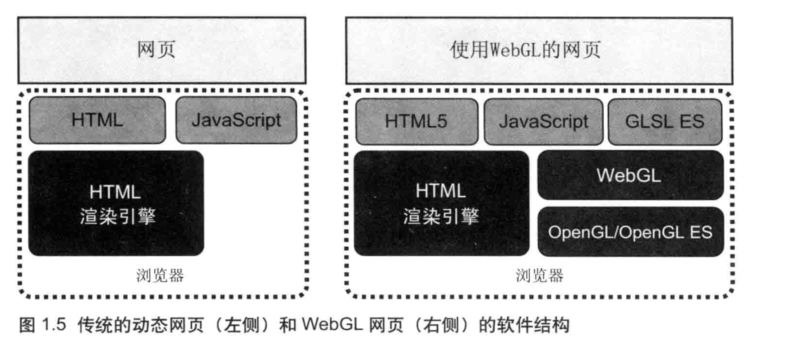
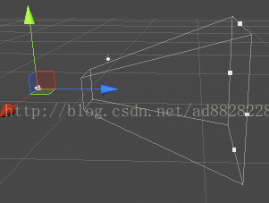
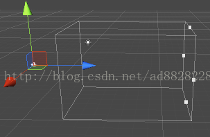

# 其他




# WebGL基础概念


## 裁剪空间

顶点接下来要从观察空间转换到**裁剪空间**(**clip space，也被称为齐次裁剪空间**)中，这个用于转换的矩阵叫做**裁剪矩阵(clip matrix)**，也被称为投影矩阵(**projection matrix**)。

裁剪空间的目标是能够方便地对渲染图元进行裁剪：完全位于这块空间内部的图元将会被保留，完全位于这块空间外部的图元将会被剔除，而与这块空间边界相交的图元就会被裁剪。那么，这块空间是如何决定的呢？答案是由**视锥体(view frustum)**来决定。

视锥体指的是空间中的一块区域，这块区域决定了摄像机可以看到的空间。视锥体由六个平面包围而成，这些平面也被称为**裁剪平面(clip planes)**。视锥体有两种类型，这涉及两种投影类型：一种是**正交投影(orthographic projection)**，一种是**透视投影(perspective projection)**。

在视锥体的6块裁剪平面中，有两块裁剪平面比较特殊，它们分别被称为**近裁剪平面(near clip plane)**和**远裁剪平面(far clip plane)**。它们决定了摄像机可以看到的深度范围。



<center style="color:#000;text-decoration:underline">透视投影</center>



<center style="color:#000;text-decoration:underline">正交投影</center>


WebGL在电脑的GPU中运行，因此你需要使用能够在GPU上运行的代码。 这样的代码需要提供成对的方法，每对方法中一个叫顶点着色器， 另一个叫片断着色器，并且使用一种和C或C++类似的强类型的语言 [GLSL](https://webglfundamentals.org/webgl/lessons/zh_cn/webgl-shaders-and-glsl.html)。 (GL着色语言)。 每一对组合起来称作一个 `program`（着色程序）。

顶点着色器的作用是计算顶点的位置。根据计算出的一系列顶点位置，WebGL可以对点， 线和三角形在内的一些图元进行光栅化处理。当对这些图元进行光栅化处理时需要使用片断着色器方法。 片断着色器的作用是计算出当前绘制图元中每个像素的颜色值。

几乎整个WebGL API都是关于如何设置这些成对方法的状态值以及运行它们。 对于想要绘制的每一个对象，都需要先设置一系列状态值，然后通过调用 `gl.drawArrays` 或 `gl.drawElements` 运行一个着色方法对，使得你的着色器对能够在GPU上运行。这些方法对所需的任何数据都需要发送到GPU，


## 着色器获取数据

### 属性（Attributes）和缓冲

缓冲是发送到GPU的一些二进制数据序列，通常情况下缓冲数据包括位置、法向量、纹理坐标、顶点颜色值等。你可以存储任何数据。

属性用来指明怎么从缓冲中获取所需数据并将它提供给顶点着色器。 例如你可能在缓冲中用三个32位的浮点型数据存储一个位置值。 对于一个确切的属性你需要告诉它从哪个缓冲中获取数据，获取什么类型的数据（三个32位的浮点数据），起始偏移值是多少，到下一个位置的字节数是多少。

### 全局变量（Uniforms）

全局变量在着色程序运行前赋值，在运行过程中全局有效。全局变量在一次绘制过程中传递给着色器的值都一样。

### 纹理（Textures）

纹理是一个数据序列，可以在着色程序运行中随意读取其中的数据。 大多数情况存放的是图像数据，但是纹理仅仅是数据序列， 你也可以随意存放除了颜色数据以外的其它数据。

### 可变量（Varyings）

可变量是一种顶点着色器给片断着色器传值的方式，依照渲染的图元是点， 线还是三角形，顶点着色器中设置的可变量会在片断着色器运行中获取不同的插值。

想要从顶点着色器传值到片断着色器，我们可以定义“可变量（varying）”。在顶点着色器和片断着色器中定义相同的varying变量，WebGL会将同名的可变量从顶点着色器输入到片断着色器中。WebGL先获得顶点着色器中计算的三个颜色值，在光栅化三角形时将会根据这三个值进行插值。


## 着色器

### 片断着色器


#### 数据获取方式

片断着色器所需的数据，可以通过以下三种方式获取

1. [Uniforms 全局变量](https://webglfundamentals.org/webgl/lessons/zh_cn/webgl-shaders-and-glsl.html#uniforms-) (values that stay the same for every pixel of a single draw call)
2. [Textures 纹理](https://webglfundamentals.org/webgl/lessons/zh_cn/webgl-shaders-and-glsl.html#textures-) (data from pixels/texels)
3. [Varyings 可变量](https://webglfundamentals.org/webgl/lessons/zh_cn/webgl-shaders-and-glsl.html#varyings-) (data passed from the vertex shader and interpolated)


**Uniform 全局变量（片断着色器中）**

同 [Uniforms 全局变量](https://webglfundamentals.org/webgl/lessons/zh_cn/webgl-shaders-and-glsl.html#uniforms-).


**Textures 纹理（片断着色器中）**

在着色器中获取纹理信息，可以先创建一个`sampler2D`类型全局变量，然后用GLSL方法`texture2D` 从纹理中提取信息。

```glsl
precision mediump float;
 
uniform sampler2D u_texture;
 
void main() {
   vec2 texcoord = vec2(0.5, 0.5)  // 获取纹理中心的值
   gl_FragColor = texture2D(u_texture, texcoord);
}
```

创建并给纹理填充数据

```glsl
var tex = gl.createTexture();
gl.bindTexture(gl.TEXTURE_2D, tex);
var level = 0;
var width = 2;
var height = 1;
var data = new Uint8Array([
   255, 0, 0, 255,   // 一个红色的像素
   0, 255, 0, 255,   // 一个绿色的像素
]);
gl.texImage2D(gl.TEXTURE_2D, level, gl.RGBA, width, height, 0, gl.RGBA, gl.UNSIGNED_BYTE, data);
gl.texParameteri(gl.TEXTURE_2D, gl.TEXTURE_MIN_FILTER, gl.LINEAR);
```


**Varyings 可变量**

在[工作原理](https://webglfundamentals.org/webgl/lessons/zh_cn/webgl-how-it-works.html)提到过，可变量是一种顶点着色器给片断着色器传值的方式。

为了使用可变量，要在两个着色器中定义同名的可变量。 给顶点着色器中可变量设置的值，会作为参考值进行内插，在绘制像素时传给片断着色器的可变量。


## webgl常用函数

### gl.createBuffer()

```glsl
WebGLBuffer gl.createBuffer();
```

The **`WebGLRenderingContext.createBuffer()`** method of the [WebGL API](https://developer.mozilla.org/en-US/docs/Web/API/WebGL_API) creates and initializes a [`WebGLBuffer`](https://developer.mozilla.org/en-US/docs/Web/API/WebGLBuffer) storing data such as vertices or colors.

### gl.bindBuffer()

The **`WebGLRenderingContext.bindBuffer()`** method of the [WebGL API](https://developer.mozilla.org/en-US/docs/Web/API/WebGL_API) binds a given [`WebGLBuffer`](https://developer.mozilla.org/en-US/docs/Web/API/WebGLBuffer) to a target.

设置缓冲区为当前缓冲区

```glsl
void gl.bindBuffer(target, buffer);
```

**参数**

- target

  A [`GLenum`](https://developer.mozilla.org/en-US/docs/Web/API/WebGL_API/Types) specifying the binding point (target). Possible values:

  - `gl.ARRAY_BUFFER`: Buffer containing vertex attributes, such as vertex coordinates, texture coordinate data, or vertex color data.

  - `gl.ELEMENT_ARRAY_BUFFER`: Buffer used for element indices.
  - When using a [WebGL 2 context](https://developer.mozilla.org/en-US/docs/Web/API/WebGL2RenderingContext)（针对 OpenGL ES 3.0）, the following values are available additionally:
    - `gl.COPY_READ_BUFFER`: Buffer for copying from one buffer object to another.
    - `gl.COPY_WRITE_BUFFER`: Buffer for copying from one buffer object to another.
    - `gl.TRANSFORM_FEEDBACK_BUFFER`: Buffer for transform feedback operations.
    - `gl.UNIFORM_BUFFER`: Buffer used for storing uniform blocks.
    - `gl.PIXEL_PACK_BUFFER`: Buffer used for pixel transfer operations.
    - `gl.PIXEL_UNPACK_BUFFER`: Buffer used for pixel transfer operations.

- buffer

  A [`WebGLBuffer`](https://developer.mozilla.org/en-US/docs/Web/API/WebGLBuffer) to bind.

### gl.bufferData()

[WebGL API](https://developer.mozilla.org/en-US/docs/Web/API/WebGL_API) 的**`WebGLRenderingContext.bufferData()`**方法创建并初始化了Buffer对象的数据存储区。

数据拷贝到缓冲区。

```glsl
// WebGL1:
void gl.bufferData(target, size, usage);
void gl.bufferData(target, ArrayBuffer? srcData, usage);
void gl.bufferData(target, ArrayBufferView srcData, usage);

// WebGL2:
void gl.bufferData(target, ArrayBufferView srcData, usage, srcOffset, length);
```


### gl.getAttribLocation()

```glsl
GLint gl.getAttribLocation(program, name);
```

**参数**

- program

  A [`WebGLProgram`](https://developer.mozilla.org/en-US/docs/Web/API/WebGLProgram) containing the attribute variable.

- name

  A [`DOMString`](https://developer.mozilla.org/en-US/docs/Web/API/DOMString) specifying the name of the attribute variable whose location to get.

**返回值**

A [`GLint`](https://developer.mozilla.org/en-US/docs/Web/API/WebGL_API/Types) number indicating the location of the variable name if found. Returns -1 otherwise.

### gl.enableVertexAttribArray()

The [`WebGLRenderingContext`](https://developer.mozilla.org/en-US/docs/Web/API/WebGLRenderingContext) method **`enableVertexAttribArray()`**, part of the [WebGL API](https://developer.mozilla.org/en-US/docs/Web/API/WebGL_API), turns on the generic vertex attribute array at the specified index into the list of attribute arrays.

In WebGL, values that apply to a specific vertex are stored in [attributes](https://developer.mozilla.org/en-US/docs/Web/API/WebGL_API/Data#attributes). These are only available to the JavaScript code and the vertex shader. Attributes are referenced by an index number into the list of attributes maintained by the GPU. Some vertex attribute indices may have predefined purposes, depending on the platform and/or the GPU. Others are assigned by the WebGL layer when you create the attributes.

Either way, since attributes cannot be used unless enabled, and are disabled by default, you need to call `enableVertexAttribArray()` to enable individual attributes so that they can be used. Once that's been done, other methods can be used to access the attribute, including [`vertexAttribPointer()`](https://developer.mozilla.org/en-US/docs/Web/API/WebGLRenderingContext/vertexAttribPointer), [`vertexAttrib*()`](https://developer.mozilla.org/en-US/docs/Web/API/WebGLRenderingContext/vertexAttrib), and [`getVertexAttrib()`](https://developer.mozilla.org/en-US/docs/Web/API/WebGLRenderingContext/getVertexAttrib).

```glsl
void gl.enableVertexAttribArray(index);
```

**参数**

- index

  A [`GLuint`](https://developer.mozilla.org/en-US/docs/Web/API/WebGL_API/Types) specifying the index number that uniquely identifies the vertex attribute to enable. If you know the name of the attribute but not its index, you can get the index by calling [`getAttribLocation()`](https://developer.mozilla.org/en-US/docs/Web/API/WebGLRenderingContext/getAttribLocation).

### gl.vertexAttribPointer()

The **`WebGLRenderingContext.vertexAttribPointer()`** method of the [WebGL API](https://developer.mozilla.org/en-US/docs/Web/API/WebGL_API) binds the buffer currently bound to `gl.ARRAY_BUFFER` to a generic vertex attribute of the current vertex buffer object and specifies its layout.
告诉显卡从当前绑定的缓冲区（bindBuffer()指定的缓冲区）中读取顶点数据。

WebGL API 的`WebGLRenderingContext.vertexAttribPointer()`方法绑定当前缓冲区范围到`gl.ARRAY_BUFFER`，成为当前顶点缓冲区对象的通用顶点属性并指定它的布局(缓冲区对象中的偏移量)。

```glsl
void gl.vertexAttribPointer(index, size, type, normalized, stride, offset);
```

**参数**

- `index`

  A [`GLuint` (en-US)](https://developer.mozilla.org/en-US/docs/Web/API/WebGL_API/Types) specifying the index of the vertex attribute that is to be modified. 指定要修改的顶点属性的索引。

- `size`

  A [`GLint` (en-US)](https://developer.mozilla.org/en-US/docs/Web/API/WebGL_API/Types) specifying the number of components per vertex attribute. Must be 1, 2, 3, or 4. 指定每个顶点属性的组成数量，必须是1，2，3或4。

- `type`

  A [`GLenum` (en-US)](https://developer.mozilla.org/en-US/docs/Web/API/WebGL_API/Types) specifying the data type of each component in the array. Possible values: 指定数组中每个元素的数据类型可能是：

  - `gl.BYTE`: signed 8-bit integer, with values in [-128, 127] 有符号的8位整数，范围[-128, 127]
  - `gl.SHORT`: signed 16-bit integer, with values in [-32768, 32767] 有符号的16位整数，范围[-32768, 32767]
  - `gl.UNSIGNED_BYTE`: unsigned 8-bit integer, with values in [0, 255] 无符号的8位整数，范围[0, 255]
  - `gl.UNSIGNED_SHORT`: unsigned 16-bit integer, with values in [0, 65535] 无符号的16位整数，范围[0, 65535]
  - `gl.FLOAT`: 32-bit IEEE floating point number 32位IEEE标准的浮点数When using a [WebGL 2 context](https://developer.mozilla.org/zh-CN/docs/Web/API/WebGL2RenderingContext), the following values are available additionally: 使用WebGL2版本的还可以使用以下值：
  - `gl.HALF_FLOAT`: 16-bit IEEE floating point number 16位IEEE标准的浮点数

- `normalized`

  A [`GLboolean` (en-US)](https://developer.mozilla.org/en-US/docs/Web/API/WebGL_API/Types) specifying whether integer data values should be normalized into a certain range when being casted to a float. 当转换为浮点数时是否应该将整数数值归一化到特定的范围。

  - For types `gl.BYTE` and `gl.SHORT`, normalizes the values to [-1, 1] if true. 对于类型`gl.BYTE`和`gl.SHORT`，如果是true则将值归一化为[-1, 1]
  - For types `gl.UNSIGNED_BYTE` and `gl.UNSIGNED_SHORT`, normalizes the values to [0, 1] if true. 对于类型`gl.UNSIGNED_BYTE`和`gl.UNSIGNED_SHORT`，如果是true则将值归一化为[0, 1]
  - For types `gl.FLOAT` and `gl.HALF_FLOAT`, this parameter has no effect. 对于类型`gl.FLOAT`和`gl.HALF_FLOAT`，此参数无效

- `stride`

  A [`GLsizei` (en-US)](https://developer.mozilla.org/en-US/docs/Web/API/WebGL_API/Types) specifying the offset in bytes between the beginning of consecutive vertex attributes. Cannot be larger than 255. If stride is 0, the attribute is assumed to be tightly packed, that is, the attributes are not interleaved but each attribute is in a separate block, and the next vertex' attribute follows immediately after the current vertex.

  一个GLsizei，以字节为单位指定连续顶点属性开始之间的偏移量(即数组中一行长度)。不能大于255。如果stride为0，则假定该属性是紧密打包的，即不交错属性，每个属性在一个单独的块中，下一个顶点的属性紧跟当前顶点之后。

- `offset`

  A [`GLintptr` (en-US)](https://developer.mozilla.org/en-US/docs/Web/API/WebGL_API/Types) specifying an offset in bytes of the first component in the vertex attribute array. Must be a multiple of the byte length of `type`.

  [`GLintptr` (en-US)](https://developer.mozilla.org/en-US/docs/Web/API/WebGL_API/Types)指定顶点属性数组中第一部分的字节偏移量。必须是类型的字节长度的倍数。
