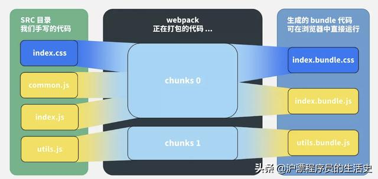
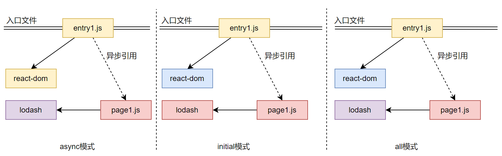
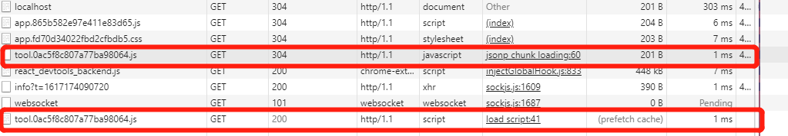

# 概念

| 概念                   | 含义                                          |
| -------------------- | ------------------------------------------- |
| 代码分割（Code Splitting） | 分割打包后的资源，首屏只加载必要的部分，不太重要的功能放在后面去加载，提升首屏渲染速度 |
|                      |                                             |
|                      |                                             |

# 模块化

## CommonJS

同步加载方案，一个单独的文件就是一个模块，每一个模块有单独的作用域，只能通过 `module.exports` 导出。加载使用 `require` 。

服务器端加载本地文件很快，但是对于浏览器，需要采用异步模块加载模式。所以就有AMD和CMD。

commonjs 中有几个特别的变量，`module`、`exports`、`require`、`global`、`__filename`、`__dirname`。

CommonJS在每个模块的首部默认添加了以下代码：

```js
var module = {
    exports: { },
};
var exports = module.exports;
```

因此不要给 `exports` 直接赋值，否则会导致其失效。

模块会有一个 `module` 对象用来存放信息，这个对象中有一个 `loaded` 属性用来记录该模块是否加载过。默认值为false，加载和执行后变为true，再次执行时不会执行模块代码

我们看一下 `module` 对象到底有哪些字段:

```js
// test.js
module.exports = {
  add: function(a, b) {
    return a + b;
  },
  module,
}

// index.js
const m = require("./test");

console.log(m.module);

const sum = m.add(1,2);
```

打印出的 `module` 对象如下，其中 `exports` 为模块的导出对象， `loaded` 指示模块是否加载

```json
{
  id: '/Users/hucheng/my/github/demo示例/CommonJS模块/test.js',
  path: '/Users/hucheng/my/github/demo示例/CommonJS模块',
  exports: { add: [Function: add], module: [Circular *1] },
  parent: Module {
    id: '.',
    path: '/Users/hucheng/my/github/demo示例/CommonJS模块',
    exports: {},
    parent: null,
    filename: '/Users/hucheng/my/github/demo示例/CommonJS模块/index.js',
    loaded: false,
    children: [ [Circular *1] ],
    paths: [
      '/Users/hucheng/my/github/demo示例/CommonJS模块/node_modules',
      '/Users/hucheng/my/github/demo示例/node_modules',
      '/Users/hucheng/my/github/node_modules',
      '/Users/hucheng/my/node_modules',
      '/Users/hucheng/node_modules',
      '/Users/node_modules',
      '/node_modules'
    ]
  },
  filename: '/Users/hucheng/my/github/demo示例/CommonJS模块/test.js',
  loaded: true,
  children: [],
  paths: [
    '/Users/hucheng/my/github/demo示例/CommonJS模块/node_modules',
    '/Users/hucheng/my/github/demo示例/node_modules',
    '/Users/hucheng/my/github/node_modules',
    '/Users/hucheng/my/node_modules',
    '/Users/hucheng/node_modules',
    '/Users/node_modules',
    '/node_modules'
  ]
}
```

## ES6 Module

复合写法

```js
export { name, add, default as other } from './calculator.js'
```

复合写法目前只支持通过命名方式导出变量，默认导出没有对应的复合形式，只能拆开写

```js
import calculator from './calculator.js';

export default calculator;
```

## CommonJS 和 ES6 Module 的区别

### 动态与静态

最本质的区别在于 CommonJS 对于模块的依赖是动态的，而 ES6 Module 是静态的。这里“动态”是指，模块的依赖关系的建立发生在代码运行阶段，而静态则是模块依赖关系的建立发生在代码编译阶段。

require 的模块路径可以动态执行，支持表达式，甚至可以通过 if 语句判断是否加载某个模块，因此在 CommonJS 模块执行前，没有办法明确依赖关系。

ES6 Module 的导入、导出语句都是声明式的，不支持路径是一个表达式，且导入、导出语句必须位于模块的顶层作用域，因此是一个静态的模块结构，在编译阶段就能确定模块的依赖关系。相比于CommonJS有一下几点优势：

- 死代码检测和排除。有些模块只使用了一部分组件或接口，可以通过静态分析在打包时去掉未曾使用的代码。（TreeShaking？）
- 模块变量类型检查。ES6 Module 有助于确保模块之间传递的值和接口类型正确。(Node下缺失会报错)
- 编译器优化。

### 值拷贝与动态映射

在导出一个模块时，CommonJS是一份导出值的拷贝，而ES6 Module是值的**动态**映射，且这个映射是只读的。

看到这个动态，实验了一把确实这这样，能动态的感知值的变化，且count是只读的，难道做了一层代理？例子如下：

```js
// test.mjs
let count = 0;

const add = function (a, b) {
  count += 1;
  return a + b;
}

export { count, add }

// index.mjs
import { count, add } from './test1.mjs';

console.log(count);  // 0
console.log(add(1, 2));
console.log(count);  // 1
```

### 循环依赖

看下面一个例子的输出：

```js
// bar.js
const foo = require("./foo.js");
console.log("value of foo:", foo);

module.exports = "this is bar.js";

// foo.js
const bar = require("./bar.js");
console.log("value of bar:", bar);

module.exports = "this is foo.js";

// index.js
require("./foo.js");

// 输出结果：
// value of foo: {}
// value of bar: this is bar.js
```

原因：在加载foo的时候，foo去加载bar，而bar中加载foo，此时foo模块并未执行完毕，故其导出值在这时为空对象。bar加载完毕后，bar的值正常输出。

> 思考：require是不是一开始执行就认为已加载，即loaded为true，再次require直接返回。从下面的webpack实现可以间接看到其原理。

由上看出，尽管循环依赖的模块均被执行了，但是导入的模块并不是我们想要的。

我们从webpack的实现角度来看，将上面的打包后，有这样一段代码：

```js
// The require function
function __webpack_require__(moduleId) {
  if (installedModules[moduleId]) {
    return installedModules[moduleId].exports;
  }
  // Create a new module (and put it into the cache)
  var module = installedModules[moduleId] = {
    i: moduleId,
    l: false,
    exports: {}
  };
  ...
}
```

再看ES6 Module针对循环依赖的场景，这里是在Node环境下运行：

```js
// bar.mjs
import foo from './foo.mjs';
console.log("value of foo:", foo);

export default "this is bar.mjs";

// foo.mjs
import bar from './bar.mjs';
console.log("value of bar:", bar);

export default "this is foo.mjs";

// index.mjs
import foo from './foo.mjs';

console.log(foo);

// 运行结果
// console.log("value of foo:", foo);
//                               ^
// ReferenceError: Cannot access 'foo' before initialization
```

可见ES6 Module不允许使用没有初始化的模块，会报错

## 其他类型模块

### 非模块化文件

如JQuery，webpack直接引用即可

```js
import './jquery.min.js'
```

一般这类库是将其接口绑定在全局。假如我们引入的非模块文件是以隐式全局变量声明的方式暴露其接口的，则会发生问题。如：

```js
// 通过顶层作用域声明变量的方式暴露接口
var calculator = {
   // ...
}
```

由于webpack在打包时会为每个文件包装一层函数作用域来避免全局污染，上面的代码将无法把calculator对象挂在全局

### AMD

## AMD & CMD

AMD：Asynchromous Module Definition，即异步模块定义。不是JS原生支持，JavaScript社区标准，使用AMD规范需要用到 `RequireJS` 。

RequireJS定义了一个函数 define，它是全局变量，用来定义模块。

```js
// 定义模块，id-可选参数，dependencies-当前模块依赖名称数组，factory-模块初始化要执行的函数或对象。若为函数，只被执行一次；若是对象，此对象应该为模块的输出值
define(id?, dependencies?, factory);
// 使用require加载模块，第一个参数：依赖模块，第二个参数：回调函数
require([dependencies], function(){});
```

### UMD

UMD：Universal Module Definition，即通用模块标准，他的目标是一个模块能运行在各种环境，不论是CommonJS、AMD，还是非模块的环境。

### CMD（不常用）

CMD：Common Module Definition，国内发展出来，类似AMD的requireJS，CMD也有类似的叫SeaJS。

也遵循统一写法：

```js
define(id?, deps?, factory);
// factory有三个参数
// function(require, exports, module)

// 定义模块 myModule.js
define(function(require, exports, module) {
  var $ = require('jquery.js')
  $('div').addClass('active');
});

// 加载模块
seajs.use(['myModule.js'], function(my){

});
```

1. 一个文件一个模块，所以经常就用文件名作为模块id
2. CMD推崇依赖就近，所以一般不在define的参数中写依赖，在factory中写

AMD 与 CMD 都是异步加载，主要区别：

1. 针对define，AMD推崇依赖前置，在定义模块的时候就要声明其依赖的模块；CMD推崇就近依赖，只有在用到某个模块的时候再去require。
2. 都是异步加载，执行时机不一样。AMD在加载模块完成后就会执行该模块，模块执行顺序不确定，RequireJS2.0可以延迟执行；CMD加载完某个依赖模块后并不执行，require时才执行，保证按书写顺序执行

# 资源输入输出

## module/chunk/bundle



看这个图就很明白了：

1. 对于一份同逻辑的代码，当我们手写了一个个的文件，它们无论是 ESM 还是 CommonJS 或是 AMD，他们都是 **module**；
2. 当我们写的 module 源文件传到 webpack 进行打包时，webpack 会根据文件引用关系生成 **chunk** 文件，webpack 会对这个 chunk 文件进行一些操作；
3. webpack 处理好 chunk 文件后，最后会输出 **bundle** 文件，这个 bundle 文件包含了经过加载和编译的最终源文件，所以它可以直接在浏览器中运行。

一般来说一个 chunk 对应一个 bundle，比如上图中的 utils.js -> chunks 1 -> utils.bundle.js；但也有例外，比如说上图中，我就用 MiniCssExtractPlugin 从 chunks 0 中抽离出了 index.bundle.css 文件。

**一句话总结：**

module，chunk 和 bundle 其实就是同一份逻辑代码在不同转换场景下的取了三个名字：我们直接写出来的是 module，webpack 处理时是 chunk，最后生成浏览器可以直接运行的 bundle。

## filename/chunkFilename

**filename**

filename 是一个很常见的 `output` 配置，指经过webpack 打包后输出文件的文件名。

```js
const path = require('path');

module.exports = {
  entry: './path/to/my/entry/file.js',
  output: {
    path: path.resolve(__dirname, 'dist'),
    filename: '[name].bundle.js'
  }
};
```

**chunkFilename**

chunkFilename 指未被列在 entry 中，却又需要被打包出来的 chunk 文件的名称。一般来说，这个 chunk 文件指的就是要**懒加载**的代码。

**一句话总结：**

filename 指列在 entry 中，打包后输出的文件的名称。

chunkFilename 指未列在 entry 中，却又需要被打包出来的文件的名称。

## hash

首先来个背景介绍，哈希一般是结合 CDN 缓存来使用的。如果文件内容改变的话，那么对应文件哈希值也会改变，对应的 HTML 引用的 URL 地址也会改变，触发 CDN 服务器从源服务器上拉取对应数据，进而更新本地缓存。 

| 类型          | 描述                                              |
| ----------- | ----------------------------------------------- |
| hash        | 跟整个项目的构建相关，生成文件的hash都一样                         |
| chunkhash   | 它根据不同的入口文件(Entry)进行依赖文件解析、构建对应的 chunk，生成对应的哈希值。 |
| contenthash | 根据资源内容创建出唯一 hash，也就是说文件内容不变，hash 就不变            |
| id          | 当前 chunk 的 id，一个数字                              |
|             |                                                 |

## publicPath

部署相关的资源请求位置

- HTML相关，publicPath为相对路径，相对于当前html所在路径的
- Host相关，publicPath为绝对路径，是以hostname为基础的
- CDN相关，public以协议头或者相对协议的形式开始，如 "http://cdn.com/", "//cdn.com/assets/"

# 预处理器

常用的 loader 如下：

| Loader         | 作用                                                                                                                                                                      |
| -------------- | ----------------------------------------------------------------------------------------------------------------------------------------------------------------------- |
| style-loader   | 将 css 代码以`style`标签的形式插入到 html 中                                                                                                                                         |
| css-loader     | 仅处理 CSS 的各种加载语法，如 JS 中的 `import`、`require` 和 CSS 中的 `@import`、`url`，通常和 style-loader 配合使用                                                                               |
| postcss-loader | 用于 css 的兼容性处理，具有众多功能，例如 **添加前缀，单位转换** 等                                                                                                                                 |
| less-loader    | CSS 预处理器，在 CSS 中新增了许多语法，提高了开发效率                                                                                                                                         |
| file-loader    | 解析文件的 `import/require()` ，转换成一个url，并且输出到指定目录。                                                                                                                           |
| url-loader     | url-loader内部封装了file-loader。<br />url-loader工作分两种情况：<br />1.文件大小小于limit参数，url-loader将会把文件转为DataURL；<br />2.文件大小大于limit，url-loader会调用file-loader进行处理，参数也会直接传给file-loader。 |

# 常见配置

## optimization

### splitChunks

#### chunks

| 值       | 含义                    |
| ------- | --------------------- |
| all     | 对所有 chunks 生效（入口和异步）  |
| async   | 默认值，只对异步 chunks 生效    |
| initial | 只对入口 chunk 生效（异步将不生效） |

#### cacheGroups

TODO...

| 配置项                             | 作用                                                                                           |
| ------------------------------- | -------------------------------------------------------------------------------------------- |
| resolve.alias                   | 创建 import 或 require 的别名，来确保模块引入变得更简单。                                                        |
| resolve.extensions              | 自动解析确定的扩展，能够使用户在引入模块时不带扩展。默认为['.js', '.json']。                                               |
| resolve.mainFiles               | 解析**目录**时要使用的文件名，默认`mainFiles: ["index"]`                                                    |
| resolve.modules                 | 告诉 webpack 解析模块时应该搜索的目录。默认是node_modules。                                                     |
| externals                       | 打包时排除某些依赖，而由用户环境提供。                                                                          |
| optimization.splitChunks        | [SplitChunksPlugin](https://webpack.docschina.org/plugins/split-chunks-plugin/)的配置，用于指定分块策略。 |
| optimization.splitChunks.chunks | 指定哪些chunks进行优化，默认为async。<br />async: 作用？？？<br />all: 作用？？？                                   |

## minimize

启动JavaScript压缩，minimizer属性可用于自定义插件，如果需要定制化则需要安装 `terser-webpack-plugin`

```js
const TerserPlugin = require("terser-webpack-plugin");

module.exports = {
  optimization: {
    minimize: true,
    minimizer: [new TerserPlugin()],
  },
};
```

# 常见Plugin

| Plugin                           | 描述                                                                              |
| -------------------------------- | ------------------------------------------------------------------------------- |
| `HotModuleReplacementPlugin`     | webpack自带插件，可以在调试阶段只更新修改的部分，而不用刷新整个页面。                                          |
| `HtmlWebpackPlugin`              | 生成html文件                                                                        |
| `CleanWebpackPlugin`             | 清理上一次打包的结果                                                                      |
| `MiniCssExtractPlugin`           | 将 `CSS` 提取为独立的文件，有利于客户端进行**缓存**                                                 |
| `OptimizeCssAssetsWebpackPlugin` | 对 `CSS` 文件进行压缩，减小 `CSS` 打包后的体积。对于Webpack V5或以上使用 CssMinimizerWebpackPlugin      |
| `CssMinimizerWebpackPlugin`      | 这个插件使用 [cssnano](https://cssnano.co/) 优化和压缩 CSS。                                |
| `TerserWebpackPlugin`            | webpack自带的JS代码压缩插件                                                              |
| `CompressionWebpackPlugin`       | 压缩资源为gzip格式插件，对js/css有很多的压缩效果，需要后端配置支持                                          |
| `DefinePlugin`                   | webpack自带插件，可以定义一些全局变量，可以在模块中直接使用                                               |
| `ProvidePlugin`                  | webpack自带插件，自动加载模块定义。如React项目中，每个组件的头部都必须import一次，是用该插件，可以省略该步，在需要引入时插件帮我们自动引入。 |
| DllPlugin/DllReferencePlugin     | 预打包某些不会变的资源，然后创建manifest文件链接，可提高编译速度。                                           |
| IgnorePlugin                     | webpack自带插件，忽略第三方包指定目录。                                                         |

## IgnorePlugin

这是 webpack 内置插件，它的作用是：忽略第三方包指定目录，让这些指定目录不要被打包进去。

比如我们要使用 `moment` 这个第三方依赖库，该库主要是对时间进行格式化，并且支持多个国家语言。虽然我设置了语言为中文，但是在打包的时候，是会将所有语言都打包进去的。这样就导致包很大，打包速度又慢。对此，我们可以用 `IgnorePlugin` 使得指定目录被忽略，从而使得打包变快，文件变小。

```js
const Webpack = require('webpack')
plugins: [
  // moment这个库中，如果引用了./locale/目录的内容，就忽略掉，不会打包进去
  new Webpack.IgnorePlugin(/\.\/locale/, /moment/),
]
```

我们虽然按照上面的方法忽略了包含`’./locale/'`该字段路径的文件目录，但是也使得我们使用的时候不能显示中文语言了，所以这个时候可以手动引入中文语言的目录。

```js
import moment from 'moment'

//手动引入所需要的语言包
import 'moment/locale/zh-cn'

moment.locale('zh-cn')

let r = moment().endOf('day').fromNow()
console.log(r)
```

# 优化

## 代码分割

代码分割主要集中在webpack中的**optimization.splitChunks**项的配置 

参考http://www.qiutianaimeili.com/html/page/2019/10/u3c9rzngly9.html，这里讲了很多参数，这里暂先看下chunks这个参数的含义

> 注：在自己的webpack5脚手架中发现，对于异步加载的js文件，触发异步加载条件时会创建script标签挂载到head中进行加载，当加载完毕后，该script标签也就被删除了。

### splitChunks.chunks

该值包含三种设置："initial" "async"  "all"，我们构造如下一个依赖关系看下参数

```js
//entry1.js
import ReactDOM from 'react-dom'
import('./page1').then();

//page1.js
import _ from 'lodash'
```



**async** 只会异步加载模块进行分割，打包结果为：

```
entry1.***.js
page1.***.js
vendor~page1.***.js
```

可以看到：

1. page1.js因为是异步引用，所以会从主包中分离出去。page1中的lodash也会单独打成一个包。
2. react-dom并没有被打包，因为async模式，只会分割异步加载里面的引用。

**initial** 只会对入口文件进行分割，打包结果为：

```
entry1.***.js
page1.***.js
vendor~entry1.***.js
```

**all** 表示对入口和异步引用都会进行分割，打包结果为：

```
entry1.***.js
page1.***.js
vendor~entry1.***.js
vendor~page1.***.js
```

## 预加载

### prefetch/preload

代码懒加载固然能提高首页的加载速度，可是若当用户与页面进行交互时再加载代码，会使得用户首次交互体验不佳，这个时候就需要预拉取（prefetch）和预加载（preload）了。

如何启用prefetch？这是我们需要一种Magic Comment（魔法注释）的方式

```js
import(/* webpackChunkName: 'tool', webpackPrefetch:true */ "./tool").then(
    ({ add }) => {
        console.log("loadSuccess:" + add(1, 3));
    }
);
```

这样做了之后，webpack会替我们在 `head` 标签内添加如下一行，其会在父chunk加载完成之后进行资源下载，此时暂时还不会加载js文件：

```html
<link rel="prefetch" as="script" href="http://localhost:9000/tool.0ac5f8c807a77ba98064.js">
```

这样的话，prefetch chunk会在父chunk加载完成之后进行加载，



 当我们触发加载异步JS文件时，新建script标签插入head中进行加载，此时由于JS文件之前已经预拉取了，这里则直接从prefetch cache缓存中提取，加快了JS文件的加载速度。

> 注：前面提起过，异步加载的script加载完成后会又从head中移除。

preload chunk会在父chunk加载时以并行方式加载。这个尝试了下，没有起作用，跟没有设置一样。

# 常见问题

# Webpack工作流程

1、读取配置文件，按命令 **初始化** 配置参数，创建 Compiler 对象；

2、调用插件的 apply 方法 **挂载插件** 监听，然后从入口文件开始执行编译；

3、按文件类型，调用相应的 Loader 对模块进行 **编译**，并在合适的时机点触发对应的事件，调用 Plugin 执行，最后再根据模块 **依赖查找** 到所依赖的模块，递归执行第三步；

4、将编译后的所有代码包装成一个个代码块 (Chuck)， 并按依赖和配置确定 **输出内容**。这个步骤，仍然可以通过 Plugin 进行文件的修改;

5、最后，根据 Output 把文件内容一一写入到指定的文件夹中，完成整个过程；