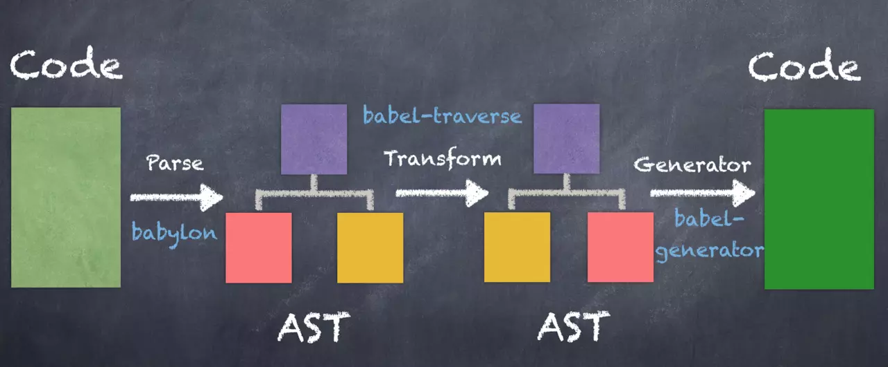

# Babel
- [一口(很长的)气了解 babel](https://juejin.im/post/5c19c5e0e51d4502a232c1c6)
- [深入Babel，这一篇就够了](https://juejin.im/post/5c21b584e51d4548ac6f6c99)

#### 工作流程
1. 解析（Parse）：将代码解析程抽象语法树（AST），通过babylon实现，包含词法分析和语法分析。语法插件介入。
2. 转换（Transform）：通过babel-traverse进行深度遍历，对节点进行相应操作。转义插件介入。
3. 生成（generate）：通过babel-generator进行代码的生成。转义插件介入。

#### 工具
- babel-cli: 命令行工具
- babel-runtime & babel-plugin-transform-runtime：将一些公共的转换函数放在一个单独的文件，就需要babel-runtime。babel-plugin-transform-runtime配合其使用。
- babel-polyfill：增加兼容方法，在代码最前面require进来，会在原型上添加很多方法，而且影响全局，打出的包体积很大。
- babel-loader：配合webpack在代码混淆前进行代码转换，

babel三个阶段：解析、转换、生成。babel本身不具备任何转换功能，都是分解到一个个Plugin实现的。插件分语法插件（syntax）和转义插件(transform)。
使用方式（常见）：命令行（cli），构建工具的插件（如webpack的babel-loader）

preset：由于需要配置很多插件不方便，便出来一个插件集合的概念。最常用也是最重要的是env，es201x、stage-x、latest等都被废弃掉了。
preset有配置项可以配置。最重要的是env，了解env的配置项即可。

#### 执行顺序
- plugin运行在preset之前
- plugin从前往后顺序执行
- preset证号相反，从后往前