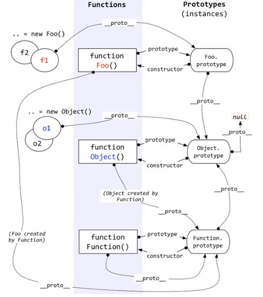

### 原型链


明确如下几点：  
1. 每个对象都有一个[[prototype]]属性，这个属性是隐藏属性，不能直接访问，所以有的浏览器提供了一个__proto__属性来访问，然而这不是一个标准的访问方法，所以ES5中用Object.getPrototypeOf函数获得一个对象的[[prototype]]。ES6中，使用Object.setPrototypeOf可以直接修改一个对象的[[prototype]]。
2. 在JS中万物皆对象，方法是对象，方法的原型也是对象。对象具有__proto__属性，可称为隐式原型，一个对象的隐式原型指向构造函数的原型。
3. 方法这个特殊的对象，除了__proto__属性，还有自己**特有**的属性——原型属性（prototype），这个属性指向一个对象，包含所有实例共享的属性和方法。这个对象我们也叫原型对象，原型对象有一个属性constructor，指向原构造函数。

上图解读：  
1. f1, f2对象通过new Foo()创建，所以它们的__proto__属性都指向Foo的原型对象，即Foo.prototype。Foo.prototype有一个constructor属性，指向Foo构造函数。
2. Foo.prototype也是一个对象，也有__proto__属性，其__proto__指向Object的原型对象，即Object.prototype。Object.prototype有一个constructor属性，指向Object构造函数。
3. Object.prototype也是一个对象，也有__proto__属性，但规定其__proto__属性为null。s
4. o1, o2对象，由构造函数Object创建，所以它们的__proto__属性都指向Object的原型对象，即Object.prototype。Object.prototype有一个constructor属性，指向Object构造函数。
5. Foo函数也是一个对象，也有__proto__属性，它由构造函数Function创建，故其__proto__指向Function的原型对象，即Function.prototype。
6. Object函数也是一个对象，也有__proto__属性，它由构造函数Function创建，故其__proto__指向Function的原型对象，即Function.prototype。 
7. Function本身也是一个对象，也有__proto__属性，指向Function.prototype。

### 对象的创建
#### new
``` js
var obj = {};
obj.__proto__ = Car.prototype
Car.call(obj)
```
1. 创建了一个空对象obj
2. 将空对象的__proto__属性指向了Car函数的原型对象，obj的原型属性将拥有了Car.prototype中的属性和方法。
3. 将Car函数中的this指针指向obj，obj有了Car构造函数中的属性和方法


### Object.create 方法

参考：  
https://www.zhihu.com/question/34183746/answer/58068402

