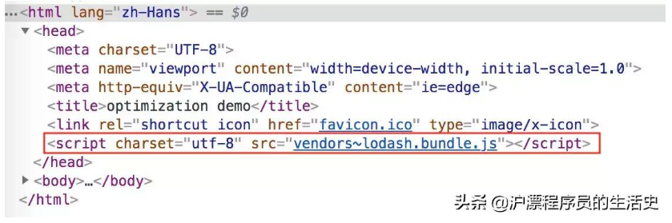
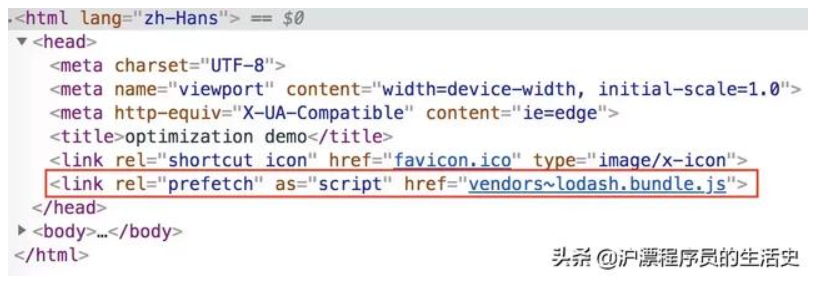
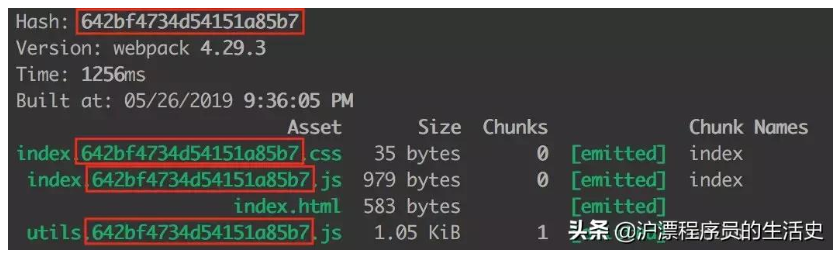
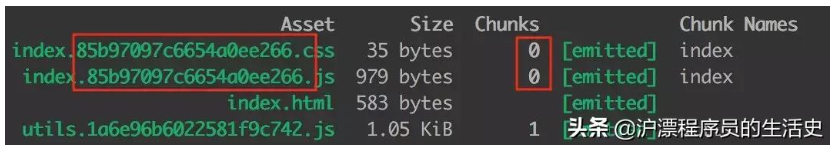
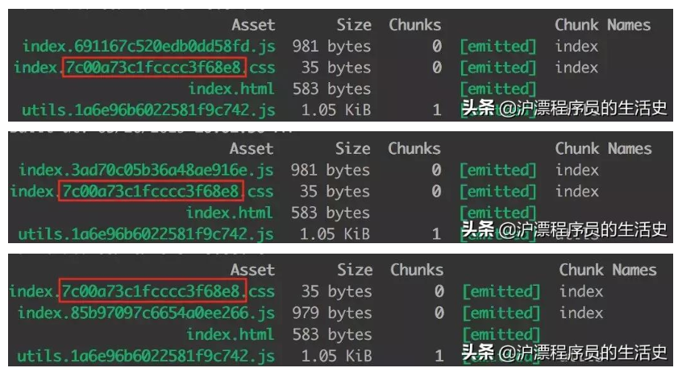

# webpack 中比较难懂的几个变量名称

### 1. module，chunk 和 bundle 的区别是什么？


看这个图就很明白了：

1. 对于一份同逻辑的代码，当我们手写了一个个的文件，它们无论是 ESM 还是 commonJS 或是 AMD，他们都是 **module**；
2. 当我们写的 module 源文件传到 webpack 进行打包时，webpack 会根据文件引用关系生成 **chunk** 文件，webpack 会对这个 chunk 文件进行一些操作；
3. webpack 处理好 chunk 文件后，最后会输出 **bundle** 文件，这个 bundle 文件包含了经过加载和编译的最终源文件，所以它可以直接在浏览器中运行。

一般来说一个 chunk 对应一个 bundle，比如上图中的 utils.js -> chunks 1 -> utils.bundle.js；但也有例外，比如说上图中，我就用 MiniCssExtractPlugin 从 chunks 0 中抽离出了 index.bundle.css 文件。

**一句话总结：**

module，chunk 和 bundle 其实就是同一份逻辑代码在不同转换场景下的取了三个名字：我们直接写出来的是 module，webpack 处理时是 chunk，最后生成浏览器可以直接运行的 bundle。

### 2.filename 和 chunkFilename 的区别

**filename**

filename 是一个很常见的配置，就是对应于 entry 里面的输入文件，经过webpack 打包后输出文件的文件名。比如说经过下面的配置，生成出来的文件名为 index.min.js。

```js
const path = require('path');

module.exports = {
  entry: './path/to/my/entry/file.js',
  output: {
    path: path.resolve(__dirname, 'dist'),
    filename: '[name].bundle.js'
  }
};
```

**chunkFilename**

chunkFilename 指未被列在 entry 中，却又需要被打包出来的 chunk 文件的名称。一般来说，这个 chunk 文件指的就是要懒加载的代码。

> output.chunkFilename 默认使用 [id].js 或从 output.filename 中推断出的值（[name] 会被预先替换为 [id] 或 [id].） 

**一句话总结：**

filename 指列在 entry 中，打包后输出的文件的名称。

chunkFilename 指未列在 entry 中，却又需要被打包出来的文件的名称。

### 3.webpackPrefetch、webpackPreload 和 webpackChunkName 到底是干什么的？

**webpackChunkName**

前面举了个异步加载 lodash 的例子，我们最后把 output.chunkFilename 写死成 bundle.js。在我们的业务代码中，不可能只异步加载一个文件，所以写死肯定是不行的，但是写成 [name].bundle.js 时，打包的文件又是意义不明、辨识度不高的 chunk id。

这时候 webpackChunkName 就可以派上用场了。我们可以在 import 文件时，在 import 里以<font color='red'>注释</font>的形式为 chunk 文件取别名： 

```js
async function getAsyncComponent() {
	var element = document.createElement('div');
 
 	// 在 import 的括号里 加注释 /* webpackChunkName: "lodash" */ ，为引入的文件取别名
 	const { default: _ } = await import(/* webpackChunkName: "lodash" */ 'lodash');
 	element.innerHTML = _.join(['Hello!', 'dynamic', 'imports', 'async'], ' ');
 	return element;
}
```

但生成的打包文件名是 vendors~lodash.bundle.js，前面多出来一个 `vendors~`。其实 webpack 懒加载是用内置的一个插件 SplitChunksPlugin 实现的，这个插件里面有些默认配置项，比如说 automaticNameDelimiter，默认的分割符就是 ~，所以最后的文件名才会出现这个符号，这块儿内容我就不引申了，感兴趣的同学可以自己研究一下。 

**webpackPrefetch 和 webpackPreload** 

  这两个配置一个叫预拉取（Prefetch），一个叫预加载（Preload），两者有些细微的不同，我们先说说 webpackPrefetch。 

 在上面的懒加载代码里，我们是点击按钮时，才会触发异步加载 lodash 的动作，这时候会动态的生成一个 script 标签，加载到 head 头里： 



 如果我们 import 的时候添加 webpackPrefetch： 

```js
const { default: _ } = await import(/* webpackChunkName: "lodash" */ /* webpackPrefetch: true */ 'lodash');
```

就会以 `<link rel="prefetch" as="script">` 的形式预拉取 lodash 代码： 



这个异步加载的代码不需要手动点击 button 触发，webpack 会在父 chunk 完成加载后，**闲时**加载 lodash 文件。 

webpackPreload 是预加载当前导航下可能需要资源，他和 webpackPrefetch 的主要区别是：

- preload chunk 会在父 chunk 加载时，以并行方式开始加载。prefetch chunk 会在父 chunk 加载结束后开始加载。
- preload chunk 具有中等优先级，并立即下载。prefetch chunk 在浏览器闲置时下载。
- preload chunk 会在父 chunk 中立即请求，用于当下时刻。prefetch chunk 会用于未来的某个时刻

**一句话总结：**

webpackChunkName 是为预加载的文件取别名，webpackPrefetch 会在浏览器闲置下载文件，webpackPreload 会在父 chunk 加载时并行下载文件。

### 4.hash、chunkhash、contenthash 有什么不同？

首先来个背景介绍，哈希一般是结合 CDN 缓存来使用的。如果文件内容改变的话，那么对应文件哈希值也会改变，对应的 HTML 引用的 URL 地址也会改变，触发 CDN 服务器从源服务器上拉取对应数据，进而更新本地缓存。 

**hash**

hash 计算是跟整个项目的构建相关



我们可以发现，生成文件的 hash 和项目的构建 hash 都是一模一样的。 

**chunkhash** 

它根据不同的入口文件(Entry)进行依赖文件解析、构建对应的 chunk，生成对应的哈希值。 



我们可以看出，chunk 0 的 hash 都是一样的，chunk 1 的 hash 和上面的不一样。 

 **contenthash** 

 我们更近一步，index.js 和 index.css 同为一个 chunk，如果 index.js 内容发生变化，但是 index.css 没有变化，打包后他们的 hash 都发生变化，这对 css 文件来说是一种浪费。 

 contenthash 将根据资源内容创建出唯一 hash，也就是说文件内容不变，hash 就不变。 



可以看出，当仅js文件改变时，css文件的hash值没有变化。

