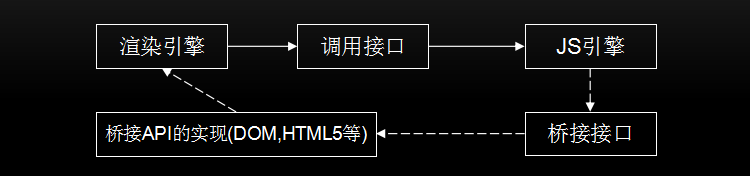
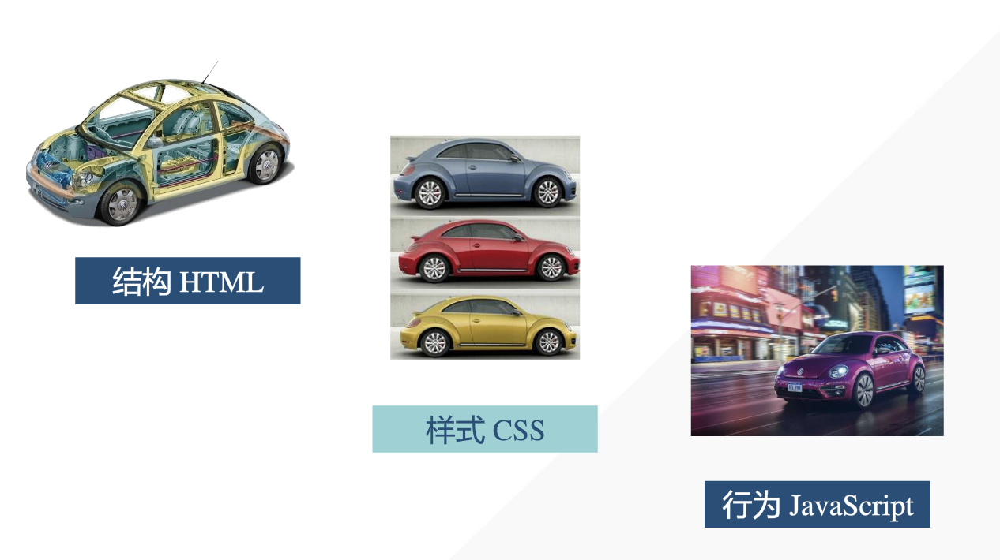
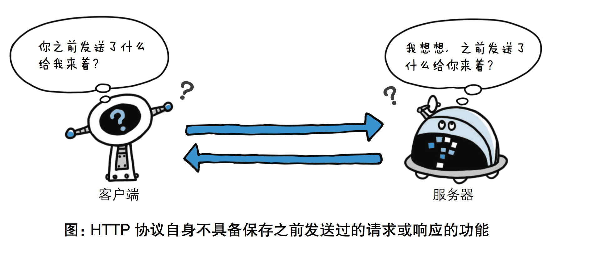
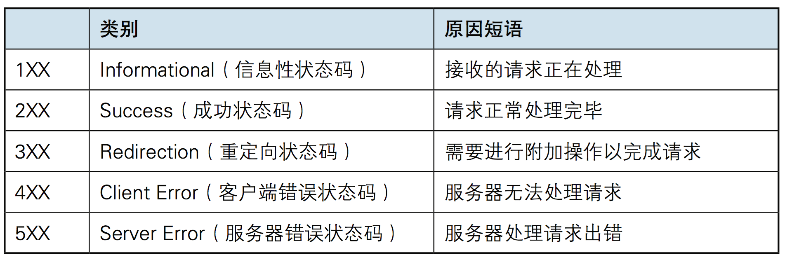
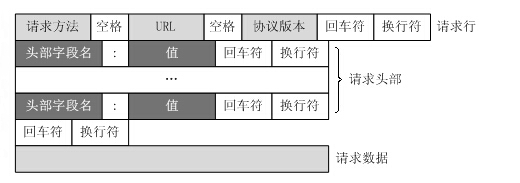
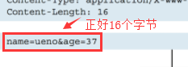
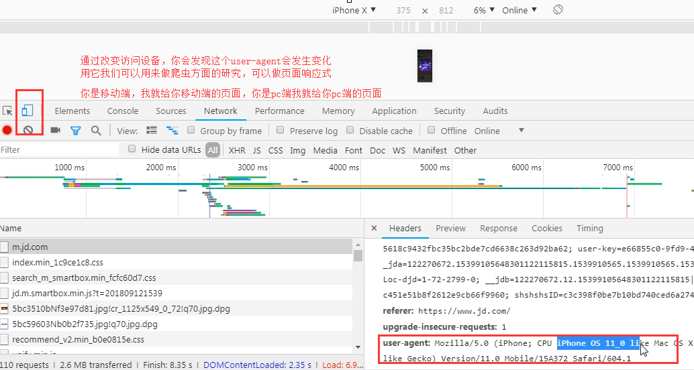

<center><span style="font-size:3rem;font-weight:bold;">前端技术简介</span></center>

| 版本   | 作者 | 时间       | 备注         |
| ------ | ---- | ---------- | ------------ |
| V1.0.0 | 胡程 | 2020.12.16 | 主体内容完成 |

<div style="page-break-after: always;"></div>

[toc]

<div style="page-break-after: always;"></div>

# 浏览器简介

## 浏览器发展史

1991 年 WorldWideWeb 浏览器发布，这款由 Web 之父 Tim Berners-Lee 亲手设计的图形化浏览器还包含一个所见即所得 HTML 编辑器，为了避免同 WWW 混淆，这个浏览器后来改名为 Nexus。[网页体验版地址](https://worldwideweb.cern.ch/browser/)


1993 年 Mosaic 发布，Internet 的流行应该归功于 Mosaic，这款浏览器将 Web 带向了大众。诸如 IE， Firefox 一类的当代浏览器仍然在延用 Mosaic 的图形化操作界面思想。


1994 年，Netscape 成立， Marc Andreessen 带领 Mosaic 的程序员成立了 Netscape 网景公司，并发布了第一款商业浏览器 Netscape Navigator（网景导航者）。


1995 年，IE 发布，浏览器之战即将爆发，微软针对 Netscape 发布了他们自己的浏览器 IE，第一场浏览器之战爆发。


1995 年同期，一家挪威的公司也推出了一款浏览器，为以后标签式浏览器奠定了基础，它就是 Opera（歌剧）。它支持单窗口多文档阅读，用户不必再一下子点开一堆窗口，清爽多了。


1998 年，Mozilla 项目成立，Netscape 成立 Mozilla 开源项目，开发下一代浏览器，后来证明，使用原有代码开发新东西是一种负担，接着他们着手重新开发。

1998 年，Netscape 浏览器走向开源，随着同 IE 征战的失利，Netscape 市场份额急剧下降，Netscape 决定将自己的浏览器开源以期重整山河。

2002 年，IE 开始主导浏览器市场 市场份额达到 95%，借助操作系统的捆绑优势，IE 赢得第一场浏览器之战。

2003 年，苹果 Safari 浏览器登场，苹果进入了浏览器市场，推出自己的 Webkit 引擎，该引擎非常优秀，后来被包括 Google， Nokia 之类的厂商用于手机浏览器。

2004 年，Firefox 引发第二场浏览器之战，Firefox 1.0 推出。早在 Beta 测试期间就积累了大量人气的 Firefox 引发了第二场浏览器之战，当年年底，Firefox 已经赢得 7.4% 的市场份额。

2006 年，IE7 发布，IE6 发布后的第六年，迫于 Firefox 的压力，微软匆匆推出 IE7 应战，吸取了 Firefox 的一些设计思想，如标签式浏览，反钓鱼等。但这款浏览器现在看来并不成功。

2008 年，Google 携 Chrome 参战 Google 发布了他们自己的浏览器，加入这场战争。轻量，快，异常的稳固让这款浏览器成为不可轻视的一个对手。


2009 年，为了应对 Firefox、Safari、Opera 和 Chrome 的挑战，微软发布了最新版 IE8。

2009 年，Mozilla 推出 Firefox 3.5

2015 年，微软发布 Edge 浏览器，2018 年 12 月 Edge 从 EdgeHTML 内核迁移为 Chromium 内核

总结：

| 发布时间 | 名称         | 发表人/组织            | 地点      | 现状                |
| -------- | ------------ | ---------------------- | --------- | ------------------- |
| 1991 年  | www（nexus） | Tim Berners-Lee        | 瑞士 CERN | 消失                |
| 1993 年  | Mosaic       | 伊利诺大学的 NCSA 组织 | 美国      | 被收购              |
| 1994 年  | Netscape     | Marc Andreessen        | 美国      | 消失                |
| 1996 年  | IE           | 微软                   | 美国      | 转战 Microsoft Edge |
| 1996 年  | Opera        | Telenor 公司           | 挪威      | 现存                |
| 2003 年  | Safari       | 苹果                   | 美国      | 现存                |
| 2004 年  | Firefox      | Mozilla 组织           | 美国      | 现存                |
| 2008 年  | Chrome       | 谷歌                   | 美国      | 现存                |
| 2015 年  | Edge         | 微软                   | 美国      | 现存                |

关于市场份额方面，依据统计网址：http://gsa.statcounter.com/browser-market-share/desktop/worldwide

2020-11 全球桌面浏览器市场份额


2020-11 中国桌面浏览器市场份额


## 浏览器内核

### 浏览器构成

浏览器一般由七个模块组成，User Interface（用户界面）、Browser engine（浏览器引擎）、Rendering engine（渲染引擎）、Networking（网络）、JavaScript Interpreter（js 解释器）、Display Backend（显示后端）、Date Persistence（数据持久化存储） 如下图：


- **用户界面**（User Interface）：用户界面主要包括工具栏、地址栏、前进/后退按钮、书签菜单、可视化页面加载进度、智能下载处理、首选项、打印等。除了浏览器主窗口显示请求的页面之外，其他显示的部分都属于用户界面。
- **浏览器引擎**（Browser Engine）：浏览器引擎是一个可嵌入的组件，其为渲染引擎提供高级接口。浏览器引擎可以加载一个给定的 URI，并支持诸如：前进/后退/重新加载等浏览操作。浏览器引擎提供查看浏览会话的各个方面的挂钩。
- **渲染引擎**（Rendering Engine）：解析 DOM 文档和 CSS 规则并将内容排版到浏览器中显示有样式的界面，也有人称之为排版引擎，我们常说的浏览器内核主要指的就是渲染引擎
- **网络**（Networking）：用来完成网络调用或资源下载的模块
- **JS 解释器**（JavaScript Intercepter）：JavaScript 解释器能够解释并执行嵌入在网页中的 JavaScript（又称 ECMAScript）代码，如 V8 引擎、JavaScriptCore
- **XML 解释器**（XML Parser）：XML 解析器可以将 XML 文档解析成文档对象模型（Document Object Model，DOM）树。 XML 解析器是浏览器架构中复用最多的子系统之一，几乎所有的浏览器实现都利用现有的 XML 解析器，而不是从头开始创建自己的 XML 解析器。
- **显示后端**（Display Backend）：显示后端提供绘图和窗口原语，包括：用户界面控件集合、字体集合。用来绘制基本的浏览器窗口内控件，如输入框、按钮、单选按钮等，根据浏览器不同绘制的视觉效果也不同，但功能都是一样的。
- **数据存储**（Data Persistence）：浏览器在硬盘中保存 cookie、localStorage 等各种数据，可通过浏览器引擎提供的 API 进行调用

### 什么是内核

最初内核的概念包括渲染引擎与 JS 引擎，目前习惯直接称渲染引擎为内核，JS 引擎独立。

最初：


因此以前称，chrome 浏览器使用 Chromium 内核，blink 渲染引擎，V8JS 引擎。

目前：


因此现在称，chrome 浏览器使用 blink 内核，V8JS 引擎。

浏览器最重要或者说核心的部分是“Rendering Engine”，可大概译为“渲染引擎”，不过我们一般习惯将之称为“浏览器内核”。负责对网页语法的解释（如标准通用标记语言下的一个应用 HTML、JavaScript）并渲染（显示）网页。 所以，通常所谓的浏览器内核也就是浏览器所采用的渲染引擎，渲染引擎决定了浏览器如何显示网页的内容以及页面的格式信息。不同的浏览器内核对网页编写语法的解释也有不同，因此同一网页在不同的内核的浏览器里的渲染（显示）效果也可能不同，这也是网页编写者需要在不同内核的浏览器中测试网页显示效果的原因。

JavaScript 引擎是一个专门处理 JavaScript 脚本的虚拟机，一般会附带在网页浏览器之中。最开始渲染引擎和 JS 引擎并没有区分的很明确，后来 JS 引擎越来越独立，内核就倾向于单指渲染引擎。有一个网页标准计划小组制作了一个 [ACID](http://acid3.acidtests.org/) 来测试引擎的兼容性和性能。内核的种类很多，但是常见的浏览器内核可以分这四种：Gecko、Trident、Webkit、Blink。需要注意浏览器和浏览器内核是不同的概念，浏览器指的是 Chrome、Firefox、Safari、Opera 等，而浏览器内核则是 Blink、Webkit、Gecko、Trident 等。浏览器内核只负责渲染，GUI 及网络连接等跨平台工作则是浏览器实现的。


内核时间线

1997 年 Trident

1998 年 KHTML

2000 年 Gecko

2001 年 WebKit

2003 年 Presto

2008 年 Chromium（Webkit）

2013 年 Chromium（Blink）

2015 年 EdgeHtml

各主流浏览器内核

| 浏览器         | 内核                                                                        |
| -------------- | --------------------------------------------------------------------------- |
| IE 浏览器      | Trident 内核，也是俗称的 IE 内核；                                          |
| Chrome 浏览器  | 统称为 Chromium 内核或 Chrome 内核，以前是 Webkit 内核，现在是 Blink 内核； |
| Firefox 浏览器 | Gecko 内核，俗称 Firefox 内核；                                             |
| Safari 浏览器  | Webkit 内核                                                                 |
| Opera 浏览器   | 最初是自己的 Presto 内核，后来是 Webkit，现在是 Chromium                    |
| 360 浏览器     | IE + Chromium 双内核                                                        |
| 百度浏览器     | IE + Chromium 双内核                                                        |
| QQ 浏览器      | IE + Chromium 双内核                                                        |
| 猎豹浏览器     | IE + Chromium 双内核                                                        |
| 搜狗           | IE + Chromium 双内核                                                        |

### 常见内核

参考：https://www.jianshu.com/p/f4bf35898719

#### Trident


Trident (['traɪd(ə)nt])，IE 内核，该内核程序在 1997 年的 IE4 中首次被采用，是微软在 Mosaic（"马赛克"，这是人类历史上第一个浏览器，从此网页可以在图形界面的窗口浏览） 代码的基础之上修改而来的，并沿用到 IE11，也被普遍称作 "IE 内核"。

Trident 实际上是一款开放的内核，其接口内核设计的相当成熟，因此才有许多采用 IE 内核而非 IE 的浏览器(壳浏览器)涌现。由于 IE 本身的 "垄断性"（虽然名义上 IE 并非垄断，但实际上，特别是从 Windows 95 年代一直到 XP 初期，就市场占有率来说 IE 的确借助 Windows 的东风处于 "垄断" 的地位）而使得 Trident 内核的长期一家独大，微软很长时间都并没有更新 Trident 内核，这导致了两个后果：一是 Trident 内核曾经几乎与 W3C 标准脱节（2005 年），二是 Trident 内核的大量 Bug 等安全性问题没有得到及时解决，然后加上一些致力于开源的开发者和一些学者们公开自己认为 IE 浏览器不安全的观点，也有很多用户转向了其他浏览器，Firefox 和 Opera 就是这个时候兴起的。非 Trident 内核浏览器的市场占有率大幅提高也致使许多网页开发人员开始注意网页标准和非 IE 浏览器的浏览效果问题。

IE 从版本 11 开始，初步支持 WebGL 技术。IE8 的 JavaScript 引擎是 Jscript，IE9 开始用 Chakra，这两个版本区别很大，Chakra 无论是速度和标准化方面都很出色。国内很多的双核浏览器的其中一核便是 Trident，美其名曰 "兼容模式"。Window10 发布后，IE 将其内置浏览器命名为 Edge，Edge 最显著的特点就是新内核 EdgeHTML。

2018 年 12 月 7 日，微软宣布将放弃基于 EdgeHTML 的 Microsoft Edge 的开发，转而投入开源项目 Chromium，并以 Chromium 为基础开发新的 Microsoft Edge。

2020 年 1 月 15 日，微软正式发布了基于 Chromium 开源项目的 Microsoft Edge。

#### Gecko


Gecko(['gekəʊ])，Firefox 内核，Netscape6 开始采用的内核，后来的 Mozilla Firefox(火狐浏览器) 也采用了该内核，Gecko 的特点是代码完全公开，因此，其可开发程度很高，全世界的程序员都可以为其编写代码，增加功能。因为这是个开源内核，因此受到许多人的青睐，Gecko 内核的浏览器也很多，这也是 Gecko 内核虽然年轻但市场占有率能够迅速提高的重要原因。

事实上，Gecko 引擎的由来跟 IE 不无关系，前面说过 IE 没有使用 W3C 的标准，这导致了微软内部一些开发人员的不满；他们与当时已经停止更新了的 Netscape 的一些员工一起创办了 Mozilla，以当时的 Mosaic 内核为基础重新编写内核，于是开发出了 Gecko。不过事实上，Gecko 内核的浏览器仍然还是 Firefox (火狐) 用户最多，所以有时也会被称为 Firefox 内核。此外 Gecko 也是一个跨平台内核，可以在 Windows、 BSD、Linux 和 Mac OS X 中使用。

#### Presto


Presto(['prestəʊ])，是挪威产浏览器 opera 的 "前任" 内核，为何说是 "前任"，因为最新的 opera 浏览器早已将之抛弃从而投入到了谷歌大本营。

Opera 的一个里程碑作品是 Opera7.0，因为它使用了 Opera Software **自主开发**的 Presto 渲染引擎，取代了旧版 Opera 4 至 6 版本使用的 Elektra 排版引擎。该款引擎的特点就是渲染速度的优化达到了极致，然而代价是牺牲了网页的兼容性。

Presto 加入了动态功能，例如网页或其部分可随着 DOM 及 Script 语法的事件而重新排版。Presto 在推出后不断有更新版本推出，使不少错误得以修正，以及阅读 Javascript 效能得以最佳化，并成为当时速度最快的引擎。

然而为了减少研发成本，Opera 在 2013 年 2 月宣布放弃 Presto，转而跟随 Chrome 使用 WebKit 分支的 Chromium 引擎作为自家浏览器核心引擎，Presto 内核的 Opera 浏览器版本永远的停留在了 12.17。在 Chrome 于 2013 年推出 Blink 引擎之后，Opera 也紧跟其脚步表示将转而使用 Blink 作为浏览器核心引擎。

Presto 与开源的 WebKit 和经过谷歌加持的 Chromium 系列相比毫无推广上的优势，这是 Opera 转投 WebKit 的主要原因，并且使用 WebKit 内核的 Opera 浏览器可以兼容谷歌 Chrome 浏览器海量的插件资源。但是换内核的代价对于 Opera 来说过于惨痛。使用谷歌的 WebKit 内核之后，原本快速，轻量化，稳定的 Opera 浏览器变得异常的卡顿，而且表现不稳定，Opera 原本旧内核浏览器书签同步到新内核上的工作 Opera 花了整整两年时间，期间很多 Opera 的用户纷纷转投谷歌浏览器和其他浏览器，造成了众多的用户流失。时至今日现在还有上千万人在使用老版本的 Opera。

很多人都认为 Opera 浏览器终止在了 12.17，此后所更新的 Opera 版本号不再是原来那个 Opera。

#### Webkit

Webkit github 镜像仓库: https://github.com/WebKit/webkit

WebKit 内核是苹果基于 KDE 小组（Linux 桌面系统）的 KHTML 引擎开发出来的，可以说 WebKit 是 KHTML 的一个开源的分支。当年苹果在比较了 Gecko 和 KHTML 后，选择了后者来做引擎开发，是因为相比 Gecko，KHTML 拥有清晰的源码结构和极快的渲染速度，也实现了 JavaScript 脚本的快速解释器调用。事实上，这个宝押对了。这种轻灵随后就赢得了 Google 的青睐（2008 年谷歌公司发布 chrome 浏览器，采用的 chromium 内核便 fork 了 Webkit）。

#### Chromium


Chromium github 镜像仓库: https://github.com/chromium/chromium

blink 地址：https://github.com/chromium/chromium/tree/master/third_party/blink

windows 编译指南：https://github.com/chromium/chromium/blob/master/docs/windows_build_instructions.md

2008 年，谷歌公司发布了 chrome 浏览器，浏览器使用的内核被命名为 Chromium。Chromium fork 自开源引擎 Webkit，却把 Webkit 的代码梳理得可读性提高很多，所以以前可能需要一天进行编译的代码，现在只要两个小时就能搞定。因此 Chromium 引擎和其它基于 WebKit 的引擎所渲染页面的效果也是有出入的。所以有些地方会把 chromium 引擎和 webkit 区分开来单独介绍，而有的文章把 chromium 归入 webkit 引擎中，都是有一定道理的。

谷歌公司还研发了自己的 Javascript 引擎，V8，极大地提高了 Javascript 的运算速度。

Chromium 问世后，带动了国产浏览器行业的发展。一些基于 chromium 的单核，双核浏览器如雨后春笋般拔地而起，例如 搜狗、360、QQ 浏览器等等，无一不是套着不同的外壳用着相同的内核。

然而 2013 年 4 月 3 日，谷歌在 Chromium Blog 上发表 [博客](http://blog.chromium.org/2013/04/blink-rendering-engine-for-chromium.html)，称将与苹果的开源浏览器核心 Webkit 分道扬镳，在 Chromium 项目中研发 Blink 渲染引擎（即浏览器核心），内置于 Chrome 浏览器之中。Webkit 用的好好的，为何要投入到一个新的内核中去呢？

Blink 其实是 WebKit 的分支，如同 WebKit 是 KHTML 的分支。Google 的 Chromium 项目此前一直使用 WebKit(WebCore) 作为渲染引擎，但出于某种原因，并没有将其多进程架构移植入 Webkit。

后来，由于苹果推出的 WebKit2 与 Chromium 的沙箱设计存在冲突，所以 Chromium 一直停留在 WebKit，并使用移植的方式来实现和主线 WebKit2 的对接。这增加了 Chromium 的复杂性，且在一定程度上影响了 Chromium 的架构移植工作。

基于以上原因，Google 决定从 WebKit 衍生出自己的 Blink 引擎（后由 Google 和 Opera Software 共同研发），将在 WebKit 代码的基础上研发更加快速和简约的渲染引擎，并逐步脱离 WebKit 的影响，创造一个完全独立的 Blink 引擎。这样以来，唯一一条维系 Google 和苹果之间技术关系的纽带就这样被切断了。

Google 和苹果在多个领域都是竞争对手，而唯独在浏览器引擎上有技术合作，利益一致。但为了各自的利益，谁都不会拿出 100% 的 "诚意" 来做好 WebKit，因为你做出来的成果竞争对手可以直接享用。移动互联网已经崛起，手机和平板设备端必将成为浏览器的另一个战场。这个时候，如果 Google 跟苹果仍然黏在一起，将会严重阻碍双方的进步，也会阻碍 WebKit 的进步。

据说 Blink 删除了 880w 行 webkit 代码。

Blink 引擎问世后，国产各种 chrome 系的浏览器也纷纷投入 Blink 的怀抱，可以在浏览器地址栏输入 `chrome://version` 进行查看

## JavaScript 引擎

JavaScript 是解释型语言，这就是说它无需编译，直接由 JavaScript 引擎直接执行。既然说到了解释型语言，那么我们就来分别以下解释型语言和编译型语言的差别：

- 编译型语言：程序在执行之前需要一个专门的编译过程，把程序编译成为机器语言的文件（即 exe 文件），运行时不需要重新编译，直接用编译后的文件（exe 文件）就行了。
  - 优点：执行效率高
  - 缺点：跨平台性差
- 解释型语言：程序不需要编译，程序在运行的过程中才用解释器编译成机器语言，边编译边执行（没有 exe 文件）。
  - 优点：跨平台性好
  - 缺点：执行效率低

其中程序无需编译，不是说真的不需要编译了，直接执行脚本字符串。而是说不需要在运行之前先编译程序成为 exe 文件，而是在运行的过程中边运行边执行。


JavaScript 引擎组成

1. 编译器。主要工作是将源代码编译成抽象语法树，然后在某些引擎中还包含将抽象语法树转换成字节码。
2. 解释器。在某些引擎中，解释器主要是接受字节码，解释执行这个字节码，然后也依赖来及回收机制等。
3. JIT 工具。一个能够 JIT 的工具，将字节码或者抽象语法树转换成本地代码，当然它也需要依赖牢记
4. 垃圾回收器和分析工具（profiler）。它们负责垃圾回收和收集引擎中的信息，帮助改善引擎的性能和功效。

JavaScript 代码是在浏览器端解析和执行的，如果需要时间太长，会影响用户体验。那么提高 JavaScript 的解析速度就是当务之急。JavaScript 引擎和渲染引擎的关系如下图所示：



JavaScript 语言是解释型语言，为了提高性能，引入了 Java 虚拟机和 C++编译器中的众多技术。现在 JavaScript 引擎的执行过程大致是：

源代码 ---> 抽象语法树 ---> 字节码 ----> JIT ----> 本地代码（V8 引擎没有中间字节码）。一段代码的抽象语法树示例如下：

```text
function demo(name) {
    console.log(name);
}
```

抽象语法树如下：


V8 更加直接的将抽象语法树通过 JIT 技术转换成本地代码，放弃了在字节码阶段可以进行的一些性能优化，但保证了执行速度。在 V8 生成本地代码后，也会通过 Profiler 采集一些信息，来优化本地代码。虽然，少了生成字节码这一阶段的性能优化，但极大减少了转换时间。

JavaScript 的性能和 C 相比还有不小的距离，可预见的未来估计也只能接近它，而不是与它相比，这从语言类型上已经决定。

JavaScript 引擎和渲染引擎的关系

网页的工作过程需要两个引擎，渲染引擎和 JavaScript 引擎。JavaScript 引擎负责执行 JavaScript 代码，渲染引擎负责渲染网页。JavaScript 引擎提供调用接口给渲染引擎，以便让渲染引擎使用 JavaScript 引擎来处理 JavaScript 代码并获取结果。JavaScript 引擎需要能够访问渲染引擎构建的 DOM 树，所以 JavaScript 引擎通常需要提供桥接的接口，渲染引擎根据桥接接口来提供让 JavaScript 访问 DOM 的能力。

渲染引擎和 JavaScript 引擎之间的调用关系：


知名的 JavaScript 引擎，目前使用广泛的存在的 JavaScript 引擎：

| JS 引擎        | 公司/组织 | 描述                                                                                                                                                                                                                                         |
| -------------- | --------- | -------------------------------------------------------------------------------------------------------------------------------------------------------------------------------------------------------------------------------------------- |
| V8             | Google    | 用 C++编写，开放源代码，Google (丹麦)研发小组在 2006 年开始研发 V8 ，部分的原因是 Google 对既有 JavaScript 引擎的执行速度不满意, 在 2008 年推出 chrome,也用于 Node.js, 巨大的速度优势, 迅速占领市场。Edge 转向 Chromium 后也是使用的该引擎。 |
| JavaScriptCore | Apple     | 开放源代码，用于 webkit 型浏览器，如 Safari ，2008 年实现了编译器和字节码解释器，升级为了 SquirrelFish。苹果内部代号为“Nitro”的 JavaScript 引擎也是基于 JavaScriptCore 引擎的。                                                              |
| SpiderMonkey   | Mozilla   | 第一款 JavaScript 引擎，早期用于 Netscape Navigator，现时用于 Mozilla Firefox。                                                                                                                                                              |

（当前 Edge 还是用的 Chakra 吗）

## 浏览器工作原理

以 Chrome 为例：


当我们打开任务管理器的时候，会看到看到浏览器开启会有多个进程（可以通过 Chrome 的更多工具 -> 任务管理器查看或使用快捷键 `shift + esc`）。

Chrome 主要有下面这些进程：

- Browser Process：浏览器的主进程（负责协调、主控），只有一个。

1. 负责包括地址栏，书签栏，前进后退按钮等部分的工作；
2. 负责各个页面的管理，创建和销毁其他进程；
3. 将 Renderer 进程得到的内存中的 Bitmap，绘制到用户界面上；
4. 负责处理浏览器的一些不可见的底层操作，比如网络请求和文件访问；

- Renderer Process：默认每个 Tab 页面一个进程，互不影响。

1. 页面渲染，脚本执行，事件处理等

- Plugin Process：每种类型的插件对应一个进程，仅当使用该插件时才创建

- GPU Process：最多一个，用于 3D 绘制等


多进程有如下优点：

- 单一页面的 crash 并不会影响浏览器
- 插件的 crash 并不会影响浏览器
- 多进程充分利用多核优势
- 更为安全，在系统层面上限定了不同进程的权限

Chrome 为了节省内存的使用，限制了最多的进程数，最大进程数量由设备的内存和 CPU 能力决定，当达到这一限制时，新打开的 Tab 会共用之前同一个站点的渲染进程。

Chrome 把浏览器不同程序的功能看做服务，这些服务可以方便的分割为不同的进程或者合并为一个进程。以 Broswer Process 为例，如果 Chrome 运行在强大的硬件上，它会分割不同的服务到不同的进程，这样 Chrome 整体的运行会更加稳定，但是如果 Chrome 运行在资源贫瘠的设备上，这些服务又会合并到同一个进程中运行，这样可以节省内存。

# Web 开发技术

## Web 开发基础

### HTML/CSS/JS

HTML 是英文 Hyper Text Mark-up Language(超文本标记语言)的缩写，它是一种制作万维网页面标准语言（标记）。相当于定义统一的一套规则，大家都来遵守他。这样就可以让浏览器根据标记语言的规则去解释它。浏览器负责将标签翻译成用户“看得懂”的格式，呈现给用户！

具体可以通过网站：https://www.w3school.com.cn/html/index.asp，进行学习

CSS，层叠样式表(英文全称：Cascading Style Sheets)是一种用来表现[HTML](https://baike.baidu.com/item/HTML)或[XML](https://baike.baidu.com/item/XML)（标准通用标记语言的一个子集）等文件样式的计算机语言。CSS 不仅可以静态地修饰网页，还可以配合各种脚本语言动态地对网页各元素进行格式化。

JavaScript（简称“JS”） 是一种具有函数优先的轻量级，解释型或即时编译型的高级[编程语言](https://baike.baidu.com/item/编程语言/9845131)。虽然它是作为开发[Web](https://baike.baidu.com/item/Web/150564)页面的脚本语言而出名的，但是它也被用到了很多非浏览器环境中，JavaScript 基于原型编程、多范式的动态脚本语言，并且支持面向对象、命令式和声明式（如[函数](https://baike.baidu.com/item/函数/301912)式编程）风格。 [1]

JavaScript 在 1995 年由[Netscape](https://baike.baidu.com/item/Netscape/2778944)公司的 Brendan Eich，在网景导航者浏览器上首次设计实现而成。因为 Netscape 与[Sun](https://baike.baidu.com/item/Sun/69463)合作，Netscape 管理层希望它外观看起来像 Java，因此取名为 JavaScript。但实际上它的语法风格与[Self](https://baike.baidu.com/item/Self/4959923)及[Scheme](https://baike.baidu.com/item/Scheme/8379129)较为接近。 [2]

JavaScript 的标准是[ECMAScript ](https://baike.baidu.com/item/ECMAScript /1889420)。截至 2012 年，所有浏览器都完整的支持 ECMAScript 5.1，旧版本的浏览器至少支持 ECMAScript 3 标准。2015 年 6 月 17 日，ECMA 国际组织发布了 ECMAScript 的第六版，该版本正式名称为 ECMAScript 2015，但通常被称为 ECMAScript 6 或者 ES6。 [1]



### HTTP 协议

参考：https://www.cnblogs.com/an-wen/p/11180076.html

#### HTTP 协议简介

超文本传输协议（英文：**H**yper**T**ext **T**ransfer **P**rotocol，缩写：HTTP）是一种用于分布式、协作式和超媒体信息系统的应用层协议。HTTP 是万维网的数据通信的基础。

HTTP 的发展是由蒂姆·伯纳斯-李于 1989 年在欧洲核子研究组织（CERN）所发起。HTTP 的标准制定由万维网协会（World Wide Web Consortium，W3C）和互联网工程任务组（Internet Engineering Task Force，IETF）进行协调，最终发布了一系列的 RFC，其中最著名的是 1999 年 6 月公布的 RFC 2616，定义了 HTTP 协议中现今广泛使用的一个版本——HTTP 1.1。

2014 年 12 月，互联网工程任务组（IETF）的 Hypertext Transfer Protocol Bis（httpbis）工作小组将 HTTP/2 标准提议递交至 IESG 进行讨论，于 2015 年 2 月 17 日被批准。 HTTP/2 标准于 2015 年 5 月以 RFC 7540 正式发表，取代 HTTP 1.1 成为 HTTP 的实现标准。

#### HTTP 协议概述

HTTP 是一个客户端终端（用户）和服务器端（网站）请求和应答的标准（TCP）。通过使用网页浏览器、网络爬虫或者其它的工具，客户端发起一个 HTTP 请求到服务器上指定端口（默认端口为 80）。我们称这个客户端为用户代理程序（user agent）。应答的服务器上存储着一些资源，比如 HTML 文件和图像。我们称这个应答服务器为源服务器（origin server）。在用户代理和源服务器中间可能存在多个“中间层”，比如代理服务器、网关或者隧道（tunnel）。

尽管 TCP/IP 协议是互联网上最流行的应用，HTTP 协议中，并没有规定必须使用它或它支持的层。事实上，HTTP 可以在任何互联网协议上，或其他网络上实现。HTTP 假定其下层协议提供可靠的传输。因此，任何能够提供这种保证的协议都可以被其使用。因此也就是其在 TCP/IP 协议族使用 TCP 作为其传输层。

通常，由 HTTP 客户端发起一个请求，创建一个到服务器指定端口（默认是 80 端口）的 TCP 连接。HTTP 服务器则在那个端口监听客户端的请求。一旦收到请求，服务器会向客户端返回一个状态，比如"HTTP/1.1 200 OK"，以及返回的内容，如请求的文件、错误消息、或者其它信息。

#### HTTP 工作原理

HTTP 协议定义 Web 客户端如何从 Web 服务器请求 Web 页面，以及服务器如何把 Web 页面传送给客户端。HTTP 协议采用了请求/响应模型。客户端向服务器发送一个请求报文，请求报文包含请求的方法、URL、协议版本、请求头部和请求数据。服务器以一个状态行作为响应，响应的内容包括协议的版本、成功或者错误代码、服务器信息、响应头部和响应数据。

以下是 HTTP 请求/响应的步骤：

1. 客户端连接到 Web 服务器
   一个 HTTP 客户端，通常是浏览器，与 Web 服务器的 HTTP 端口（默认为 80）建立一个 TCP 套接字连接。例如，[http://www.luffycity.com](http://www.luffycity.com/)。

2. 发送 HTTP 请求
   通过 TCP 套接字，客户端向 Web 服务器发送一个文本的请求报文，一个请求报文由请求行、请求头部、空行和请求数据 4 部分组成。

3. 服务器接受请求并返回 HTTP 响应
   Web 服务器解析请求，定位请求资源。服务器将资源复本写到 TCP 套接字，由客户端读取。一个响应由状态行、响应头部、空行和响应数据 4 部分组成。

4. 释放连接 TCP 连接
   若 connection 模式为 close，则服务器主动关闭 TCP 连接，客户端被动关闭连接，释放 TCP 连接;若 connection 模式为 keepalive，则该连接会保持一段时间，在该时间内可以继续接收请求;

5. 客户端浏览器解析 HTML 内容
   客户端浏览器首先解析状态行，查看表明请求是否成功的状态代码。然后解析每一个响应头，响应头告知以下为若干字节的 HTML 文档和文档的字符集。客户端浏览器读取响应数据 HTML，根据 HTML 的语法对其进行格式化，并在浏览器窗口中显示。

例如：在浏览器地址栏键入 URL，按下回车之后会经历以下流程：

1. 浏览器向 DNS 服务器请求解析该 URL 中的域名所对应的 IP 地址;
2. 解析出 IP 地址后，根据该 IP 地址和默认端口 80，和服务器建立 TCP 连接;
3. 浏览器发出读取文件(URL 中域名后面部分对应的文件)的 HTTP 请求，该请求报文作为 TCP 三次握手的第三个报文的数据发送给服务器;
4. 服务器对浏览器请求作出响应，并把对应的 html 文本发送给浏览器;
5. 释放 TCP 连接;
6. 浏览器将该 html 文本并显示内容;


**http 协议是基于 TCP/IP 协议之上的应用层协议，基于 请求-响应 的模式**。HTTP 协议规定,请求从客户端发出,最后服务器端响应该请求并返回。换句话说,肯定是先从客户端开始建立通信的,服务器端在没有 接收到请求之前不会发送响应


**无状态保存**，HTTP 是一种不保存状态，即无状态(stateless)协议。HTTP 协议自身不对请求和响应之间的通信状态进行保存。也就是说在 HTTP 这个级别，协议对于发送过的请求或响应都不做持久化处理。



使用 HTTP 协议,每当有新的请求发送时,就会有对应的新响应产 生。协议本身并不保留之前一切的请求或响应报文的信息。这是为了更快地处理大量事务,确保协议的可伸缩性，而特意把 HTTP 协议设计成 如此简单的。可是随着 Web 的不断发展，因无状态而导致业务处理变得棘手的情况增多了。比如，用户登录到一家购物网站，即使他跳转到该站的其他页面后，也需要能继续保持登录状态。针对这个实例,网站为了能 够掌握是谁送出的请求,需要保存用户的状态。HTTP/1.1 虽然是无状态协议,但为了实现期望的保持状态功能，于是引入了 Cookie 技术。有了 Cookie 再用 HTTP 协议通信,就可以管理状态了。

#### HTTP 请求方法

HTTP/1.1 协议中共定义了八种方法（也叫“动作”）来以不同方式操作指定的资源：

**GET**

向指定的资源发出“显示”请求。使用 GET 方法应该只用在读取数据，而不应当被用于产生“副作用”的操作中，例如在 Web Application 中。其中一个原因是 GET 可能会被网络蜘蛛等随意访问。

**HEAD**

与 GET 方法一样，都是向服务器发出指定资源的请求。只不过服务器将不传回资源的本文部分。它的好处在于，使用这个方法可以在不必传输全部内容的情况下，就可以获取其中“关于该资源的信息”（元信息或称元数据）。

**POST**

向指定资源提交数据，请求服务器进行处理（例如提交表单或者上传文件）。数据被包含在请求本文中。这个请求可能会创建新的资源或修改现有资源，或二者皆有。

**PUT**

向指定资源位置上传其最新内容。

**DELETE**

请求服务器删除 Request-URI 所标识的资源。

**TRACE**

回显服务器收到的请求，主要用于测试或诊断。

**OPTIONS**

这个方法可使服务器传回该资源所支持的所有 HTTP 请求方法。向 Web 服务器发送 OPTIONS 请求，可以测试服务器功能是否正常运作。

**CONNECT**

HTTP/1.1 协议中预留给能够将连接改为管道方式的代理服务器。通常用于 SSL 加密服务器的链接（经由非加密的 HTTP 代理服务器）。

注意事项：

1. 方法名称是区分大小写的。当某个请求所针对的资源不支持对应的请求方法的时候，服务器应当返回状态码 405（Method Not Allowed），当服务器不认识或者不支持对应的请求方法的时候，应当返回状态码 501（Not Implemented）。
2. HTTP 服务器至少应该实现 GET 和 HEAD 方法，其他方法都是可选的。当然，所有的方法支持的实现都应当匹配下述的方法各自的语义定义。此外，除了上述方法，特定的 HTTP 服务器还能够扩展自定义的方法。例如**PATCH**（由 RFC 5789 指定的方法）用于将局部修改应用到资源。

#### HTTP 状态码

所有 HTTP 响应的第一行都是状态行，依次是当前 HTTP 版本号，3 位数字组成的状态代码，以及描述状态的短语，彼此由空格分隔。

状态代码的第一个数字代表当前响应的类型：

- 1xx 消息——请求已被服务器接收，继续处理
- 2xx 成功——请求已成功被服务器接收、理解、并接受
- 3xx 重定向——需要后续操作才能完成这一请求
- 4xx 请求错误——请求含有词法错误或者无法被执行
- 5xx 服务器错误——服务器在处理某个正确请求时发生错误

虽然 RFC 2616 中已经推荐了描述状态的短语，例如"200 OK"，"404 Not Found"，但是 WEB 开发者仍然能够自行决定采用何种短语，用以显示本地化的状态描述或者自定义信息。



#### URL

超文本传输协议（HTTP）的统一资源定位符将从因特网获取信息的五个基本元素包括在一个简单的地址中：

- 传送协议。
- 层级 URL 标记符号(为[//],固定不变)
- 访问资源需要的凭证信息（可省略）
- 服务器（通常为域名，有时为 IP 地址）
- 端口号（以数字方式表示，若为 HTTP 的默认值“:80”可省略）
- 路径（以“/”字符区别路径中的每一个目录名称）
- 查询（GET 模式的窗体参数，以“?”字符为起点，每个参数以“&”隔开，再以“=”分开参数名称与数据，通常以 uft-8 编码的 URL，避开字符冲突的问题）
- 片段，以“#”字符为起点


#### HTTP 请求格式(请求协议)




请求头里面的内容举个例子：这个 length 表示请求体里面的数据长度，其他的请求头里面的这些键值对，陆续我们会讲的，大概知道一下就可以了，其中有一个 user-agent，算是需要你记住的吧，就是告诉你的服务端，我是用什么给你发送的请求。



以京东为例，看一下 user-agent




#### HTTP 响应格式（响应协议）


一个完整的请求报文如下：


## 什么是 web 开发

基本流程


网络传输过程


## Web 开发历史演变


技术升级


开发模式


# 桌面端开发技术

## 纯 Native 开发

纯 Native 开发 C++/C#/duilib + C++(Windows), Objective-C(Mac)。在桌面客户端开发中，使用最多的技术莫过于纯 Native 开发。这种开发方式可以实现最好的性能，可以比较容易的与第三方的 C++应用集成。灵活性强，安装包体量小也是其优点。但如果采取这种开发方式，不可避免会造成开发难度大，周期长。

优点：

- 客户端性能比较好

- 安装包比较小

- Windows 比较容易兼容 XP

缺点：

- 界面开发复杂，开发周期长，无法实现快速迭代

- 跨平台开发困难，需要针对 Windows 和 Mac 分别开发，人员投入大，后期维护困难

- 纯 Native 开发的优缺点，使得其适用于客户端性能要求高、界面简单、客户端安装包小、开发人员富足等场景。

### DirectUI

Native 开发的一种方式就是，基于 DirectUI 开发一套界面库。其核心思想是指将所有的界面控件都绘制在一个窗口上，这些控件的逻辑和绘制方式都必须自己进行编写和封装，而不是使用 Windows 的原生控件，所以这些控件都是无句柄的（Windowsless）。

对于传统 Win32 界面编程来讲，微软提供一整套界面标准，比如窗口、按钮、滚动条、列表等。对于每一个窗口（控件也是一个窗口），其能响应的消息和行为都有规范（通过 API 提供给开发者）。微软这套界面标准是为通用场景下提出的解决方案，能够满足绝大部分需求，但业务场景的多样性，使得开发者们并不满足于这套界面标准。

- 2005 年 6 月，Bjarke Viksoe 发布了一篇文章[UI: Become windowless](http://www.viksoe.dk/code/windowless1.htm), 阐述了无窗口句柄（windowless）思想。

- 2010 年 12 月，金山网络宣布启动[金山卫士开源计划](http://code.ijinshan.com/)，该开源项目以失败告终，但有热心的网友从该项目中分离了金山卫士的界面部分成为一个独立的项目[bkwin](http://code.ijinshan.com/index.html)。

- 2012 年之后，由 bkwin 项目衍生出各种基于 DirectUI 思想的开源框架，如[Duilib](https://github.com/duilib/duilib)、[DuiEngine](https://github.com/kevinzhwl/duiplant/tree/master/src/DUIEngine)、[DuiVision](https://github.com/blueantst/DuiVision)、[SOUI](https://github.com/SOUI2/soui)等。

现在的桌面应用越来越倾向使用 DirectUI，代表的开源项目有：duilib、DUIEngine、DuiVision、SOUI、Bolt(迅雷 UI)。

#### duilib

Duilib 是一个 Windows 下免费开源的 DirectUI 界面库，由于简约易扩展的设计以及稳定高效的实现被各大互联网公司普遍接受，广泛应用于包括 IM、视频客户端、股票行情软件、导航软件、手机辅助软件、安全软件等多个行业的众多 pc 客户端软件。[Duilib 的 Github 地址](https://github.com/duilib/duilib)。

Duilib 自 2010 年 8 月 21 日发布以来，获得了众多开发者和大公司的信赖，在各行各业的软件中得到了广泛应用，以下是基于 Duilib 的软件不完全列表：

> 百度： PPS 爱奇艺 百度杀毒 百度卫士 91 助手
>
> 腾讯： 微信 企业微信
>
> 阿里： 钉钉 支付宝安全控件 PP 助手 优酷
>
> 新东方： 云教室 RoomBox
>
> 书生云： 书生企业云盘
>
> 微软： 微软壁纸
>
> 网易： 易信 荒野行动 PC 版
>
> 华为： 华为网盘
>
> 金山： 金山快盘
>
> 京东： 咚咚
>
> cctv： cbox
>
> 酷我： 酷我音乐盒
>
> 蘑菇街： TeamTalk
>
> 火绒： 火绒安全软件
>
> 盘古： 盘古越狱工具
>
> 顺网： 网维大师 91y
>
> 网狐： 网狐经典版
>
> 墨迹风云： 墨迹天气
>
> zoomcloud： Zoom 视频会议
>
> 搜狗： 搜狗手机助手
>
> 沃通： 沃通代码签名工具
>
> 驱动人生： 驱动人生 人生日历
>
> 维棠： 维棠
>
> 深圳市北斗智研科技： 智能办公助手 ERP 管理系统
>
> 金蝶： 云之家
>
> 优效软件： 优效日历

### 相关软件

#### 百度网盘

界面 DuiEngine + CEF web 控件


其 `skin\duiengineskin.zip` 则为界面的 xml 描述文件。如我们可以看到主界面的描述文件，文件路径为`skin\xml\MainPanel\MainDlg.xml`：

```xml
<layer width="1118" height="698" minsize="1024,698" appwin="1" ncRect="12,12,12,12"  resize="1" translucent="1" nomaxsize="0">
  <body>
    <dlg name="MainWindowPanel" pos="0,0,-0,-0" skin="main_dlg_frame">
      <dlg name="MainPanel" pos="9,9,-9,-9" crbg="ffffff">
        <!--标题栏-->
        <dlg name="TitlePanel" pos="0,0,-0,50" show="1">
            <include src="IDR_DUI_TITLE_PANEL"/>
        </dlg>
        <!--客户区-->
        <dlg name="ClientPanel" pos="0,50,-0,-0">

          <!--首页-->
          <dlg name="NetdiskContainerPanel" pos="69,0,-0,-0" show="1">
            <!--侧边栏-->
            <dlg name="NetdiskLeftPanel" pos="0,0,165,-0">
              <include src="IDR_DUI_LEFT_PANEL"/>
            </dlg>
            <!--最近使用列表视图区域-->
            <dlg name="RecentUsePanel" pos="165,0,-0,-0" show="0">
              <include src="IDR_DUI_RECENT_PANEL"/>
            </dlg>
            <!--文件列表视图区域-->
            <dlg name="FileViewPanel" pos="165,0,-0,-0">
              <include src="IDR_DUI_PAN_CONTAINER_PANEL"/>
              <include src="IDR_DUI_SAFEBOX_CONTAINER_PANEL"/>
            </dlg>
            <!--我的分享链接视图区域-->
            <dlg name="MySharePanel" pos="165,0,-0,-0" show="0">
              <include src="IDR_DUI_SHARELIST_PANEL"/>
            </dlg>
            <!--回收站区域-->
            <dlg name="MyRecyclePanel" pos="165,0,-0,-0" show="0">
              <include src="IDR_DUI_RECYCLE_PANEL"/>
            </dlg>
            <!--隐藏空间激活区域-->
            <dlg name="SafeboxActivePanel" pos="165,0,-0,-0" show="0">
              <include src="IDR_DUI_SAFEBOX_ACTIVE_PANEL"/>
            </dlg>
          </dlg>
          <!--传输-->
          <dlg name="TransContainerPanel" pos="69,0,-0,-0" show="0">
            <!--侧边栏-->
            <dlg name="TransLeftPanel" pos="0,0,165,-0">
              <include src="IDR_DUI_TRANS_LEFT_PANEL"/>
            </dlg>
            <!--传输列表视图区域-->
            <dlg name="TransListPanel" pos="165,0,-0,-0">
            </dlg>
          </dlg>
          <!--分享-->
          <dlg name="SharePanel" pos="69,0,-0,-0" show="0">
            <include src="IDR_DUI_SHARE_PANEL"/>
          </dlg>
          <!--工具-->
          <dlg name="FunctionnalBoxPanel" pos="69,0,-0,-0" show="0">
            <!--功能宝箱入口界面-->
            <include src="IDR_DUI_FUNCTIONALBOX_PANEL"/>
            <!--手机忘带界面-->
            <include src="IDR_DUI_PHONE_PANEL"/>
            <!--数据线界面-->
            <include src="IDR_DUI_PT2PT_PANEL"/>
          </dlg>
          <!--一级导航栏-->
          <dlg name="NavigatePanel" pos="0,0,82,-0" show="1">
            <include src="IDR_DUI_NAVIGATE_PANEL"/>
          </dlg>
          <!--顶部操作栏阴影-->
          
        </dlg>
      </dlg>
    </dlg>
  </body>
</layer>
```

#### 微信

主界面使用 duilib，网页使用 cef（libcef 封装到 qbcore.dll 里面）


#### 钉钉

基本上也是 duilib + cef，duilib 做界面开发，cef 作为动态网页渲染部分


## Qt

Qt 一直以来被许多用户作为跨平台客户端开发的首选，其功能强大、支持的操作系统丰富、与 C++结合紧密，其在某些特定领域(如嵌入式领域、军工、安防监控领域等)非常受欢迎。


优点：

- 支持的操作系统丰富、跨平台性好

- 性能比较好，接近纯 Native 开发的性能

- 功能丰富、具有各种成熟类库

缺点：

- Qt 开发人员不足，市场上 Qt 的开发人员一直都很少

- 库太大，导致安装包也会过大

- Qt 学习成本高，需要花费很多的时间和成本才能达到熟练开发的程度

- 界面开发效率不高，满足不了互联网快发迭代的要求

- Qt 使用 GPL 授权协议，需要商业授权协议才能做商业应用

从使用的情况来看，Qt 作为跨平台的桌面端开发框架，有其有力的方面，但缺点也制约了其快速发展和在客户端开发的大规模使用。

采用 Qt 的软件有：

- Opera
- YY 语音
- WPS Office

### 相关软件

#### WPS Office

搜索资料得知 WPS Office 使用的 Qt，而且在其安装包中 Office 目录可看到使用 Qt 的痕迹


## Electron/NW.js

NW.js 和 Electron 两个框架都是基于 Chromium 和 Node.js 实现的，这就使得前端程序员可以使用 JavaScript、HTML 和 CSS 轻松构建跨平台的桌面应用。

NW.js 和 Electron 问世之后，之前很多传统桌面应用开发的难点变得异常容易，比如：

- 简单界面绘图可以使用 HTML 的 SVG 或 Canvas 技术实现；
- 简单动效可以用 CSS Animations 或 Web Animations API 来实现；
- 复杂的动效、图形处理、音视频处理等可以借助 Node.js 的原生 C++ 模块实现。

为了弥补 Node.js 和前端技术访问系统 API 方面的不足，这两个框架内部都对系统 API 做了封装，比如系统对话框、系统托盘、系统菜单、剪切板等。开发者基于 Electron 开发应用时，可以直接使用 JavaScript 访问这些 API。

其他 API，诸如网络访问控制、本地文件系统的访问控制等则由 Node.js 提供支持。

两个框架对于开发者来说差别并不是特别大，最主要的差别无过于 Electron 区分主进程和渲染进程：

- Electron 主进程负责创建、管理渲染进程以及控制整个应用的生命周期，渲染进程负责显示界面及控制与用户的交互逻辑。在 Electron 中，主进程和渲染进程间通信需要经由 ipcMain 和 ipcRenderer 传递消息来实现。
- NW.js 则无须关注这些问题，它需要关注的是所有窗口共享同一个 Node.js 环境带来的问题。

NW.js 和 Electron 都是基于 Chromium 和 Node.js 实现的，Chromium 和 Node.js 的应用场景完全不同，它们的底层虽有一部分是相同的，但要想把它们两个整合起来并非易事。

显然 NW.js 和 Electron 都做到了，然而它们底层使用的整合技术却截然不同：

- NW.js 通过修改源码合并了 Node.js 和 Chromium 的事件循环机制；
- Electron 则是通过各操作系统的消息循环打通了 Node.js 和 Chromium 的事件循环机制（新版本的 Electron 是通过一个独立的线程完成这项工作的）。

NW.js 的实现方式更直接，但这也导致 Node.js 和 Chromium 耦合性更高。Electron 的实现方式虽然保证了 Node.js 和 Chromium 的松耦合，但也间接地创造出了主进程和渲染进程的概念，给开发人员实现应用带来了一定的困扰。

除此之外，其他方面的比较如下图所示。

| 能力       | Electron                   | NW.js |
| ---------- | -------------------------- | ----- |
| 崩溃报告   | 内置                       | 无    |
| 自动更新   | 内置                       | 无    |
| 社区活跃度 | 良好                       | 一般  |
| 周边组件   | 较多，很多是官方团队开发的 | 一般  |
| 开发难度   | 一般                       | 较低  |
| 知名应用   | 较多                       | 一般  |
| 维护人员   | 较多                       | 一般  |

Nw.js 和 Electron 是目前桌面客户端跨平台方案中最廉价和最通用的方案，因此，在做客户端框架选型时，可以优先考虑 NW.js 和 Electron。可以说 NW.js 和 Electron 各有优劣，Electron 更胜一筹，更值得推荐。

### 相关软件

#### 迅雷（Electron 开发）


#### Motrix（Electron 开发）

查看起安装目录文件，可以很明显的看到其为 Electron 开发


#### 飞书（Electron 开发）


不论从 license 还是从文件类型看，飞书应用主体使用 Electron 开发，配合第三方 dll 库


其中前端资源文件达到 400 多 M


EDSS 项目比较简单，故该文件比较小，目前为 19M。随着界面更复杂，该包的体积会越来越大。


### miniblink

Miniblink 是一个追求极致小巧的浏览器内核项目，全世界第三大流行的浏览器内核控件。
其基于 chromium 最新版内核，去除了 chromium 所有多余的部件，只保留最基本的排版引擎 blink。

github 地址：https://github.com/weolar/miniblink49

文档地址：https://miniblink.net/doc-main.html

目前该项目不再更新，作者如下声明：

> 由于本项目被黑产拿去修改源码后用于非法目的，已经违背我当初开源的原意。
>
> 经深思熟虑后决定自 2019-6-17 起不在更新，并且
>
> 后续更新将以二进制及头文件方式发布，请持续关注。
>
> 希望大家尊重开源，尊重作者全职几年持续更新付出的劳动。

当前除 miniblink 以二进制发布外，其余功能如 mini-electron 均需要商业购买。且该项目目前个人开发维护，使用有风险。

## CEF

[CEF github 镜像地址](https://github.com/chromiumembedded/cef)

CEF 全称 Chromium Embedded Framework，是一个基于 Google Chromium 的开源项目。Google Chromium 项目主要是为 Google Chrome 应用开发的，而 CEF 的目标则是为第三方应用提供可嵌入浏览器支持。CEF 作用是在客户端嵌入网页界面。

- 嵌入一个兼容 HTML5 的浏览器控件到一个已经存在的本地应用。
- 创建一个轻量化的壳浏览器，用以托管主要用 Web 技术开发的应用。
- 有些应用有独立的绘制框架，使用 CEF 对 Web 内容做离线渲染。
- 使用 CEF 做自动化 Web 测试。

基础的 CEF 支持 C/C++编程，但是外部开发者已经使其能够集成到其他语言的开发平台。

其他语言支持：https://github.com/chromiumembedded/cef#external-projects

优点：

- CEF 可以通过编译和修改源代码的方式来定制

- 可以通过 C++控制窗口类型，支持透明窗口

- 能够使用最新的 CEF 来兼容最新的 Javascript 标准和 CSS，或者固定 CEF 的版本来支持 Windows XP

- 底层与 C++集成容易

- 可以使用 Javascript 来开发 UI，C++实现大计算量的任务

缺点：

- 与操作系统相关的功能，如读取注册表、写文件等功能，需要 C++实现，增加了一些 C++开发的工作量

- 不经过裁剪的 CEF，安装包会过大

对于要实现透明窗口和集成大量的 C++模块的应用，CEF 是个不错的选择。

## 其他

C++/C#：MFC、WinForm、WPF

Java：JavaFX、AWT/Swing、SWT/JFace

# 移动端开发技术

## 原生开发与跨平台技术

### 原生开发

原生应用程序是指某一个移动平台（比如 iOS 或安卓）所特有的应用，使用相应平台支持的开发工具和语言，并直接调用系统提供的 SDK API。比如 Android 原生应用就是指使用 Java 或 Kotlin 语言直接调用 Android SDK 开发的应用程序；而 iOS 原生应用就是指通过 Objective-C 或 Swift 语言直接调用 iOS SDK 开发的应用程序。原生开发有以下主要优势：

- 可访问平台全部功能（GPS、摄像头）；
- 速度快、性能高、可以实现复杂动画及绘制，整体用户体验好；

主要缺点：

- 平台特定，开发成本高；不同平台必须维护不同代码，人力成本随之变大；
- 内容固定，动态化弱，大多数情况下，有新功能更新时只能发版；

在移动互联网发展初期，业务场景并不复杂，原生开发还可以应对产品需求迭代。 但近几年，随着物联网时代到来、移动互联网高歌猛进，日新月异，在很多业务场景中，传统的纯原生开发已经不能满足日益增长的业务需求。主要表现在：

- 动态化内容需求增大；当需求发生变化时，纯原生应用需要通过版本升级来更新内容，但应用上架、审核是需要周期的，这对高速变化的互联网时代来说是很难接受的，所以，对应用动态化(不发版也可以更新应用内容)的需求就变的迫在眉睫。
- 业务需求变化快，开发成本变大；由于原生开发一般都要维护 Android、iOS 两个开发团队，版本迭代时，无论人力成本，还是测试成本都会变大。

总结一下，纯原生开发主要面临动态化和开发成本两个问题，而针对这两个问题，诞生了一些跨平台的动态化框架。

### 跨平台技术简介

针对原生开发面临问题，人们一直都在努力寻找好的解决方案，而时至今日，已经有很多跨平台框架，根据其原理，主要分为三类：

- H5 + 原生（Cordova、Ionic、微信小程序）
- JavaScript 开发 + 原生渲染 （React Native、Weex、快应用）
- 自绘 UI + 原生(QT for mobile、Flutter)

我们逐个来看看这三类框架的原理及优缺点。

## Hybrid 技术简介

### H5+原生混合开发


这类框架主要原理就是将 APP 的一部分需要动态变动的内容通过 H5 来实现，通过原生的网页加载控件 WebView (Android)或 WKWebView（iOS）来加载（以后若无特殊说明，我们用 WebView 来统一指代 android 和 iOS 中的网页加载控件）。这样以来，H5 部分是可以随时改变而不用发版，动态化需求能满足；同时，由于 H5 代码只需要一次开发，就能同时在 Android 和 iOS 两个平台运行，这也可以减小开发成本，也就是说，H5 部分功能越多，开发成本就越小。我们称这种 H5+原生的开发模式为**混合开发** ，采用混合模式开发的 APP 我们称之为**混合应用**或**Hybrid APP** ，如果一个应用的大多数功能都是 H5 实现的话，我们称其为**Web APP** 。

目前混合开发框架的典型代表有：Cordova、Ionic 和微信小程序，值得一提的是微信小程序目前是在 webview 中渲染的，并非原生渲染。

注：微信小程序目前采用的是 Webview + 原生渲染结合的方式，参考：[小程序同层渲染原理剖析](https://developers.weixin.qq.com/community/develop/article/doc/000c4e433707c072c1793e56f5c813)

### 混合开发技术点

如之前所述，原生开发可以访问平台所有功能，而混合开发中，H5 代码是运行在 WebView 中，而 WebView 实质上就是一个浏览器内核，其 JavaScript 依然运行在一个权限受限的沙箱中，所以对于大多数系统能力都没有访问权限，如无法访问文件系统、不能使用蓝牙等。所以，对于 H5 不能实现的功能，都需要原生去做。而混合框架一般都会在原生代码中预先实现一些访问系统能力的 API， 然后暴露给 WebView 以供 JavaScript 调用，这样一来，WebView 就成为了 JavaScript 与原生 API 之间通信的桥梁，主要负责 JavaScript 与原生之间传递调用消息，而消息的传递必须遵守一个标准的协议，它规定了消息的格式与含义，我们把依赖于 WebView 的用于在 JavaScript 与原生之间通信并实现了某种消息传输协议的工具称之为**WebView JavaScript Bridge**, 简称 **JsBridge**，它也是混合开发框架的核心。

**示例：Android JavaScript 调用原生 API**

通过 WebView 提供的`addJavascriptInterface`方法给浏览器`window`注入一个命名空间，然后给 Web 增加一些可以操作 Java 的反射。

```java
mWebView.addJavascriptInterface(new Class(), 'android');

public class Class(){
  @JavascriptInterface
  public void method(){

  }
}
```

这样在 webview 的 window 对象会注入一个 andorid 对象，通过该对象即可调用原生的方法

```js
window.android.method();
```

### 总结

混合应用的优点是动态内容是 H5，web 技术栈，社区及资源丰富，缺点是性能不好，对于复杂用户界面或动画，WebView 不堪重任。

## React Native、Weex 及快应用

本篇主要介绍一下 **JavaScript 开发+原生渲染**的跨平台框架原理。

React Native (简称 RN)是 Facebook 于 2015 年 4 月开源的跨平台移动应用开发框架，是 Facebook 早先开源的 JS 框架 React 在原生移动应用平台的衍生产物，目前支持 iOS 和 Android 两个平台。RN 使用 Javascript 语言，类似于 HTML 的 JSX，以及 CSS 来开发移动应用，因此熟悉 Web 前端开发的技术人员只需很少的学习就可以进入移动应用开发领域。

由于 RN 和 React 原理相通，并且 Flutter 也是受 React 启发，很多思想也都是相通的，万丈高楼平地起，我们有必要深入了解一下 React 原理。React 是一个响应式的 Web 框架，我们先了解一下两个重要的概念：DOM 树与响应式编程。

### DOM 树与控件树

文档对象模型（Document Object Model，简称 DOM），是 W3C 组织推荐的处理可扩展标志语言的标准编程接口，一种独立于平台和语言的方式访问和修改一个文档的内容和结构。换句话说，这是表示和处理一个 HTML 或 XML 文档的标准接口。简单来说，DOM 就是文档树，与用户界面控件树对应，在前端开发中通常指 HTML 对应的渲染树，但广义的 DOM 也可以指 Android 中的 XML 布局文件对应的控件树，而术语**DOM 操作**就是指直接来操作渲染树（或控件树）， 因此，可以看到其实 DOM 树和控件树是等价的概念，只不过前者常用于 Web 开发中，而后者常用于原生开发中。

### 响应式编程

React 中提出一个重要思想：状态改变则 UI 随之自动改变，而 React 框架本身就是响应用户状态改变的事件而执行重新构建用户界面的工作，这就是典型的**响应式**编程范式，下面我们总结一下 React 中响应式原理：

- 开发者只需关注状态转移（数据），当状态发生变化，React 框架会自动根据新的状态重新构建 UI。
- React 框架在接收到用户状态改变通知后，会根据当前渲染树，结合最新的状态改变，通过 Diff 算法，计算出树中变化的部分，然后只更新变化的部分（DOM 操作），从而避免整棵树重构，提高性能。

值得注意的是，在第二步中，状态变化后 React 框架并不会立即去计算并渲染 DOM 树的变化部分，相反，React 会在 DOM 的基础上建立一个抽象层，即**虚拟 DOM**树，对数据和状态所做的任何改动，都会被自动且高效的同步到虚拟 DOM，最后再批量同步到真实 DOM 中，而不是每次改变都去操作一下 DOM。为什么不能每次改变都直接去操作 DOM 树？这是因为在浏览器中每一次 DOM 操作都有可能引起浏览器的重绘或回流：

1. 如果 DOM 只是外观风格发生变化，如颜色变化，会导致浏览器重绘界面。
2. 如果 DOM 树的结构发生变化，如尺寸、布局、节点隐藏等导致，浏览器就需要回流（及重新排版布局）。

而浏览器的重绘和回流都是比较昂贵的操作，如果每一次改变都直接对 DOM 进行操作，这会带来性能问题，而批量操作只会触发一次 DOM 更新。

### React Native


上文已经提到 React Native 是 React 在原生移动应用平台的衍生产物，那两者主要的区别是什么呢？其实，主要的区别在于虚拟 DOM 映射的对象是什么？React 中虚拟 DOM 最终会映射为浏览器 DOM 树，而 RN 中虚拟 DOM 会通过 JavaScriptCore 映射为原生控件树。

JavaScriptCore 是一个 JavaScript 解释器，它在 React Native 中主要有两个作用：

1. 为 JavaScript 提供运行环境。
2. 是 JavaScript 与原生应用之间通信的桥梁，作用和 JsBridge 一样，事实上，在 iOS 中，很多 JsBridge 的实现都是基于 JavaScriptCore 。

而 RN 中将虚拟 DOM 映射为原生控件的过程中分两步：

1. 布局消息传递； 将虚拟 DOM 布局信息传递给原生；
2. 原生根据布局信息通过对应的原生控件渲染控件树；

至此，React Native 便实现了跨平台。 相对于混合应用，由于 React Native 是原生控件渲染，所以性能会比混合应用中 H5 好很多，同时 React Native 使用了 Web 开发技术栈，也只需维护一份代码，同样是跨平台框架。

### Weex

Weex 是阿里巴巴于 2016 年发布的跨平台移动端开发框架，思想及原理和 React Native 类似，最大的不同是语法层面，Weex 支持 Vue 语法和 Rax 语法，Rax 的 DSL(Domain Specific Language) 语法是基于 React JSX 语法而创造。与 React 不同，在 Rax 中 JSX 是必选的，它不支持通过其它方式创建组件，所以学习 JSX 是使用 Rax 的必要基础。而 React Native 只支持 JSX 语法。

### 快应用

快应用是华为、小米、OPPO、魅族等国内 9 大主流手机厂商共同制定的轻量级应用标准，目标直指微信小程序。它也是采用 JavaScript 语言开发，原生控件渲染，与 React Native 和 Weex 相比主要有两点不同：

1. 快应用自身不支持 Vue 或 React 语法，其采用原生 JavaScript 开发，其开发框架和微信小程序很像，值得一提的是小程序目前已经可以使用 Vue 语法开发（mpvue），从原理上来讲，Vue 的语法也可以移植到快应用上。
2. React Native 和 Weex 的渲染/排版引擎是集成到框架中的，每一个 APP 都需要打包一份，安装包体积较大；而快应用渲染/排版引擎是集成到 ROM 中的，应用中无需打包，安装包体积小，正因如此，快应用才能在保证性能的同时做到快速分发。

### 总结

JavaScript 开发+原生渲染的方式主要优点如下：

1. 采用 Web 开发技术栈，社区庞大、上手快、开发成本相对较低。
2. 原生渲染，性能相比 H5 提高很多。
3. 动态化较好，支持热更新。

不足：

1. 渲染时需要 JavaScript 和原生之间通信，在有些场景如拖动可能会因为通信频繁导致卡顿。
2. JavaScript 为脚本语言，执行时需要 JIT(Just In Time)，执行效率和 AOT(Ahead Of Time)代码仍有差距。
3. 由于渲染依赖原生控件，不同平台的控件需要单独维护，并且当系统更新时，社区控件可能会滞后；除此之外，其控件系统也会受到原生 UI 系统限制，例如，在 Android 中，手势冲突消歧规则是固定的，这在使用不同人写的控件嵌套时，手势冲突问题将会变得非常棘手。

## QT Mobile

我们看看最后一种跨平台技术：自绘 UI+原生。这种技术的思路是，通过在不同平台实现一个统一接口的渲染引擎来绘制 UI，而不依赖系统原生控件，所以可以做到不同平台 UI 的一致性。注意，自绘引擎解决的是 UI 的跨平台问题，如果涉及其它系统能力调用，依然要涉及原生开发。这种平台技术的优点如下：

1. 性能高；由于自绘引擎是直接调用系统 API 来绘制 UI，所以性能和原生控件接近。
2. 灵活、组件库易维护、UI 外观保真度和一致性高；由于 UI 渲染不依赖原生控件，也就不需要根据不同平台的控件单独维护一套组件库，所以代码容易维护。由于组件库是同一套代码、同一个渲染引擎，所以在不同平台，组件显示外观可以做到高保真和高一致性；另外，由于不依赖原生控件，也就不会受原生布局系统的限制，这样布局系统会非常灵活。

不足：

1. 动态性不足；为了保证 UI 绘制性能，自绘 UI 系统一般都会采用 AOT 模式编译其发布包，所以应用发布后，不能像 Hybrid 和 RN 那些使用 JavaScript（JIT）作为开发语言的框架那样动态下发代码。
2. 开发效率低：QT 使用 C++作为其开发语言，而编程效率是直接会影响 APP 开发效率的，C++作为一门静态语言，在 UI 开发方面灵活性不及 JavaScript 这样的动态语言，另外，C++需要开发者手动去管理内存分配，没有 JavaScript 及 Java 中垃圾回收（GC）的机制。

也许你已经猜到 Flutter 就属于这一类跨平台技术，没错，Flutter 正是实现一套自绘引擎，并拥有一套自己的 UI 布局系统。不过，自绘制引擎的思路并不是什么新概念，Flutter 并不是第一个尝试这么做的，在它之前有一个典型的代表，即大名鼎鼎的 QT。

### QT 简介

Qt 是一个 1991 年由 Qt Company 开发的跨平台 C++图形用户界面应用程序开发框架。2008 年，Qt Company 科技被诺基亚公司收购，Qt 也因此成为诺基亚旗下的编程语言工具。2012 年，Qt 被 Digia 收购。2014 年 4 月，跨平台集成开发环境 Qt Creator 3.1.0 正式发布，实现了对于 iOS 的完全支持，新增 WinRT、Beautifier 等插件，废弃了无 Python 接口的 GDB 调试支持，集成了基于 Clang 的 C/C++代码模块，并对 Android 支持做出了调整，至此实现了全面支持 iOS、Android、WP，它提供给应用程序开发者构建图形用户界面所需的所有功能。但是，QT 虽然在 PC 端获得了巨大成功，备受社区追捧，然而其在移动端却表现不佳，在近几年，虽然偶尔能听到 QT 的声音，但一直很弱，无论 QT 本身技术如何、设计思想如何，但事实上终究是败了，究其原因，主要有四：

第一：QT 移动开发社区太小，学习资料不足，生态不好。

第二：官方推广不利，支持不够。

第三：移动端发力较晚，市场已被其它动态化框架占领（Hybrid 和 RN)。

第四：在移动开发中，C++开发和 Web 开发栈相比有着先天的劣势，直接结果就是 QT 开发效率太低。

基于此四点，尽管 QT 是移动端开发跨平台自绘引擎的先驱，但却成为了烈士。

## Flutter 出世

Flutter 是 Google 发布的一个用于创建跨平台、高性能移动应用的框架。Flutter 和 QT mobile 一样，都没有使用原生控件，相反都实现了一个自绘引擎，使用自身的布局、绘制系统。那么，我们会担心，QT mobile 面对的问题 Flutter 是否也一样，Flutter 会不会步入 QT mobile 后尘，成为另一个烈士？要回到这个问题，我们先来看看 Flutter 诞生过程：

- 2017 年 Google I/O 大会上，Google 首次推出了一款新的用于创建跨平台、高性能的移动应用框架——Flutter。
- 2018 年 2 月，Flutter 发布了第一个 Beta 版本，同年五月， 在 2018 年 Google I/O 大会上，Flutter 更新到了 beta 3 版本。
- 2018 年 6 月，Flutter 发布了首个预览版本，这意味着 Flutter 进入了正式版（1.0）发布前的最后阶段。

观其发展，在 2018 年 5 月份，Flutter 进入了 GitHub stars 排行榜前 100 名，已有 27k star。而今天(2020 年 12 月 10 日)，已经有 109K 的 Star。经历了短短 3 年多的时间，Flutter 生态系统得以快速增长，由此可见，Flutter 在开发者中受到了热烈的欢迎，其未来发展值得期待！


Flutter 具有三个主要组成部分：

- 框架层：Flutter 框架建立在 Dart 语言的基础上，在 Flutter 中一切 UI 皆 Widget，Flutter 有两大不同风格的 Widget 库，一个是基于 Material Design（材料设计）风格的组件库；一个是基于 cupertino 的 iOS 设计风格的组件库；

- 引擎层：Flutter 引擎使用的是基于 C++的 2D 图形库（称为 Skia）。 在这一层中，提供了 Dart VM，以提供一个执行环境，用于将 Dart 代码转换为本地平台可执行代码。 Flutter 引擎在 Android，iOS 中运行，以为 widget 呈现对应的外观，并根据特定平台通过 Channel 进行通信；

- 平台层：Flutter 根据不同平台提供了其特定的 shell（即 Android Shell 和 iOS Shell），这些 shell 用来托管 Dart VM，以提供对特定的平台 API 的访问；

现在，我们来和 QT mobile 做一个对比：

1. 生态：从 Github 上来看，目前 Flutter 活跃用户正在高速增长。从 Stackoverflow 上提问来看，Flutter 社区现在已经很庞大。Flutter 的文档、资源也越来越丰富，开发过程中遇到的很多问题都可以在 Stackoverflow 或其 github issue 中找到答案。
2. 技术支持：现在 Google 正在大力推广 Flutter，Flutter 的作者中很多人都是来自 Chromium 团队，并且 github 上活跃度很高。另一个角度，从今年上半年 Flutter 频繁的版本发布也可以看出 Google 对 Flutter 的投入的资源不小，所以在官方技术支持这方面，大可不必担心。
3. 开发效率：Flutter 的热重载可帮助开发者快速地进行测试、构建 UI、添加功能并更快地修复错误。在 iOS 和 Android 模拟器或真机上可以实现毫秒级热重载，并且不会丢失状态。这真的很棒，相信我，如果你是一名原生开发者，体验了 Flutter 开发流后，很可能就不想重新回去做原生了，毕竟很少有人不吐槽原生开发的编译速度。

## 小结

本章主要介绍了目前移动开发中三种跨平台技术，现在我们从框架角度对比一下它们，如表 1-1 所示：

| 技术类型            | UI 渲染方式       | 性能 | 开发效率          | 动态化     | 框架代表       |
| ------------------- | ----------------- | ---- | ----------------- | ---------- | -------------- |
| H5+原生             | WebView 渲染      | 一般 | 高                | 支持       | Cordova、Ionic |
| JavaScript+原生渲染 | 原生控件渲染      | 好   | 中                | 支持       | RN、Weex       |
| 自绘 UI+原生        | 调用系统 API 渲染 | 好   | Flutter 高, QT 低 | 默认不支持 | QT、Flutter    |

上表中开发语言主要指 UI 的开发语言。而开发效率，是指整个开发周期的效率，包括编码时间、调试时间、以及排错、兼容时间。动态化主要指是否支持动态下发代码和是否支持热更新。值得注意的是 Flutter 的 Release 包默认是使用 Dart AOT 模式编译的，所以不支持动态化，但 Dart 还有 JIT 或 snapshot 运行方式，这些模式都是支持动态化的。

# 前端学习路线

前端学习路线可参考如下图，来自 Github 开源项目https://github.com/kamranahmedse/developer-roadmap，（图片无法直接显示，可把库下载下来打开）


或者也可以参考国内大神的学习路线，网站地址：https://objtube.github.io/front-end-roadmap/#/

# 参考

- [浏览器发展历史](https://www.cnblogs.com/hxw1024/p/13062303.html)
- https://wenku.baidu.com/view/70cb7e2629ea81c758f5f61fb7360b4c2f3f2a12.html
- https://www.bilibili.com/read/cv8295153
- [Electron 和当下其他的桌面开发方法相比如何？](https://www.zhihu.com/question/264999651?sort=created)
- [Flutter 中文网](https://book.flutterchina.club/chapter1/mobile_development_intro.html)
- https://zhuanlan.zhihu.com/p/43599282
- https://blog.csdn.net/weixin_37501173/article/details/105443843
- https://www.dazhuanlan.com/2019/09/29/5d8f936a633a2/
- https://zhuanlan.zhihu.com/p/29077686
- http://c.biancheng.net/view/7794.html
- [CEF（Chromium Embedded Framework）介绍-下载编译框架概念](https://zhuanlan.zhihu.com/p/133841725)
- [全面了解浏览器（内核）发展史](https://www.jianshu.com/p/db1b230e3415)
- [百度百科：浏览器内核](https://baike.baidu.com/item/%E6%B5%8F%E8%A7%88%E5%99%A8%E5%86%85%E6%A0%B8/10602413?fr=aladdin)
- https://segmentfault.com/a/1190000019142746
- https://blog.csdn.net/zhangank/article/details/90172830
- https://www.cnblogs.com/caiyy/p/10509659.html
- https://zhuanlan.zhihu.com/p/27628685
- https://www.cnblogs.com/qcloud1001/p/10431325.html
- https://juejin.cn/post/6844903780106895368
