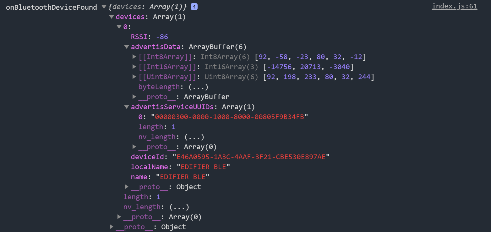
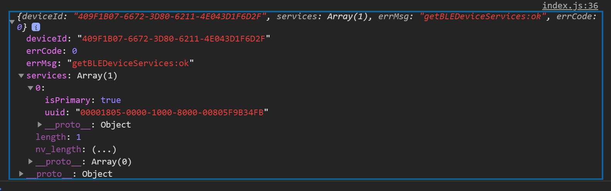
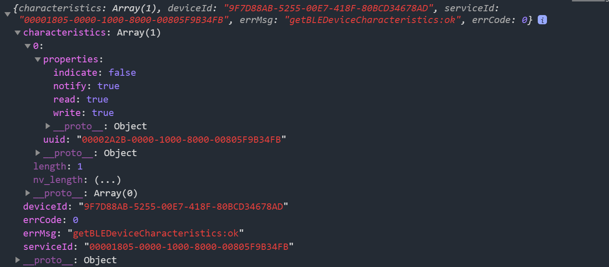
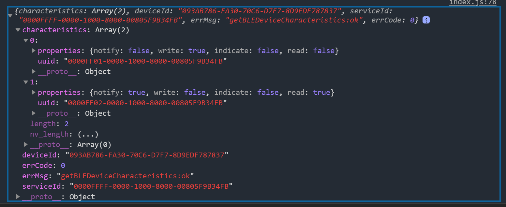

对于选型，很同意如下作者的一段话：

https://zhuanlan.zhihu.com/p/62338731

> 谈人生，谈情怀，我觉得过程很重要。但对于工作，我只以结果为导向。我从来对任何技术没有什么偏见，但我唯一珍惜的是我的时间。如果能用原生开发解决的问题，我绝对不会花成本去学习第三方框架。如果能用Python解决的问题，我100%不会用Java来写。
> 
> 第三方框架的存在是有价值的，它确实解决了不少人的需求，但我不建议大家盲从。如果一个框架你根本不知道你为什么用它，那还是用原生吧，最省心的选择。
> 
> 同学们也不要忽略了这个一点：用第三方框架就完全不需要学习原生小程序吗？这当然是不可能的，正是因为用了第三方框架，你反而要更加精通原生小程序的开发。不然你怎么解决各个第三方框架的”坑“？没有哪个框架能100%保证完美转译成小程序的。至少最近团队在处理LinUI的时候就发现，很多框架都宣传支持小程序的自定义组件，然而我们用第三方测试的结果是，这些框架根本无法编译小程序的WXS。

如果连原生框架都搞不懂，那么使用框架的话，后面会有很多坑需要你去填补。

# 备注

app.json 全局配置文件

- 页面路由配置
- Window样式配置

属性绑定必须双引号里面双括号，这点和React不一样

```html
 wx:if="{{true}}"
```

block 标签

template 定义可复用模板，name指定名字，使用is属性，is可以动态决定使用哪个模板。

import和include引入。

import定义组件，include类似做mixin。

**WXML**：WeiXin Markup Language

**WXSS**：WeiXin Style Sheets

wxml通用属性

| id           | String       | 组件的唯一标识 | 整个页面唯一               |
| ------------ | ------------ | ------- | -------------------- |
| class        | String       | 组件的样式类  | 在对应的 WXSS 中定义的样式类    |
| style        | String       | 组件的内联样式 | 可以动态设置的内联样式          |
| hidden       | Boolean      | 组件是否显示  | 所有组件默认显示             |
| data-*       | Any          | 自定义属性   | 组件上触发的事件时，会发送给事件处理函数 |
| bind*/catch* | EventHandler | 组件的事件   |                      |

app.wxss为项目公共样式，会注入到小程序的每个页面。

页面样式会注入同名同级的wxml文件。

WXSS使用的rpx（responsive pixel）尺寸单位。

iPhone6屏幕宽度为375px，共750个物理像素，那么1rpx = 375 / 750 px = 0.5px。

可以这样引用样式 @import './test_0.wxss'，会在编译过程中打包到目标文件。

可动态更新内联样式

```html
<view style="color: {{eleColor}}; font-size: {{eleFontsize}}"></view>
```

当前支持的选择器，hover不支持么？

| **类型** | **选择器**  | **样例**        | **样例描述**                        |
|:------ |:-------- |:------------- |:------------------------------- |
| 类选择器   | .class   | .intro        | 选择所有拥有 class="intro" 的组件        |
| id选择器  | #id      | #firstname    | 选择拥有 id="firstname" 的组件         |
| 元素选择器  | element  | view checkbox | 选择所有文档的 view 组件和所有的 checkbox 组件 |
| 伪元素选择器 | ::after  | view::after   | 在 view 组件后边插入内容                 |
| 伪元素选择器 | ::before | view::before  | 在 view 组件前边插入内容                 |

小程序模块化，CommonJS语法，module.exports / require。会按照require模块的顺序执行文件。

app.js执行结束，会把app.json定义的pages按顺序执行一遍。

小程序JS作用域，与NodeJS相似，文件中的变量和函数只会在该文件生效，不会互相影响。

app.js可以定义全局变量。

```javascript
App({
  globalData: 1
})
```

小程序特点

- 网页开发渲染线程和脚本线程是互斥的，而在小程序中，二者是分开的，分别运行在不同的线程中

- 小程序没有一个完整浏览器对象，因而缺少相关的DOM API和BOM API，很多库无法运行。

- 小程序只需要考虑Android/iOS两大客户端，而不关注各浏览器兼容性问题。

小程序原理

小程序的渲染层和逻辑层分别由2个线程管理：渲染层的界面使用了WebView 进行渲染；逻辑层采用JsCore线程运行JS脚本。一个小程序存在多个界面，所以渲染层存在多个WebView线程，这两个线程的通信会经由微信客户端（Native）做中转，逻辑层发送网络请求也经由Native转发，小程序的通信模型下图所示。


场景值：场景值用来描述用户进入小程序的路径。即何种方式进入小程序。

逻辑层需要调用setData将数据从逻辑层传递到渲染层。

App实例，单例。有如下4个回调函数。

```js
// app.js
App({
  onLaunch (options) {
    // Do something initial when launch.
  },
  onShow (options) {
    // Do something when show.
  },
  onHide () {
    // Do something when hide.
  },
  onError (msg) {
    console.log(msg)
  },
  globalData: 'I am global data'
})
```

| 参数属性     | 类型       | 描述                                           |
|:-------- |:-------- |:-------------------------------------------- |
| onLaunch | Function | 当小程序初始化完成时，会触发 onLaunch（全局只触发一次）             |
| onShow   | Function | 当小程序启动，或从后台进入前台显示，会触发 onShow                 |
| onHide   | Function | 当小程序从前台进入后台，会触发 onHide                       |
| onError  | Function | 当小程序发生脚本错误，或者 API 调用失败时，会触发 onError 并带上错误信息  |
| 其他字段     | 任意       | 可以添加任意的函数或数据到 Object 参数中，在App实例回调用 this 可以访问 |

**注册页面**

对于小程序中的每个页面，都需要在页面对应的 `js` 文件中进行注册，指定页面的初始数据、生命周期回调、事件处理函数等。

简单的页面可以使用 `Page()` 进行构造。

`Page` 构造器适用于简单的页面。但对于复杂的页面， `Page` 构造器可能并不好用。

此时，可以使用 `Component` 构造器来构造页面。 `Component` 构造器的主要区别是：方法需要放在 `methods: { }` 里面。

onLoad / onReady / onShow / onHide /onUnload 5个回调是Page实例的生命周期函数

onPullDownRefresh / onReachBottom / onShareAppMessage / onPageScroll 4个回调是页面的用户行为

**页面生命周期**


data中的key还可以非常灵活，以数据路径的形式给出，例如 this.setData({"d[0]": 100}); this.setData({"d[1].text": 'Goodbye'}); 我们只要保持一个原则就可以提高小程序的渲染性能：**每次只设置需要改变的最小单位数据**。

这个与React真的不太一样。React采用的是浅比较。

wx.navigateTo和wx.redirectTo只能打开非TabBar页面，wx.switchTab只能打开Tabbar页面。

我们还可以使用 wx. reLaunch({ url: 'pageH' }) 重启小程序，并且打开pageH

currentTarget为当前事件所绑定的组件，而target则是触发该事件的源头组件

事件使用：bind:xxx, capture-bind:xxx

bind不会阻止冒泡，catch可以阻止事件冒泡。若在捕获阶段，则会中断捕获阶段和取消冒泡阶段

兼容性适配：

wx.getSystemInfo 或者 wx.getSystemInfoSync 来获取微信和手机信息

```javascript
if (wx.openBluetoothAdapter) {
  wx.openBluetoothAdapter()
} else {
  // 如果希望用户在最新版本的客户端上体验您的小程序，可以这样子提示
  wx.showModal({
    title: '提示',
    content: '当前微信版本过低，无法使用该功能，请升级到最新微信版本后重试。'
  })
}
```

wx.canIUse这个API，可用于判断接口或者组件在当前宿主环境是否可用

flex介绍，有演示，讲的很清楚

https://developers.weixin.qq.com/ebook?action=get_post_info&docid=00080e799303986b0086e605f5680a

flex-basis和width同时存在，flex-basis优先级高于width，也就是此时flex-basis代替项目的width属性。

当容器设置flex-direction为column或column-reverse时，flex-basis和height同时存在，flex-basis优先级高于height，也就是此时flex-basis代替项目的height属性。

需要注意的是，当flex-basis和width（或height），其中一个属性值为auto时，非auto的优先级更高。

```css
.item{

  flex-basis: auto（默认值） | <number>px

}
```

**flex 属性**

是flex-grow，flex-shrink，flex-basis的简写方式。值设置为none，等价于 0 0 auto。值设置为auto，等价于1 1 auto。

https://developers.weixin.qq.com/ebook?action=get_post_info&docid=000224fc9d0f98cb0086f4eff5180a

按下状态反馈，小程序叫hover，小程序的button和view提供了hover-class属性。

button loading

我们不应该把Toast用于错误提示，因为错误提示需要明确告知用户具体原因，因此不适合用这种一闪而过的Toast弹出式提示。一般需要用户明确知晓操作结果状态的话，会使用模态对话框来提示，同时附带下一步操作的指引。

页面滚动onPullDownRefresh和onReachBottom

wx.request

返回：

data：若content-type为application/json，会解析为JSON对象，其余情况为String

statusCode：HTTP的状态码

header：返回的头信息

我们可以在app.json指定超时时间

https://developers.weixin.qq.com/ebook?action=get_post_info&docid=000ee27c9c8d98ab0086788fa5b00a

**小程序后台请求需要指定域名**，域名不要使用IP地址或者localhost，并且不能带端口号，同时域名需要经过ICP备案。

**微信登陆流程**：需要再重点阅读一下

SessionId

本地缓存提前渲染界面，优化体验。

标题栏加载，toast加载，按钮加载

**组件系统**：重点看下

ShadowDOM

ShadowTree

## 蓝牙操作

openBluetoothAdapter

搜索外围设备，可以做些优化，如allowDuplicatesKey，interval等

[startBluetoothDevicesDiscovery](https://developers.weixin.qq.com/miniprogram/dev/api/device/bluetooth/wx.startBluetoothDevicesDiscovery.html)

onBluetoothDeviceFound

开始搜寻附近的蓝牙外围设备。**此操作比较耗费系统资源，请在搜索并连接到设备后调用 [wx.stopBluetoothDevicesDiscovery](https://developers.weixin.qq.com/miniprogram/dev/api/device/bluetooth/wx.stopBluetoothDevicesDiscovery.html) 方法停止搜索。**

每次只接收一个设备，数据格式如下：



createBLEConnection

连接低功耗蓝牙设备。

若小程序在之前已有搜索过某个蓝牙设备，并成功建立连接，可直接传入之前搜索获取的 deviceId 直接尝试连接该设备，无需进行搜索操作。

getBLEDeviceServices 成功返回的结果



getBLEDeviceCharacteristics



# 实践

页面占满 100%，可使用 `page` 标签

```css
page {
  height : 100%;
}
```

交互方面，建议Toast用于成功提示，Modal用于错误提示，showToast/showModal

路由 

```js
wx.navigateTo({
          url: '/pages/list/index'
        })
```

url这里一定要写绝对路径

this.setData是同步，界面更新是异步

返回时上一个页面不会调用onHide而是直接调用onUnload

小程序不支持blob对象！如何讲String转换成ArrayBuffer？

**蓝牙注意点**

要调用wx.writeBLECharacteristicValue(Object object)写入数据，则必须先调用如下两个方法获取：

```
wx.getBLEDeviceServices
wx.getBLEDeviceCharacteristics
```

可能和缓存有关系！！！！

ESP32 BluFi的各个id值



serviceId: "0000FFFF-0000-1000-8000-00805F9B34FB"

characteristic: 

"0000FF01-0000-1000-8000-00805F9B34FB"

"0000FF02-0000-1000-8000-00805F9B34FB"