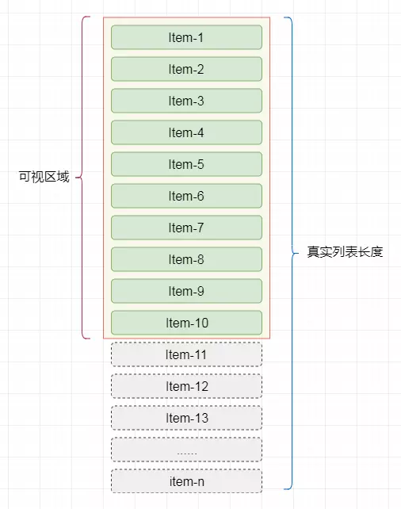
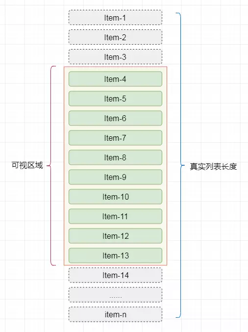
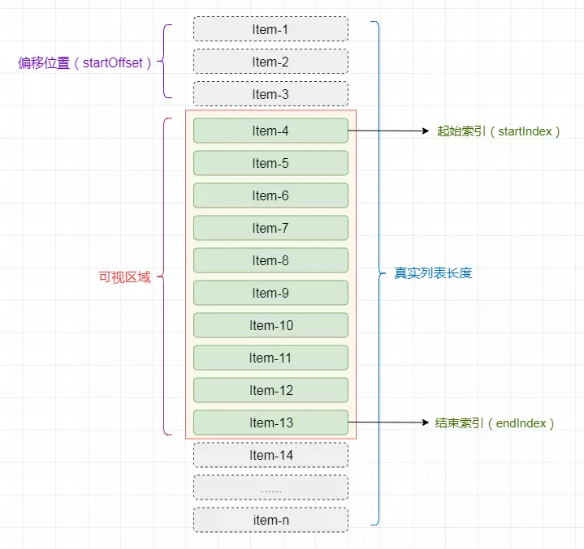
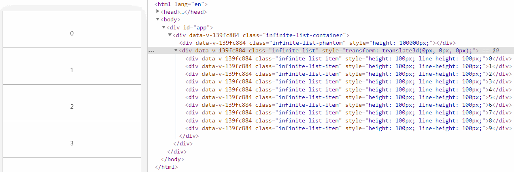
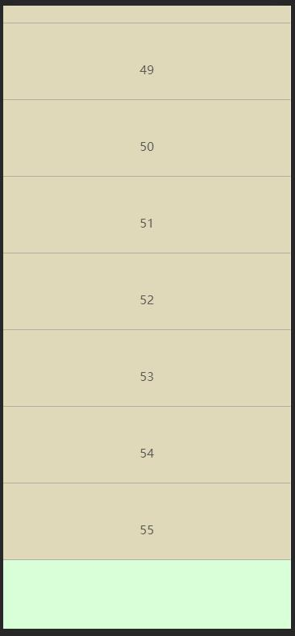

## 高性能渲染十万条数据
### 最粗暴做法
```html
<ul id="container"></ul>
```
```js
// 记录任务开始时间
let now = Date.now();
// 插入十万条数据
const total = 100000;
// 获取容器
let ul = document.getElementById('container');
// 将数据插入容器中
for (let i = 0; i < total; i++) {
    let li = document.createElement('li');
    li.innerText = ~~(Math.random() * total)
    ul.appendChild(li);
}

console.log('JS运行时间：',Date.now() - now);
setTimeout(()=>{
  console.log('总运行时间：',Date.now() - now);
},0)
// print: JS运行时间： 187
// print: 总运行时间： 2844
```
在 JS 的Event Loop中，当JS引擎所管理的执行栈中的事件以及所有微任务事件全部执行完后，才会触发渲染线程对页面进行渲染
第一个console.log的触发时间是在页面进行渲染之前，此时得到的间隔时间为JS运行所需要的时间
第二个console.log是放到 setTimeout 中的，它的触发时间是在渲染完成，在下一次Event Loop中执行的

依照两次console.log的结果，可以得出结论：
对于大量数据渲染的时候，JS运算并不是性能的瓶颈，性能的瓶颈主要在于渲染阶段

### 时间分片
#### 使用setTimeout
```js
//需要插入的容器
let ul = document.getElementById('container');
// 插入十万条数据
let total = 100000;
// 一次插入 20 条
let once = 20;
//总页数
let page = total/once
//每条记录的索引
let index = 0;
//循环加载数据
function loop(curTotal,curIndex){
    if(curTotal <= 0){
        return false;
    }
    //每页多少条
    let pageCount = Math.min(curTotal , once);
    setTimeout(()=>{
        for(let i = 0; i < pageCount; i++){
            let li = document.createElement('li');
            li.innerText = curIndex + i + ' : ' + ~~(Math.random() * total)
            ul.appendChild(li)
        }
        loop(curTotal - pageCount,curIndex + pageCount)
    },0)
}
loop(total,index);
```

我们可以看到，页面加载的时间已经非常快了，每次刷新时可以很快的看到第一屏的所有数据，但是当我们快速滚动页面的时候，会发现页面出现闪屏或白屏的现象
> 在移动端界面快速向上滚动，确实会出现闪屏或者白屏的现象。

闪屏原因：
1. setTimeout执行时间不确定。setTimeout中的事件是放入事件队列的，只有当JS线程的任务栈执行完毕，才会去执行事件队列中的事件，因此setTimeout实际执行时间可能比设定的要大。
2. 刷新频率受屏幕分辨率和屏幕尺寸的影响，因此不同设备的刷新频率可能会不同，而setTimeout只能设置一个固定时间间隔，这个时间不一定和屏幕的刷新时间相同。

> 总结：1. setTimeout回调执行时间问题；2. 屏幕刷新时间和setTimeout不同步问题

以上两种情况都会导致setTimeout的执行步调和屏幕的刷新步调不一致。
在setTimeout中对dom进行操作，必须要等到屏幕下次绘制时才能更新到屏幕上，如果两者步调不一致，就可能导致中间某一帧的操作被跨越过去，而直接更新下一帧的元素，从而导致丢帧现象。

#### 使用requestAnimationFrame
>window.requestAnimationFrame() 告诉浏览器——你希望执行一个动画，并且要求浏览器在下次重绘之前调用指定的回调函数更新动画。该方法需要传入一个回调函数作为参数，该回调函数会在浏览器下一次重绘之前执行

与setTimeout相比，requestAnimationFrame最大的优势是由系统来决定回调函数的执行时机。
如果屏幕刷新率是60Hz,那么回调函数就每16.7ms被执行一次，如果刷新率是75Hz，那么这个时间间隔就变成了1000/75=13.3ms，换句话说就是，requestAnimationFrame的步伐跟着系统的刷新步伐走。它能保证回调函数在屏幕每一次的刷新间隔中只被执行一次，这样就不会引起丢帧现象。

```js
//需要插入的容器
let ul = document.getElementById('container');
// 插入十万条数据
let total = 100000;
// 一次插入 20 条
let once = 20;
//总页数
let page = total/once
//每条记录的索引
let index = 0;
//循环加载数据
function loop(curTotal,curIndex){
    if(curTotal <= 0){
        return false;
    }
    //每页多少条
    let pageCount = Math.min(curTotal , once);
    window.requestAnimationFrame(function(){
        for(let i = 0; i < pageCount; i++){
            let li = document.createElement('li');
            li.innerText = curIndex + i + ' : ' + ~~(Math.random() * total)
            ul.appendChild(li)
        }
        loop(curTotal - pageCount,curIndex + pageCount)
    })
}
loop(total,index);
```
页面加载的速度很快，并且滚动的时候，也很流畅没有出现闪烁丢帧的现象。
#### 使用DocumentFragment
>DocumentFragment，文档片段接口，表示一个没有父级文件的最小文档对象。它被作为一个轻量版的Document使用，
>用于存储已排好版的或尚未打理好格式的XML片段。最大的区别是因为DocumentFragment不是真实DOM树的一部分，它的变化不会触发DOM树的（重新渲染) ，且不会导致性能等问题。
>可以使用document.createDocumentFragment方法或者构造函数来创建一个空的DocumentFragment

从MDN的说明中，我们得知DocumentFragments是DOM节点，但并不是DOM树的一部分，可以认为是存在内存中的，所以将子元素插入到文档片段时不会引起页面回流。
当append元素到document中时，被append进去的元素的样式表的计算是同步发生的，此时调用 getComputedStyle 可以得到样式的计算值。
而append元素到documentFragment 中时，是不会计算元素的样式表，所以documentFragment 性能更优。当然现在浏览器的优化已经做的很好了，
当append元素到document中后，没有访问 getComputedStyle 之类的方法时，现代浏览器也可以把样式表的计算推迟到脚本执行之后。

```js
//需要插入的容器
let ul = document.getElementById('container');
// 插入十万条数据
let total = 100000;
// 一次插入 20 条
let once = 20;
//总页数
let page = total/once
//每条记录的索引
let index = 0;
//循环加载数据
function loop(curTotal,curIndex){
    if(curTotal <= 0){
        return false;
    }
    //每页多少条
    let pageCount = Math.min(curTotal , once);
    window.requestAnimationFrame(function(){
        let fragment = document.createDocumentFragment();
        for(let i = 0; i < pageCount; i++){
            let li = document.createElement('li');
            li.innerText = curIndex + i + ' : ' + ~~(Math.random() * total)
            fragment.appendChild(li)
        }
        ul.appendChild(fragment)
        loop(curTotal - pageCount,curIndex + pageCount)
    })
}
loop(total,index);
```

### 虚拟列表
在粗暴法中我们渲染10万条数据，我们可以通过chrome中的performance查看耗时，
其中的主要时间消耗如下：
- Event(click) : 213.81ms
- Recalculate Style : 635.29ms
- Layout : 3.43s
- Update Layer Tree : 584.87ms
- Paint : 52.25ms

从这里我们可以看出，我们的代码的执行过程中，消耗时间最多的两个阶段是Recalculate Style和Layout。
- Recalculate Style：样式计算，浏览器根据css选择器计算哪些元素应该应用哪些规则，确定每个元素具体的样式。
- Layout：布局，知道元素应用哪些规则之后，浏览器开始计算它要占据的空间大小及其在屏幕的位置。

在实际的工作中，列表项必然不会像例子中仅仅只由一个li标签组成，必然是由复杂DOM节点组成的。
那么可以想象的是，当列表项数过多并且列表项结构复杂的时候，同时渲染时，会在Recalculate Style和Layout阶段消耗大量的时间。
而虚拟列表就是解决这一问题的一种实现。

虚拟列表其实是按需显示的一种实现，即只对可见区域进行渲染，对非可见区域中的数据不渲染或部分渲染的技术，从而达到极高的渲染性能。
假设有1万条记录需要同时渲染，我们屏幕的可见区域的高度为500px,而列表项的高度为50px，则此时我们在屏幕中最多只能看到10个列表项，那么在首次渲染的时候，我们只需加载10条即可。


说完首次加载，再分析一下当滚动发生时，我们可以通过计算当前滚动值得知此时在屏幕可见区域应该显示的列表项。
假设滚动发生，滚动条距顶部的位置为150px,则我们可得知在可见区域内的列表项为第4项至第13项。


#### 实现
虚拟列表的实现，实际上就是在首屏加载的时候，只加载可视区域内需要的列表项，当滚动发生时，动态通过计算获得可视区域内的列表项，并将非可视区域内存在的列表项删除。

- 计算当前可视区域起始数据索引(startIndex)
- 计算当前可视区域结束数据索引(endIndex)
- 计算当前可视区域的数据，并渲染到页面中
- 计算startIndex对应的数据在整个列表中的偏移位置startOffset并设置到列表上


由于只是对可视区域内的列表项进行渲染，所以为了保持列表容器的高度并可正常的触发滚动，将Html结构设计成如下结构：
```html
<div class="infinite-list-container">
    <div class="infinite-list-phantom"></div>
    <div class="infinite-list">
      <!-- item-1 -->
      <!-- item-2 -->
      <!-- ...... -->
      <!-- item-n -->
    </div>
</div>
```

- infinite-list-container 为可视区域的容器
- infinite-list-phantom 为容器内的占位，高度为总列表高度，用于形成滚动条
- infinite-list 为列表项的渲染区域

接着，监听infinite-list-container的scroll事件，获取滚动位置scrollTop

- 假定可视区域高度固定，称之为screenHeight
- 假定列表每项高度固定，称之为itemSize
- 假定列表数据称之为listData
- 假定当前滚动位置称之为scrollTop

则可推算出：

- 列表总高度listHeight = listData.length * itemSize
- 可显示的列表项数visibleCount = Math.ceil(screenHeight / itemSize)
- 数据的起始索引startIndex = Math.floor(scrollTop / itemSize)
- 数据的结束索引endIndex = startIndex + visibleCount
- 列表显示数据为visibleData = listData.slice(startIndex,endIndex)

当滚动后，由于渲染区域相对于可视区域已经发生了偏移，此时我需要获取一个偏移量startOffset，通过样式控制将渲染区域偏移至可视区域中。

- 偏移量startOffset = scrollTop - (scrollTop % itemSize);

>渲染区域要不断的修改（每当渲染的数据变化时），保证在可视区域内

最终的简易代码如下：
```js
<template>
  <div ref="list" class="infinite-list-container" @scroll="scrollEvent($event)">
    <div class="infinite-list-phantom" :style="{ height: listHeight + 'px' }"></div>
    <div class="infinite-list" :style="{ transform: getTransform }">
      <div ref="items"
        class="infinite-list-item"
        v-for="item in visibleData"
        :key="item.id"
        :style="{ height: itemSize + 'px',lineHeight: itemSize + 'px' }"
      >{{ item.value }}</div>
    </div>
  </div>
</template>

export default {
  name:'VirtualList',
  props: {
    //所有列表数据
    listData:{
      type:Array,
      default:()=>[]
    },
    //每项高度
    itemSize: {
      type: Number,
      default:200
    }
  },
  computed:{
    //列表总高度
    listHeight(){
      return this.listData.length * this.itemSize;
    },
    //可显示的列表项数
    visibleCount(){
      return Math.ceil(this.screenHeight / this.itemSize)
    },
    //偏移量对应的style
    getTransform(){
      return `translate3d(0,${this.startOffset}px,0)`;
    },
    //获取真实显示列表数据
    visibleData(){
      return this.listData.slice(this.start, Math.min(this.end,this.listData.length));
    }
  },
  mounted() {
    this.screenHeight = this.$el.clientHeight;
    this.start = 0;
    this.end = this.start + this.visibleCount;
  },
  data() {
    return {
      //可视区域高度
      screenHeight:0,
      //偏移量
      startOffset:0,
      //起始索引
      start:0,
      //结束索引
      end:null,
    };
  },
  methods: {
    scrollEvent() {
      //当前滚动位置
      let scrollTop = this.$refs.list.scrollTop;
      //此时的开始索引
      this.start = Math.floor(scrollTop / this.itemSize);
      //此时的结束索引
      this.end = this.start + this.visibleCount;
      //此时的偏移量
      this.startOffset = scrollTop - (scrollTop % this.itemSize);
    }
  }
};
```

效果如下：


本地测试时会出现如下现象，底下空间已足够显示大半条数据，但是没有数据显示

可以给与一定的缓存

### 列表项动态高度
参考文档[「前端进阶」高性能渲染十万条数据(虚拟列表)](https://juejin.im/post/5db684ddf265da4d495c40e5)

### 参考
[「前端进阶」高性能渲染十万条数据(虚拟列表)](https://juejin.im/post/5db684ddf265da4d495c40e5)
