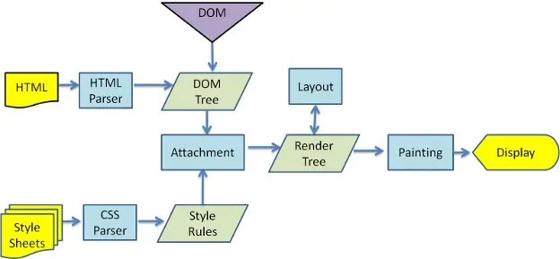

# 浏览器基础
- [「前端进阶」从多线程到Event Loop全面梳理](https://juejin.im/post/5d5b4c2df265da03dd3d73e5)

> 读上面的文章后，让我知道了不少浏览器相关知识点，说实在的自己做了一两年的前端开发了，但却很少关注这些，觉得自己有点业余了。

浏览器是多进程的，主要：
- **Browser进程**，即浏览器主进程，只有一个。负责浏览器界面显示与用户交互，网络资源管理与下载，各页面管理，Render进程的Bitmap显示
- **第三方插件进程**，每种类型对应一个
- **GPU进程**，最多一个，用于3D显示
- **渲染进程**，即Render进程，浏览器内核，主要负责页面渲染、脚本执行、事件处理。

渲染进程是多线程的，主要包含如下线程：
- **GUI渲染线程**，负责页面渲染，与JS线程互斥
- **JS引擎线程**，负责解析执行JS，单线程
- **事件触发线程**，用来管理事件，当事件触发时，将事件放入JS执行栈
- **定时触发线程**，setTimeout和setInterval所在的线程，计时完毕通知事件触发线程
- **异步Http请求线程**，处理网络请求，若有回调通知事件触发线程

JS引擎是单线程的，因为：
1. 历史原因，在JavaScript创建之时，多线程不流行，硬件支持不好
2. 多线程复杂度高，需要加锁，否则会导致DOM渲染不可预期

GUI线程与JS线程互斥因为JS是可以操作DOM的，如一边操作一边渲染，会导致渲染出现不可预期的结果

关于EventLoop，理解一些概念：
- JS 分为同步任务和异步任务，同步任务都在JS线程上执行，形成一个执行栈，JS线程只执行执行栈中的任务。
- 事件触发线程管理一个事件队列，异步任务触发条件达成，会将回调事件放到事件队列中
- 执行栈中的代码执行完毕，就会读取事件队列中的事件，添加到执行栈中，开始执行

**宏任务**：可以认为每次执行栈中执行的代码是一个宏任务（包括每次从事件队列中获取一个事件回调并放到执行栈中），宏任务和渲染是交叉进行，渲染线程会将宏任务对DOM的修改做优化。
注意setTimeout的回调属于下一次宏任务。  包括script代码、setTimeout、setInterval、I/O、UI交互事件、postMessage、MessageChannel等

**微任务**：宏任务之后，渲染之前，会将期间产生的所有微任务都执行。Promise中的then触发时（即Resolve时），将会插入微任务队列。如Promise.then、MutationObserver、process.nextTick（Node.js环境）

所以执行流程是：宏任务 -> 微任务 -> 渲染 -> 宏任务 -> 微任务 -> 渲染 -> ...

# 浏览器渲染原理
- [浏览器渲染原理及流程](https://www.cnblogs.com/slly/p/6640761.html)
- [细说浏览器输入URL后发生了什么](https://juejin.im/post/5e32449d6fb9a02fe4581907)

#### 浏览器引擎
- Geoko: Firefox
- webkit: Safari, Chrome

#### 概念
- DOM Tree：浏览器将HTML解析成树形的数据结构。
- CSS Rule Tree：浏览器将CSS解析成树形的数据结构。
- Render Tree: DOM和CSSOM合并后生成Render Tree。
- Layout: 有了Render Tree，浏览器已经能知道网页中有哪些节点、各个节点的CSS定义以及他们的从属关系，从而去计算出每个节点在屏幕中的位置。
- Painting: 按照算出来的规则，通过显卡，把内容画到屏幕上。
- Reflow（回流）：当浏览器发现某个部分发生了点变化影响了布局，需要倒回去重新渲染，这个回退的过程叫 reflow。
- Repaint（重绘）：改变某个元素的背景色、文字颜色、边框颜色等等不影响它周围或内部布局的属性时，屏幕的一部分要重画，但是元素的几何尺寸没有变。

> 1. display:none 的节点不会被加入Render Tree，而visibility: hidden 则会，所以，如果某个节点最开始是不显示的，设为display:none是更优的。
> 2. display:none 会触发 reflow，而 visibility:hidden 只会触发 repaint，因为没有发现位置变化。
> 3. 有些情况下，比如修改了元素的样式，浏览器并不会立刻reflow 或 repaint 一次，而是会把这样的操作积攒一批，然后做一次 reflow，这又叫异步 reflow 或增量异步 reflow。但是在有些情况下，比如resize 窗口，改变了页面默认的字体等。对于这些操作，浏览器会马上进行 reflow。

#### 浏览器输入URL后发生的事情
1. DNS解析
> 1. 根 DNS 服务器 ：返回顶级域 DNS 服务器的 IP 地址
> 2. 顶级域 DNS 服务器：返回权威 DNS 服务器的 IP 地址
> 3. 权威 DNS 服务器 ：返回相应主机的 IP 地址

查找顺序：浏览器缓存 -> 本地hosts文件 -> 本地DNS解析器缓存 -> 本地DNS服务器 -> (转发到外部DNS服务器)

2. 建立TCP连接
TODO 详细

3. 发送HTTP请求，服务器处理请求，返回响应结果
TODO

4. 关闭TCP连接

5. 浏览器渲染
> 这块步骤研究下

#### 疑问
1. 什么时候会触发Reflow?(TODO)

# 高性能渲染大量列表数据

- [「前端进阶」高性能渲染十万条数据(时间分片)](https://juejin.im/post/5d76f469f265da039a28aff7)
- [「前端进阶」高性能渲染十万条数据(虚拟列表)](https://juejin.im/post/5db684ddf265da4d495c40e5)

从上面文章可以得出：  
渲染大数据列表，最粗暴的做法就是一次性全部渲染，最后发现JS运行耗时很短，但是渲染阶段是瓶颈（渲染时长计算可创建一个setTimeout的异步回调）。
通过Chrome的Performance工具，可以看出耗时主要集中在 `Recaculate Style` 和 `Layout`阶段，故在列表项布局比较复杂时，这两项的耗时将增加。

故为了解决这个问题，有两种常用方法：时间分片和虚拟列表。

+ 时间分片法：定时加载一部分数据，直至全部加载完成。
> `setTimeout` 方式可以实现，但是有闪屏问题，`setTimeout` 执行时间与渲染刷新时间不一致。
> `requestAnimationFrame` 替代`setTimeout`，解决不掉不一致问题，该函数在页面需要重绘时调用。
> 进一步优化，使用`DocumentFragment`？？？
+ 虚拟列表法：
> 虚拟列表其实是按需显示的一种实现，即只对可见区域进行渲染，对非可见区域中的数据不渲染或部分渲染的技术，从而达到极高的渲染性能。
> 一般包含三部分，可视区域、列表总长度占位区域（形成滚动条）、渲染区域（显示的列表项）。
> 其中渲染区域会根据可视区域的滚动条的scrollTop属性，不断修正自己的需要显示的列表数据项以及top属性（或其他位移属性），
> 保证自己在可视区域内以及数据的更新。

**虚拟列表法**有两种情况：列表项高度固定、列表项高度动态高度。固定高度比较好处理，动态高度的则需要先给出预估高度，然后不断的修正数据。
上面文章中给出了解决方案。另外对于包含异步图片的列表项，则需要使用 `ResizeObserver` 来监听，但兼容的浏览器很少。

# 大文件上传
- [字节跳动面试官：请你实现一个大文件上传和断点续传](https://juejin.im/post/5dff8a26e51d4558105420ed)

总结以下要点：
* 分块上传：前端使用blob的slice方法，将大文件分割成一个个的小文件，然后并发上传，每个blob需要有一个块的标识hash（比如文件名 + index）。
后端在接收到第一个块时建立以文件名命名的文件夹，然后将每个block以hash为文件名存储。
* 合并分片：待所有分片上传完毕后，前端发送一个合并请求，然后找到对应文件夹，合并文件。
* 文件进度条的显示：监听每个blob切片的上传进度，然后合并计算整个文件的上传进度。   
* hash的生成：最好是文件内容hash，不随文件名变化。可以使用spark-md5这个库去计算。比较耗时，所以使用web-worker。以hash+下标作为切片名，hash作为切片文件夹名，hash+扩展名作为文件名
* 文件秒传，先发送一个请求（文件hash）验证文件是否存在，若存在直接提示上传成功。
* 断点续传：需要记住已上传的切片。前端/后端均可实现，前端实现会存在数据丢失。
  - 前端方式：剔除已经上传成功的request对象，只上传未成功的。
  - 后端方式：已上传成功，不用上传；部分上传成功，将已上传的切片信息返回。

# 视频流
- [为什么视频网站的视频链接地址是blob？](https://juejin.im/post/5d1ea7a8e51d454fd8057bea)

核心是运用 `URL.createObjectURL` 生成blob协议的链接。要使用BlobURL，则需要先获取原始的blob对象，但是视频很大这种方法肯定不行，
所以出现了流媒体，常用有以下两种形式：HLS和MPEG DASH。

#### HLS（HTTP Live Streaming）
Apple 公司实现的基于 HTTP 的媒体流传输协议。HLS以ts为传输格式，m3u8为索引文件（文件中包含了所要用到的ts文件名称，时长等信息，可以用播放器播放）。
优酷使用的是这种格式。

#### DASH（Dynamic Adaptive Streaming over HTTP）
DASH会通过media presentation description (MPD)将视频内容切片成一个很短的文件片段，每个切片都有多个不同的码率，DASH Client可以根据网络的情况选择一个码率进行播放，支持在不同码率之间无缝切换。
索引文件通常是mpd，文件扩展名通常是 `.m4s`。Youtube，B站使用这种方案。

#### MediaSource
如何无缝切换视频地址，可以Blob URL指向一个视频二进制数据，然后不断将下一段视频的二进制数据添加拼接进去。
要实现这个功能我们要通过MediaSource来实现，MediaSource接口功能也很纯粹，作为一个媒体数据容器可以和HTMLMediaElement进行绑定。
基本流程就是通过URL.createObjectURL创建容器的BLob URL，设置到video标签的src上，
在播放过程中，我们仍然可以通过MediaSource.appendBuffer方法往容器里添加数据，达到更新视频内容的目的。

#### HTTP缓存
- [HTTP缓存机制](https://juejin.im/post/5a1d4e546fb9a0450f21af23)

##### 强制缓存
缓存数据存在，则使用缓存数据，没有则请求。对于的字段有Expires和Cache-Control。

+ Expires: 值为服务器返回的数据到期时间。小于该时间则直接使用缓存。但会存在客户端和服务端时间差问题。Http 1.0的产物，一般用Cache-Control代替。
+ Cache-Control：
  - private：客户端可以缓存
  - public：客户端和代理服务器都可以缓存
  - max-age=t：缓存内容将在t秒后失效
  - no-cache：需要使用协商缓存来验证缓存数据 
  - no-store：所有内容都不会缓存

##### 协商缓存
先用一个标识请求服务器查看是否失效，没有失效，服务器会返回304，客户端使用缓存中的数据。否则，服务器会直接返回更新后的数据。

+ Last-Modified/If-Modified-Since: 服务器会返回客户端文件的最后修改时间。客户端再此请求时会带上 If-Modified-Since，没有变更返回304，有变更则返回新的数据。
> 会存在修改时间虽然改了，但是内容没变的情况。
+ Etag：根据资源生成的唯一标识（内容的md5？），每次请求都会带上该标识，查看服务器端是否有变化。Etag是服务器端计算出来的，会服务器端计算的资源，一般很少用。

上述优先级：cache-control > expires > etag > last-modified

# HTTP常见消息头
##### referer
表示从哪个页面链接过来的（也可以这么理解，在哪个页面发送的请求），作用：1. 防盗链，2. 防止恶意请求。

