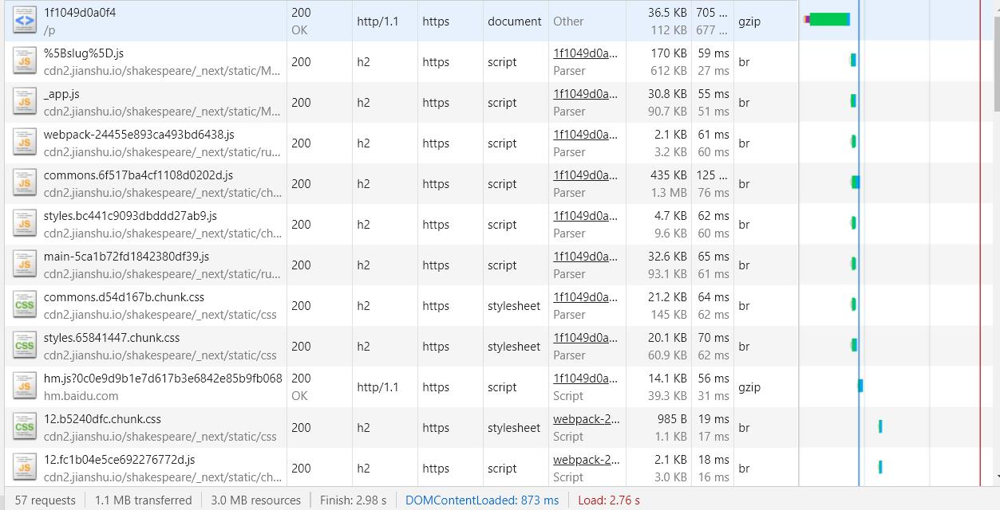

# 浏览器基础

- [「前端进阶」从多线程到Event Loop全面梳理](https://juejin.im/post/5d5b4c2df265da03dd3d73e5)

JS引擎是单线程的，因为：
1. 历史原因，在JavaScript创建之时，多线程不流行，硬件支持不好
2. 多线程复杂度高，需要加锁，否则会导致DOM渲染不可预期

GUI线程与JS线程互斥因为JS是可以操作DOM的，如一边操作一边渲染，会导致渲染出现不可预期的结果

关于EventLoop，理解一些概念：
- JS 分为同步任务和异步任务，同步任务都在JS线程上执行，形成一个执行栈，JS线程只执行执行栈中的任务。
- 事件触发线程管理一个事件队列，异步任务触发条件达成，会将回调事件放到事件队列中
- 执行栈中的代码执行完毕，就会读取事件队列中的事件，添加到执行栈中，开始执行

**宏任务**：可以认为每次执行栈中执行的代码是一个宏任务（包括每次从事件队列中获取一个事件回调并放到执行栈中），宏任务和渲染是交叉进行，渲染线程会将宏任务对DOM的修改做优化。
注意setTimeout的回调属于下一次宏任务。  包括script代码、setTimeout、setInterval、I/O、UI交互事件、postMessage、MessageChannel等

**微任务**：宏任务之后，渲染之前，会将期间产生的所有微任务都执行。Promise中的then触发时（即Resolve时），将会插入微任务队列。如Promise.then、MutationObserver、process.nextTick（Node.js环境）

所以执行流程是：宏任务 -> 微任务 -> 渲染 -> 宏任务 -> 微任务 -> 渲染 -> ...


#### 浏览器输入URL后发生的事情
1. DNS解析

查找顺序：浏览器缓存 -> 本地hosts文件 -> 本地DNS解析器缓存 -> 本地DNS服务器 -> (转发到外部DNS服务器)
> 1. 根 DNS 服务器 ：返回顶级域 DNS 服务器的 IP 地址
> 2. 顶级域 DNS 服务器：返回权威 DNS 服务器的 IP 地址
> 3. 权威 DNS 服务器 ：返回相应主机的 IP 地址 

> 

2. 建立TCP连接
TODO 详细

3. 发送HTTP请求，服务器处理请求，返回响应结果
TODO

4. 关闭TCP连接

5. 浏览器渲染
> 这块步骤研究下

#### DOMContentLoaded && Load
- [DOMContentLoaded与load的区别](https://www.cnblogs.com/caizhenbo/p/6679478.html)




就是DOM内容加载完毕的时候，具体表现就是：空白 -> 页面展示出内容（DOMContentLoaded） -> 页面图片、视频等资源加载完成(load)。
当文档html下下来之后便从上到下解析，流程如上图所示，dom和css形成render tree，然后进入layout计算阶段，然后进行绘制paint。
但在解析html过程中（可通过performance工具查看），发现会被中断，会去加载js，如果是内联就执行，如果是链接，则先等待下载完成然后执行。
注意：如果js标签前面有样式文件，则会先等待样式文件加载并解析完才执行脚本。

结论：DOMContentLoaded需要等界面所有js，css文件解析完成以及html解析完成才会触发。而load事件会等到图片、视频等资源加载完毕执行。
故要后于DOMContentLoaded事件。
DOMContentLoaded相当于jQuery中的$.ready事件

> 这一块跟渲染的关系还是不是很清楚。

#### defer和async
- [浅谈script标签中的async和defer](https://www.cnblogs.com/jiasm/p/7683930.html)

普通script标签，开始发请求时，就会阻塞DOM解析，直到下载执行完成。多个标签的话同时发起请求，但是会按照顺序执行。

defer标签，不影响页面的渲染，发请求不阻塞DOM的解析，会按照顺序执行。执行时间会计入DOMContentLoaded时间。
async标签，条件允许的情况下执行，会也可能不会计入DOMContentLoaded时间。

#### 预加载preload和prefetch
- [预加载preload和prefetch](https://www.cnblogs.com/xiaohuochai/p/9183874.html)

prefetch：将会在未来某个导航或者功能要用到的资源，将会被浏览器在空闲时间加载。
preload：让浏览器提前加载指定资源(加载后并不执行)，需要执行时再执行，不阻塞渲染。preload将会把资源得下载顺序权重提高，使得关键数据提前下载好，优化页面打开速度。


#### 疑问
1. 什么时候会触发Reflow?(TODO)

#### 常见问题
1. 为什么javascript是单线程的？
> js可以操作DOM，如果是多线程会带来操作UI的冲突，如果再引入锁会带来更大的复杂性。

2. 为什么JS阻塞页面的加载？
> js引擎线程和GUI渲染线程是互斥的（不互斥UI会出现不可预期的结果），如果js执行耗时过程会阻塞页面渲染。

3. CSS加载会造成阻塞吗？
> css的加载不会影响DOM的解析，但是Render Tree依赖DOM Tree和Style Rules，所以CSS会阻塞DOM的渲染。???不懂

4. DOMContentLoaded与load的区别？
> DOMContentLoaded会在界面解析完成之后（包含html，css，js脚本）触发。load是页面所有元素，包括图片、视频等解析完成之后触发。

5. script标签的async和defer的区别
> async和defer都不会阻塞DOM的渲染；defer会计入DOMContentLoaded时间，async一般不会；defer脚本要按顺序执行，而async没有这个限制。

7. dns-prefetch

8. 为什么要把css放在头部，js放在body底部？
> 因为first paint（减少白屏时间）的存在，不会等到界面解析完后再渲染，若js都放在前面，则会影响到first paint。注意此优化不会影响DOMContentLoaded
的触发时间。
> 我看我之前的vue工程，默认就是这样的

# 高性能渲染大量列表数据

- [「前端进阶」高性能渲染十万条数据(时间分片)](https://juejin.im/post/5d76f469f265da039a28aff7)
- [「前端进阶」高性能渲染十万条数据(虚拟列表)](https://juejin.im/post/5db684ddf265da4d495c40e5)

从上面文章可以得出：  
渲染大数据列表，最粗暴的做法就是一次性全部渲染，最后发现JS运行耗时很短，但是渲染阶段是瓶颈（渲染时长计算可创建一个setTimeout的异步回调）。
通过Chrome的Performance工具，可以看出耗时主要集中在 `Recaculate Style` 和 `Layout`阶段，故在列表项布局比较复杂时，这两项的耗时将增加。

故为了解决这个问题，有两种常用方法：时间分片和虚拟列表。

+ 时间分片法：定时加载一部分数据，直至全部加载完成。
> `setTimeout` 方式可以实现，但是有闪屏问题，`setTimeout` 执行时间与渲染刷新时间不一致。
> `requestAnimationFrame` 替代`setTimeout`，解决不掉不一致问题，该函数在页面需要重绘时调用。
> 进一步优化，使用`DocumentFragment`？？？
+ 虚拟列表法：
> 虚拟列表其实是按需显示的一种实现，即只对可见区域进行渲染，对非可见区域中的数据不渲染或部分渲染的技术，从而达到极高的渲染性能。
> 一般包含三部分，可视区域、列表总长度占位区域（形成滚动条）、渲染区域（显示的列表项）。
> 其中渲染区域会根据可视区域的滚动条的scrollTop属性，不断修正自己的需要显示的列表数据项以及top属性（或其他位移属性），
> 保证自己在可视区域内以及数据的更新。

**虚拟列表法**有两种情况：列表项高度固定、列表项高度动态高度。固定高度比较好处理，动态高度的则需要先给出预估高度，然后不断的修正数据。
上面文章中给出了解决方案。另外对于包含异步图片的列表项，则需要使用 `ResizeObserver` 来监听，但兼容的浏览器很少。

# 大文件上传
- [字节跳动面试官：请你实现一个大文件上传和断点续传](https://juejin.im/post/5dff8a26e51d4558105420ed)

总结以下要点：
* 分块上传：前端使用blob的slice方法，将大文件分割成一个个的小文件，然后并发上传，每个blob需要有一个块的标识hash（比如文件名 + index）。
后端在接收到第一个块时建立以文件名命名的文件夹，然后将每个block以hash为文件名存储。
* 合并分片：待所有分片上传完毕后，前端发送一个合并请求，然后找到对应文件夹，合并文件。
* 文件进度条的显示：监听每个blob切片的上传进度，然后合并计算整个文件的上传进度。   
* hash的生成：最好是文件内容hash，不随文件名变化。可以使用spark-md5这个库去计算。比较耗时，所以使用web-worker。以hash+下标作为切片名，hash作为切片文件夹名，hash+扩展名作为文件名
* 文件秒传，先发送一个请求（文件hash）验证文件是否存在，若存在直接提示上传成功。
* 断点续传：需要记住已上传的切片。前端/后端均可实现，前端实现会存在数据丢失。
  - 前端方式：剔除已经上传成功的request对象，只上传未成功的。
  - 后端方式：已上传成功，不用上传；部分上传成功，将已上传的切片信息返回。

# 视频流
- [为什么视频网站的视频链接地址是blob？](https://juejin.im/post/5d1ea7a8e51d454fd8057bea)

核心是运用 `URL.createObjectURL` 生成blob协议的链接。要使用BlobURL，则需要先获取原始的blob对象，但是视频很大这种方法肯定不行，
所以出现了流媒体，常用有以下两种形式：HLS和MPEG DASH。

#### HLS（HTTP Live Streaming）
Apple 公司实现的基于 HTTP 的媒体流传输协议。HLS以ts为传输格式，m3u8为索引文件（文件中包含了所要用到的ts文件名称，时长等信息，可以用播放器播放）。
优酷使用的是这种格式。

#### DASH（Dynamic Adaptive Streaming over HTTP）
DASH会通过media presentation description (MPD)将视频内容切片成一个很短的文件片段，每个切片都有多个不同的码率，DASH Client可以根据网络的情况选择一个码率进行播放，支持在不同码率之间无缝切换。
索引文件通常是mpd，文件扩展名通常是 `.m4s`。Youtube，B站使用这种方案。

#### MediaSource
如何无缝切换视频地址，可以Blob URL指向一个视频二进制数据，然后不断将下一段视频的二进制数据添加拼接进去。
要实现这个功能我们要通过MediaSource来实现，MediaSource接口功能也很纯粹，作为一个媒体数据容器可以和HTMLMediaElement进行绑定。
基本流程就是通过URL.createObjectURL创建容器的BLob URL，设置到video标签的src上，
在播放过程中，我们仍然可以通过MediaSource.appendBuffer方法往容器里添加数据，达到更新视频内容的目的。


## 简书log耗时分析

```
Environment  production 
Platform  shakespeare 
Version  1.1.0 
Build Date  2020-02-18T08:04:28.161Z 

0: {key: "Redirect", desc: "网页重定向的耗时", value: 0}
1: {key: "AppCache", desc: "检查本地缓存的耗时", value: 3.2999999821186066}
2: {key: "DNS", desc: "DNS查询的耗时", value: 3.370000049471855}
3: {key: "TCP", desc: "TCP连接的耗时", value: 102.26999991573393}
4: {key: "Waiting(TTFB)", desc: "从客户端发起请求到接收到响应的时间 / Time To First Byte", value: 682.6750000473112}
5: {key: "Content Download", desc: "下载服务端返回数据的时间", value: 55.82499993033707}
6: {key: "HTTP Total Time", desc: "http请求总耗时", value: 738.4999999776483}
7: {key: "DOMContentLoaded", desc: "dom加载完成的时间", value: 893.7049999367446}
8: {key: "Loaded", desc: "页面load的总耗时", value: 3285.6650000903755}
```

