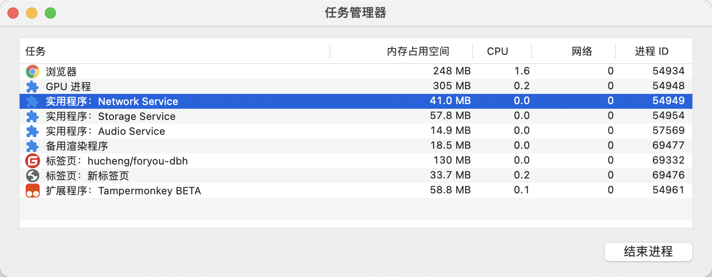
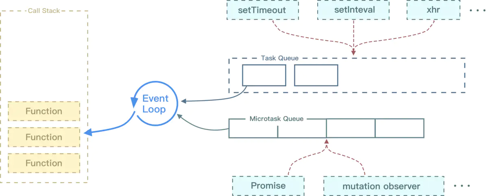
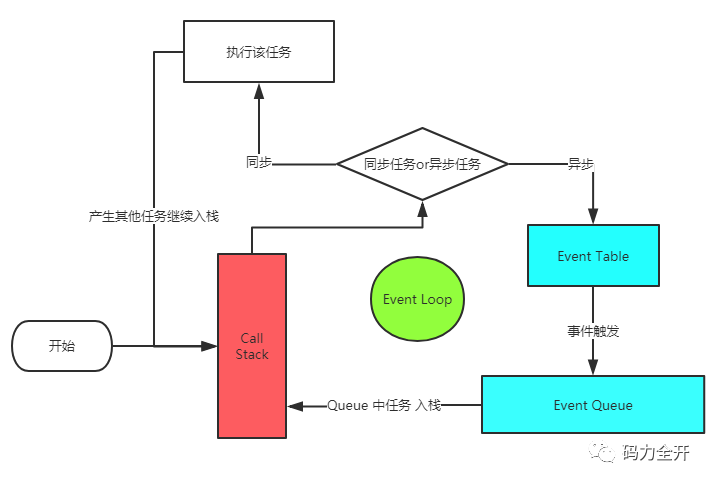

# 浏览器进程



新开一个页面至少会启动如下进程：

- 浏览器进程（即主进程）
- 网络进程（NetworkService）
- GPU进程
- 渲染进程（隔离，但同一站点公用）

浏览器进程功能：

- 浏览器主进程：主要负责界面显示、用户交互、子进程管理，同时提供存储等功能。 
- 插件进程： 主要是负责插件的运行，因插件易崩溃，所以需要通过插件进程来隔离，以保证插件进程崩溃不会对浏览器和页面造成影响。 每个插件一个，使用才创建。
- GPU进程：其实，Chrome 刚开始发布的时候是没有 GPU 进程的。而 GPU 的使用初衷是为了实现 3D CSS 的效果，只是随后网页、Chrome 的 UI 界面**都选择**采用 GPU 来绘制，这使得 GPU 成为浏览器普遍的需求。最后，Chrome 在其多进程架构上也引入了 GPU 进程。
- 渲染进程：核心任务是将 HTML、CSS 和 JavaScript 转换为用户可以与之交互的网页，排版引擎 Blink 和 JavaScript 引擎 V8 都是运行在该进程中，默认情况下，Chrome 会为每个 Tab 标签创建一个渲染进程。出于安全考虑，渲染进程都是运行在沙箱模式下。
- 网络进程：主要负责页面的网络资源加载，之前是作为一个模块运行在浏览器进程里面的，直至最近才独立出来，成为一个单独的进程。 
- 存储进程？？

**渲染进程**，即Renderer Process，包含如下线程：

- GUI渲染线程
  
  - 负责渲染浏览器界面，解析 HTML、CSS构建 DOM 树和 RenderObject 树，布局和绘制等。
  - 当界面需要重绘（Repaint）或由于某种操作引发回流(reflow)时，该线程就会执行。 
  - GUI 渲染线程与 JS 引擎线程是互斥的，当 JS 引擎执行时 GUI 线程会被挂起（相当于被冻结了），GUI 更新会被保存在一个队列中等到 JS 引擎空闲时立即被执行 

- JS引擎线程
  
  - Javascript 引擎，也称为 JS 内核，负责处理 Javascript 脚本程序。（例如 V8 引擎） 
  - JS 引擎一直等待着任务队列中任务的到来，然后加以处理，一个 Tab 页（renderer 进程）中无论什么时候都只有一个 JS 线程在运行 JS 程序。 
  - GUI 渲染线程与 JS 引擎线程是互斥的，所以如果 JS 执行的时间过长，这样就会造成页面的渲染不连贯，导致页面渲染加载阻塞。 

- 事件触发线程
  
  - 当 JS 引擎执行代码块如 setTimeout 时（也可来自浏览器内核的其他线程，如鼠标点击、AJAX 异步请求等），会将对应任务**添加到事件线程中** 
  - 当对应的事件符合触发条件被触发时，该线程会把事件添加到待处理队列的队尾，等待 JS 引擎的处理 
  - 由于 JS 的单线程关系，所以这些待处理队列中的事件都得排队等待 JS 引擎处理（当 JS 引擎空闲时才会去执行） 

- 定时器触发线程
  
  - 传说中的 setInterval 与 setTimeout 所在线程 
  - 浏览器定时计数器并不是由 JavaScript 引擎计数的,（因为 JavaScript 引擎是单线程的, 如果处于阻塞线程状态就会影响记计时的准确） 
  - 因此通过单独线程来计时并触发定时（计时完毕后，添加到事件队列中，等待 JS 引擎空闲后执行）
  - W3C 在 HTML 标准中规定,规定要求 setTimeout 中低于 4ms 的时间间隔算为 4ms  

- 异步HTTP请求线程
  
  - 在 XMLHttpRequest 在连接后是通过浏览器新开一个线程请求。 
  - 将检测到状态变更时，如果设置有回调函数，异步线程就**产生状态变更**事件，将这个回调再放入事件队列中，再由 JavaScript 引擎执行。 

# 页面渲染

## 概念

Chrome Network面板，蓝线表示DOMContentLoaded，红线表示Loaded。

**DOMContentLoaded**: 当一个 **HTML 文档被加载和解析完成后**，DOMContentLoaded 事件便会被触发。JavaScript 可以**阻塞** DOM 的生成，也就是说当浏览器在解析 HTML 文档时，如果遇到 script，便会停下对 HTML 文档的解析，转而去处理脚本。如果脚本是内联的，浏览器会先去执行这段内联的脚本，如果是外链的，那么先会去加载脚本，然后执行。在处理完脚本之后，浏览器便继续解析 HTML 文档。DOMContentLoaded 的触发不需要等待图片等其他资源加载完成。

**Loaded**: 页面的所有元素加载完成后触发

**回流（Reflow）**：当我们对 DOM 的修改引发了 DOM 几何尺寸的变化（比如修改元素的宽、高或隐藏元素等）时，浏览器需要重新计算元素的几何属性（其他元素的几何属性和位置也会因此受到影响），然后再将计算的结果绘制出来。这个过程就是回流（也叫重排）。 Reflow 会从 **html** 这个 root frame 开始递归往下，依次计算所有的结点几何尺寸和位置。 常见导致回流的因素：

- 常见的几何属性有 width、height、padding、margin、left、top、border 等等。
- 获取一些需要通过即时计算得到的属性：offsetTop、offsetLeft、 offsetWidth、offsetHeight、scrollTop、scrollLeft、scrollWidth、scrollHeight、clientTop、clientLeft、clientWidth、clientHeight 时，浏览器为了获取这些值，也会进行回流。
- 当我们调用了 getComputedStyle 方法，或者 IE 里的 currentStyle 时，也会触发回流。原理是一样的，都为求一个“即时性”和“准确性”。

**重绘**：当我们对 DOM 的修改导致了样式的变化、却并未影响其几何属性（比如修改了颜色或背景色）时，浏览器不需重新计算元素的几何属性、直接为该元素绘制新的样式。这个过程叫做重绘。 由此我们可以看出，重绘不一定导致回流，回流一定会导致重绘。

如何避免回流：

CSS

- 避免使用`table`布局。
- 尽可能在`DOM`树的最末端改变`class`。
- 避免设置多层内联样式。
- 将动画效果应用到`position`属性为`absolute`或`fixed`的元素上。
- 避免使用`CSS`表达式（例如：`calc()`）。

JavaScript

- 避免频繁操作样式，最好一次性重写`style`属性，或者将样式列表定义为`class`并一次性更改`class`属性。
- 避免频繁操作`DOM`，创建一个`documentFragment`，在它上面应用所有`DOM操作`，最后再把它添加到文档中。
- 也可以先为元素设置`display: none`，操作结束后再把它显示出来。因为在`display`属性为`none`的元素上进行的`DOM`操作不会引发回流和重绘。
- 避免频繁读取会引发回流/重绘的属性，如果确实需要多次使用，就用一个变量缓存起来。
- 对具有复杂动画的元素使用绝对定位，使它脱离文档流，否则会引起父元素及后续元素频繁回流。

## 脚本加载

DOMContentLoaded/Prefer/Async：https://zhuanlan.zhihu.com/p/25876048 

### defer/async异步脚本


**同步脚本**

当 HTML 文档被解析时如果遇见（同步）脚本，则停止解析，先去加载脚本，然后执行，执行结束后继续解析 HTML 文档。

```html
 <script src="***.js" charset="utf-8"></script>
```


**defer 脚本**

当 HTML 文档被解析时如果遇见 defer 脚本，则在后台加载脚本（异步），文档解析过程不中断，而等文档解析结束之后，defer 脚本执行，**DOMContentLoaded会等到defer脚本执行完毕后**触发

```html
<script src="***.js" charset="utf-8" defer></script>
```


**async脚本**

当 HTML 文档被解析时如果遇见 async 脚本，则在后台加载脚本，文档解析过程不中断。脚本加载完成后，文档停止解析，脚本执行，执行结束后文档继续解析。async脚本不阻塞DOMContentLoaded的执行，但是此时DOM没有完成解析则会阻塞DOM的执行。

```html
<script src="***.js" charset="utf-8" async></script>
```


defer和async都是异步的，区别主要是：

- 执行时机不同，defer是文档解析完毕之后执行，而async是加载完成之后就立即执行
- 执行顺序不同，defer按加载顺序执行，而async没有顺序可言，谁先加载完就执行谁

# 事件模型

## 宏任务/微任务

**宏任务**：可以认为每次执行栈（call stack）中执行的代码是一个宏任务，包括每次从事件队列中获取一个事件回调并放到执行栈中

**微任务**：宏任务之后，渲染之前，会将期间产生的所有微任务都执行。Promise中的then触发时（即Resolve时），将会插入微任务队列。如Promise.then、MutationObserver、process.nextTick（Node.js环境）

所以执行流程是：宏任务 -> 微任务 -> 渲染 -> 宏任务 -> 微任务 -> 渲染 -> ...



Event Loop中，每一次循环称为tick，每一次tick的任务如下：

- 执行栈选择最先进入队列的宏任务（一般都是script），执行其同步代码直至结束；
- 检查是否存在微任务，有则会执行至微任务队列为空；
- 如果宿主为浏览器，可能会渲染页面；
- 开始下一轮tick，执行宏任务中的异步代码（setTimeout等回调）。

> ES6 规范中，microtask 称为 `jobs`，macrotask 称为 `task`
> 宏任务是由宿主发起的，而微任务由JavaScript自身发起。

## EventLoop



步骤：

1. JS 分为同步任务和异步任务，同步任务都在JS线程上执行，形成一个执行栈，JS线程只执行执行栈中的任务。
2. **事件触发线程管理一个事件队列**，异步任务触发条件达成，会将回调事件放到事件队列中
3. 执行栈中的代码执行完毕，就会读取事件队列中的事件，添加到执行栈中，开始执行
4. Event Table 可以理解成一张事件和回调函数对应表，Event Queue 简单理解就是回调函数队列，所以它也叫Callback Queue 

# 浏览器缓存

## 缓存位置

**memory cache** 存储在内存中的缓存，不受max-age、no-cache的影响，即使不设置缓存，如果内存比较充裕，一些资源也是会被缓存。但是缓存只是暂时的，一旦关闭浏览器，缓存就释放掉，如果这个也不想要，可以设置no-store

**disk cache** 存储在硬盘中的缓存，长时效。

## 强缓存

强缓存是利用http头中的Expires和Cache-Control来控制。 强缓存中，当请求再次发出时，浏览器会根据其中的 expires 和 cache-control 判断目标资源是否"命中"强缓存，若命中则直接从缓存中获取资源，**不会再与服务端发生通信**。 

+ Expires: 值为服务器返回的数据到期时间。小于该时间则直接使用缓存。但会存在客户端和服务端时间差问题。这个Http 1.0的产物，一般用Cache-Control代替。
+ Cache-Control：
  - private：客户端可以缓存
  - public：客户端和代理服务器都可以缓存
  - max-age=t：缓存内容将在t秒后失效
  - no-cache：需要使用协商缓存来验证缓存数据 （注意这里不是代表不缓存）
  - no-store：所有内容都不会缓存

## 协商缓存

协商缓存依赖于服务端与浏览器之间的通信。协商缓存机制下，浏览器需要向服务器去询问缓存的相关信息，进而判断是重新发起请求、下载完整的响应，还是从本地获取缓存的资源。如果服务端提示缓存资源未改动（Not Modified），资源会被重定向到浏览器缓存，这种情况下网络请求对应的状态码是 304。

+ Last-Modified/If-Modified-Since: 服务器会返回客户端文件的最后修改时间。客户端再此请求时会带上 If-Modified-Since，没有变更返回304，有变更则返回新的数据。（会存在修改时间虽然改了，但是内容没变的情况。）
+ Etag：是由服务器为每个资源生成的唯一的标识字符串，这个标识字符串可以是基于文件内容编码的，只要文件内容不同，它们对应的 Etag 就是不同的，反之亦然。因此 Etag 能够精准地感知文件的变化。 Etag 的生成过程需要服务器额外付出开销，会影响服务端的性能，这是它的弊端。 

## 缓存优先级

上述优先级：cache-control > expires > Etag > last-modified
