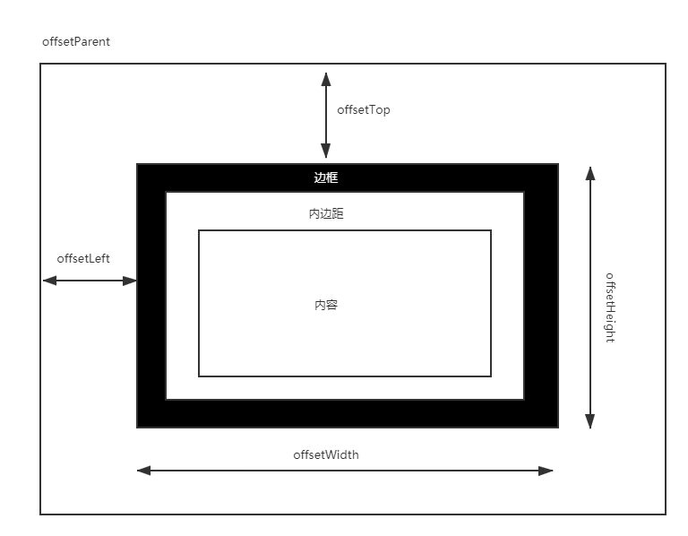
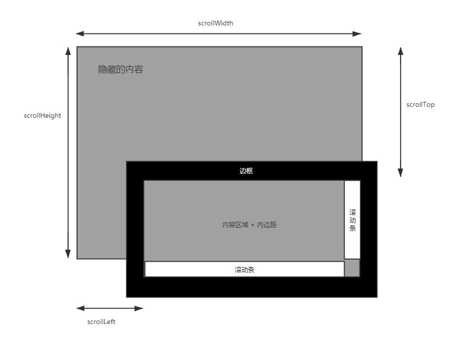

## DOM节点类型

节点至少拥有nodeType、nodeName和nodeValue这三个基本属性。节点类型不同，这三个属性的值也不相同 。其中nodeType可取如下值：

```js
元素节点            　　Node.ELEMENT_NODE(1)
属性节点            　　Node.ATTRIBUTE_NODE(2)
文本节点            　　Node.TEXT_NODE(3)
文档节点            　 Node.DOCUMENT_NODE(9)

注释节点            　 Node.COMMENT_NODE(8)
文档类型节点        　　Node.DOCUMENT_TYPE_NODE(10) //  <!DOCTYPE html>
文档片段节点        　　Node.DOCUMENT_FRAGMENT_NODE(11) // DocumentFragment

CDATA节点             Node.CDATA_SECTION_NODE(4)
实体引用名称节点    　　 Node.ENTRY_REFERENCE_NODE(5)
实体名称节点        　　Node.ENTITY_NODE(6)
处理指令节点        　　Node.PROCESSING_INSTRUCTION_NODE(7)
DTD声明节点            Node.NOTATION_NODE(12)
```

其中Node为js内建接口，枚举节点类型。

### 元素节点

以body为例：

```js
nodeType = 1  // Node.ELEMENT_NODE
nodeName = 'BODY'
nodeValye = null
```

### 属性节点

```js
nodeType = 2 // Node.ATTRIBUTE_NODE
nodeName = [属性名]
nodeValye = [属性值]
```

### 文本节点

```js
nodeType = 3 // Node.ATTRIBUTE_NODE
nodeName = '#text' // 注释节点此位置为 "#comment"
nodeValye = [文本值]
```

> node.firstChild 会返回第一个节点类型，而node.firstElementChild则只会选择元素节点返回

### 文档节点

```js
nodeType = 9 // Node.DOCUMENT_NODE
nodeName = '#document' // 注释节点此位置为 "#comment"
nodeValye = null
```


## Document.readyState

当这个属性的值变化时，document对象上的readystatechange事件被触发

#### loading / 加载

document仍在加载。

#### interactive / 互动

文档已经完成加载，文档已被解析，但是诸如图像，样式表和框架之类的字资源仍在加载。

#### complete / 完成

文档和所有子资源已完成加载。状态表示load事件即将被触发。


示例：

```html
<div class="controls">
  <button id="reload" type="button">Reload</button>
</div>

<div class="event-log">
  <label>Event log:</label>
  <textarea readonly class="event-log-contents" rows="8" cols="30"></textarea>
</div>
```

```js
const log = document.querySelector('.event-log-contents');
const reload = document.querySelector('#reload');

reload.addEventListener('click', () => {
  log.textContent ='';
  window.setTimeout(() => {
      window.location.reload(true);
  }, 200);
});

window.addEventListener('load', (event) => {
    log.textContent = log.textContent + 'load\n';
});

document.addEventListener('readystatechange', (event) => {
    log.textContent = log.textContent + `readystate: ${document.readyState}\n`;
});

document.addEventListener('DOMContentLoaded', (event) => {
    log.textContent = log.textContent + `DOMContentLoaded\n`;
});
```

```
readystate: interactive
DOMContentLoaded
readystate: complete
load
```


## DOM高度宽度等属性

1. 偏移量-offset开头的



2. 客户区-client开头的


3. 滚动大小-scroll开头



4. window-inner、outer开头

   window.innerWidth, window.innerHeight 可视区域的宽高

   window.outerWidth, window.outerHeight 整个窗口的宽高，包括导航工具栏以及F12调试面板都在内部	

## DOM事件

addEventListener和on系列函数可同时共存，on只能绑定一个，而addEventListener可以绑定多个。on只在冒泡阶段响应