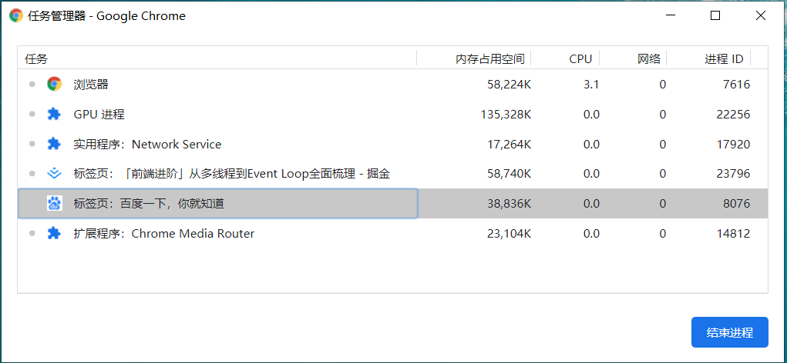
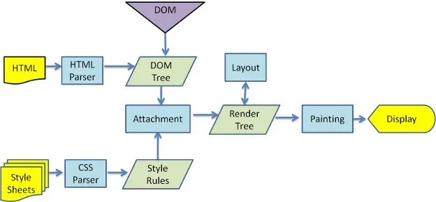
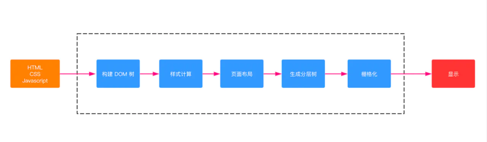
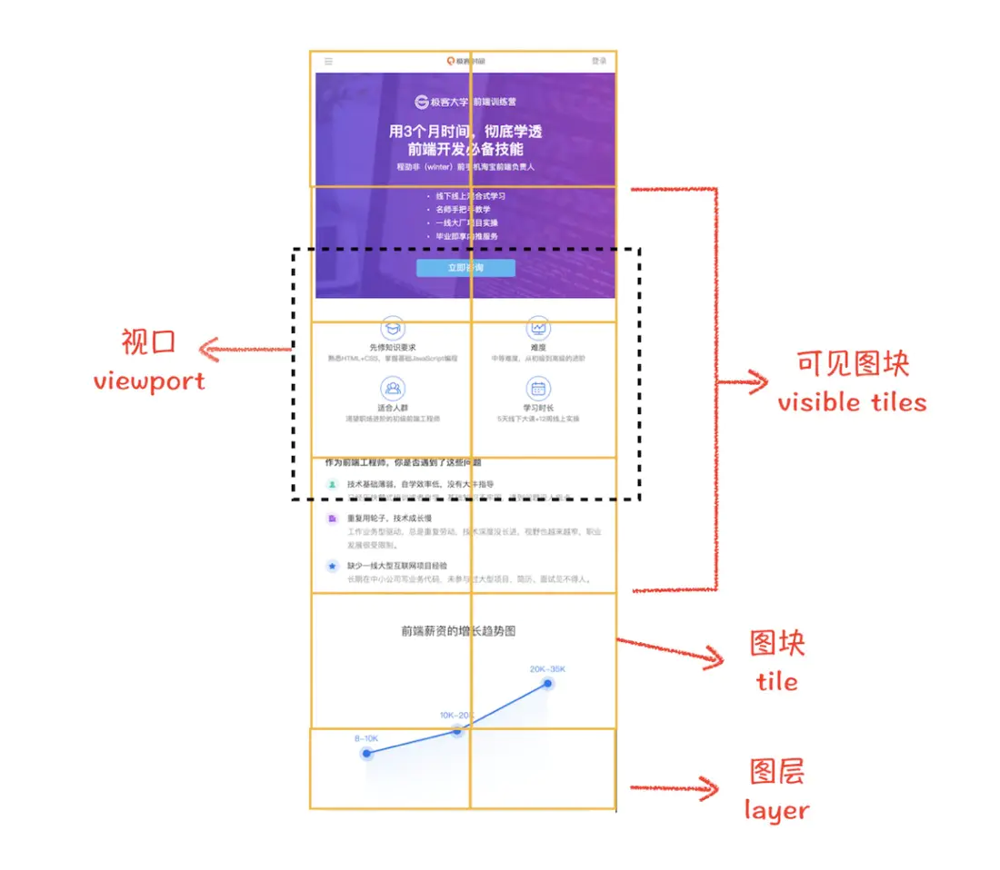
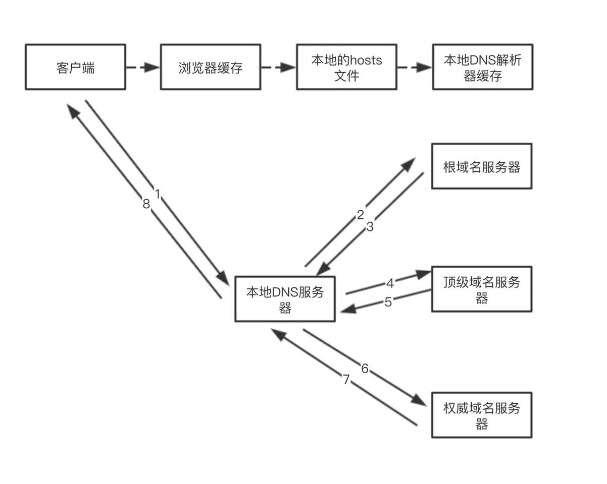
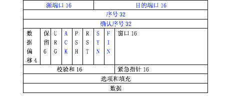

## 浏览器进程

浏览器从关闭状态进行启动，然后新开 1 个页面至少需要 1 个网络进程、1 个浏览器进程、1 个 GPU 进程以及 1 个渲染进程，共 4 个进程；后续再新开标签页，浏览器、网络进程、GPU进程是**共享的**，不会重新启动，如果2个页面属于**同一站点的话**，并且从a页面中打开的b页面，那么他们也会**共用一个渲染进程**，否则新开一个渲染进程。

最新的 Chrome 浏览器包括：1 个浏览器（Browser）主进程、1 个 GPU 进程、1 个网络（NetWork）进程、多个渲染进程和多个插件进程。

- 浏览器主进程：主要负责界面显示、用户交互、子进程管理，同时提供存储等功能。 

- 插件进程： 主要是负责插件的运行，因插件易崩溃，所以需要通过插件进程来隔离，以保证插件进程崩溃不会对浏览器和页面造成影响。 每个插件一个，使用才创建。

- GPU进程：其实，Chrome 刚开始发布的时候是没有 GPU 进程的。而 GPU 的使用初衷是为了实现 3D CSS 的效果，只是随后网页、Chrome 的 UI 界面**都选择**采用 GPU 来绘制，这使得 GPU 成为浏览器普遍的需求。最后，Chrome 在其多进程架构上也引入了 GPU 进程。
- 渲染进程：核心任务是将 HTML、CSS 和 JavaScript 转换为用户可以与之交互的网页，排版引擎 Blink 和 JavaScript 引擎 V8 都是运行在该进程中，默认情况下，Chrome 会为每个 Tab 标签创建一个渲染进程。出于安全考虑，渲染进程都是运行在沙箱模式下。
- 网络进程：主要负责页面的网络资源加载，之前是作为一个模块运行在浏览器进程里面的，直至最近才独立出来，成为一个单独的进程。 

## 渲染进程

渲染进程，即Renderer Process，包含如下线程：

- GUI渲染线程
  -  负责渲染浏览器界面，解析 HTML、CSS构建 DOM 树和 RenderObject 树，布局和绘制等。
  -  当界面需要重绘（Repaint）或由于某种操作引发回流(reflow)时，该线程就会执行。 
  -  GUI 渲染线程与 JS 引擎线程是互斥的，当 JS 引擎执行时 GUI 线程会被挂起（相当于被冻结了），GUI 更新会被保存在一个队列中等到 JS 引擎空闲时立即被执行 

- JS引擎线程
  -  Javascript 引擎，也称为 JS 内核，负责处理 Javascript 脚本程序。（例如 V8 引擎） 
  -  JS 引擎一直等待着任务队列中任务的到来，然后加以处理，一个 Tab 页（renderer 进程）中无论什么时候都只有一个 JS 线程在运行 JS 程序。 
  -  GUI 渲染线程与 JS 引擎线程是互斥的，所以如果 JS 执行的时间过长，这样就会造成页面的渲染不连贯，导致页面渲染加载阻塞。 

- 事件触发线程
  -  当 JS 引擎执行代码块如 setTimeout 时（也可来自浏览器内核的其他线程，如鼠标点击、AJAX 异步请求等），会将对应任务**添加到事件线程中** 
  -  当对应的事件符合触发条件被触发时，该线程会把事件添加到待处理队列的队尾，等待 JS 引擎的处理 
  -  由于 JS 的单线程关系，所以这些待处理队列中的事件都得排队等待 JS 引擎处理（当 JS 引擎空闲时才会去执行） 

- 定时器触发线程
  -  传说中的 setInterval 与 setTimeout 所在线程 
  -  浏览器定时计数器并不是由 JavaScript 引擎计数的,（因为 JavaScript 引擎是单线程的, 如果处于阻塞线程状态就会影响记计时的准确） 
  -  因此通过单独线程来计时并触发定时（计时完毕后，添加到事件队列中，等待 JS 引擎空闲后执行）
  -  W3C 在 HTML 标准中规定,规定要求 setTimeout 中低于 4ms 的时间间隔算为 4ms  

- 异步HTTP请求线程
  -  在 XMLHttpRequest 在连接后是通过浏览器新开一个线程请求。 
  -  将检测到状态变更时，如果设置有回调函数，异步线程就**产生状态变更**事件，将这个回调再放入事件队列中，再由 JavaScript 引擎执行。 

## EventLoop

## 浏览器渲染原理

### 渲染流程

按照渲染按照渲染的时间顺序，流水线可分为如下几个子阶段：`构建 DOM 树`、`样式计算`、`布局阶段`、`分层`、`栅格化`和`显示`。 

1. 渲染进程将 HTML 内容转换为能够读懂DOM 树结构。

2. 渲染引擎将 CSS 样式表转化为浏览器可以理解的styleSheets，计算出 DOM 节点的样式。

3. 创建布局树，并计算元素的布局信息。

4. 对布局树进行分层，并生成分层树。

5. 为每个图层生成绘制列表，并将其提交到合成线程。合成线程将图层分图块，并栅格化将图块转换成位图。

6. 合成线程发送绘制图块命令给浏览器进程。浏览器进程根据指令生成页面，并显示到显示器上。

### 重要概念

#### 回流(Reflow)

当我们对 DOM 的修改引发了 DOM 几何尺寸的变化（比如修改元素的宽、高或隐藏元素等）时，浏览器需要重新计算元素的几何属性（其他元素的几何属性和位置也会因此受到影响），然后再将计算的结果绘制出来。这个过程就是回流（也叫重排）。 Reflow 会从 html 这个 root frame 开始递归往下，依次计算所有的结点几何尺寸和位置。 

##### 常见导致回流的元素

- 常见的几何属性有 width、height、padding、margin、left、top、border 等等。

- 最容易被忽略的操作：获取一些需要通过即时计算得到的属性,当你要用到像这样的属性：offsetTop、offsetLeft、 offsetWidth、offsetHeight、scrollTop、scrollLeft、scrollWidth、scrollHeight、clientTop、clientLeft、clientWidth、clientHeight 时，浏览器为了获取这些值，也会进行回流。

- 当我们调用了 getComputedStyle 方法，或者 IE 里的 currentStyle 时，也会触发回流。原理是一样的，都为求一个“即时性”和“准确性”。

> 1. display:none 的节点不会被加入Render Tree，而visibility: hidden 则会，所以，如果某个节点最开始是不显示的，设为display:none是更优的。
> 2. display:none 会触发 reflow，而 visibility:hidden 只会触发 repaint，因为没有发现位置变化。
> 3. 有些情况下，比如修改了元素的样式，浏览器并不会立刻reflow 或 repaint 一次，而是会把这样的操作积攒一批，然后做一次 reflow，这又叫异步 reflow 或增量异步 reflow。但是在有些情况下，比如resize 窗口，改变了页面默认的字体等。对于这些操作，浏览器会马上进行 reflow。

#### 重绘

当我们对 DOM 的修改导致了样式的变化、却并未影响其几何属性（比如修改了颜色或背景色）时，浏览器不需重新计算元素的几何属性、直接为该元素绘制新的样式。这个过程叫做重绘。 由此我们可以看出，重绘不一定导致回流，回流一定会导致重绘。

#### Layer图层

**拥有层叠上下文属性的元素会被提升为单独的一层。**

拥有层叠上下文属性：

- 根元素 (HTML),
- z-index 值不为 "auto"的 绝对/相对定位元素，
- position,固定（fixed） / 沾滞（sticky）定位（沾滞定位适配所有移动设备上的浏览器，但老的桌面浏览器不支持）
- z-index值不为 "auto"的 flex 子项 (flex item)，即：父元素 display: flex|inline-flex，
- z-index值不为"auto"的grid子项，即：父元素display：grid
- opacity 属性值小于 1 的元素（参考 the specification for opacity），
- transform 属性值不为 "none"的元素，
- mix-blend-mode 属性值不为 "normal"的元素，
- filter值不为"none"的元素，
- perspective值不为"none"的元素，
- clip-path值不为"none"的元素
- mask / mask-image / mask-border不为"none"的元素
- isolation 属性被设置为 "isolate"的元素
- 在 will-change 中指定了任意CSS属性（参考 [这篇文章](https://dev.opera.com/articles/css-will-change-property/)）
- -webkit-overflow-scrolling 属性被设置 "touch"的元素
- contain属性值为"layout"，"paint"，或者综合值比如"strict"，"content"

**需要剪裁（clip）的地方也会被创建为图层**

这里的剪裁指的是，假如我们把 div 的大小限定为 200 * 200 像素，而 div 里面的文字内容比较多，文字所显示的区域肯定会超出 200 * 200 的面积，这时候就产生了剪裁，渲染引擎会把裁剪文字内容的一部分用于显示在 div 区域。出现这种裁剪情况的时候，渲染引擎会为文字部分单独创建一个层，如果出现滚动条，滚动条也会被提升为单独的层。

#### 栅格化

合成线程会按照视口附近的图块来优先生成位图，实际生成位图的操作是由栅格化来执行的。所谓栅格化，是指将图块转换为位图。如图： 

通常一个页面可能很大，但是用户只能看到其中的一部分，我们把用户可以看到的这个部分叫做视口（viewport）。在有些情况下，有的图层可以很大，比如有的页面你使用滚动条要滚动好久才能滚动到底部，但是通过视口，用户只能看到页面的很小一部分，所以在这种情况下，要绘制出所有图层内容的话，就会产生太大的开销，而且也没有必要。

## 浏览器缓存

### 强缓存

强缓存是利用http头中的Expires和Cache-Control来控制。 强缓存中，当请求再次发出时，浏览器会根据其中的 expires 和 cache-control 判断目标资源是否"命中"强缓存，若命中则直接从缓存中获取资源，**不会再与服务端发生通信**。 

+ Expires: 值为服务器返回的数据到期时间。小于该时间则直接使用缓存。但会存在客户端和服务端时间差问题。这个Http 1.0的产物，一般用Cache-Control代替。
+ Cache-Control：
  - private：客户端可以缓存
  - public：客户端和代理服务器都可以缓存
  - max-age=t：缓存内容将在t秒后失效
  - no-cache：需要使用协商缓存来验证缓存数据 
  - no-store：所有内容都不会缓存

### 协商缓存

协商缓存依赖于服务端与浏览器之间的通信。协商缓存机制下，浏览器需要向服务器去询问缓存的相关信息，进而判断是重新发起请求、下载完整的响应，还是从本地获取缓存的资源。如果服务端提示缓存资源未改动（Not Modified），资源会被重定向到浏览器缓存，这种情况下网络请求对应的状态码是 304。

+ Last-Modified/If-Modified-Since: 服务器会返回客户端文件的最后修改时间。客户端再此请求时会带上 If-Modified-Since，没有变更返回304，有变更则返回新的数据。（会存在修改时间虽然改了，但是内容没变的情况。）
+ Etag：  是由服务器为每个资源生成的唯一的标识字符串，这个标识字符串可以是基于文件内容编码的，只要文件内容不同，它们对应的 Etag 就是不同的，反之亦然。因此 Etag 能够精准地感知文件的变化。 Etag 的生成过程需要服务器额外付出开销，会影响服务端的性能，这是它的弊端。 

### 缓存优先级

上述优先级：cache-control > expires > Etag > last-modified

## 浏览器输入URL后发生了什么

### 1. DNS域名解析

### 2. 建立TCP连接

首先判断是不是HTTPS， HTTPS其实是HTTP + SSL / TLS 两部分组成，也就是在HTTP上又加了一层处理加密信息的模块 。随后进入**TCP三次握手**阶段：

### 3. 发送HTTP请求，服务器处理请求，返回响应结果

 TCP连接建立后，浏览器就可以利用HTTP／HTTPS协议向服务器发送请求了。 注意这里有个缓存的过程，如强缓存和协商缓存。

### 4. 关闭TCP连接

TCP四次挥手过程：

- 第一次挥手：客户端发出释放FIN=1，自己序列号seq=u，进入FIN-WAIT-1状态
- 第二次挥手：服务器收到客户端的后，发出ACK=1确认标志和客户端的确认号ack=u+1，自己的序列号seq=v，进入CLOSE-WAIT状态
- 第三次挥手：客户端收到服务器确认结果后，进入FIN-WAIT-2状态。此时服务器发送释放FIN=1信号，确认标志ACK=1，确认序号ack=u+1，自己序号seq=w，服务器进入LAST-ACK（最后确认态）
- 第四次挥手：客户端收到回复后，发送确认ACK=1，ack=w+1，自己的seq=u+1，客户端进入TIME-WAIT（时间等待）。客户端经过2个最长报文段寿命后，客户端CLOSE；服务器收到确认后，立刻进入CLOSE状态。

> 1. 为什么是四次挥手？当收到对方的 FIN 报文时，仅仅表示对方不再发送数据了但是还能接收数据，己方是否现在关闭发送数据通道，需要上层应用来决定，因此，己方 ACK 和 FIN 一般都会分开发送。 
>
> 2. 为什么要进行TIME-WAIT，等待2MSL（一个消息来回）的时间？ 客户端需要保证最后一次发送的ACK报文到服务器，如果服务器未收到，可以请求客户端重发，这样客户端还有时间再发，重启2MSL计时。 

### 5. 浏览器渲染

- 构建DOM树
- 计算DOM节点的样式
- 页面布局
- 生成分层树
- 栅格化
- 给浏览器进程显示

## FAQ

### 为什么很多站点第二次打开速度会很快？

因为有如下缓存的存在：DNS缓存、内存中的缓存、浏览器缓存、Service Worker Cache

## 参考

- [「前端进阶」从多线程到Event Loop全面梳理](https://juejin.im/post/5d5b4c2df265da03dd3d73e5)

- [浏览器相关原理(面试题)详细总结一](https://juejin.im/post/5da18b1af265da5bb318ed07)

- [HTTP缓存机制](https://juejin.im/post/5a1d4e546fb9a0450f21af23)

- [细说浏览器输入URL后发生了什么](https://juejin.im/post/5e32449d6fb9a02fe4581907)