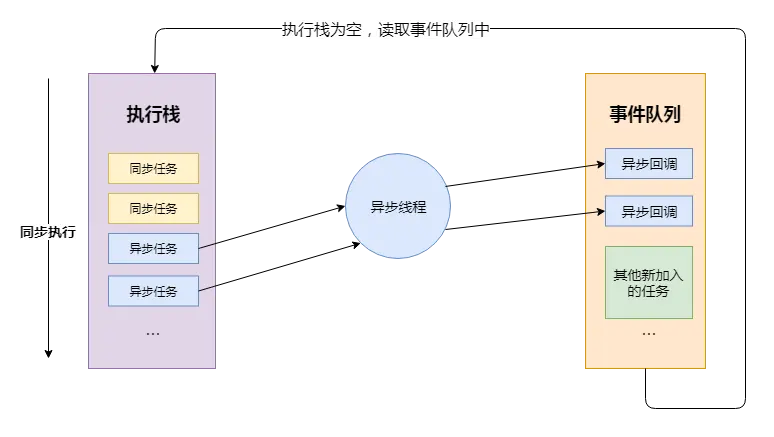
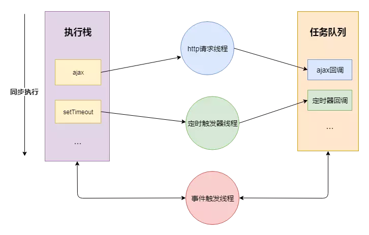
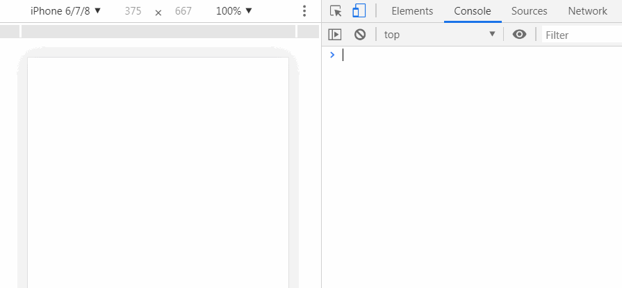
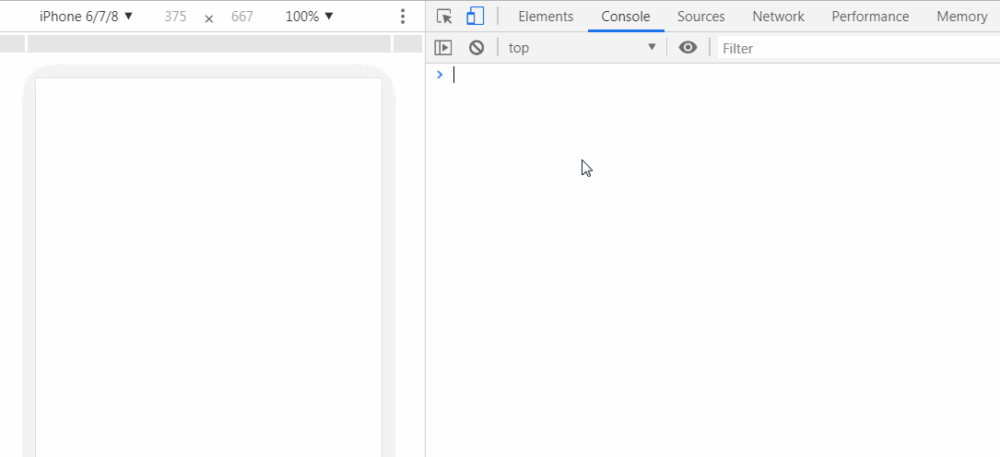
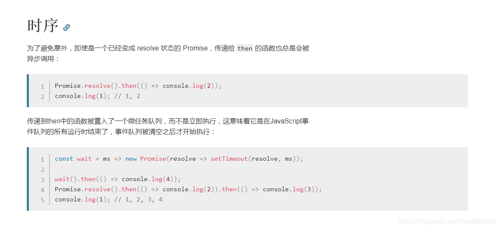
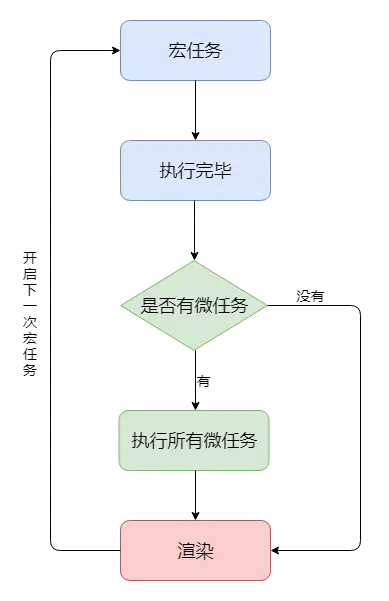

## CPU、进程、线程
- 进程是cpu资源分配的最小单位（是能拥有资源和独立运行的最小单位）
- 线程是cpu调度的最小单位（线程是建立在进程的基础上的一次程序运行单位，一个进程中可以有多个线程）
- 不同进程之间也可以通信，不过代价较大
- 单线程与多线程，都是指在一个进程内的单和多

## 浏览器进程
浏览器是多进程的，我们可以打开任务管理器看到很多chrome.exe进程。一般来说每一个tab页就是一个独立的进程。浏览器包含了如下进程：
- 主进程
 - 协调控制其他子进程
 - 浏览器页面显示、用户交互
 - 将渲染进程得到的内存中的Bitmap，绘制到用户界面上
 - 处理不可见请求，网络请求、文件访问等
- 第三方插件进程
 - 每种类型插件对应一个进程，仅当使用时才创建
- GPU进程
 - 用户3D绘制
- 渲染进程（浏览器内核）
 - 负责页面渲染、脚本执行、事件处理等
 - 每个tab对应一个渲染进程

其中渲染进程对于前端开发来说时最重要的

## 渲染进程（浏览器内核）
渲染进程是多线程的，主要包含如下线程：
+ GUI渲染线程
 - 负责渲染页面、布局和绘制
 - 页面需要重绘和回流时，该线程需要执行（回流？）
 - 与JS引擎线程互斥，防止渲染结果不可预期
+ JS引擎线程
 - 负责处理解析和执行js脚本
 - 只有一个js引擎线程
 - 与GUI线程互斥，方式渲染结果不可预期
+ 事件触发线程
 - 用来控制事件循环（鼠标点击，setTimeout，ajax等）
 - 当事件满足出发条件，将事件放入js引擎所在的执行队列中
+ 定时触发线程
 - setInterval与setTimeout所在线程
 - 定时任务并不是由JS引擎计时的，而是由定时触发线程来计时的
 - 计时完毕后通知事件出发线程
+ 异步Http请求线程
 - 一个单独的线程用来处理ajax请求
 - 当请求完成时，若有回调函数，通知事件出发线程

#### 问答1：为啥js是单线程的？
1. 历史原因，在js创建之时，多线程不流行，硬件支持不好
2. 多线程复杂度高，需要加锁，否则会导致DOM渲染不可预期

#### 问答2：为啥GUI线程与JS线程互斥？
因为js是可以操作DOM的，如一边操作一边渲染，会导致渲染出现不可预期的结果

## EventLoop
先理解一些概念：
- JS 分为同步任务和异步任务
- 同步任务都在JS引擎线程上执行，形成一个执行栈
- 事件触发线程管理一个任务队列，异步任务触发条件达成，将回调事件放到任务队列中
- 执行栈中所有同步任务执行完毕，此时JS引擎线程空闲，系统会读取任务队列，将可运行的异步任务回调事件添加到执行栈中，开始执行


关于同步和异步，要记住不管是setTimeout/setInterval，还是XHR/fetch，这些代码执行时，其本身是同步任务，其中的回调才是异步的。

**setTimeout/setInterval**：js线程通知定时触发线程多长时间后触发一个回调，时间到之后，回调事件会放如事件触发线程所管理的事件队列中。
**XHR/fetch**：js线程通知异步http线程发送一个网络请求，请求完成后触发一个回调，当请求完成后，会将回调事件放入事件触发线程所管理的事件队列中。

当我们的同步任务执行完，JS引擎线程才会询问事件触发线程，在事件队列中是否有待执行的回调函数，如果有就会加入到执行栈中交给JS引擎线程执行


代码解释
```js
let timerCallback = function() {
  console.log('wait one second');
};
let httpCallback = function() {
  console.log('get server data success');
}

// 同步任务
console.log('hello');
// 同步任务
// 通知定时器线程 1s 后将 timerCallback 交由事件触发线程处理
// 1s 后事件触发线程将 timerCallback 加入到事件队列中
setTimeout(timerCallback,1000);
// 同步任务
// 通知异步http请求线程发送网络请求，请求成功后将 httpCallback 交由事件触发线程处理
// 请求成功后事件触发线程将 httpCallback 加入到事件队列中
$.get('www.xxxx.com',httpCallback);
// 同步任务
console.log('world');
//...
// 所有同步任务执行完后
// 询问事件触发线程在事件事件队列中是否有需要执行的回调函数
// 如果没有，一直询问，直到有为止
// 如果有，将回调事件加入执行栈中，开始执行回调代码
```
### 总结
- JS引擎线程只执行执行栈中的事件
- 执行栈中的代码执行完毕，就会读取事件队列中的事件
- 事件队列中的回调事件，是由各自线程插入到事件队列中的
- 如此循环

## 宏任务、微任务
- 宏任务包括：script(整体代码), setTimeout, setInterval, setImmediate, I/O, UI rendering。
- 微任务包括： Promises, Object.observe, MutationObserver
### 宏任务
执行栈中的任务（包括从事件队列中获取的事件回调放到执行栈的任务），每一个宏任务会从头到尾执行，不会执行其他。
由于JS引擎线程和GUI渲染线程是互斥关系，所以会出现宏任务和渲染交替进行。即宏任务->渲染->宏任务->渲染 ...
#### 宏任务示例1：
```js
document.body.style = 'background:black';
document.body.style = 'background:red';
document.body.style = 'background:blue';
document.body.style = 'background:grey';
```

结果：页面瞬间变成灰色，以上代码属于同一次宏任务，所以全部执行才会进行渲染，渲染时GUI线程会将UI改动合并优化，所以只看到灰色。

#### 宏任务示例2：
```js
document.body.style = 'background:blue';
setTimeout(function(){
    document.body.style = 'background:black'
},0)
```

结果：页面先变成蓝色，然后瞬间变成黑色，因为上面属于两次宏任务，setTimeout的回调是从事件队列中获取的宏任务。

#### 问题
1. 什么样的任务属于同一次宏任务？

### 微任务
宏任务结束后，会执行渲染，然后执行下一个宏任务， 而微任务可以理解成在当前宏任务执行后立即执行的任务。
也就是说，当宏任务执行完，会在渲染前，将执行期间所产生的所有微任务都执行完。
Promise，process.nextTick等，属于微任务。
#### 微任务示例1
```js
document.body.style = 'background:blue'
console.log(1);
Promise.resolve().then(()=>{
    console.log(2);
    document.body.style = 'background:black'
});
console.log(3);
```
控制台输出 1 3 2 , 是因为 promise 对象的 then 方法的回调函数是异步执行，所以 2 最后输出
页面的背景色直接变成黑色，没有经过蓝色的阶段，是因为，我们在宏任务中将背景设置为蓝色，但在进行渲染前执行了微任务，
在微任务中将背景变成了黑色，然后才执行的渲染

#### 微任务示例2
```js
setTimeout(() => {
    console.log(1)
    Promise.resolve(3).then(data => console.log(data))
}, 0)

setTimeout(() => {
    console.log(2)
}, 0)

// print : 1 3 2
```
上面代码共包含两个 setTimeout ，也就是说除主代码块外，共有两个宏任务，
其中第一个宏任务执行中，输出 1 ，并且创建了微任务队列，所以在下一个宏任务队列执行前，
先执行微任务，在微任务执行中，输出 3 ，微任务执行后，执行下一次宏任务，执行中输出 2

#### 微任务示例3
```js
setTimeout(()=>{
  new Promise(resolve =>{
  	resolve();
  }).then(()=>{
  	console.log('test');
  });

  console.log(4);
});

new Promise(resolve => {
  resolve();
  console.log(1)
}).then( () => {
  console.log(3);
  Promise.resolve().then(() => {
    console.log('before timeout');
  }).then(() => {
    Promise.resolve().then(() => {
      console.log('also before timeout')
    })
  })
})
console.log(2);
```
1. 遇到setTimeout，异步宏任务，将() => {console.log(4)}放入宏任务队列中；
2. 遇到new Promise，new Promise在实例化的过程中所执行的代码都是同步进行的，所以输出1；
3. 而Promise.then中注册的回调才是异步执行的，将其放入微任务队列中
4. 遇到同步任务console.log(2)，输出2；主线程中同步任务执行完
5. 从微任务队列中取出任务到主线程中，输出3，此微任务中又有微任务，Promise.resolve().then(微任务a).then(微任务b)，将其依次放入微任务队列中；
6. 从微任务队列中取出任务a到主线程中，输出 before timeout；
7. 从微任务队列中取出任务b到主线程中，任务b又注册了一个微任务c，放入微任务队列中；
8. 从微任务队列中取出任务c到主线程中，输出 also before timeout；微任务队列为空
9. 从宏任务队列中取出任务到主线程，此任务中注册了一个微任务d，将其放入微任务队列中，接下来遇到输出4，宏任务队列为空
10. 从微任务队列中取出任务d到主线程 ，输出test，微任务队列为空，结束~

#### 问题
1. Promise什么时候被推入微任务？只有resolve状态Promise的then中的函数才会被推入微任务。


#### 总结
- 执行一个宏任务（栈中没有就从事件队列中获取）
- 执行过程中如果遇到微任务，就将它添加到微任务的任务队列中
- 宏任务执行完毕后，立即执行当前微任务队列中的所有微任务（依次执行）
- 当前宏任务执行完毕，开始检查渲染，然后GUI线程接管渲染
- 渲染完毕后，JS线程继续接管，开始下一个宏任务（从事件队列中获取）



## 参考：
[「前端进阶」从多线程到Event Loop全面梳理](https://juejin.im/post/5d5b4c2df265da03dd3d73e5)
