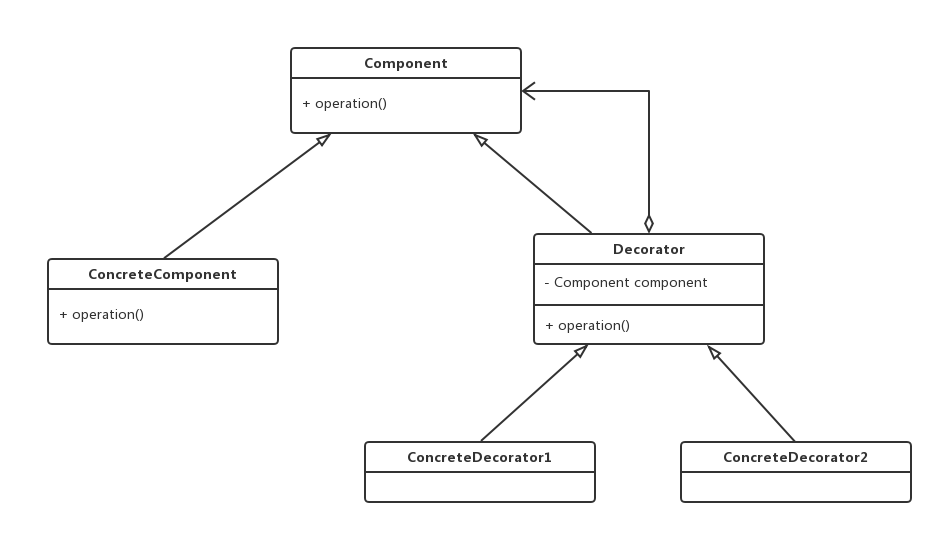
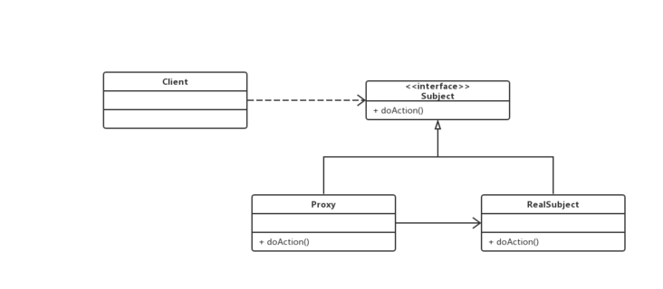
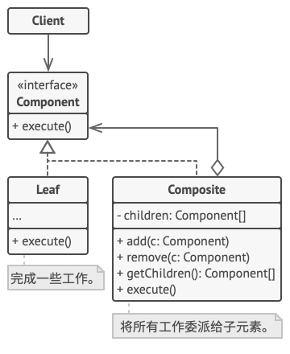
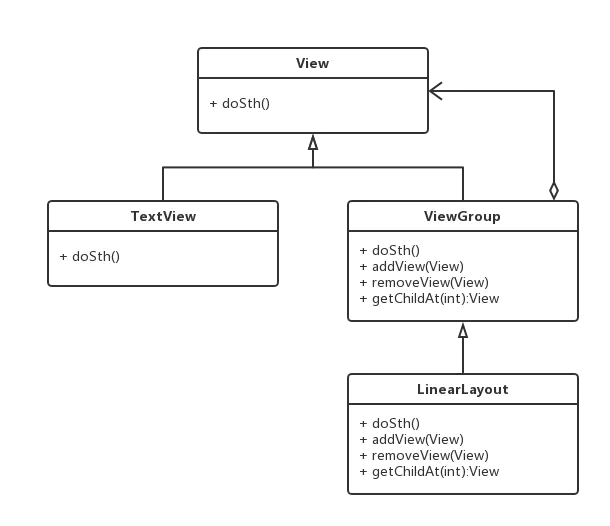
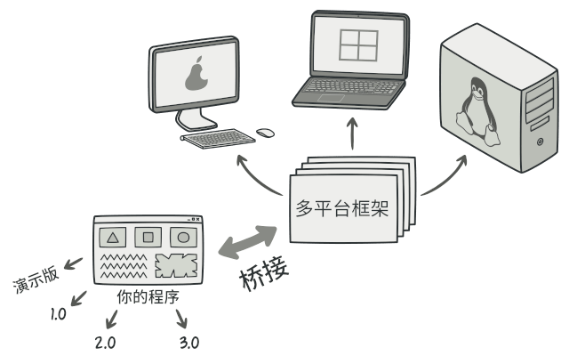

# 设计思想

# 设计模式

## 装饰者模式✨



装饰器模式组成：

- 抽象组件角色(Component): 定义可以动态添加任务的对象的接口
- 具体组件角色(ConcreteComponent)：定义一个要被装饰器装饰的对象，即 Component 的具体实现
- 抽象装饰器(Decorator): 维护对组件对象和其子类组件的引用
- 具体装饰器角色(ConcreteDecorator)：向组件添加新的职责

### 使用场景

主要有如下使用场景

- 如果你希望在无需修改代码的情况下即可使用对象，且希望在运行时为对象新增**额外**的行为，可以使用装饰模式
- 如果用继承来扩展对象行为的方案难以实现或根本不可行，可以使用该模式

### Java


```java
public interface DataSource {
    void writeData(String data);

    String readData();
}

public class FileDataSource implements DataSource {
    private String name;

    public FileDataSource(String name) {
        this.name = name;
    }

    @Override
    public void writeData(String data) {
        File file = new File(name);
        try (OutputStream fos = new FileOutputStream(file)) {
            fos.write(data.getBytes(), 0, data.length());
        } catch (IOException ex) {
            System.out.println(ex.getMessage());
        }
    }

    @Override
    public String readData() {
        char[] buffer = null;
        File file = new File(name);
        try (FileReader reader = new FileReader(file)) {
            buffer = new char[(int) file.length()];
            reader.read(buffer);
        } catch (IOException ex) {
            System.out.println(ex.getMessage());
        }
        return new String(buffer);
    }
}

// 抽象装饰类
public class DataSourceDecorator implements DataSource {
    private DataSource wrappee;

    DataSourceDecorator(DataSource source) {
        this.wrappee = source;
    }

    @Override
    public void writeData(String data) {
        wrappee.writeData(data);
    }

    @Override
    public String readData() {
        return wrappee.readData();
    }
}


// 加密装饰类
public class EncryptionDecorator extends DataSourceDecorator {

    public EncryptionDecorator(DataSource source) {
        super(source);
    }

    @Override
    public void writeData(String data) {
        super.writeData(encode(data));
    }

    @Override
    public String readData() {
        return decode(super.readData());
    }

    private String encode(String data) {
        byte[] result = data.getBytes();
        for (int i = 0; i < result.length; i++) {
            result[i] += (byte) 1;
        }
        return Base64.getEncoder().encodeToString(result);
    }

    private String decode(String data) {
        byte[] result = Base64.getDecoder().decode(data);
        for (int i = 0; i < result.length; i++) {
            result[i] -= (byte) 1;
        }
        return new String(result);
    }
}

// 压缩装饰类
public class CompressionDecorator extends DataSourceDecorator {
    private int compLevel = 6;

    public CompressionDecorator(DataSource source) {
        super(source);
    }

    public int getCompressionLevel() {
        return compLevel;
    }

    public void setCompressionLevel(int value) {
        compLevel = value;
    }

    @Override
    public void writeData(String data) {
        super.writeData(compress(data));
    }

    @Override
    public String readData() {
        return decompress(super.readData());
    }

    private String compress(String stringData) {
        byte[] data = stringData.getBytes();
        try {
            ByteArrayOutputStream bout = new ByteArrayOutputStream(512);
            DeflaterOutputStream dos = new DeflaterOutputStream(bout, new Deflater(compLevel));
            dos.write(data);
            dos.close();
            bout.close();
            return Base64.getEncoder().encodeToString(bout.toByteArray());
        } catch (IOException ex) {
            return null;
        }
    }

    private String decompress(String stringData) {
        byte[] data = Base64.getDecoder().decode(stringData);
        try {
            InputStream in = new ByteArrayInputStream(data);
            InflaterInputStream iin = new InflaterInputStream(in);
            ByteArrayOutputStream bout = new ByteArrayOutputStream(512);
            int b;
            while ((b = iin.read()) != -1) {
                bout.write(b);
            }
            in.close();
            iin.close();
            bout.close();
            return new String(bout.toByteArray());
        } catch (IOException ex) {
            return null;
        }
    }
}

// 客户端代码
public class Demo {
    public static void main(String[] args) {
        String salaryRecords = "Name,Salary\nJohn Smith,100000\nSteven Jobs,912000";

        DataSourceDecorator encoded = new CompressionDecorator(
                                         new EncryptionDecorator(
                                             new FileDataSource("out/OutputDemo.txt")));
        encoded.writeData(salaryRecords);
        DataSource plain = new FileDataSource("out/OutputDemo.txt");

        System.out.println("- Input ----------------");
        System.out.println(salaryRecords);
        System.out.println("- Encoded --------------");
        System.out.println(plain.readData());
        System.out.println("- Decoded --------------");
        System.out.println(encoded.readData());
    }
}
```

输出结果：

```
- Input ----------------
Name,Salary
John Smith,100000
Steven Jobs,912000
- Encoded --------------
Zkt7e1Q5eU8yUm1Qe0ZsdHJ2VXp6dDBKVnhrUHtUe0sxRUYxQkJIdjVLTVZ0dVI5Q2IwOXFISmVUMU5rcENCQmdxRlByaD4+
- Decoded --------------
Name,Salary
John Smith,100000
Steven Jobs,912000
```

### JavaScript

搜索 JavaScript 中该模式的应用最多的是 AOP，关键掌握下面两个前置函数和后置函数

```js
Function.prototype.before = function(fn) {
  const self = this;
  return function() {
    fn.apply(this, arguments);
    self.apply(this, arguments);
  }
}

Function.prototype.after = function(fn) {
  const self = this;
  return function() {
    self.apply(this, arguments);
    fn.apply(this, arguments);
  }
}

// ------------使用--------------
 function hello() {
   console.log('hello world!!!');
 }

const h = hello.after(function() {
  console.log('after');
}).before(function() {
  console.log('before');
});

h();
```

上述添加切面方法的方式虽然实现了功能，但是会对代码有一定的侵入性（在 `Function.prototype    ` 上添加了新的方法），我们也可以使用高阶函数来进行封装。

这里我们对函数进行了一个装饰，可以对输入输出值进行修改。

```js
function doSomething(name) {
  console.log("Hello, " + name);
}

function loggingDecorator(wrapped) {
  return function() {
    console.log("Starting");
    const result = wrapped.apply(this, arguments);
    console.log("Finished");
    return result;
  }
}

const wrapped = loggingDecorator(doSomething);
```

对于其他装饰器可以参考 [JavaScript](JavaScript.md) 文档中的 **ES7装饰器(Decorator)** 章节

### 实例

#### Java IO


### 与其他模式的关系

- 适配器模式可以对已有的接口进行**修改**，装饰器模式则能在不改变对象接口的前提下**强化**对象功能。此外，装饰还支持递归组合，适配器则无法实现
- 适配器模式能为被封装对象提供**不同**的接口，代理模式能为对象提供**相同**的接口，装饰则能为对象提供**加强**的接口
- 责任链模式和装饰模式的类结构非常相似。两者都依赖递归组合将需要执行的操作传递给一系列对象。但是，两者有几点重要的不同之处。责任链的管理者可以相互独立地执行一切操作，还可以随时停止传递请求。 另一方面，各种**装饰**可以在遵循基本接口的情况下扩展对象的行为。此外，装饰无法中断请求的传递。
- [组合模式](https://refactoringguru.cn/design-patterns/composite)和[装饰](https://refactoringguru.cn/design-patterns/decorator)的结构图很相似，因为两者都依赖递归组合来组织无限数量的对象。**装饰**类似于**组合**，但其只有一个子组件。此外还有一个明显不同：装饰为被封装对象添加了额外的职责，组合仅对其子节点的结果进行了“求和”。但是，模式也可以相互合作：你可以使用**装饰**来扩展**组合**树中特定对象的行为。
- 大量使用组合和装饰的设计通常可从对于原型模式的使用中获益。 你可以通过该模式来复制复杂结构， 而非从零开始重新构造。
- 装饰可让你更改对象的外表，策略模式则让你能够改变其本质。
- 装饰和代理有着相似的结构，但是其意图却非常不同。 这两个模式的构建都基于组合原则，也就是说一个对象应该将部分工作委派给另一个对象。两者之间的不同之处在于代理通常自行管理其服务对象的生命周期，而装饰的生成则总是由客户端进行控制。

## 代理模式✨



### 使用场景

主要有如下使用场景（后端）：

- 日志的采集
- 访问控制
- 实现AOP
- 延迟初始化

### Java

```java
public interface Subject {
    void doAction();
}

public class RealSubject implements Subject {
    @Override
    public void doAction() {
        System.out.println("service impl class.");
    }
}

public class Proxy implements Subject {

    private Subject subject;

    public Proxy(Subject subject) {
        this.subject = subject;
    }

    @Override
    public void doAction () {
        System.out.println("before");
        subject.doAction();
        System.out.println("after");
    }

}
```

### JavaScript

TODO...

### 与其他模式的关系

- **适配器模式**能为被封装的对象提供不同的接口，**代理模式**能为对象提供相同的接口，**装饰模式**则能为对象提供加强的接口
- **外观模式**与**代理模式**的相似之处在于它们都缓存了一个复杂实体并自行对其初始化。代理模式与其服务对象遵循同一接口，使得自己和服务对象可以互换，在这一点它与外观不同
- **装饰器模式**和**代理模式**有着相似的结构，但是其意图却不同。这两个模式的构建都基于组合原则，也就是说一个对象应该把部分工作委派给另一个对象。两者之间的不同之处在于代理通常自行管理其服务对象的声明周期，而装饰的生成总是由客户端控制。

## 责任链模式✨

## 外观模式✨

## 组合模式✨

**组合模式**是一种结构型设计模式， 你可以使用它将对象组合成树状结构， 并且能像使用独立对象一样使用它们。



### 使用场景

- 如果你需要实现树状对象结构， 可以使用组合模式。
- 如果你希望客户端代码以相同方式处理简单和复杂元素， 可以使用该模式。

### 实现

1. Android中的View



## 适配器模式✨

**适配器模式**是一种结构型设计模式， 它能使接口不兼容的对象能够相互合作。

### 使用场景

- 当你希望使用某个类，但是其接口与其他代码不兼容时，可以使用适配器
- 如果你需要复用这样一些类，他们处于同一个继承体系，并且他们又有了额外的一些共同的方法，但是这些共同的方法不是所有在这一继承体系中的子类所具有的共性

### 实现方式

1. **对象适配器**，适配器对象包含被适配的对象


2. **类适配器**，使用继承机制


## 桥接模式✨

**桥接模式**是一种结构型设计模式， 可将一个大类或一系列紧密相关的类拆分为抽象和实现两个独立的层次结构， 从而能在开发时分别使用。

### 使用场景

- 如果你想要拆分或重组一个具有多重功能的庞杂类 （例如能与多个数据库服务器进行交互的类），可以使用桥接模式。
- 如果你希望在几个独立维度上扩展一个类，可使用该模式。
- 如果你需要在运行时切换不同实现方法， 可使用桥接模式。



> HC：我的理解，我们编写的程序依赖抽象接口，而不依赖具体的实现，具体的实现由客户端去桥接

## 策略模式✨

**策略模式**是一种行为设计模式， 它能让你定义一系列算法， 并将每种算法分别放入独立的类中， 以使算法的对象能够相互替换。


### 使用场景

- 当你想使用对象中各种不同的算法变体， 并希望能在运行时切换算法时， 可使用策略模式。
- 当你有许多仅在执行某些行为时略有不同的相似类时， 可使用策略模式。
- 如果算法在上下文的逻辑中不是特别重要， 使用该模式能将类的业务逻辑与其算法实现细节隔离开来。
- 当类中使用了复杂条件运算符以在同一算法的不同变体中切换时， 可使用该模式。

### 与其他模式的关系

- 与桥接模式很相近

- 模板方法模式基于继承机制： 它允许你通过扩展子类中的部分内容来改变部分算法。 策略基于组合机制： 你可以通过对相应行为提供不同的策略来改变对象的部分行为。 模板方法在类层次上运作， 因此它是静态的。 策略在对象层次上运作， 因此允许在运行时切换行为。

- 。。。