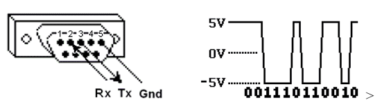
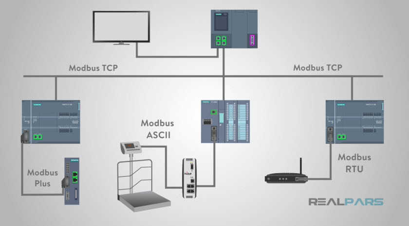
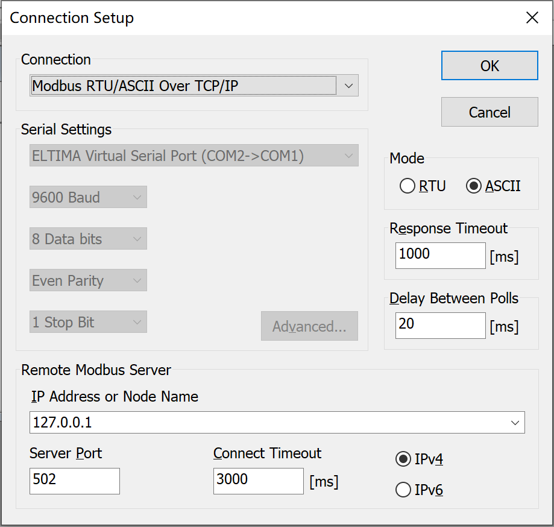
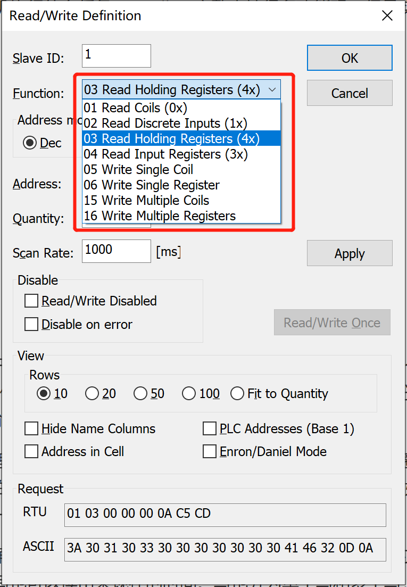

# Modbus

## 什么是Modbus？

Modbus是Modicon（施耐德）公司于1979年开发的串行通信协议。它最初设计用于公司的可编程逻辑控制器（PLC）。 Modbus是一种开放式协议，支持使用RS232/RS485/RS422协议的串行设备，同时还支持调制解调器。 它的简单性以及制造商可以免费将其纳入其产品的事实使其成为连接工业电子设备的最流行的方法。
Modbus比其他通信协议使用的更广泛的主要原因有以下几点：

公开发表并且无著作权要求；
易于部署和维护；
对供应商来说，修改移动本地的比特或字节没有很多限制；
Modbus通过设备之间的串行线进行数据传输。最简单的设置是使用一根串行电缆连接两个设备（主设备和从设备）上的串行端口。
数据以称为比特的1和0的序列发送。每个位都作为电压发送。0被发送为正电压，1被发送为负电压。如下图所示；




## 主从模式

`Modbus`解决了通过**串行线路**在电子设备之间发送信息的问题。 该协议在遵循该协议的体系结构中实现**主/从模型**。
Modbus主站（`Master`）负责从其他设备（`Slave`）请求信息。 标准Modbus网络中有一个Modbus主站。具体如下图所示；


主设备向从设备请求信息，最多大约可达到240个 . 每个从设备都有自己**唯一的从设备地址标识**（`Slave Address`）。除了从从设备请求信息之外，主设备还可以写入从设备的**内部寄存器**。

另外需要区别Slave和Master与Server和Client两大类，这是同一种设备在不同领域的不同叫法。

- Slave： 工业自动化用语；响应请求；
- Master：工业自动化用语；发送请求；

- Server：IT用语；响应请求；
- Client：IT用语；发送请求；

在Modbus中，Slave和Server意思相同，Master和Client意思相同。

## 协议的分类

`Modbus`的应用十分广泛，特别是在工业控制领域，具体如下图所示；



我们可以看到最常用`Modbus`协议总共有以下四种：**Modbus ASCII**， **Modbus RTU**， **Modbus Plus**，**Modbus TCP**；

### Modbus ASCII

当设备设置为使用ASCII（美国信息交换标准代码）模式在MODBUS串行线上进行通信时，消息中的每个8位字节将作为两个ASCII 4位字符发送。当物理通信链路或设备的功能不允许符合RTU计时器管理要求时，使用此模式。
所以此模式的效率不如RTU，因为每个字节需要两个字符。示例：字节0x7D编码为两个字符：0x35和0x42（在ASCII表中为0x37 ='7'，而0x44 ='D'）。

### Modbus RTU

Modbus RTU是一种紧凑的，采用二进制表示数据的方式；因为使用二进制编码和CRC错误检查的结合使得Modbus RTU适用于工业应用，因为它比ASCII字符的替代方案更有效地传输。 在Modbus RTU与ASCII之间进行选择时，如果考虑性能，则RTU是首选。

### Modbus TCP

Modbus TCP 是在TCP/IP网络上运行的Modbus的实现，旨在允许Modbus ASCII / RTU协议在基于TCP / IP的网络上传输。Modbus / TCP将Modbus消息嵌入TCP / IP帧内。尽管实现起来非常简单，但是与网络相关的特性增加了一些挑战。例如，由于Modbus主机期望并要求在一定时间范围内对其轮询做出响应，因此必须考虑TCP / IP网络的不确定性（和其他方面）。



### Modbus Plus

Modbus有一个扩展版本Modbus Plus（Modbus+或者MB+），不过此协议是Modicon专有的，和Modbus不同。
它需要一个专门的协处理器来处理类似HDLC的高速令牌旋转。它使用1Mbit/s的双绞线，并且每个节点都有转换隔离设备，是一种采用转换／边缘触发而不是电压／水平触发的设备。连接Modbus Plus到计算机需要特别的接口，通常是支持ISA（SA85），PCI或者PCMCIA总线的板卡。

## 数据类型

Modbus中，数据可以分为两大类，分别为Coil和Register，每一种数据，根据读写方式的不同，又可细分为两种（只读，读写）。Modbus四种数据类型：

| 类型              | 变量       | 读写方式 |
| ----------------- | ---------- | -------- |
| Coils             | 位变量     | 读写     |
| Discrete Inputs   | 位变量     | 只读     |
| Holding Registers | 16-bit整型 | 读写     |
| Input Registers   | 16-bit整型 | 只读     |

## 数据帧

RTU帧
| 地址码 | 功能码 | 数据区  | 错误校验码 |
| ------ | ------ | ------- | ---------- |
| 8位    | 8位    | N × 8位 | 16位       |

**地址码**：地址码是信息帧的第一字节(8位)，从0到255。这个字节表明由用户设置地址的从机将接收由主机发送来的信息。每个从机都必须有唯一的地址码，并且只有符合地址码的从机才能响应回送。当从机回送信息时，相当的地址码表明该信息来自于何处。

**功能码**：主机发送的功能码告诉从机执行什么任务。modbus完整支持很多功能码，但是实际在应用的时候常用的也就那么几个。



- 0x01: 读线圈寄存器
- 0x02: 读离散输入寄存器
- 0x03: 读保持寄存器
- 0x04: 读输入寄存器
- 0x05: 写单个线圈寄存器
- 0x06: 写单个保持寄存器
- 0x0f: 写多个线圈寄存器
- 0x10: 写多个保持寄存器

**线圈寄存器**，实际上就可以类比为开关量，每一个bit都对应一个信号的开关状态。所以一个byte就可以同时控制8路的信号。比如控制外部8路io的高低。 线圈寄存器支持读也支持写，写在功能码里面又分为写单个线圈寄存器和写多个线圈寄存器。对应上面的功能码也就是：0x01  0x05  0x0f

**离散输入寄存器**，如果线圈寄存器理解了这个自然也明白了。离散输入寄存器就相当于线圈寄存器的只读模式，他也是每个bit表示一个开关量，而他的开关量只能读取输入的开关信号，是不能够写的。比如我读取外部按键的按下还是松开。所以功能码也简单就一个读的 0x02

**保持寄存器**，这个寄存器的单位不再是bit而是两个byte，也就是可以存放具体的数据量的，并且是可读写的。比如我我设置时间年月日，不但可以写也可以读出来现在的时间。写也分为单个写和多个写，所以功能码有对应的三个：0x03 0x06 0x10

**输入寄存器，**只剩下这最后一个了，这个和保持寄存器类似，但是也是只支持读而不能写。一个寄存器也是占据两个byte的空间。类比通过读取输入寄存器获取现在的AD采集值。对应的功能码也就一个 0x04  


 

3.Modbus地址范围对应表

设备地址 　　　　Modbus地址　　   描述 　　         功能 　　R/W
1~10000 　　   address-1      Coils（Output）    0      R/W
10001~20000  address-10001   Discrete Inputs     01     R
30001~40000  address-30001   Input Registers     04     R
40001~50000  address-40001   Holding Registers   03     R/W

4.Modbus变量地址
映射地址       Function Code     地址类型      R/W      描述
0xxxx        01,05,15         Coil         R/W      -
1xxxx        02              离散输入      R        -
2xxxx        03,04,06,16       浮点寄存器    R/W      两个连续16-bit寄存器表示一个浮点数（IEEE754）
3xxxx        04              输入寄存器    R        每个寄存器表示一个16-bit无符号整数（0~65535）
4xxxx        03,06,16         保持寄存器     R/W      -
5xxxx        03,04,06,16      ASCII字符     R/W      每个寄存器表示两个ASCII字符


# PyModbus

Pymodbus is a full Modbus protocol implementation using twisted/torndo/asyncio for its asynchronous communications core. 

意思是支持twisted/torndo/asyncio这些异步的核心，但是我们应该不需要吧。

调通的第一个modbus程序，其中unit = 1为slave的id，要对应，这个很重要，否则发送不成功

```python
from pymodbus.client.sync import ModbusSerialClient

client = ModbusSerialClient(method='rtu', port='COM1', baudrate=9600)
client.connect()
result = client.read_holding_registers(0, 10, unit=1)
# print(result.bits[0])
print(result.registers)
client.close()
```

