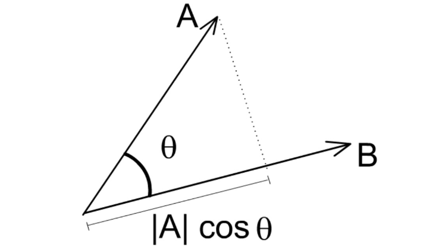
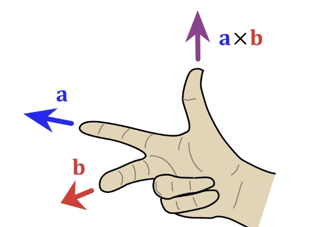
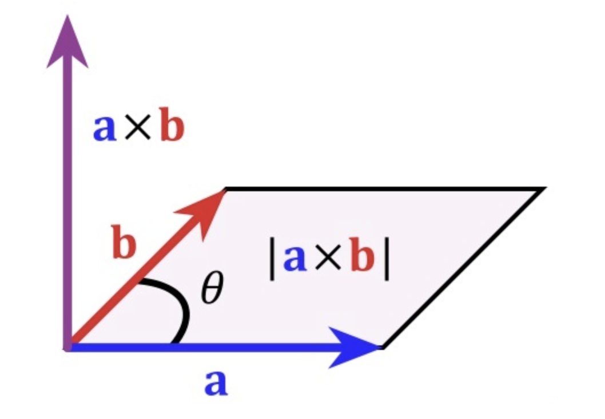
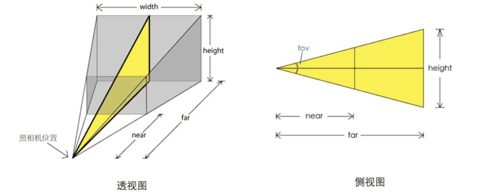

# 数学基础

## 点乘

**点乘（Dot Product）**又叫内积。

在空间中有两个向量：$\vec{a}=(x_1,y_1,z_1)$ ，$\vec{b}=(x_2,y_2,z_2)$，$\vec{a}$ 与 $\vec{b}$之间的夹角为 $\theta$。

从代数角度计算，点乘是对两个向量对应位置上的值相乘再相加的操作：
$$
\vec{a}\cdot\vec{b}=x_1x_2+y_1y_2+z_1z_2
$$
从几何角度计算，点乘是两个向量的长度与它们夹角余弦的积。
$$
\vec{a}\cdot\vec{b}=\lvert\vec{a}\rvert \lvert\vec{b}\rvert \cos\theta
$$

**几何意义**：点乘表示 $\vec{a}$ 在 $\vec{b}$ 方向上的投影与 $\lvert\vec{b}\rvert$ 的乘积，反映两个向量在方向上的相似度，结果越大越相似。




根据点乘的结果我们可以得到如下结果：

1. 若 $\vec{a}\cdot\vec{b} > 0$，则表示两向量方向基本相同，夹角在 0^o^ ~90^o^ 之间
2. 若 $\vec{a}\cdot\vec{b} = 0$，则表示两向量正交，互相垂直
3. 若 $\vec{a}\cdot\vec{b} < 0$，则表示两向量方向基本相反，夹角在 90^o^ ~180^o^ 之间

如果我们需要$\vec{a}$ 在 $\vec{b}$ 方向上的投影向量 $\vec{p}$，则：
$$
\vec{p} = \frac{\vec{a}\cdot\vec{b}}{\lvert\vec{b}\rvert}\vec{b}
$$

## 叉乘

**叉乘（Cross Product）**又称**向量积**（Vector Product）。

在空间中有两个向量：$\vec{a}=(x_1,y_1,z_1)$ ，$\vec{b}=(x_2,y_2,z_2)$，$\vec{a}$ 与 $\vec{b}$之间的夹角为 $\theta$。

从代数角度计算：
$$
\vec{a}\cross\vec{b} = (y_1z_2 - z_1y_2, z_1x_2-x_1z_2, x_1y_2-y_1x_2)
$$
从几何角度计算：
$$
\vec{a}\cross\vec{b} = (\lvert\vec{a}\rvert \lvert\vec{b}\rvert \sin\theta) \vec{n}
$$
其中 $\vec{n}$ 为 $\vec{a}$ 与 $\vec{b}$ 所构成平面的单位法向量。

其运算结果是一个向量，并且与这两个向量都**垂直**，是这两个向量所在平面的**法线向量**。使用右手定则确定其方向。




**几何意义**：如果以向量 $\vec{a}$ 与 $\vec{b}$ 为边构成一个平行四边形，，那么这两个向量外积的模长与这个平行四边形的面积相等。



# Three.js中Camera

## 透视相机 

**透视相机（PerspectiveCamera）**，这一投影模式被用来模拟人眼所看到的景象，它是3D场景的渲染中使用得最普遍的投影模式。在Three.js中用的也是最多的，其定义为：

```ts
PerspectiveCamera(fov : Number, aspect : Number, near : Number, far : Number)
```

其中：

- fov — 摄像机视锥体垂直视野角度
- aspect — 摄像机视锥体长宽比
- near — 摄像机视锥体近端面
- far — 摄像机视锥体远端面

这些参数一起定义了摄像机的视锥体。




## 观察空间

要定义一个相机，我们需要知道它在世界空间中的位置、观察的方向、一个指向它右侧的向量以及一个指向它上方的向量。我们实际上创建了一个三个单位轴相互垂直的、以摄像机的位置为原点的坐标系。


### 相机位置

摄像机位置很简单。在three.js中，设置如下：

```js
camera.position.set(0, 0, 10)
```

### 相机方向

指的是摄像机指向哪个方向

```js
camera.lookAt(0, 0, 0);
```

### 右轴

**右向量**(Right Vector)，它代表摄像机空间的x轴的正方向。为获取右向量我们需要先使用一个小技巧：先定义一个**上向量**(Up Vector)。接下来把上向量和第二步得到的方向向量进行叉乘。两个向量叉乘的结果会同时垂直于两向量，因此我们会得到指向x轴正方向的那个向量（如果我们交换两个向量叉乘的顺序就会得到相反的指向x轴负方向的向量）：


# 参考

1. [知乎-向量点乘与叉乘的概念及几何意义](https://zhuanlan.zhihu.com/p/359975221)
1. [Learn OpenGL](https://learnopengl-cn.github.io/01%20Getting%20started/09%20Camera/#_2)

