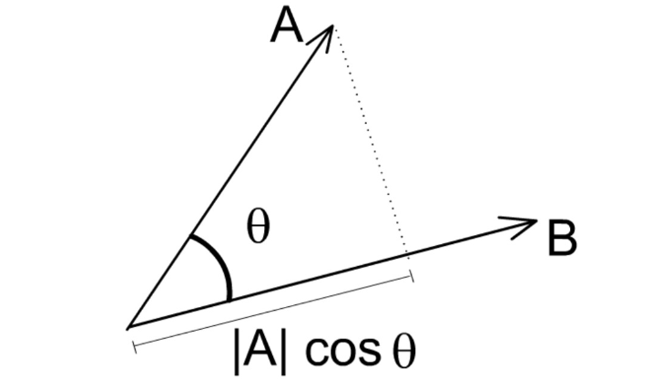
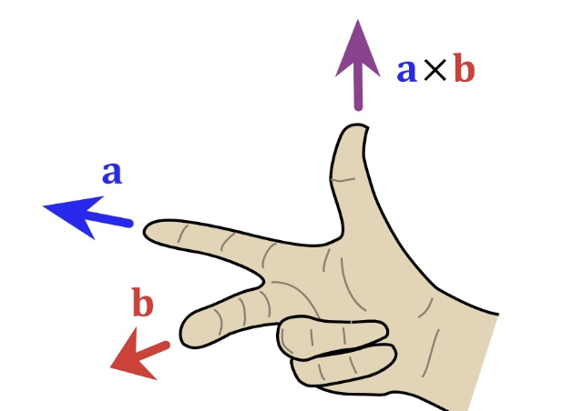
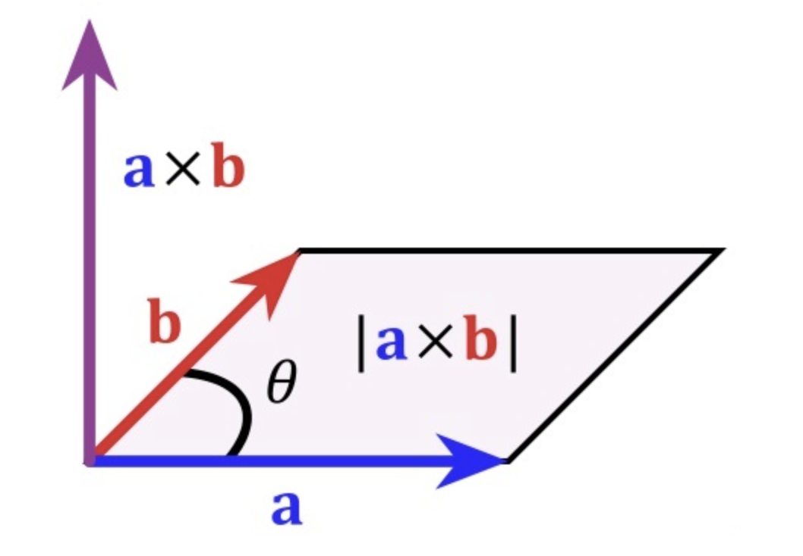

# 点乘

**点乘(Dot Product)**又叫内积。

在空间中有两个向量：$\vec{a}=(x_1,y_1,z_1)$ ，$\vec{b}=(x_2,y_2,z_2)$，$\vec{a}$ 与 $\vec{b}$之间的夹角为 $\theta$。

从代数角度计算，点乘是对两个向量对应位置上的值相乘再相加的操作：
$$
\vec{a}\cdot\vec{b}=x_1x_2+y_1y_2+z_1z_2
$$
从几何角度计算，点乘是两个向量的长度与它们夹角余弦的积。
$$
\vec{a}\cdot\vec{b}=\lvert\vec{a}\rvert \lvert\vec{b}\rvert \cos\theta
$$

**几何意义**：点乘表示 $\vec{a}$ 在 $\vec{b}$ 方向上的投影与 $\lvert\vec{b}\rvert$ 的乘积，反映两个向量在方向上的相似度，结果越大越相似。

根据点乘的结果我们可以得到如下结论：

1. 若 $\vec{a}\cdot\vec{b} > 0$，则表示两向量方向基本相同，夹角在 $0^\circ $~$90^\circ$  之间
2. 若 $\vec{a}\cdot\vec{b} = 0$，则表示两向量正交，互相垂直
3. 若 $\vec{a}\cdot\vec{b} < 0$，则表示两向量方向基本相反，夹角在 $90^\circ $~$180^\circ$ 之间

如果我们需要$\vec{a}$ 在 $\vec{b}$ 方向上的投影向量 $\vec{p}$，则：
$$
\vec{p} = \frac{\vec{a}\cdot\vec{b}}{\lvert\vec{b}\rvert}\vec{b}
$$

# 叉乘

**叉乘(Cross Product)**又称**向量积**（Vector Product）。

在空间中有两个向量：$\vec{a}=(x_1,y_1,z_1)$ ，$\vec{b}=(x_2,y_2,z_2)$，$\vec{a}$ 与 $\vec{b}$之间的夹角为 $\theta$。

从代数角度计算：
$$
\vec{a}\times\vec{b} = (y_1z_2 - z_1y_2, z_1x_2-x_1z_2, x_1y_2-y_1x_2)
$$
从几何角度计算：
$$
\vec{a}\times\vec{b} = (\lvert\vec{a}\rvert \lvert\vec{b}\rvert \sin\theta) \vec{n}
$$
其中 $\vec{n}$ 为 $\vec{a}$ 与 $\vec{b}$ 所构成平面的单位法向量。

其运算结果是一个向量，并且与这两个向量都**垂直**，是这两个向量所在平面的**法线向量**。使用右手定则确定其方向。

**几何意义**：如果以向量 $\vec{a}$ 与 $\vec{b}$ 为边构成一个平行四边形，那么这两个向量外积的模长与这个平行四边形的面积相等。

# 参考

1. [知乎-向量点乘与叉乘的概念及几何意义](https://zhuanlan.zhihu.com/p/359975221)

