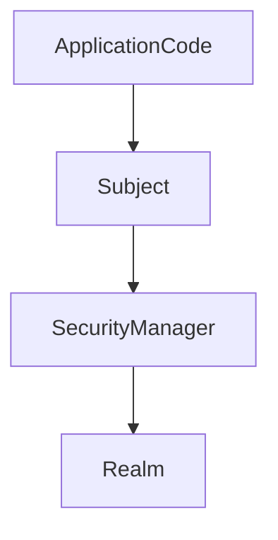

## Shiro提供的功能

-  **Authentication**：身份认证

-  **Authorization** : 授权，权限验证

-  **SessionManager**：会话管理，用户所有信息保存在会话

-  **Cryptography** ：加密

## shiro原理

-  **Subject **: 主体，可以看作用户
-  **SecurityManager** :  Shiro的心脏，所有的交互都通过此进行控制，如管理所有Subject、认证、授权、会话和缓存的管理
-  **Authenticator**：认证器，可以自定义认证策略，AuthenticationStrategy
-  **Authrizer** : 授权器，决定是否有权限进行相应操作
-  **Realm**：安全实体数据源，可以是JDBC，LDAP或内存，需要自己指定
-  **SessionManager** ：Session管理器，这里是Session是Shiro自己抽象的会话
-  **SessionDAO** ：Session的CURD
-  **CacheManager** ：缓存控制器， 来管理如用户、角色、权限缓存
-  **Cryptography** : 密码模块，Shiro 提高了一些常见的加密组件用于如密码加密 

## SpringBoot集成shiro

