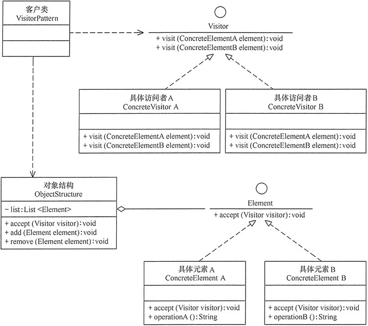

# Java版
#### 装饰者模式
- [设计模式——装饰者模式（Decorator）](https://blog.csdn.net/ma598214297/article/details/80699377)

在不改变原始接口的情况下，扩展新的接口。
实现方式：在原有的接口上扩展新的接口，新的实现类实现该接口，构造函数参数为原接口。
典型示例就是java的IO类

#### 命令模式
- [命令模式](https://www.cnblogs.com/jmcui/p/10042235.html)

有一个Command接口，具体的命令实现Command接口，但是必须有一个Receiver，Command接口的执行，其实是调用
Receiver的执行。一个命令是一个可执行的个体。命令执行放可以维护一个命令的集合。

#### 访问者模式

- [访问者模式（Visitor模式）详解](http://c.biancheng.net/view/1397.html)

将访问操作独立出来变成一个新的类。
首先要有一个visitor接口，有多个visit重载，参数类型不同，表示可以访问的对象。
被访问的对象需要实现accept函数，参数为visitor，其实现就是visitor.visit(this)。
将访问操作交给visitor去实现。
