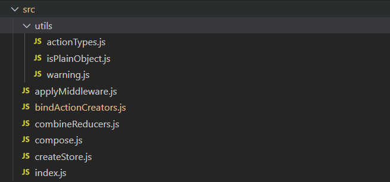

本文是基于redux 4.0.5的源码做的解析，源码不多，目录结构如下所示：




## utils

### actionTypes.js

```js
const randomString = () =>
  Math.random()
    .toString(36)
    .substring(7)
    .split('')
    .join('.')

const ActionTypes = {
  INIT: `@@redux/INIT${randomString()}`,
  REPLACE: `@@redux/REPLACE${randomString()}`,
  PROBE_UNKNOWN_ACTION: () => `@@redux/PROBE_UNKNOWN_ACTION${randomString()}`
}

export default ActionTypes
```

该文件首先定义了一个产生随机数的函数，然后定义了三个内部使用的ActionType。

### isPlainObject.js

```js
export default function isPlainObject(obj) {
  if (typeof obj !== 'object' || obj === null) return false

  let proto = obj
  while (Object.getPrototypeOf(proto) !== null) {
    proto = Object.getPrototypeOf(proto)
  }

  return Object.getPrototypeOf(obj) === proto
}
```

判断是否是一个简单对象，什么是简单对象呢？就是由Object构造函数或者字面量方式创建的对象，即`obj.__proto__ === Object.protype` 。

> 我的解读：上面的意思是一个对象的原型链深度只有一层，一般情况下只有Object才能满足，但可以人为创建一个原型为null的构造函数来终止原型链。
>
> 我们可以先看下 lodash 中 [isPlainObject](https://lodash.com/docs/4.17.15#isPlainObject) 的解释：
>
> `_.isPlainObject(value)`
>
>  Checks if `value` is a plain object, that is, an object created by the `Object` constructor or one with a `[[Prototype]]` of `null`. 
>
> 也就是说由Object创建的对象或者字面量对象，以及由没有原型的构造函数所创建
>
> ```js
> _.isPlainObject([1, 2, 3]);
> // => false
>  
> _.isPlainObject({ 'x': 0, 'y': 0 });
> // => true
>  
> _.isPlainObject(Object.create(null));
> // => true
> 
> // 补充：Object.create对应的原理如下，即创建一个对象以参数为原型
> Object.create =  function (o) {
>     var F = function () {};
>     F.prototype = o;
>     return new F();
> };
> ```

只不过这里有点疑问，为什么不能这么写呢？

```js
const proto = Object.getPrototypeOf(obj);
return proto === Object.prototype || proto === null
```

### warning.js

打印错误信息，适配了console在ie低版本中的兼容性问题


## index.js

```js
import createStore from './createStore'
import combineReducers from './combineReducers'
import bindActionCreators from './bindActionCreators'
import applyMiddleware from './applyMiddleware'
import compose from './compose'
import warning from './utils/warning'
import __DO_NOT_USE__ActionTypes from './utils/actionTypes'

// 省去非重要的代码

export {
  createStore,
  combineReducers,
  bindActionCreators,
  applyMiddleware,
  compose,
  __DO_NOT_USE__ActionTypes
}

```

该文件是整个redux的入口文件，暴露了很多方法，每个方法都在对应的文件中，我们一个个的看。

### createStore.js

```js
export default function createStore(reducer, preloadedState, enhancer) {
  
  // ... 省略部分代码
    
  let currentReducer = reducer			// 当前的reducer
  let currentState = preloadedState		// store的当前状态
  let currentListeners = []             // 当前订阅列表
  let nextListeners = currentListeners  // 新的订阅列表
  let isDispatching = false             // 作为锁来用
  
  // ... 省略了需要到处的函数定义
  
  dispatch({ type: ActionTypes.INIT })
  
  return {
    dispatch,
    subscribe,
    getState,
    replaceReducer,
    [$$observable]: observable
  }
}
```

由此可见，createStore创建了一个闭包环境，暴露了一些操作内部遍历的函数。createStore的前两个参数很好理解，第三个参数enhancer意思为增强器，来增强redux的，下面将会介绍。

createStore也适配了两个参数的情形，第二个参数可以忽略，代码如下：

```js
if (typeof preloadedState === 'function' && typeof enhancer === 'undefined') {
  enhancer = preloadedState
  preloadedState = undefined
}
```

#### getState

```js
function getState() {
  if (isDispatching) {
    throw new Error(
      'You may not call store.getState() while the reducer is executing. ' +
      'The reducer has already received the state as an argument. ' +
      'Pass it down from the top reducer instead of reading it from the store.'
    )
  }
  // 由此可看出，此处直接返回了内部对象，非副本，理论上可修改内部state，但是不会进行事件通知
  return currentState
}
```

可以看到，当在进行reducer操作时获取state，则会报错。该函数直接返回内部状态currentState，并没有做拷贝动作，因此这里得到的state是可以被更改的，但是redux不允许这么做。

#### dispatch

```js
function dispatch(action) {
  // 省略代码：判断是否是plainObject，判断action是否有type属性

  if (isDispatching) {
    throw new Error('Reducers may not dispatch actions.')
  }

  try {
    isDispatching = true
    currentState = currentReducer(currentState, action)
  } finally {
    isDispatching = false
  }

  // 通知每一个listener
  // 注意currentListeners = nextListeners这一步操作，后面会提到
  const listeners = (currentListeners = nextListeners)
  for (let i = 0; i < listeners.length; i++) {
    const listener = listeners[i]
    listener()
  }

  return action
}
```

可以看到dispatch实际上就是就是调用reducer，然后通知所有订阅的监听者，listener是没有回调参数的。同样isDispatch起到锁的作用，当执行reducer时为true。

#### subscribe

```js
function subscribe(listener) {
  if (typeof listener !== 'function') {
    throw new Error('Expected the listener to be a function.')
  }

  if (isDispatching) {
    throw new Error('xxx')
  }

  // listener的订阅状态
  let isSubscribed = true

  ensureCanMutateNextListeners()
  nextListeners.push(listener)

  return function unsubscribe() {
    if (!isSubscribed) {
      return
    }

    if (isDispatching) {
      throw new Error('xxx')
    }

    isSubscribed = false

    ensureCanMutateNextListeners()
    const index = nextListeners.indexOf(listener)
    nextListeners.splice(index, 1)
    currentListeners = null
  }
}
```

可以看出，如果正在执行reducer的时候是不允许进行订阅的。注意该函数的返回值取消该订阅的函数，通过闭包实现。这里需要看下ensureCanMutateNextListeners的实现：

```js
function ensureCanMutateNextListeners() {
  if (nextListeners === currentListeners) {
    nextListeners = currentListeners.slice()
  }
}
```

当nextListeners 和 currentListeners为同一引用的时候，则对currentListeners进行一次浅拷贝，保证nextListeners是可以更改的。因为在dispatch的最后，会将currentListeners指向nextListeners，调用所有的监听函数，此时为了保证currentListeners不被修改，乱序导致发生错误，故每当需要对listeners进行修改的时候，均进行一次浅拷贝操作，起到一个缓存的作用，也就是所有的操作针对缓存的，当需要遍历执行的时候，则取最新数据。

#### replaceReducer

更改reducer，这个方法我们一般很少用到。

```js
function replaceReducer(nextReducer) {
  if (typeof nextReducer !== 'function') {
    throw new Error('Expected the nextReducer to be a function.')
  }

  currentReducer = nextReducer

  // This action has a similiar effect to ActionTypes.INIT.
  // Any reducers that existed in both the new and old rootReducer
  // will receive the previous state. This effectively populates
  // the new state tree with any relevant data from the old one.
  dispatch({ type: ActionTypes.REPLACE })
}
```

#### ActionTypes.INIT

在createStore函数的末尾我们可以看到，dispatch了这样的一个action

```js
dispatch({ type: ActionTypes.INIT })
```

是因为我们的初始状态currentState为undefined，发了这样一个action是为了拿到state的初始状态对象。

#### enhancer


### combineReducers.js


### applyMiddleware

最难理解的一个函数，需要和enhancer结合着看

```js
export default function applyMiddleware(...middlewares) {

  // 返回一个高阶函数
  return createStore => (...args) => {
    const store = createStore(...args)
    let dispatch = () => {
      throw new Error(
        'Dispatching while constructing your middleware is not allowed. ' +
          'Other middleware would not be applied to this dispatch.'
      )
    }

    const middlewareAPI = {
      getState: store.getState,
      dispatch: (...args) => dispatch(...args)
    }
    const chain = middlewares.map(middleware => middleware(middlewareAPI))
    dispatch = compose(...chain)(store.dispatch)

    // applyMiddleware主要是对dispatch的装饰
    return {
      ...store,
      dispatch
    }
  }
}
```


## redux-thunk 源码

```js
function createThunkMiddleware(extraArgument) {
  return ({ dispatch, getState }) => (next) => (action) => {
    if (typeof action === 'function') {
      return action(dispatch, getState, extraArgument);
    }

    return next(action);
  };
}

const thunk = createThunkMiddleware();
thunk.withExtraArgument = createThunkMiddleware;

export default thunk;
```

