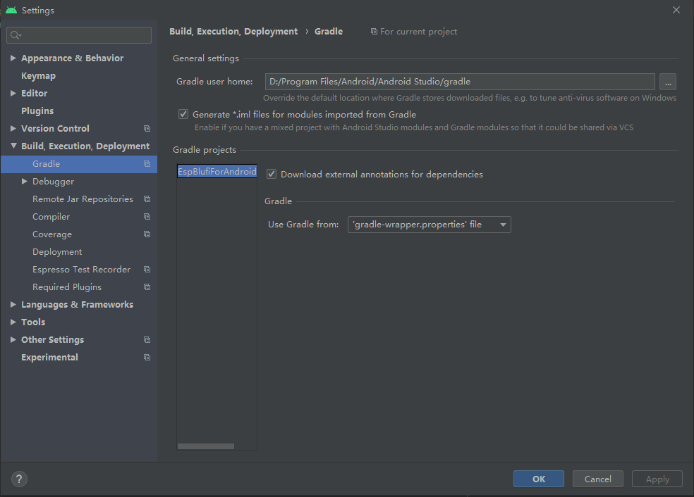

# Gradle配置

AndroidStudio4.+版本Gradle配置界面已更新位如下界面：



以下是我的理解：

Gradle user home: gradle的home目录，相当于以前用户下面 `.gradle` 目录，用来放置一些gradle缓存的，是gradle.properties文件会使用到的目录。如果该home目录有对应版本的gradle会直接使用，否则需要下载。

```properties
#Tue Nov 24 14:49:47 CST 2020
distributionBase=GRADLE_USER_HOME
distributionPath=wrapper/dists
zipStoreBase=GRADLE_USER_HOME
zipStorePath=wrapper/dists
distributionUrl=https\://services.gradle.org/distributions/gradle-6.5-all.zip
```

使用Gradle方式有两种，即 **User Gradle from** 有两种方式：

1. gradle-wrapper.properties: 使用项目中的配置文件使用
2. Specified location:  指定目录的gradle