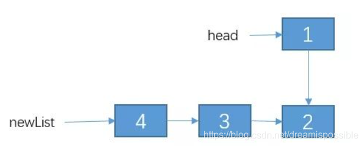
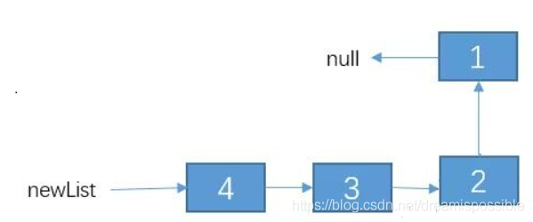

# 要素

**第一要素：明确你这个函数想要干什么**

**第二要素：寻找递归结束条件**

**第三要素：找出函数的等价关系式**


# 实例

## 小青蛙跳台阶

一只青蛙一次可以跳上1级台阶，也可以跳上2级。求该青蛙跳上一个n级的台阶总共有多少种跳法。

**第一次**跳一步还是两步进行递归。

```
f(n) = f(n-1) + f(n-2)
```


## 反转单向链表

反转单链表。例如链表为：1->2->3->4。反转后为 4->3->2->1。

我们把 2->3->4 递归成 4->3->2。不过，1 这个节点我们并没有去碰它，所以 1 的 next 节点仍然是连接这 2。
      接下来呢？该怎么办？
      其实，接下来就简单了，我们接下来只需要把节点 2 的 next 指向 1，然后把 1 的 next 指向 null,不就行了？，即通过改变 newList 链表之后的结果如下：





```
//用递归的方法反转链表 
public static Node reverseList2(Node head)
{ 
// 1.递归结束条件
 if (head == null || head.next == null)
  {
   return head; 
   } 
   // 递归反转 子链表 
   Node newList = reverseList2(head.next);
    // 改变 1，2节点的指向。 
    // 通过 head.next获取节点2 
    Node t1 = head.next; 
    // 让 2 的 next 指向 2 
    t1.next = head; 
    // 1 的 next 指向 null. 
    head.next = null; 
    // 把调整之后的链表返回。
     return newList; 
     }
```

### 汉诺塔问题

当我们有N个盘子的时候，第N个盘子看成一个盘子，(N-1)个盘子看做成一个盘子。需要将(N-1)个盘子放在中介柱子B上，N个盘子放在目标柱子C即可。

当我们有三个盘子的时候，我们会发现一个问题： **角色变化**

1. 将A塔座的第(N-1)~1个盘子看成是一个盘子，放到中柱子B上，然后将第N个盘子放到目标柱子C上。这时候柱子A空了!柱子A成为中介柱子，柱子B成为起始柱子。
2. 柱子B这时候有N-1个盘子，将第(N-2)~1个盘子看成是一个盘子，放到中介柱子A上，然后将柱子B的第(N-1)号盘子放到目标柱子C上。这时候柱子B空了!柱子B又成为了中介柱子，A成为了起始柱子!

重复1、2步骤，直到所有盘子都放到目标塔座C上结束。
总结一下：

从初始柱子A上移动包含n-1个盘子到中介柱子B上。
将初始柱子A上剩余的一个盘子（最大的一个盘子）放到目标柱子C上。
将中介柱子B上n-1个盘子移动到目标柱子C上。