# 基本概念

Git 的核心概念分为四个区块，分别是远程仓库、本地版本库、暂存区以及工作区，下面这张图能清晰的描述出这四个区块之间的关系。

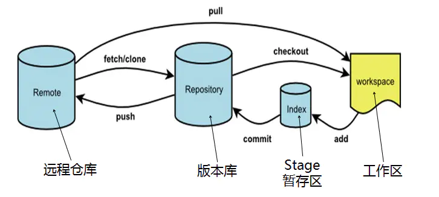

## 分支 branch

首先要从git的分支说起，git 中的分支，其实本质上仅仅是个指向 commit 对象的可变指针。git 是如何知道你当前在哪个分支上工作的呢？其实答案也很简单，它保存着一个名为 **HEAD** 的特别指针。在 git 中，它是一个指向你正在工作中的本地分支的指针，可以将 HEAD 想象为当前分支的别名。（注：HEAD指针可以指向快照也可以指向branch）

git clone 命令会为你自动将远程主机命名为 origin，拉取它的所有数据，创建一个指向它的 master 分支的指针，并且在本地将其命名为 origin/master。同时Git 也会给你一个与 origin 的master 分支在指向同一个地方的本地 master 分支，这样你就有工作的基础。

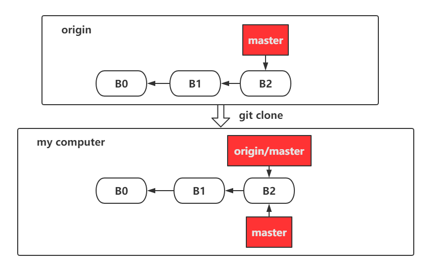

远程库有人推送，提交了C0和C1：

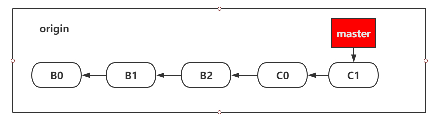

本地提交了D0和D1：

只要你不与 origin 服务器连接，你的 origin/master 指针就不会移动。

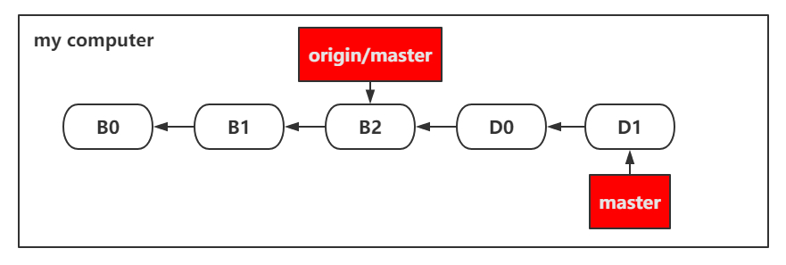

如果要同步远程库到你的工作，运行 git fetch origin 命令

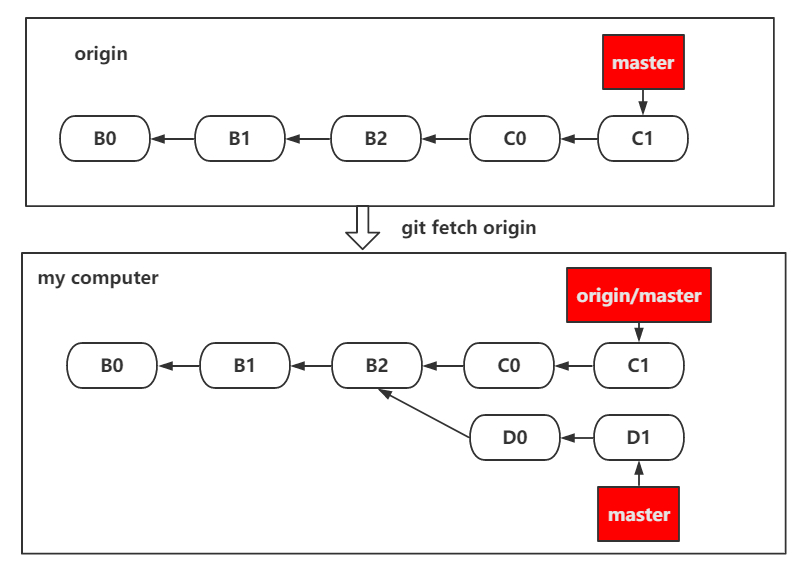

fetch 抓取到新的远程跟踪分支时，本地的工作区（workspace）不会自动生成一份可编辑的副本，抓取结果是直接送到版本库（Repository）中

如果想要在 origin/master 分支上工作，可以新建分支 test 并将其建立在远程跟踪分支之上：

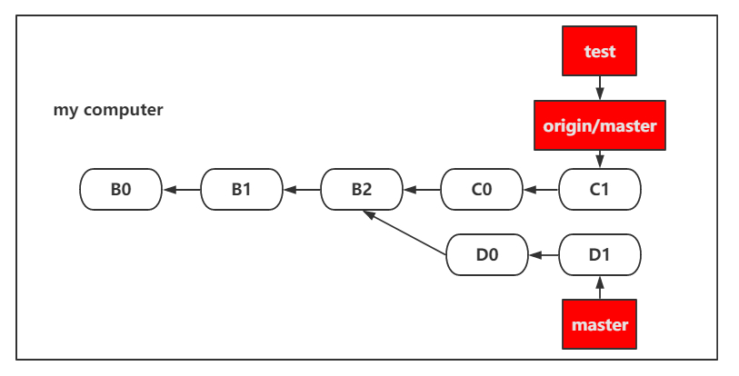

如果想把拉取的结果合并到本地分支，需要手动合并。使用如下命令：

```bash
$ git chekout master
$ git merge origin/master
# 由于merge过后master分支会产生一条多余的merge记录
# 这个时候我们更倾向于rebase变基操作
$ git rebase origin/master
```

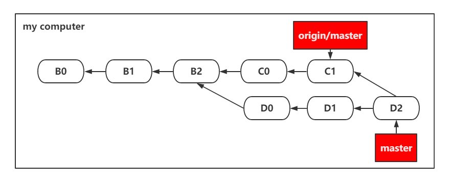

看到上面的合并结果会想到命令 git pull 。在大多数情况下它的含义是一个 git fetch 紧接着一个 git merge 命令。即 git pull 是 git fetch 和 git merge 的两步的和。


# 常用命令

## git config

```bash
$ git config --list

# 全局的设置
$ git config --global user.name "username"  
$ git config --global user.email "email"

# 局部的设置
$ git config user.name "username"  
$ git config user.email "email"
```

## git clone

git clone 命令会为你自动将远程主机命名为 origin，拉取它的所有数据，创建一个指向它的 master 分支的指针，并且在本地将其命名为 origin/master。同时Git 也会给你一个与 origin 的master 分支在指向同一个地方的本地 master 分支，这样你就有工作的基础。

## git fetch/pull

`git fetch`是将远程主机的最新内容拉到本地，用户在检查了以后决定是否合并到工作本机分支中。

而`git pull` 则是将远程主机的最新内容拉下来后直接合并，即：`git pull = git fetch + git merge`，这样可能会产生冲突，需要手动解决。

```bash
$ git fetch <远程主机名> # 将某个远程主机的更新全部取回本地
$ git fetch <远程主机名> <分支名> # 取回特定分支的更新
```

取回更新后，会返回一个`FETCH_HEAD` ，指的是某个branch在服务器上的最新状态，我们可以在本地通过它查看刚取回的更新信息

`git pull` 的过程可以理解为：

```bash
$ git fetch origin master # 从远程主机的master分支拉取最新内容 
$ git merge FETCH_HEAD    # 将拉取下来的最新内容合并到当前所在的分支中
```

将远程主机的某个分支的更新取回，并与本地指定的分支合并，完整格式可表示为:

```bash
# 取回远程主机某个分支的更新，再与本地的指定分支合并。
$ git pull <远程主机名> <远程分支名>:<本地分支名>

# 将远程主机origin的master分支拉取过来，与本地的hucheng分支合并
$ git pull origin master:hucheng

# 冒号可以省略，表示将远程origin主机的master分支拉取过来和本地的当前分支进行合并
$ git pull origin master
```

如果本地分支有修改，上面的方式会在本地分支生成一个merge的提交记录，这通常不是我们需要的，为了保证提交记录的简洁性，我们推荐使用rebase方式，rebase过程中可能也会产生冲突，通过相关命令解决即可。

```bash
# 将远程master分支与本地合并（rebase方式），本地master分支不会合并
$ git pull origin master --rebase
```

## git branch

```bash
$ git branch # 查看本地所有分支 
$ git branch -r # 查看远程所有分支
$ git branch -a # 查看本地和远程的所有分支
$ git branch <branchname> # 新建分支
$ git branch -d <branchname> # 删除本地分支

$ git branch -d -r <branchname> # 删除远程分支，删除后还需推送到服务器
$ git push origin:<branchname>  # 删除后推送至服务器

$ git branch -m <oldbranch> <newbranch> # 重命名本地分支

-d = --delete 删除
-D = --delete --force 的快捷键
-f = --force 强制
-m = --move 移动或重命名
-M = --move --force 的快捷键
-r = --remote 远程
-a = --all 所有
```

## git checkout

```bash
# 在本地新建一个与远程的分支b相同(被合并的版本)的分支b
$ git checkout -b <本地分支名> origin/<远程分支名>
```

## git merge

把一个分支或或某个commit的修改合并到现在的分支上

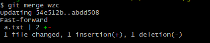

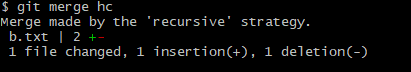

两种模git式：

https://www.cnblogs.com/lyy-2016/p/6511930.html

https://blog.csdn.net/qq_42780289/article/details/97945300

讲清楚即可


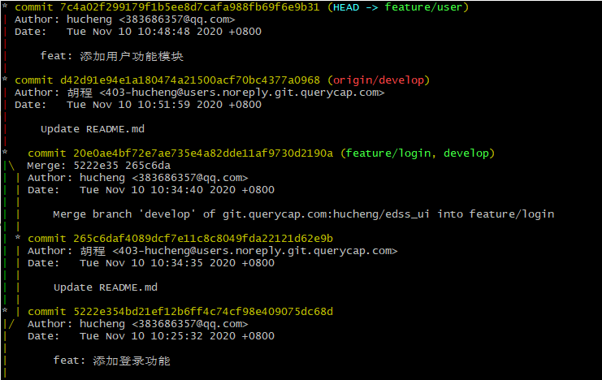

下面是merge，按时间排序；上面是rebase，按逻辑排序

## git rebase

**场景1：合并多次提交**

常见的是一个功能修修补补commit了n次，导致提交记录过多过杂，不够直观，究竟哪些提交对应这个功能？如果功能需要迁移，需要一个个commit去cherry-pick？这个时候需要将提交合并。

> 注意：合并记录时，注意不要已经push到远程的记录

如下图，修改同一个文件同一个问题修改3次

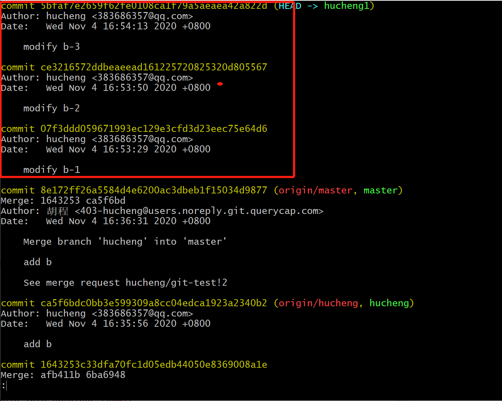

执行如下命令进行commit合并，会弹出如下界面，其中会按提交历史倒叙排列：

```bash
$ git rebase -i HEAD~3
$ git rebase -i [commit_id] # 以commit_id的提交为基线进行合并
```

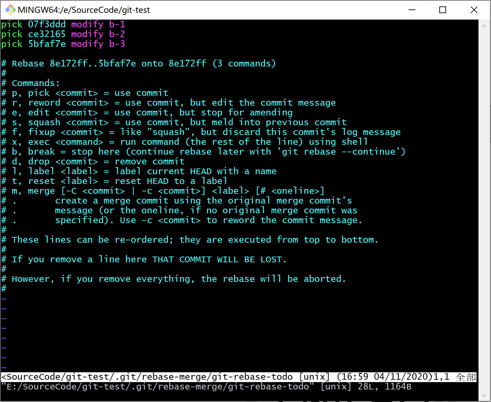

```bash
pick 07f3ddd modify b-1
pick ce32165 modify b-2
pick 5bfaf7e modify b-3

# Rebase 8e172ff..5bfaf7e onto 8e172ff (3 commands)
#
# Commands:
# p, pick = use commit 保留该commit
# r, reword = use commit, but edit the commit message 保留该commit，但我需要修改该commit的注释
# e, edit = use commit, but stop for amending 保留该commit, 但我要停下来修改该提交
# s, squash = use commit, but meld into previous commit 将该commit和前一个commit合并
# f, fixup = like "squash", but discard this commit's log message 将该commit和前一个commit合并，但我不要保留该提交的注释信息
# x, exec = run command (the rest of the line) using shell 执行shell命令
# d, drop = remove commit 丢弃该commit
#
# These lines can be re-ordered; they are executed from top to bottom.
#
# If you remove a line here THAT COMMIT WILL BE LOST.
#
# However, if you remove everything, the rebase will be aborted.
#
```

这里我们使用pick 和 squash, squash会将该commit和前一个commit合并

调整成如下格式，都合并到第一个提交当中：

```
pick 07f3ddd modify b-1
s ce32165 modify b-2
s 5bfaf7e modify b-3
```

然后弹出commit message的编辑界面，进行合并后的message编辑：

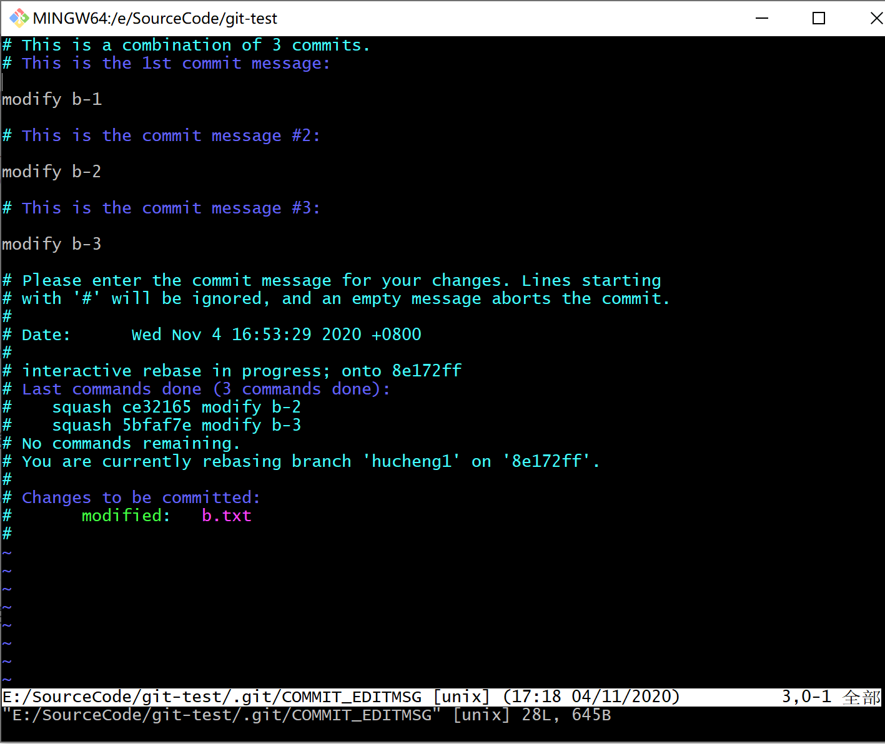

将commit message修改成为 "commit b-all"，git log查看commit信息，可看到已合并成一次提交

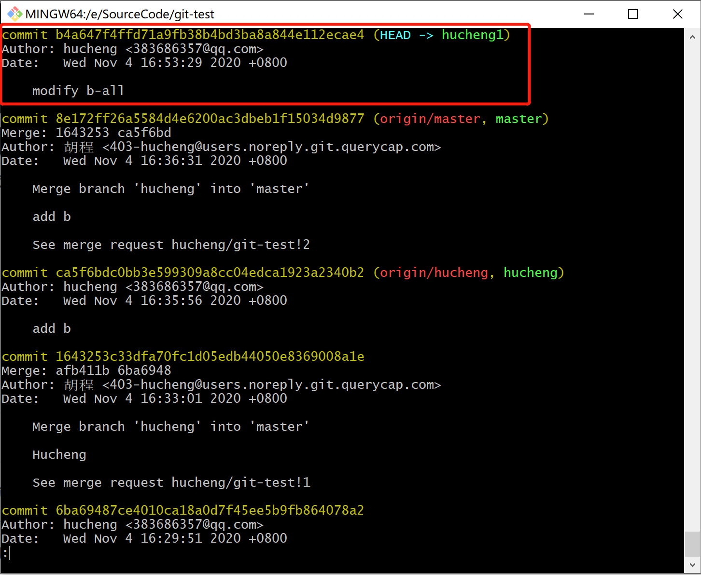

在Tortoise上操作则比较简单，进入git log界面，选择要合并的三条记录，右键选择【combine into one commit】，编辑备注提交即可。注意：只能选择连续的提交记录才可以进行合并。

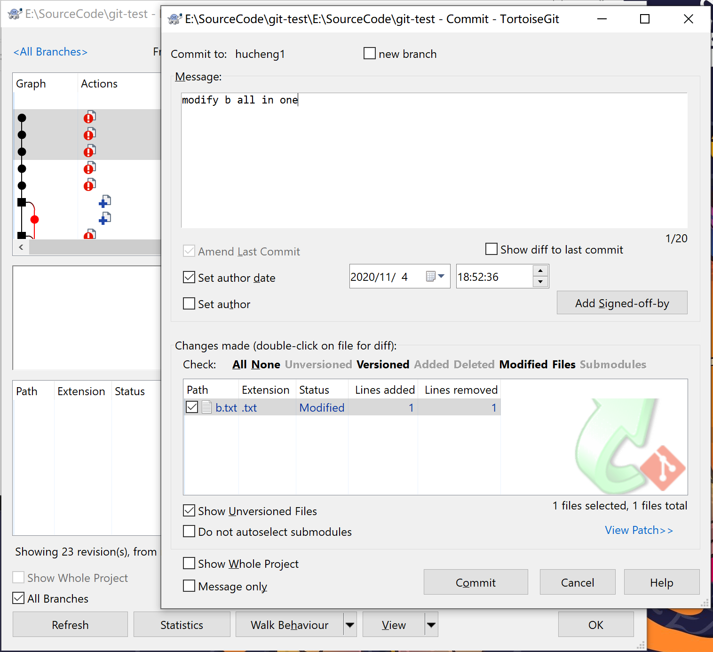

**场景2：分支合并**


## git reset

--soft: 放入暂存区，待提交

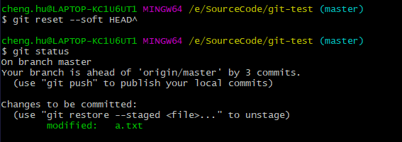

--mixed: 默认，放入工作区，保留修改，not staged状态

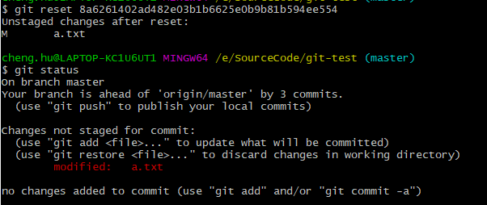

--hard: 重置 **暂存区** 和 **工作区**，暂存区和工作区中的任何修改都被 **丢弃**。

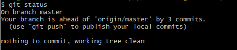


Tortoise上的操作，右键菜单【show log】进入如下界面，选择一条提交，右键选择【reset xxx to this】菜单，可以看到有三种reset模式供选择

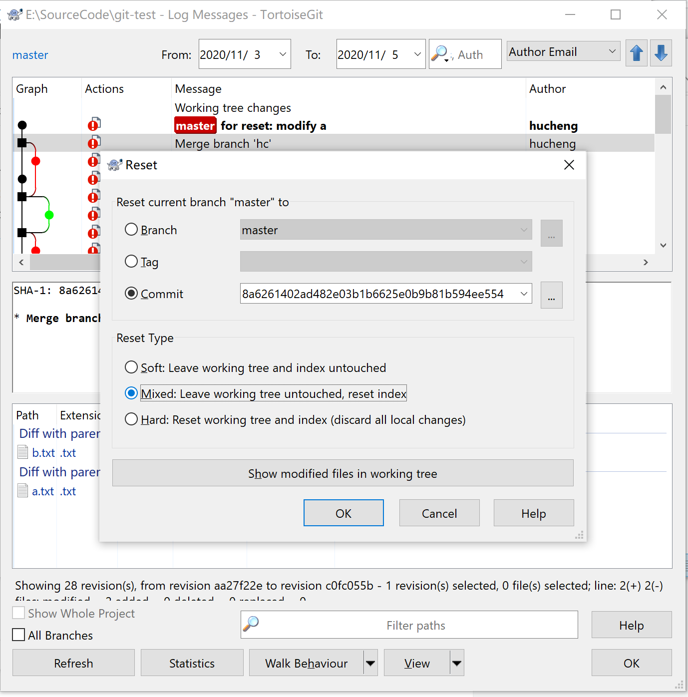


## git revert

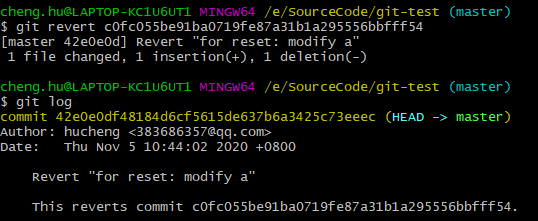

创建了一个新的提交记录，逆向修改。有冲突时需要手动修改冲突。

```bash
#　强制提交远程
$ git reset --hard HEAD^
$ git push origin master -f
```

## git push

```bash
$ git push <远程主机名> <本地分支名>:<远程分支名>
```

如果省略远程分支名，则表示将本地分支推送与之存在"追踪关系"的远程分支（通常两者同名），如果该远程分支不存在，则会被新建。

```bash
$ git push origin dev
```

如果省略本地分支名，则表示删除指定的远程分支，因为这等同于推送一个空的本地分支到远程分支。

```bash
# 慎用！删除远程仓库的分支
$ git push origin :master
# 等同于
$ git push origin --delete master
```

如果当前分支与远程分支之间存在追踪关系，则本地分支和远程分支都可以省略。

```bash
#　将当前分支推送到origin主机的对应分支
$ git push origin
```


#  Git实战

## 拉取篇

**场景 1.** 假设现有两个远程分支 master、branchA，并已经拉取到本地版本库，此时一同事删除了远程仓库中的分支 branchA，但是你电脑上仍然能看到 origin/branchA ，怎样才能更新仓库呢？

**解决方法：** 获取远程仓库的新分支以及删除远程仓库已删除的分支（本地版本库中的分支）

``` bash
$ git fetch -p  # --prune(修剪)的缩写
```

**场景 2.** 本地新增提交记录后，准备推到远程前会先从远程 `git pull` 拉取代码进行更新，假设此时其他同事已经推送新的代码，为什么这时候拉取会自动产生一个（看似）没有意义的提交记录，怎样让提交记录更直观明了？

原始提交记录

```
      C---D  origin/branchA
     /
A---B---E  branchA*
```

git pull 之后的提交记录多了一个 `Merge branch "XXX" into XXX`，也就是下例的 F 点

```
      C---D  origin/branchA
     /     \
A---B---E---F  branchA*
```

**解决方法：**

```
git pull --rebase
```
```
      origin/branchA
            |
A---B---C---D---E  branchA*
```

> git pull = git fetch + git merge 	//  拉取到本地版本库 + 合并到本地工作区
>  git pull --rebase = git fetch + git rebase	 //  拉取到本地版本库 + 工作区变基到最新版本库

## 分支篇

**场景 1.** 怎么从指定分支创建分支?

**解决方法：**

```bash
# 从目标分支创建本地分支，如果没有指定目标分支，默认为当前分支
$ git branch <name> [<targetBranch>]

# 创建并切换到该分支
$ git checkout -b <branchname> [<tragetBranch>]
```

**场景 2.** 怎么将本地分支关联到指定的远程分支?

**解决方法：**

```bash
$ git branch --set-upstream-to=<origin/branchname>
# 或者
$ git branch -u <origin/branchname>
```

**场景 3.** 怎么取消本地分支和远程分支的关联?

**解决方法：**

```bash
$ git branch --unset-upstream [<origin/branchname>]
```

**场景 4.** 怎么查看分支以及其关联的远程分支的详细信息?

**解决方法：**

```
git branch -vv
```

**场景 5.** 怎么删除本地分支？

**解决方法：**

```
git branch -D <branchname>
```

**场景 6.** 怎么删除远程分支？

**解决方法：**

```
git push -d origin <branchname>
// 或者
git push origin :branchname
```

**场景 7.** 怎么移动/重命名分支？

**解决方法：**

```
// 将目标分支 移动/重命名 到新分支
git branch -m <branchname> [<targetBranch>]
```

**场景 8.** 怎么合并分支？

**解决方法：**`merge` 合并

```
git merge <branchname>
```

情况1：原始提交记录

```
      C---D  feature
     /
A---B  master*
```

情况1：合并之后的提交记录

```
A---B---C---D  master*、feature
```

情况2：原始提交记录

```
      C---D  feature
     /
A---B---E  master*
```

情况2：合并之后的提交记录

```
      C---D  feature
     /     \
A---B---E---F master*
```

> 在多人协作开发场景下，merge 操作容易产生分支间的闭环，使得分支提交信息变得不清晰，不利于分支维护。

**场景 9.** 怎么合并指定分支的指定提交记录？

**解决方法：**`cherry-pick` 遴选

```
// 合并指定提交记录
git cherry-pick <commit>

// 合并多个提交记录
git cherry-pick <commit1> <commit2> <commit3>

// 若提交记录在同一分支上，则可以采用区间形式(start, end]，commit1不包含，commit3包含
// 等价于合并了 commit2、commit3
git cherry-pick <commit1>..<commit3>

// 若省略了区间形式的起点，则起点默认为两个分支的交点
git cherry-pick ..<commit3>
```

原始提交记录

```
      C---D  feature
     /
A---B---E  master*
```

`git cherry-pick B..D` 遴选之后的提交记录

```
      C---D  feature
     /
A---B---E---C'---D'  master*
```

> cherry-pick 操作会拷贝提交记录到当前分支，使得当前分支的提交信息更为清晰。

扩展：`cherry-pick` 操作若产生了冲突，处理流程如下

1. 解决冲突，或者想中断此次操作 `git cherry-pick --abort`（中断则不需要后两步操作）
2. 添加到暂存区 `git add .`
3. 继续遴选 `git cherry-pick --continue`

**场景 10.** 从公共分支签出特性分支进行新功能开发，开发完后准备合并回公共分支，此时发现公共分支已经有其他人推送新的提交记录，此时怎么以公共分支来更新特性分支？

**解决方法：**通过 `rebase` 变基，将当前分支的基点移动到目标分支上

```
// branchname 默认为当前分支，可省略
git rebase <targetBranch> [<branchname>]

// 等价于下面两条命令
git checkout <branchname>
git rebase <targetBranch>
```

原始提交记录

```
      C---D  feature
     /
A---B---E  master*
```

`git rebase master` 变基之后的提交记录

```
          C'---D'  feature*
         /
A---B---E  master
```

> 变基操作能更新当前分支的基点（起点），使当前分支包含公共分支上新的提交记录，这样有个好处就是如果和主分支存在冲突，可以在特性分支上提前解决。
>
> 因为重塑了历史提交记录，所以变基后当前分支会和远程分支不一致，需要采用强制推送（参见下文）覆盖远程分支。

扩展：`rebase` 操作若产生了冲突，处理流程如下

1. 解决冲突，或者想中断此次操作 `git rebase --abort`（中断则不需要后两步操作）
2. 添加到暂存区 `git add .`
3. 继续变基 `git rebase --continue`

**场景 11.** 怎么合并多个提交记录？

**解决方法：**`git rebase --interactive` 或者缩写形式 `git rebase -i`交互式变基

```
// commit 为需要处理的提交记录区间的父节点
git rebase -i <commit>
```

原始提交记录

```
A---B---C---D feature*
```

需要合并 C、D 两个提交记录，`git rebase -i B`

```
pick a0a6eba feat: 新增 C 功能
pick 95f09e5 feat: 新增 D 功能
```

将 D 提交记录合并进 C 中 ，所以把 D 记录的 `pick` 改为 `squash`，然后保存退出即可

```
pick a0a6eba feat: 新增 C 功能
squash 95f09e5 feat: 新增 D 功能
```

最终的提交记录，E 点则包含了 C 和 D 的全部改动

```
A---B---E feature*
```

扩展：交互式变基过程中会自动进入 vi 编辑模式，参数解释如下

1. p，pick 选中
2. r，reword 选中，并且修改提交信息
3. e，edit 选中，rebase 时会暂停，允许你修改这个 commit
4. s，squash 选中，会将当前 commit 与上一个 commit 合并
5. f，fixup ，与 squash 相同，但不会保存当前 commit 的提交信息
6. x，exec 执行其他 shell 命令

## 提交篇

**场景 1.** 最近的一次提交记录信息错误怎么修改？

**解决方法：**

```bash
$ git commit --amend -m '新的提交信息'
```

**场景 2.** 最近的一次提交，发现遗漏了部分改动？

**解决方法：**出于提交信息的完整性考虑，在不新增提交记录的情况下将遗漏的改动合并到本次提交中。

```bash
# 将遗漏的文件改动添加到暂存区
$ git add <filename>

# 将暂存区中的所有文件合并到最近一次提交中，
# 如果不带 --no-edit 参数，则在合并之后会进入提交信息修改面板
$ git commit --amend --no-edit
```

## 推送篇

**场景 1.** 怎么推送到远程指定分支？

**解决方法：**

```bash
# 推送到远程指定分支，并创建关联
$ git push -u origin <branchname>

# 若本地分支已经与远程分支关联，则可省略远程分支
$ git push
```

**场景 2.** 怎么强制推送到远程分支？

**解决方法：**

```bash
$ git push -f	 # --force 的缩写
```

若在强制推送的过程中，已经有其他人推送到该远程分支，则会使他人的提交记录丢失，**`为了更安全的推送`**，可用如下命令。**`在他人推送了新的提交的情况下，强制推送会被拒绝`**。

```
git push --force-with-lease
```

扩展：需要强制推送的场景可能如下

- 分支 `git rebase` 变基操作后
- 将错误代码推送到了远程，想要丢弃此提交记录（建议用下文介绍的 `git revert` 操作）

> 强制推送到远程分支会覆盖远程，若不熟悉此命令，请慎用！

**场景3**. 如何把本地分支推送到远程不存在的分支？

解决办法：

```bash
# git push <远程主机名> <本地分支名>:<远程分支名>
$ git push origin hucheng:hucheng
# 若远程分支名省略，则会推送到同名的远程分支（远程分支不存在则会创建）
# 将本地的hucheng分支推送到远程hucheng分支
$ git push origin hucheng
```

## 撤销篇

**场景 1.** 怎么撤销本地工作区文件的改动？

**解决方法：**

```bash
# 丢弃工作区某个文件的改动
$ git checkout -- <filePath>

# 丢弃工作区所有文件的改动
$ git checkout -- .
```

仅限没有通过`git add`添加到暂存区的修改，若通过`git add`添加到暂存区的，无法进行丢弃。

撤销本地工作的改动后，文件会回退到最近一次 commit 或 add 状态。

**场景 2.** 怎么撤销暂存区的改动？

**解决方法：**

```bash
# 当没有指定 filename 时，表示撤销暂存区中的所有文件
$ git reset HEAD <filename>
```

撤销暂存区的改动后，文件会回到工作区状态。

**场景 3.** 怎么撤销本地版本库的改动？

**解决方法：**

```bash
# 回退到指定的提交记录
$ git reset [<mode>] [<commit>]
```

通过指定 mode 参数，使回退之后的文件处于相应状态：

- --soft：将当前分支重置到指定版本，当前版本与指定版本间的改动文件处于 **暂存区** 中，待提交状态。
- --hard：重置 **暂存区** 和 **工作区**，暂存区和工作区中的任何修改都被 **丢弃**。
- --mixed（默认）：将当前分支重置到指定 ，当前版本与指定版本间的改动文件处于 **工作区** 中，**'not staged'** 状态。

扩展：HEAD 可以理解为一个指针，总是指向当前分支上最近一次的提交记录。HEAD^ 表示上一个提交记录，HEAD^^表示上两个提交记录，HEAD~n 表示上 n 个提交记录。

```
           HEAD^/HEAD~1
                |
A---B---C---D---E---F  branchA
            |       |
    HEAD^^/HEAD~2   HEAD
```

**场景 4.** 下班前急匆匆的将代码推到远程仓库，然后愉快的回家了，结果第二天发现推远程的代码出错了，这时候怎么撤销远程仓库的改动？

**解决方法：**`revert` 逆向修改，然后重新提交并推送到远程仓库。

```bash
# 撤销修改
$ git revert <commit>
# 推送到远程仓库，实现远程仓库的撤销
$ git push
```

扩展：`revert` 和 `reset` 的区别

`revert` 是新增一次提交记录，其修改内容正好抵消指定的改动，而 `reset` 的撤销效果是重置了版本库。假设本地版本库和远程仓库一致，`reset` 撤销了一个提交，此时本地版本库落后远程仓库一个版本，`git push` 推送到远程会失败，而 `revert` 新增了一个提交，本地版本库领先远程仓库一个记录，此时 `git push` 可以正常推送到远程。

**场景 5**. `git commit add .` 添加了所有修改到暂存区，但是想分开提交，把某些文件移除暂存区，该怎么把特定文件移除暂存区？

**解决方法：**`restore` 移除暂存区。

```bash
# 文件移除暂存区
$ git restore --staged <file>...
```


## 日志篇

**场景 1.** 本地 commit 提交了但是未推送到远程仓库，此时 `git reset --hard` 误操作强制回滚，弄丢的提交记录怎么恢复？

**解决方法：**通过 `git reflog` 查看引用日志，找到误删的提交记录，然后回滚到这条被删除的记录

```bash
# Reference logs(引用日志)，能记录 HEAD 和分支引用所指向的历史
$ git reflog
```

假设本地提交了三次 commit，然后误操作强制回滚到第一次提交，导致第二、三次的提交全部丢失

```bash
# git reflog 引用日志输出格式如下
1c36188 HEAD@{0}: reset: moving to 1c36188
d921970 HEAD@{1}: commit: feature-3
1c002dd HEAD@{2}: commit: feature-2
1c36188 HEAD@{3}: commit (initial): feature-1
```

找到误删的提交记录 feature-2 和 feature-3

```bash
$ git reset --hard d921970
```

## 贮藏篇

**场景 1.** 当正在编写代码的时候，接到了一个紧急任务，需要切换分支去开发，此时未完成的代码怎么保存？

**解决方法：**

```
// 将全部未保存的代码添加到贮藏区，若未填写描述信息，则以上一次 commit 的信息记录
git stash [push [-m <message>]]
```

**场景 2.** 怎么查看贮藏区中保存的代码？

**解决方法：**

```
git stash list

// 若存在贮藏的代码，则输出格式如下
stash@{0}: On feature: 新功能开发未完成，先贮藏一下       // 添加了描述信息
stash@{1}: WIP on master: 8e50dc3a feat：添加新功能xxx  // 未填写描述信息
```

**场景 3.** 怎么取出贮藏的代码？

**解决方法：**

```
// 恢复指定下标的贮藏代码，并删除对应的贮藏列表，index 默认为 0
git stash pop [index]

// 等价于下面两条命令
git stash apply [index] // 取出贮藏
git stash drop [index] // 删除贮藏列表
```

**场景 4.** 怎么清空贮藏列表？

**解决方法：**

```
git stash clear
```

## 大文件

> 参考：
>
> - Removing sensitive data from a repository](https://docs.github.com/en/free-pro-team@latest/github/authenticating-to-github/removing-sensitive-data-from-a-repository)
>
> - Git如何永久删除文件(包括历史记录)](https://www.cnblogs.com/shines77/p/3460274.html)

如何永久删除文件？有些时候不小心上传了一些敏感文件(例如密码)，或者不想上传的文件(没及时或忘了加到`.gitignore`里的)，而且上传的文件又特别大的时候, 这将导致别人clone你的代码或下载zip包的时候也必须更新或下载这些无用的文件。因此，我们需要一个方法，永久的删除这些文件(包括该文件的历史记录).


```bash
# 第一步
# 如果你要删除的目标不是文件，而是文件夹，那么请在 `git rm --cached' 命令后面添加 -r 命令，表示递归的删除（子）文件夹和文件夹下的文件，类似于 `rm -rf` 命令。
$ git filter-branch --force --index-filter 'git rm --cached --ignore-unmatch path-to-your-remove-file' --prune-empty --tag-name-filter cat -- --all

# 第二步：推送我们修改后的repo
$ git push origin --force --all
# 如果tags中也要删除，则需要运行
$ git push origin --force --tags

# 第三步：清理和回收空间
$ rm -rf .git/refs/original/
$ git reflog expire --expire=now --all
$ git gc --prune=now
$ git gc --aggressive --prune=now

```


# Git Commit规范

https://www.cnblogs.com/jiaoshou/p/11190619.html

https://www.conventionalcommits.org/en/v1.0.0/


commitlint + husky


要想规范git commit 提交，我们先要了解一下Commit Message格式，目前规范使用较多的是 [Angular 团队的规范](https://github.com/angular/angular.js/blob/master/DEVELOPERS.md#-git-commit-guidelines), 继而衍生了 [Conventional Commits specification](https://www.conventionalcommits.org/en/v1.0.0/). 很多工具也是基于此规范, 它的 message 格式如下:

每次提交，Commit message 都包括三个部分：Header，Body 和 Footer。


一般来说，commit message 应该清晰明了，说明本次提交的目的。

```
<type>(<scope>): <subject>
// 空一行
<body>
// 空一行
<footer>
```

其中，Header 是必需的，Body 和 Footer 可以省略。

Header部分只有一行，包括三个字段：`type`（必需）、`scope`（可选）和`subject`（必需）。

type

`type`用于说明 commit 的类别，只允许使用下面7个标识。

```
feat：新功能（feature）
fix：修补bug
docs：文档（documentation）
style： 格式（不影响代码运行的变动）
refactor：重构（即不是新增功能，也不是修改bug的代码变动）
test：增加测试
chore：构建过程或辅助工具的变动
perf：提升页面性能
deps: 升级依赖
```

`scope`用于说明 commit 影响的范围

`subject`是 commit 目的的简短描述


Body 部分是对本次 commit 的详细描述，可以分成多行。

```
More detailed explanatory text, if necessary.  Wrap it to 
about 72 characters or so. 

Further paragraphs come after blank lines.

- Bullet points are okay, too
- Use a hanging indent
```

Footer

Footer 部分只用于两种情况：1. 不兼容变动，2. 关闭issue

如果当前代码与上一个版本不兼容，则 Footer 部分以`BREAKING CHANGE`开头，后面是对变动的描述、以及变动理由和迁移方法。


Revert

还有一种特殊情况，如果当前 commit 用于撤销以前的 commit，则必须以`revert:`开头，后面跟着被撤销 Commit 的 Header

```
revert: feat(pencil): add 'graphiteWidth' option
// Body部分的格式是固定的，必须写成This reverts commit &lt;hash>.
This reverts commit 667ecc1654a317a13331b17617d973392f415f02.
```


插件介绍： 

Commitizen，一个撰写合格 Commit message 的工具

validate-commit-msg，用于检查 Node 项目的 Commit message 是否符合格式。


# Git版本管理规范


https://blog.csdn.net/weixin_38809962/article/details/79814308

## 分支解释

https://www.jianshu.com/p/d46da933c180

主分支，辅助分支


**Master分支**

这个分支最近发布到生产环境的代码，最近发布的Release， 这个分支只能从其他分支合并，不能在这个分支直接修改。所有在Master分支上的Commit应该打上Tag，一般情况下Master不存在Commit，Develop分支基于Master分支创建


master分支存放的是随时可供在生产环境中部署的稳定版本代码

master分支保存官方发布版本历史，release tag标识不同的发布版本

一个项目只能有一个master分支

**仅在发布新的可供部署的代码时才更新master分支上的代码**

每次更新master，都需对master添加指定格式的tag，用于发布或回滚

**master分支是保护分支，不可直接push到远程仓master分支**

**master分支代码只能被release分支或hotfix分支合并**


**Develop分支**

这个分支是我们是我们的主开发分支，包含所有要发布到下一个Release的代码，这个主要合并与其他分支，比如Feature分支。


develop分支是保存当前最新开发成果的分支

一个项目只能有一个develop分支

develop分支衍生出各个feature分支

develop分支是保护分支，不可直接push到远程仓库develop分支

develop分支不能与master分支直接交互


**Feature分支**

这个分支主要是用来开发一个新的功能，一旦开发完成，我们合并回Develop分支进入下一个Release

**Release分支**

当你需要一个发布一个新Release的时候，我们基于Develop分支创建一个Release分支，完成Release后，我们合并到Master和Develop分支。发布分支扮演的角色是功能开发（develop）与官方发布（master）之间的一个缓冲。

**Hotfix分支**

当我们在Production发现新的Bug时候，我们需要创建一个Hotfix, 完成Hotfix后，我们合并回Master和Develop分支，所以Hotfix的改动会进入下一个Release

## git 命令演示

1. 在gitlab网站手动创建一个develop分支

2. git fetch更新远程分支信息，git fetch

3. 基于远程develop分支创建一个本地develop分支，git checkout -b develop origin/develop

4. 基于develop分支创建一个feature分支，如feature/user，git checkout -b feature/user develop

5. 在feature上做些修改，进行commit操作

6. 将远程的develop分支的最新修改合并到本分支 git pull origin develop （rebase ？）

7. 准备release，git checkout -b release-0.1 develop

8. 全面测试

9. 合并到master和develop

   ```
   git checkout master
   git merge release-0.1
   git push
   git checkout develop
   git merge release-0.1
   git push
   git branch -d release-0.1
   ```

10. 在master上打上tag

    ```
    git tag -a 0.1 -m"Initial public release" master
    git push --tags
    ```
    
11. 用户发现一个bug，创建hotfix分支

    ```
    git checkout -b issue#001 master
    // ...# fix bug
    
    // 合并到master
    git checkout master
    git merge issue#001
    git push
    
    // 合并到develop
    git checkout develop
    git merge issue#001
    git push
    
    git branch -d issue-#001
    
    
    ```

    


## 安装

好像是跟随git一起安装的？

```shell
$ git flow
usage: git flow <subcommand>

Available subcommands are:
   init      Initialize a new git repo with support for the branching model.
   feature   Manage your feature branches.
   bugfix    Manage your bugfix branches.
   release   Manage your release branches.
   hotfix    Manage your hotfix branches.
   support   Manage your support branches.
   version   Shows version information.
   config    Manage your git-flow configuration.
   log       Show log deviating from base branch.

Try 'git flow <subcommand> help' for details.


```


# 常见问题

## idea添加忽略文件到.gitignore 不起作用

原因：idea 对应的目录或者文件已经被 git 跟踪，此时再加入.gitignore后就无效了
执行如下命令：

```makefile
git rm -r --cached .idea   　　　　# 删除文件夹
git rm --cached demo-project.iml  # 删除单个文件
```


# Git原理

参考：

https://www.lzane.com/slide/git-under-the-hood/#/

这里面讲的非常清楚

.git/objects

```bash
# 获取类型
$ git cat-file -t 58c9
# 获取内容
$ git cat-file -p 58c9
```


# 参考

[Git：远程分支----git fetch命令的使用](https://blog.csdn.net/qq_42780289/article/details/98049574)

[Commit message 和 Change log 编写指南](http://www.ruanyifeng.com/blog/2016/01/commit_message_change_log.html)

[如何规范git commit提交](https://www.cnblogs.com/jiaoshou/p/11190619.html)